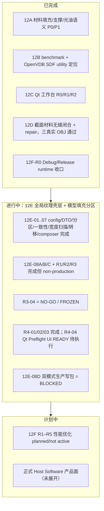

# CLAUDE_01 项目现状评估

> 证据等级标注：A=代码/测试事实，B=正式目标，C=历史，P=Claude 判断。
> 状态基线：2026-07-22。阶段状态以 `docs/slice/REPORT` 最新报告为准。目录位置：`docs/claude/ANALYSIS/`。
>
> ⚠ **2026-07-27 状态已变更**：本篇 §3/§4/§6 的阶段与生产事实已被新开发部分推翻——**双模式（12E-08D）已落地**（Global 作为显式 opt-in Profile 准入，但慢 4.09–5.92×、内存 8.19–8.74×，Legacy 仍默认）、**DPI 不再固定 600**、新增 **Stage 13 场景排版专项**（13A 全完成、13B-01..04A 完成）与 `scene/`+`layout/` 子系统。阅读本篇时请先看 [`VERIFICATION/CLAUDE_08 基线差异与文档更新清单`](../VERIFICATION/CLAUDE_08_基线差异与文档更新清单.md)。

## 1. 产品定位与系统边界（A/B）

SliceSoft 是 **UV 工业喷墨 3D 打印的上位机切片原型（Host Software prototype）**。它把三维模型 + 材料意图，转换为按 Z 层排列的二维材料通道图，并产出可交付给下游 RIP/设备团队的包。


**项目覆盖 B 与 B→C 的交付契约，并提供严格包读取器（`rip_reader_test`）验证 C。** 明确不覆盖：完整 RIP（色彩变换/墨量限制/半色调/喷头 bitstream）、设备通信、作业队列、真机闭环。这一边界是理解"完整度"的前提——**不能拿"完整商业 Host Software"当分母**，当前分母是"上游切片 + 交付契约原型 + 调试工作台"。

RGBWSV 六通道语义（A）：`R/G/B` 彩色纹理、`W` 白墨/白色材料、`S` 支撑材料、`V` 光油/透明。核心问题不仅是"哪里有实体"，而是"每个像素用什么材料、是否互斥、是否连续、是否允许空白"。

## 2. 技术栈与工程形态（A）

| 维度 | 现状 |
|---|---|
| 语言/标准 | C++20（`CMAKE_CXX_STANDARD_REQUIRED ON`，`EXTENSIONS OFF`）|
| 构建 | CMake ≥ 3.24，target-based，单一根 `CMakeLists.txt`（约 731 行）+ UI 子 CMake |
| 核心库 | 单一 `slicer_core`（聚合约 197 个源文件 + `third_party/miniz`）|
| UI | Qt 5.15 Widgets，**仅** `apps/slicer_debug_ui`；核心库对 Qt **零依赖**（已核实）|
| 依赖 | vcpkg manifest：`nlohmann-json`、`tiff`、`assimp`；可选 feature `openvdb` |
| 可选内核 | OpenVDB，`USE_OPENVDB` 默认 **OFF**；ON 时经 vcpkg 查找并链接 |
| 平台 | Windows x64 / MSVC（`/bigobj`；WIN32 链接 `windowscodecs ole32 psapi`）|

工程化程度（P：显著高于同规模原型）：约 37 个单测可执行目标、golden/schema fixture、约 49 个 PowerShell 脚本覆盖 CI/回归/golden/schema/OpenVDB/surface-shell/support/3MF、committed golden RIP 包、UI self-test/smoke。**证据纪律（A/B/C/D + strict admission + 禁止静默回退）是本项目最稀缺、最有价值的资产之一。**

## 3. 阶段完成情况（A/B，依 `.agents/AGENTS.md §6` 与 REPORT）



**要点（P）**：项目已经把"能出图"这件事做到很扎实（12A–12D），当前全部精力压在 **12E"全局纹理壳层/模型填充分区"这条通往双模式生产的路径**上，而这条路径被"真实模型拓扑"卡住。12F 性能线与产品化外围尚未真正启动。

## 4. 当前生产事实（A，教程 15 / REPORT 一致）

```text
legacy               -> 可生成完整 p0.rgbwsv.2 包（生产路径，默认）
global_surface_shell -> diagnostic-only / blocked（非生产）
OpenVDB              -> optional / 默认 OFF / 仅 conformance 或 candidate
material closure repair -> 默认 OFF（仅 1px，且需成对开关）
mesh repair preflight -> 已有只读 CLI/报告与资格基线
mesh topology repair  -> 实际修复/post-strict 尚未形成"已准入生产链"
slicePipeline.mode    -> 目标态；config.h 尚无此字段
```

## 5. 代码落地现实：设计好，但"单体未拆"（A + P）

分层设计（见 02）在依赖方向上贯彻得很好，但**真实执行体仍是单体**。核心事实：

| 文件 | 约行数 | 角色 | 判断 |
|---|---|---|---|
| `src/slicer_core/slicer.cpp` | ~4830 | legacy 切片引擎 `run_slicer()` 全流程 | **主 god file** |
| `src/slicer_core/model.cpp` | ~1662 | STL/OBJ/3MF 真实加载 + `ModelReport` | 次级聚合 |
| `src/slicer_core/config.cpp` | ~1030 | 解析/归一化/校验 | 大但职责单一 |
| `apps/slicer_debug_ui/services/UiSmokeTestRunner.cpp` | ~2618 | UI 自测运行器 | UI 侧 god file |
| `apps/slicer_debug_ui/MainWindow.cpp` | ~1611 | 主窗口 | UI 侧聚合 |

关键结论（A）：`pipeline/SlicePipeline.cpp` 的 `RunSlicePipelineLegacy()` 在预检门成功回调里**整体调用** `run_slicer()`（第 45 行），14 个正式步骤名只是 `DefaultSlicePipelineSteps()` 返回的字符串。也就是说：

> **"模块边界 + facade 已存在，但 legacy 实现尚未拆成独立步骤。"** 这不是缺陷，是 `wrap first / move later / rewrite last` 策略下的中间态；但它是目前"可组合性/可测性/双模式/性能剖析/增量重算"一切受限的根因。

`slicer.cpp` 内部还以匿名命名空间定义了约 40 个本地结构（`Segment2`、`RasterResult`、`ChannelStats`、`IslandComponent`、`SupportGenerationResult`、`SurfaceVarnishMasks`、`PreviewImage` 等），这些概念同时又在 `support/`、`raster/`、`geometry/`、`material(s)/` 有一等模块——**新模块与单体内联版本并存**，是最需要治理的结构性重复（详见 03）。

## 6. 能力域完整度评分卡（P，口径见 00 §6）

> 分数为 Claude 主观评估，用于表达"强弱与差距"，非验收结论。

| 能力域 | 完整度 | 强在哪 | 主要缺口 |
|---|---:|---|---|
| RGBWSV 协议 / TIFF 输出 / 包校验 | **92%** | 协议冻结、`rip_reader_test` 严格校验、golden 包 | 版本化输出兼容策略未成文 |
| 配置系统（解析/归一/校验/迁移）| **85%** | 默认值集中、schema/负向测试、Profile 概念 | 5 处材料意图重叠、无 `slicePipeline.mode` |
| 测试与证据体系 | **88%** | A/B/C/D 分级、fixture/golden/RIP/回归、脚本齐 | 无统一测试框架、脚本-CTest 双轨、Quick CI 有已知红 |
| 几何 / 拓扑 / 距离场 | **75%** | scanline/relief 两模式、拓扑诊断、鲁棒性分析、OpenVDB conformance | 真实模型准入 0/3、自交/非流形修复未成生产链 |
| 材料 / 纹理 / 光油 / 支撑策略 | **78%** | 六通道合成、材料闭环 exact 检测、壳层分区诊断完备 | 双模式未通、光油 CompensatedShrink 仅目标 |
| 诊断 / 准入 / 材料闭环 | **80%** | strict admission、语义 exact detector、1px repair 受控 | mesh repair 修复态未准入、预算未冻结 |
| 管线可组合性 | **35%** | facade/步骤名/预检门已就位 | 14 步未落地，单体未拆，无 step-level 上下文 |
| Qt 调试工作台 | **80%** | Profile/effective config/预览/诊断 dock/self-test | UI 侧 god file、生产 mode selector 待 08D |
| 性能 / Release 预算 | **40%** | 有 benchmark 工具与历史剖面、热点已定位 | 预算未冻结、优化线未启动 |
| 产品化外围（作业/设备/交付/运维）| **10%** | runtime 打包脚本、进度协议雏形 | 作业队列、设备/材料 Profile 生命周期、RIP 接口、可观测性/安全全缺 |
| **整体（对当前产品边界加权）** | **≈72%** | — | — |

## 7. 三个最关键的现状判断（P）

1. **它比"原型"成熟，比"产品"缺口大。** 上游切片与交付契约这条主干（12A–12D + 协议 + 校验 + 测试）已接近可用；但"可组合管线""真实模型准入""性能预算""产品外围"四块共同决定它离"正式 Host Software"还有明确距离。

2. **瓶颈是"结构 + 治理"，不是"算法能不能算"。** 全局壳层分区、材料闭环、拓扑诊断在诊断层都已跑通并有 golden；卡点是把它们**准入到生产写包**（拓扑修复 + 预算冻结 + 双模式 router/writer），以及把单体拆成可组合、可回退的管线。

3. **它的"证据纪律"是可复用的护城河。** A/B/C/D 分级、strict 不降级、禁止静默回退、`manual_repair_required ≠ pass`——这些约束让后续任何重构/优化都能"安全推进"。Claude 的所有建议都必须在这套纪律内展开（见 02/06）。

## 8. 与后续文档的衔接

- 架构差距与演进方案 → `CLAUDE_02`；
- 完整度细账、技术债台账、阻断项闭环 → `CLAUDE_03`；
- 近/中/长期计划 → `CLAUDE_04`；
- 模块级建议 → `CLAUDE_05`；
- 可执行 backlog 与迁移剧本 → `CLAUDE_06`。
