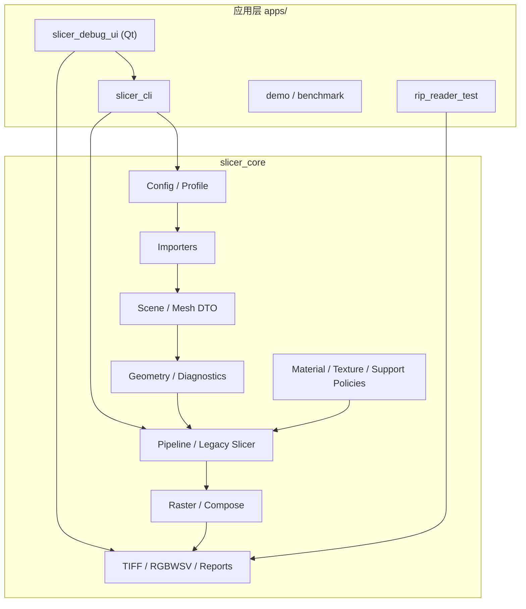
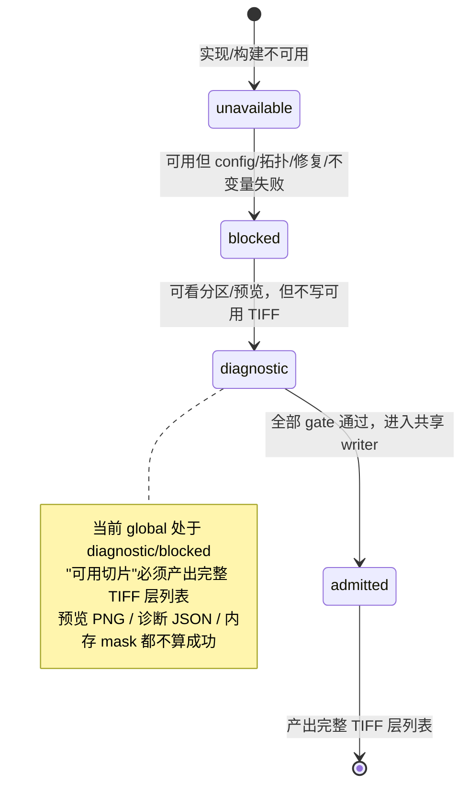
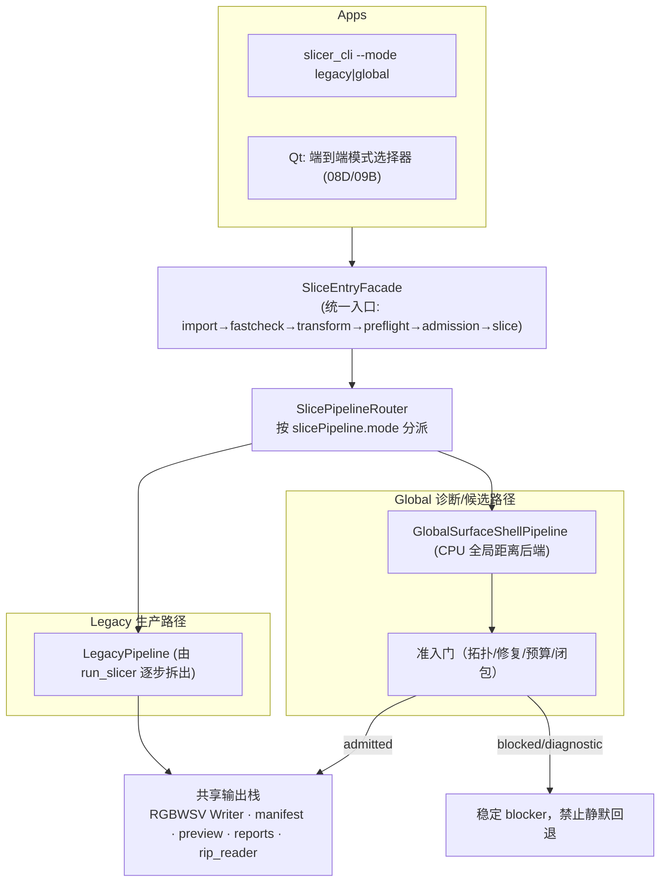

# CLAUDE_02 系统架构分析与优化

> 证据等级：A=代码事实，B=正式目标，P=Claude 建议。目录位置：`docs/claude/ANALYSIS/`。
> 本篇聚焦"设计 vs 落地"的差距，以及在项目红线内的架构演进方案。

## 1. 目标分层架构（B，设计意图）

项目在 `04_系统架构与模块边界.md` 与 `.agents/docs/architecture-boundary.md` 定义了清晰的分层与依赖方向：



层职责边界（B）：Apps 只做参数解析/编排/交互；Config 只做解析/迁移/校验；Importers 只把外部格式转 DTO；Geometry 只做拓扑/相交/距离，不碰 RGBWSV/报告/Qt；Policies 做材料/纹理/支撑/光油/准入决策，不隐式读盘；Pipeline 只按序组合并传状态，不吞错、不静默回退；Raster/Compose 做确定性像素/通道转换；Output/Reports 只写协议/统计，不反向决定业务。

## 2. 依赖红线：贯彻得好的部分（A）

以下红线经代码核实**确实被遵守**，是本项目架构最健康的一面：

| 红线 | 核实结论 |
|---|---|
| Qt 只在 UI 层，`slicer_core` 不依赖 `QString/QList/QObject/QWidget` | 全 `src/slicer_core` 对 Qt 符号 **0 命中**（已核实）|
| OpenVDB 可选、默认 OFF、不成普通构建强依赖 | `USE_OPENVDB=OFF` 默认；OFF 时核心/legacy 仍可构建 |
| SupportType 不进 TIFF 通道 | 仅存于 metadata/report/debug |
| 实验 OpenVDB 不写生产 RGBWSV | `write_production_rgbwsv` 默认 false，CLI 有 `--no-production-rgbwsv` |
| Reports 不拥有业务决策 | 报告为只读投影；准入在 diagnostics/policy |

代码中 `TODO/FIXME/HACK` 标记极少（`src` 仅 3 处且全在 `third_party/miniz`），说明**技术债不是"零散注释债"，而是"结构债"**——即"单体未拆 + 概念重复"，需要架构级治理而非局部修补。

## 3. 核心架构缺口：概念管线只有名字（A，最高优先）

这是全篇最重要的架构判断。

**现状（A）**：`pipeline/SlicePipeline.cpp`

```cpp
std::vector<std::string> DefaultSlicePipelineSteps() {
  return { "LoadConfig","ValidateConfig","LoadInputScene","NormalizeScene",
           "ResolveMaterials","PrepareTextureSources","ApplyTextureApplicationPolicy",
           "PrepareVarnishGeometryPolicy","SliceGeometry","GenerateSupport",
           "ComposeMaterialChannels","WriteRGBWSVPackage","WriteReports","ValidatePackage" };
}

SliceRunResult RunSlicePipelineLegacy(const std::filesystem::path& configPath, const SliceRunOptions& options) {
  ModelPreflightService service;
  ModelPreflightGateRequest request;
  request.preflight_request.configPath = configPath;
  request.selected_mode = ModelPreflightPipelineMode::Legacy;
  std::optional<SliceRunResult> result;
  const ModelPreflightGateResult gate = RunModelPreflightPipelineGate(
      service, request, [&](const ModelPreflightGateResult&) {
        result = run_slicer(configPath, options);   // 第 45 行：整条 pipeline = 一次调用
      });
  if (!result.has_value()) throw std::runtime_error(FormatModelPreflightGateFailure(gate));
  return std::move(result.value());
}
```

即：**"预检门 + 单次 `run_slicer()`"**。`PipelineContext` 有 `steps/scene/config` 字段，legacy 路径从不逐步填充。全部真实逻辑仍在 `slicer.cpp`（~4830 行）里顺序执行：`LoadConfig → LoadModel → Grid/Mask → Texture → Support → Compose → TIFF/Preview → Reports/Manifest`。

**为什么这是最关键的缺口（P）**：

1. **双模式无处分叉。** 目标 `slicePipeline.mode=legacy|global_surface_shell` 需要在"生产材料层形成前"分叉、"准入后"汇入同一 writer。单体没有清晰的分叉点/汇合点，08D 难以在不复制第二套 TIFF 协议的前提下接入。
2. **无法做 step-level 测试与剖析。** 性能热点（支撑生成、逐层合成）无法被独立计时/替换/缓存，12F 优化缺少 wrapper 边界。
3. **增量重算/预览分离困难。** UI 改一个参数就得整跑，无法只重算受影响步骤。
4. **回退与错误定位耦合。** 错误发生在 4830 行的哪一步，靠日志而非 step 结果码。

> 治理方向不是"大重构一步到位"，而是严格按 `wrap first / move later / rewrite last`：先给每个概念步骤加**可观测的 wrapper**（不改行为、只记录进入/耗时/产物摘要），再逐步把 `run_slicer()` 内的段落**迁移**为独立 step 函数（输入/输出 DTO 明确），最后在双模式与性能需要时**重写**热点。详细剧本见 `CLAUDE_06`。

## 4. 目标：双模式管线 + 共享写包（B）

> ⚠ **2026-07-27 更新**：本节所述双模式**已从目标态变为已实现**——`config/SlicePipelineConfig.h`（`SlicePipelineMode`）、`pipeline/SlicePipelineRouter.h`（`ResolveSlicePipelineRoute`、`fallback_applied` 审计、11 个稳定错误码）、`GlobalSurfaceShellProductionPipeline/Package/LayerAdapter/MaterialEvidence` 均已落地；Global 以显式 opt-in Profile 通过 TIFF/RIP strict，但慢 4.09–5.92×、峰值内存 8.19–8.74×，Legacy 仍为默认。§3 的"单体未拆"判断**依然成立**。详见 `VERIFICATION/CLAUDE_08`。

正式决策 `DOC_DECISION_12E_Legacy与GlobalSurfaceShell双切片模式.md`（Accepted，现已实现）定义：

```text
slicePipeline.mode = legacy | global_surface_shell   （默认 legacy；缺省即 legacy，TIFF 不变）
用户选择"端到端模式"，不是选 backend（首个 global candidate 用 OpenVDB-OFF 的 Legacy CPU 全局距离后端）
两模式在"生产材料层形成前"分叉，准入后共享同一 RGBWSV writer / p0.rgbwsv.2 manifest / preview/report/package 规则
```

Global 模式状态机（B）：



**禁止静默回退（B，已冻结稳定错误码）**：global 失败不得切 legacy、不得把 legacy 包冒充 global、不得把预览成功当生产成功；返回稳定 blocker，重选 legacy 是一次**新的显式请求**。已定义：`E_12E_PIPELINE_GLOBAL_NOT_ADMITTED`、`E_12E_PIPELINE_SILENT_FALLBACK_FORBIDDEN`、`E_12E_PIPELINE_PRODUCTION_TIFF_REQUIRED`。

## 5. Claude 建议的架构演进（P，红线内）

### 5.1 目标态架构图（建议）



### 5.2 分步落地策略（P，对应 06 的剧本）

| 阶段 | 动作 | 不变量 / 验证门 |
|---|---|---|
| S0 观测 wrapper | 给 14 步各加"进入/耗时/产物摘要"记录，行为不变 | 30 层 TIFF SHA-256 不变 + RIP strict 通过 |
| S1 步骤 DTO | 定义 `SliceStepContext`（config/scene/grid/masks/stats）与 step 输入输出 DTO | 单测覆盖每步 DTO；golden 投影不漂移 |
| S2 迁移非热点步 | 先迁 `LoadConfig/Validate/LoadScene/Normalize/ResolveMaterials/WriteReports/ValidatePackage` | 每迁一步跑 legacy 回归，TIFF hash 不变 |
| S3 迁移热点步 | 迁 `SliceGeometry/GenerateSupport/ComposeMaterialChannels` 为独立 step | 逐步计时可复现历史剖面；channel-hash 不变 |
| S4 引入 Router | 加 `slicePipeline.mode` 字段 + Router；legacy 默认，global 走诊断分支 | 缺省=legacy 行为 100% 不变；global 不写生产 TIFF |
| S5 共享 writer | 抽出 `RgbwsvPackageWriter` 单一实现，两模式复用 | 不复制第二套 TIFF 协议；rip_reader 双模式通过 |

> 核心原则：**每一步都能单独回退，且以"生产 TIFF 逐字节不变"为安全底线。** 这与 `run_material_closure_tests.ps1 -Mode RepairDisabled` 的 SHA-256 不变门思路一致。

### 5.3 统一入口 Facade（P，呼应 `DOC_ANALYSIS_12E_R3_04` §3）

正式分析已提出：导入检测 Gate 应是**核心内的正式共享 facade**，而非独立"诊断按钮"。建议：

```text
SliceEntryFacade::run(config, mode)
  = import → fast check → final transform → full preflight → mode-specific admission → slice
UI 与 CLI 调用同一 facade（消除 UI 直读 slicer.cpp 临时结构的风险）
```

这条 facade 一旦建立，既服务双模式，也天然承载"作业级"编排（进度、取消、错误呈现），是通往产品化的关键接缝。

## 6. 横切关注点的架构建议（P）

### 6.1 协议常量集中化（技术债，见 03）

现状（A）：`SLICE_PROGRESS` 进度令牌在 `apps/slicer_cli/main.cpp:289`（发送端）与 `apps/slicer_debug_ui/services/SliceProgressProtocolParser.cpp:9`（接收端）**各自硬编码**；RGBWSV 通道数在 `tiff_io.h`（`rgbwsv_channel_count=6`）定义，而 `rip_reader.h` 又**重复硬编码**通道顺序 `{"R","G","B","W","S","V"}`。

建议：新增 `src/slicer_core/output/rgbwsv/RgbwsvProtocol.h` 作为**协议单一真源**（通道顺序/数量/位深/极性/schema 字符串/进度令牌等），所有生产者/消费者/测试引用它。这直接落实 `.agents/AGENTS.md §5` "生产协议常量集中，不在多个模块复制魔法值"。

### 6.2 错误与结果模型（P）

项目已有稳定错误码文化（`ValidationIssue`、`E_12E_PIPELINE_*`、`rip_reader` 的 `ValidationErrorCode`）。建议在管线拆解时统一为：

```text
低层 parser/algorithm  -> status/result 或稳定异常
  -> ValidationIssue / blocker code（带 severity + production 影响）
    -> report/schema
      -> CLI exit code / UI 稳定错误码 + 友好中文
```

避免新增"只打印日志"的错误路径；每个新错误码需正/负测试并进 schema（`14_代码导读` §4 已成文，本集只强调在管线拆解中保持）。

### 6.3 配置模型：收敛"5 处材料意图"（P，见 03/05）

`SliceConfig`（A）中 `material(legacy)`、`material_policy`、`model_fill`、`material_process_profile`、`material_role_mapping` 可表达相互重叠甚至冲突的材料意图。教程已警告"不要在同一配置用三套矛盾意图"。建议中期给出**材料意图的规范优先级与归一模型**（哪一层覆盖哪一层、effective 如何推导），并在 `EffectiveConfig` 层固化，减少用户与 UI 的心智负担。

### 6.4 `material/` 与 `materials/` 命名（P）

现状（A）：并存两棵顶层树——`material/`（`MaterialClosureRepair`、`MaterialChannelComposer`）与 `materials/`（policy/profile/role/texture/varnish）。建议在一次有测试保护的重构中合并为单一 `materials/`，`material/` 内容归入 `materials/composition/` 与 `materials/closure/`，消除歧义（低风险、纯移动 + include 修正）。

## 7. 架构风险登记（P）

| 风险 | 触发条件 | 影响 | 缓解 |
|---|---|---|---|
| 单体拆解引入行为漂移 | 迁移步骤时误改逻辑 | 生产 TIFF 变化 | 每步 SHA-256 + RIP strict 不变门；小步提交 |
| 双模式复制第二套 TIFF 协议 | 08D 赶工 | 协议分裂、维护翻倍 | 先抽共享 writer（S5）再接 global |
| global 静默回退 legacy | 失败处理图省事 | 生产包语义错误 | 冻结错误码 + 负向测试；facade 强制 fail-closed |
| OpenVDB 变成隐性强依赖 | 为 global 便利默认开 | 普通构建被绑定 | 首个 global 后端用 CPU；保留 OFF 构建门 |
| 性能优化破坏确定性 | 并行/近似替换热点 | golden/channel-hash 漂移 | 先 profile、wrapper 化、保留 legacy 回退与不变量校验 |
| 配置重叠导致 effective 歧义 | 用户混用 5 处材料意图 | 结果不可预期 | 规范优先级 + effective 归一 + UI 收敛 |

## 8. 小结（P）

架构的"骨架和纪律"是本项目的强项：分层清晰、依赖红线被真正遵守、协议冻结、证据分级严格。真正要补的是"血肉的可组合性"——**把 14 步概念管线从 `slicer.cpp` 单体里安全地拆出来**，它是双模式（08D）、性能优化（12F）、增量重算、产品化编排（作业/UI）共同的前置条件。建议以"观测 wrapper → 步骤 DTO → 非热点迁移 → 热点迁移 → Router → 共享 writer"六步推进，全程以"生产 TIFF 逐字节不变 + RIP strict"为安全底线。
