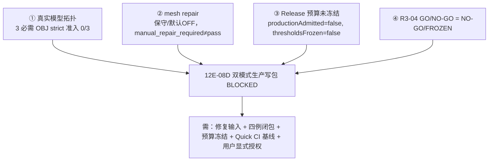

# CLAUDE_03 完整度评估与技术债清单

> 证据等级：A=代码事实，B=正式目标，P=Claude 判断。目录位置：`docs/claude/ANALYSIS/`。
> 本篇给出完整度细账、生产阻断链、以及可跟踪的技术债台账。
>
> ⚠ **2026-07-27 更新**：§1.5 与 §2 的"12E-08D BLOCKED 阻断链"已过期——**双模式已落地**，Global 以显式 opt-in Profile 通过 TIFF/RIP strict；阻断性质已从"能否写包"转变为"**性能与内存能否支撑默认化**"（慢 4.09–5.92×、峰值内存 8.19–8.74×）。技术债台账（§3）中 **D-01/D-02/D-03 仍然成立且更紧迫**（新能力是在单体旁新增模块获得的，`run_slicer()` 仍在 slicer.cpp:3964）。详见 [`VERIFICATION/CLAUDE_08`](../VERIFICATION/CLAUDE_08_基线差异与文档更新清单.md) 与重构方案 [`PLANNING/CLAUDE_09`](../PLANNING/CLAUDE_09_重构方案与目标架构.md)。

## 1. 完整度细账（P，口径见 00 §6）

在 01 §6 的域评分基础上，进一步拆到"子能力"，标注证据与差距。

### 1.1 输入 / 导入

| 子能力 | 状态 | 证据 | 差距 |
|---|---|---|---|
| STL / OBJ / MTL 导入 | 可用 | A：`model.cpp` `load_stl/load_obj`、`parse_obj_face_vertex` | 解析集中在 `model.cpp`（1662 行），`importers/` 仅 15 行 facade 桩 |
| 3MF stored/deflate、BaseMaterial/ColorGroup/Texture2D | 可用 | A：`model.cpp load_3mf`、3MF 负向测试脚本 | 无 strict-PASS 的真实 3MF 资产（正例仍用 `texture2d_checker_cube.3mf`）|
| 单位/缩放/旋转/自动朝向 | 可用 | A：`TransformConfig`/`AutoOrientConfig` | 自动朝向≠排版/碰撞/多模型摆放 |
| MaterialRoleMapping | 可用 | A：`material_role_mapping/` | 与其他 4 处材料意图存在重叠 |

### 1.2 几何 / 切片

| 子能力 | 状态 | 证据 | 差距 |
|---|---|---|---|
| `closed_mesh_scanline` | 可用 | A：`slicer.cpp` 扫描线；记录 `oddIntersectionRows` | 逻辑在单体内，未独立成 step |
| `relief_heightfield` | 可用 | A：`ReliefConfig`、relief 报告 | 仅适配 2.5D 形态 |
| 拓扑/鲁棒性诊断 | 可用（诊断）| A：`geometry/MeshTopologyDiagnostics`、`MeshRobustnessDiagnostics` | 服务 admission，不做静默修复 |
| 自交/非流形分析 | 可用（诊断）| A：`MeshCompleteSelfIntersectionAnalyzer`、`MeshNonManifoldPatternClassifier` | 分析≠修复；真实模型仍 0/3 准入 |
| mesh repair 修复链 | **未准入** | A：`geometry/repair/*`（保守、默认 OFF）、`mesh_repair_preflight` CLI | 修复后 post-strict、属性保持、真机预算未成生产链 |
| OpenVDB SDF / 壳层 | 可用（可选/诊断）| A：`geometry/OpenVdb*`、conformance 测试 | 默认 OFF，仅 conformance/candidate |

### 1.3 材料 / 纹理 / 支撑 / 光油

| 子能力 | 状态 | 证据 | 差距 |
|---|---|---|---|
| 六通道逐层合成 `compose_layer` | 可用 | A：`material/MaterialChannelComposer` + 单体合成 | 合成主体仍在 `slicer.cpp` |
| 纹理采样/fallback/策略 | 可用 | A：`TextureConfig`、`texture_image` | 多种 applyMode 语义易混 |
| 全局纹理壳层分区（12E）| 可用（诊断）| A：`materials/texture_application/GlobalTextureFillPartitionService`(718 行)、width sweep/transfer/raster/full closure 测试与 golden | **不进生产 writer** |
| 支撑（placement/island/internalVoid/shape）| 可用 | A：`support/*`、`SupportConfig` | 形态优化受 `maxAddedSupportRatio` 约束 |
| 光油（surface/outer/geometry target）| 部分 | A：`SurfaceVarnishConfig`/`OuterVarnishShellConfig` | `CompensatedShrink` 仅目标/实验 |
| 材料闭环 exact 检测 + 1px repair | 可用（repair 默认 OFF）| A：`diagnostics/MaterialClosureSemanticDetector`、`material/MaterialClosureRepair` | 2px+ 只报告；candidate≠exact |

### 1.4 输出 / 校验 / 报告

| 子能力 | 状态 | 证据 | 差距 |
|---|---|---|---|
| RGBWSV TIFF writer（stripped/tiled）| 可用 | A：`tiff_io.cpp`(641 行)、`output/rgbwsv/RgbwsvPackage` | 协议常量分散（见 §3 债 D-06）|
| manifest / reports / preview | 可用 | A：`reports/*`、golden 包 | 报告序列化路径多（见 D-07）|
| 包严格校验 | 可用 | A：`rip_reader.cpp`、`rip_reader_test`、bad-package 脚本 | 通道顺序在 reader 重复硬编码 |
| 输出版本化兼容策略 | 缺 | — | 未成文的多版本包兼容/迁移策略 |

### 1.5 管线 / UI / 性能 / 产品外围

| 子能力 | 状态 | 证据 | 差距 |
|---|---|---|---|
| 概念管线 14 步落地 | **未落地** | A：`SlicePipeline.cpp` 名字 + 转调 | 见 02 §3，最高优先 |
| 双模式 Router + 共享 writer | 未实现（目标）| B：双模式 Decision/Schema | `config.h` 无 `slicePipeline.mode` |
| Qt 工作台 | 可用 | A：`slicer_debug_ui` + self-test | UI 侧 god file；生产 mode selector 待 08D |
| Release 性能预算 | 未冻结 | B：`PRD_12F`，历史剖面 | 优化线 R1–R5 未启动 |
| 作业/设备/材料生命周期/RIP 接口/运维 | 缺 | — | 产品化外围整体未展开（见 04）|

## 2. 生产阻断链（A/B，通往 12E-08D）

**结论**：双模式生产写包 **12E-08D 仍 BLOCKED**，由四个相互咬合的阻断构成。



**① 真实模型拓扑（A，`REPORT_12E_启动准备状态.md`）**

```text
nai_you_new    : boundaryEdges=113        strict_closed BLOCKED
aishen_fudiao  : boundaryEdges=3, nonManifoldEdges=59   strict_closed BLOCKED
meigui_fudiao  : nonManifoldEdges=10940    strict_closed BLOCKED
R3-02 自交对数  : 8409 / 19270 / 5592（confirmed self-intersection，fail fast 于变更前）
```

**② mesh repair（A）**：修复保守、默认关闭；`manual_repair_required` 绝不计入 production pass；修复后必须重新 strict，不放宽 gate。

**③ Release 预算（A/B）**：`productionAdmitted=false`、`thresholdsFrozen=false`；真实 OBJ 全局核心 `skipped_due_topology`，仅闭合 Texture2D 3MF 走完全局链。

**④ R3-04 = NO-GO / FROZEN**（`DOC_DECISION_12E_08C_R3_04_08D_GO_NO_GO.md`）：因必需 OBJ 0/3 strict 准入且预算未冻结。

**模型资产治理（A，`REPORT_12E_08C_R4_模型资产预检清单.md`）**：15 个 OBJ/3MF → **7 strict-PASS**（5 个 `xiao_ma_wu_yu_new` + `yecan/3.obj` + `yecan/4.obj`）/ **1 需人工修复**（`caihong/5mm.obj`）/ **7 需重建**（含 3 必需模型）。这说明"资产入库标准 + 修复/重建流程"本身就是一条待建的产品能力（见 04/05）。

**已知失败基线（A）**：Quick CI 中 `material_process_top2 widthPx expected=48 actual=226` 长期作为记录基线存在，未在当前范围修复——建议单独立项定位（见 06 债项）。

## 3. 技术债台账（A 现象 + P 建议）

> 严重度：🔴 高（阻碍演进/有正确性风险）/ 🟡 中（增加维护与心智成本）/ 🟢 低（整洁性）。
> 规模：S ≤ 2 人日 / M ≤ 1–2 周 / L > 2 周。

| ID | 债务 | 位置（A）| 严重度 | 影响 | 建议（P）| 规模 |
|---|---|---|:--:|---|---|:--:|
| D-01 | 概念管线未落地（14 步只有名字）| `pipeline/SlicePipeline.cpp:12/45` | 🔴 | 双模式/性能/增量/编排全被卡 | 观测 wrapper→步骤 DTO→迁移（06 剧本）| L |
| D-02 | `slicer.cpp` god file（~4830 行）| `src/slicer_core/slicer.cpp` | 🔴 | 难测/难改/难剖析 | 随 D-01 分步迁出段落 | L |
| D-03 | 单体内联结构与一等模块重复 | `slicer.cpp` 匿名 ns ~40 结构 vs `support/ raster/ geometry/ material(s)/` | 🔴 | 两套实现并存、易漂移 | 迁移时以模块版本为准，删内联版 | L |
| D-04 | `importers/` 为 15 行 facade 桩，真解析在 `model.cpp` | `importers/*.cpp`、`model.cpp:1521/431/1068` | 🟡 | "拥有模块"名不副实 | 将解析迁入 `importers/`，`model.cpp` 收缩 | M |
| D-05 | 进度令牌 `SLICE_PROGRESS` 双处硬编码 | `slicer_cli/main.cpp:289`、`SliceProgressProtocolParser.cpp:9` | 🟡 | 协议漂移风险 | 抽 `RgbwsvProtocol.h`/共享常量 | S |
| D-06 | RGBWSV 通道顺序/数量重复定义 | `tiff_io.h:11`(`rgbwsv_channel_count{6}`) vs `rip_reader.h:62`(硬编码 `{"R","G","B","W","S","V"}`) | 🟡 | 违反"常量集中" | 同 D-05，单一真源 | S |
| D-07 | 多条 JSON 序列化路径并存 | 自研 `json_value.*`(447) + `reports/ReportWriter/Base/Schema` + vcpkg `nlohmann-json` | 🟡 | 心智与一致性成本 | 收敛为单一 report 序列化栈 | M |
| D-08 | `material/` 与 `materials/` 命名分裂 | 两棵顶层树 | 🟡 | 职责定位混乱 | 合并入 `materials/`（纯移动+include）| M |
| D-09 | 5 处材料意图可重叠冲突 | `config.h` `material/policy/model_fill/process_profile/role_mapping` | 🟡 | effective 语义歧义 | 规范优先级 + effective 归一（05/06）| M |
| D-10 | 无统一测试框架（断言式 main）| `tests/unit/*/main.cpp` × ~37 | 🟢 | 复用/报告能力弱 | 可选引入轻量框架或统一断言头 | M |
| D-11 | 脚本(49) 与 CTest 双轨 | `scripts/*.ps1` vs `add_test` | 🟢 | 门槛分散、易漏跑 | 以 CTest label 收敛脚本编排 | M |
| D-12 | 仓库卫生：构建产物入库 | 8+ `build-openvdb-*/vcpkg_installed`、`build/`、`runtime/` 副本（5 万+ 文件）| 🟡 | 克隆/检索/CI 变慢，遮蔽源码 glob | `.gitignore` 清理 + 迁出，历史另议 | S–M |
| D-13 | Quick CI 已知红基线 | `material_process_top2 widthPx 48 vs 226` | 🟡 | "已知失败"侵蚀门槛信任 | 单独立项定位并转绿或显式豁免 | S–M |
| D-14 | UI 侧 god file | `UiSmokeTestRunner.cpp`(2618)、`MainWindow.cpp`(1611) | 🟡 | UI 可维护性 | 拆分 runner/case 与窗口职责 | M |
| D-15 | 输出无版本化兼容策略 | 无 | 🟢 | 未来协议演进风险 | 成文多版本包兼容/迁移策略 | S |

## 4. 债务与演进的耦合（P）

- **D-01/02/03 是"根债"**：它们不还，双模式（08D）、性能（12F）、产品化编排都难推进。应作为近期最高优先，且与 12E 生产收口协同（06 剧本 P1）。
- **D-05/06/12 是"低风险高回报"**：可在不触碰生产逻辑的前提下先清，快速改善协议一致性与仓库健康度（06 剧本 P0/"随手清"）。
- **D-04/07/08/09/14 是"中期整洁"**：宜在对应模块被 D-01 迁移触及时"顺路重构"，避免单独制造大 diff。
- **D-13 是"信任债"**：已知红基线会让 `run_ci_quick.ps1` 的"绿"失去意义，建议尽快转绿或显式记录豁免范围。

## 5. 完整度小结（P）

对"上游切片 + 交付契约原型"这一当前边界，项目**主干接近可用（≈72%）**，短板集中在"可组合管线（35%）""性能预算（40%）""产品化外围（10%）"。技术债以**结构债**为主（而非注释债或 bug 债），意味着回报最高的投入是**架构级的管线拆解 + 常量/命名/仓库治理**，而非零散修补。这也正是 04 路线图与 06 任务底稿的组织依据。
