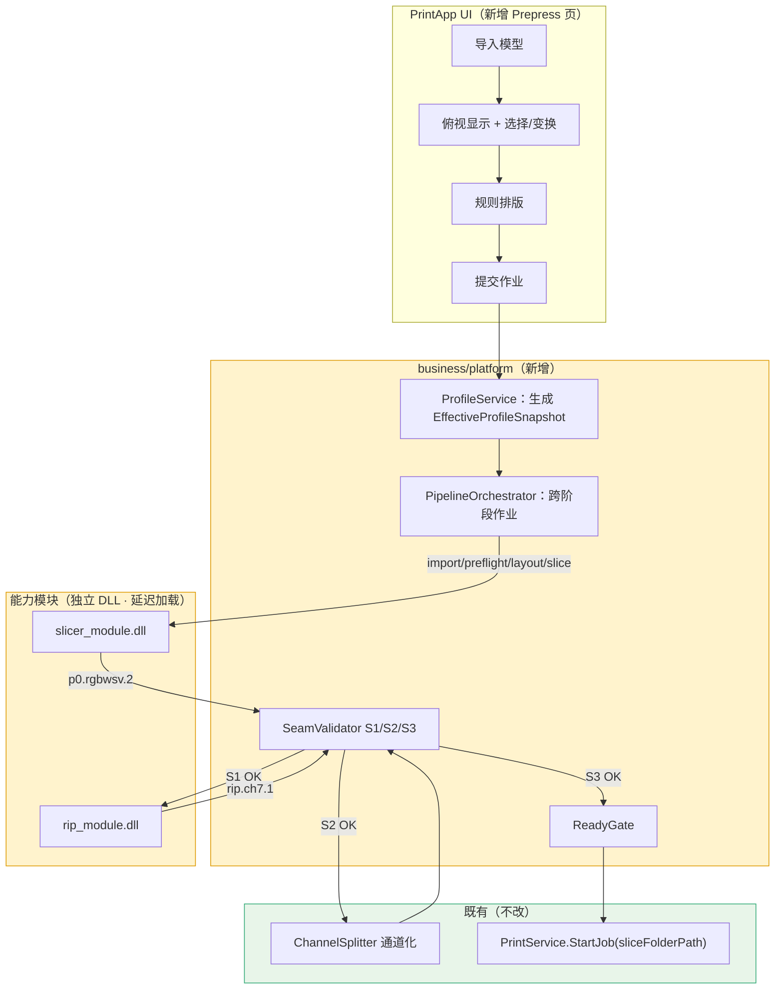

# INT_01 MVP 集成方案与里程碑

> 目录：`docs/claude/INTEGRATION/`。日期：2026-07-27。
> MVP 范围（已确认）：**含多模型排版**。证据等级：A=已核实事实，P=方案建议。

## 1. MVP 定义

**一句话**：在 PrintApp 里完成「导入多个模型 → 俯视排版 → 预检准入 → 联合切片 → RIP → 通道化 → Ready 校验 → 打印」的**一次完整闭环**，且全程只用一套 Profile、一个作业、三个强制接缝校验。

### 1.1 In / Out

| ✅ MVP 之内 | ❌ MVP 之外（后置）|
|---|---|
| 多模型导入（OBJ/STL/3MF + 贴图）| 自动 nesting（真正的排样优化）|
| 俯视 2D 显示与选择 | 真实 3D 视口（透视相机/轨道/拾取）|
| 变换：移动、旋转 Z、等比缩放、镜像 | 三轴 gizmo、撤销/重做、吸附对齐 |
| 规则排版（行列 + 间距）+ 碰撞/幅面 fail-closed | 跨模型联合支撑 |
| 预检 strict 准入（阻断即拒绝）| 自动网格修复入生产链（保持默认关闭）|
| 联合切片 → 单一 RGBWSV 包 | 增量重切片与缓存 |
| RIP 调用（契约先行接口）| ICC 色彩管理 |
| 通道化 → Ready 闸门 → 打印 | 多作业并行队列、断点续打增强 |
| 单设备、单 Profile | 多设备、mixed-profile |
| 作业进度/取消/失败留档 | 分布式/远程作业 |

### 1.2 MVP 成功判据（P）

```text
1. 导入 ≥3 个模型，规则排版后无碰撞、无越界，UI 可见结果；
2. 一键提交 → 作业贯穿全部阶段，进度单调、可取消；
3. 三个接缝（S1/S2/S3）全部通过强制校验；
4. 产出的切片目录能被既有 PrintService.StartJob 直接消费；
5. 同一输入 + 同一 Profile 重跑，产物稳定投影一致；
6. 全链路可在无设备环境下跑到 Ready（满足 AC-28-03）。
```

## 2. 端到端链路



**关键设计**：排版与切片都在 `slicer_module.dll` 内（同一 `MultiModelScene` 数据模型，A），避免几何真值分裂；UI 只做显示与手感（详见 `../PLANNING/CLAUDE_13` §2）。

## 3. 里程碑（建议 5 个）

> 每个里程碑都是**可演示、可回退**的完整增量。

### M0 契约冻结（不写业务代码）

| 产出 | 说明 |
|---|---|
| `print_module_spi.h` | 统一 SPI 头（切片与 RIP 共用）|
| `p0.rgbwsv.2` schema | 已有，形式化为 JSON Schema |
| `rip.ch7.1` schema | 新建（INT_03 §3）|
| 切片目录契约 schema | 既有 `slice_{layer}_{channel}.bmp` 规则形式化 |
| Profile key 清单 | 三模块各需哪些 key |
| 错误码命名规范 | `PM-<模块>-<类别>-<码>` |
| **TBD 关闭** | 尤其 INT_03 的 TBD-1（W/S/V 墨滴量化归属）|

**出口**：三方（切片/RIP/打印）书面确认。**M0 不完成不进入 M1。**

### M1 平台层骨架 + 切片模块可装载

| 任务 | 出口门 |
|---|---|
| 新增 `business/platform/`：ModuleRegistry / ProfileService / ErrorTranslator | 能装载空模块、版本协商、自检通过 |
| 切片侧产出 `slicer_module.dll` + `module.json` | 通过 L1 SPI 一致性套件 |
| CMake 接入（照抄 A3DSDK 的 IMPORTED + `/DELAYLOAD` 范式）| 纯打印路径不装载切片 DLL（验 AC-28-04）|
| `SliceService → PreparedPrintDataService` 改名 | 全测试通过 |

**演示**：命令行/测试里装载切片 DLL，打印能力清单与版本。

### M2 单模型离线链路（先不接设备）

| 任务 | 出口门 |
|---|---|
| `business/prepress/SlicerService`：导入 + 预检 + 单模型切片 | 产出 `p0.rgbwsv.2` 包 |
| `SeamValidator(S1)`：复用切片侧 `rip_reader_test` 能力 | 正例通过 / 负例被拦 |
| `PipelineOrchestrator` 最小版（顺序执行 + 进度 + 取消）| 可取消且无残留 |

**演示**：选一个模型 → 出切片包 → S1 校验通过。

### M3 多模型排版（MVP 的核心增量）

| 任务 | 出口门 |
|---|---|
| UI 新增 Prepress 页：模型列表、俯视 2D 显示 | 可见多实例 |
| 变换交互（移动/旋转 Z/等比缩放/镜像）+ 乐观本地反馈 | 手感流畅（不过边界）|
| 提交式权威求值（携带 `expectedSceneRevision`）| 变换后 bbox/碰撞由模块裁决 |
| 规则排版（行列 + 间距，UI 可配）| 无碰撞、无越界；越界 fail-closed |
| 联合切片 → 单一包 | 单一 `p0.rgbwsv.2`，含 per-instance 统计 |

**演示**：导入 3–5 个模型 → 规则排版 → 联合切片出一个包。

> **依赖提醒（A）**：设备 `buildVolume`、原点、轴向是排版越界判定的前提，属外部 Gate。MVP 阶段建议在 Profile 里**显式配置一个"标称幅面"**并在 UI 标注"待设备确认"，避免被外部输入卡死。

### M4 接入 RIP + 通道化 + Ready

| 任务 | 出口门 |
|---|---|
| `RipService` 按 INT_03 调用 `rip_module.dll` | 产出 `rip.ch7.1` |
| **`rip_output_validator`（S2）** | C1–C7 全过；尤其 C5 拦住 W/S/V 越界 |
| 接既有 `ChannelSplitter` | 产出 12 通道目录 |
| `PackageVerifier`（S3）+ `ReadyGate` | 未过闸门不得进 `StartJob` |

**演示**：全链路跑到 Ready，目录可被 `PrintService` 识别。

### M5 打通打印 + 作业留档

| 任务 | 出口门 |
|---|---|
| `ReadyGate → PrintService.StartJob(sliceFolderPath)` | 打印链路**零改动**接上 |
| `PrepressJobRepository` 作业留档（含 Profile 快照）| 可回溯"这批图用的哪套参数" |
| UI 作业监控（阶段/进度/失败原因/取消）| 端到端可视 |

**演示（MVP 完成）**：导入多模型 → 排版 → 一键 → 打印。

## 4. 阶段权重与进度归一（P）

UI 只显示一条总进度 + 当前阶段名，建议权重：

```text
Import 5% | Preflight 10% | Layout 5% | Slice 45% | Rip 20% | Channelize 12% | Verify 3%
```

（Slice 与 Rip 的实际权重在 M4 后按真实耗时标定。）

## 5. 风险与对策（P）

| 风险 | 等级 | 对策 |
|---|---|---|
| **TBD-1 未关闭就开工**（W/S/V 墨滴量化归属）| 🔴 | M0 强制关闭；未关闭不进 M4 |
| 切片崩溃/OOM 拖垮宿主（Global 内存 8.19–8.74×，A）| 🔴 | 重作业走子进程承载（`CLAUDE_13` §1.4）；MVP 至少对切片阶段启用 |
| buildVolume 等外部输入未定 | 🟡 | Profile 里配"标称幅面"+ UI 标注待确认，不阻塞 M3 |
| 三处配置漂移 | 🟡 | M1 就把 ProfileService 建起来，模块不自带业务默认值 |
| 接缝错位被静默吞 | 🔴 | S1/S2/S3 校验设为**强制步骤**，不是调试开关 |
| MVP 范围膨胀 | 🟡 | 严守 §1.1 的 ❌ 列表；新需求进 backlog 不进 MVP |
| 打印链路被误改 | 🔴 | 遵守 INT_04 §6 禁改清单；CI 加保护 |

## 6. 与既有约束的一致性（A）

```text
AC-28-03 无设备可验证切片/RIP→数据包   → M2/M4 即满足（离线链路先行）
AC-28-04 打印运行时不加载切片/RIP 引擎 → M1 的 /DELAYLOAD 验证
AC-28-19 核心 API 可在无 QWidget 测试调用 → platform/prepress 全 Qt-free
DEV_51   预处理不得依赖 A3DSDK          → CI 依赖方向检查
DEV_51   SlicerService 与 SliceService 命名分离 → M1 改名任务
架构守卫  几何不得进 presentation/       → UI 只做显示与手感
```

## 7. 建议的执行纪律（P）

1. **M0 不打折**。三模块已各自跑通的情况下，集成失败几乎全部源于"契约没冻结就接线"。
2. **每个里程碑可演示**。不做"憋大招"式集成。
3. **离线先行**。M2–M4 全在无设备环境完成，把设备相关风险留到 M5。
4. **打印链路零改动**是硬约束，不是建议（INT_04）。
5. 每完成一个里程碑，更新本篇状态 + 对应接缝校验的 fixture。
