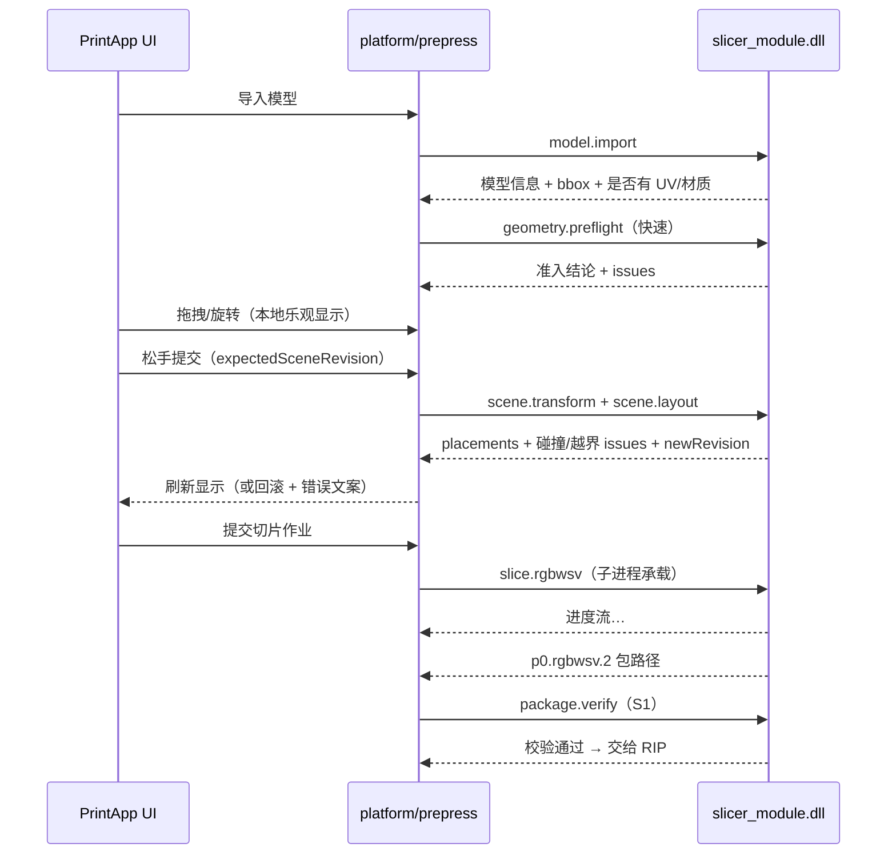

# INT_02 切片模块对接规范

> 目录：`docs/claude/INTEGRATION/`。日期：2026-07-27。
> 面向：打印软件开发（调用方）与切片模块开发（实现方）。证据等级：A=已核实代码事实，P=设计建议。
>
> ⚠️ **本篇 §1.1 的 8 项能力清单已过期（2026-08-02）**。经打印侧 `CLD_27` 与我方 `INT_06` 采纳**方案 C（几何真值包）**后，`scene.layout` **不再对外提供**（碰撞/越界改由 `geometry.collision` 出真值，packing 策略归宿主）。
> **能力清单以 [`INT_09` §3 的 v2 清单](INT_09_契约完整性审计与补齐.md)（15 项）为唯一权威**；其余章节（场景 JSON、请求契约、错误码、承载策略、安全发布）仍然有效。差异裁定见 [`INT_13` §4](INT_13_封装层级一致性核对与完善清单.md)。

## 1. 模块定位与能力清单

切片模块以 **`slicer_module.dll`（预处理能力包）** 形式提供，实现与 RIP 相同的统一 SPI（见 INT_03 §4）。

### 1.1 `provides`（包内能力）

| 能力 ID | 说明 | 承载建议 |
|---|---|---|
| `model.import` | OBJ / STL / 3MF / MTL / 贴图 权威解析 | 进程内 |
| `geometry.preflight` | 拓扑诊断 + strict 准入裁决（唯一裁决者）| 进程内（轻）/ 子进程（全量）|
| `geometry.repair` | 保守修复 + 修复后重新 strict（**默认关闭**）| 子进程 |
| `scene.transform` | 变换求值（移动/旋转Z/等比缩放/镜像/落台）+ 变换后 bbox | 进程内 |
| `scene.layout` | 规则排版、间距、幅面越界、实例间碰撞 | 进程内 |
| `scene.viewdata` | 供 UI 渲染的几何数据（俯视轮廓、bbox）——**只给数据不渲染** | 进程内 |
| `slice.rgbwsv` | 单模型/联合切片 → `p0.rgbwsv.2` 包 | **子进程** |
| `package.verify` | 包读取与协议严格校验（S1 校验器）| 进程内 |

### 1.2 不提供（由打印软件负责）

```text
渲染/拾取/相机/gizmo 手感 · 交互临时态 · 设备 Profile 与 buildVolume
RIP · 通道化 · 作业队列 · 持久化 · 任何 Qt 类型
```

## 2. 数据模型：场景与实例（A）

切片侧已实现的核心 DTO，打印软件按此构造请求：

```text
MultiModelScene       场景（含实例集合 + 场景版本 revision）
ModelInstance         实例（instanceId + 模型引用 + 变换 + 可见/锁定）
ModelTransform        变换（平移 XY / 旋转 Z / 等比缩放 / 镜像 X,Y）
SceneEffectiveConfig  场景级有效配置
```

**场景版本（乐观并发，A）**：`GridLayoutRequest` 内置 `currentSceneRevision / expectedSceneRevision`。UI 提交时携带 `expectedSceneRevision`，若与模块侧当前版本不符 → 返回 `SceneRevisionStale`，UI 需重取后重试。**这是 UI 流畅拖拽 + 模块权威裁决的关键机制。**

### 2.1 场景 JSON（`scene_json`）

```json
{
  "sceneId": "scene-0001",
  "revision": 42,
  "buildVolume": { "widthMm": 300, "depthMm": 200, "heightMm": 100, "originMm": [0, 0, 0] },
  "instances": [
    {
      "instanceId": "inst-001",
      "modelPath": "D:/models/a.obj",
      "visible": true,
      "locked": false,
      "transform": {
        "translationMm": [12.0, 8.0, 0.0],
        "rotationZDeg": 90.0,
        "uniformScale": 1.0,
        "mirrorX": false,
        "mirrorY": false
      }
    }
  ]
}
```

> **buildVolume 由打印软件提供**（设备域），模块只消费并 fail-closed 校验。这也顺带关闭切片侧长期悬空的 buildVolume/轴向 Gate。

## 3. 典型调用序列



## 4. 请求契约（`pm_submit`）

### 4.1 排版求值请求

```json
{
  "jobId": "layout-0007",
  "capability": "scene.layout",
  "scene": { "...见 §2.1..." },
  "layout": {
    "mode": "grid",
    "columns": 11, "rows": 2,
    "columnGapMm": 10.0, "rowGapMm": 10.0,
    "keepManualAdjustments": true
  },
  "expectedSceneRevision": 42
}
```

### 4.2 切片作业请求

```json
{
  "jobId": "job-20260727-0001",
  "correlationId": "trace-abc123",
  "capability": "slice.rgbwsv",
  "scene": { "...见 §2.1..." },
  "output": { "contract": "p0.rgbwsv.2", "packageDir": "D:/jobs/0001/slice" },
  "profile": {
    "profileVersion": "2026-07-27.1",
    "profileHash": "sha256:…",
    "output": { "dpiX": 600, "dpiY": 600, "layerThicknessMm": 0.028,
                "storageMode": "stripped" },
    "slicingMode": "relief_heightfield",
    "texture": { "enabled": true, "applyMode": "top_surface_band", "topSurfaceLayers": 1 },
    "support": { "enabled": true, "mode": "bottom_projection", "placement": "lower" },
    "materialClosure": { "enabled": true, "mode": "diagnostic" }
  },
  "options": { "backend": "auto", "threads": 0 }
}
```

**要点（P）**：

- `profileVersion/profileHash` 由宿主 `ProfileService` 生成，模块**原样回写**到结果，用于追溯；
- `backend: auto | inprocess | subprocess`（承载策略，见 `../PLANNING/CLAUDE_13` §1.4）；
- 模块**不得自带业务默认值**：Profile 缺关键项应报 `PM-SLICER-PROFILE-*` 而不是静默取默认。

## 5. 输出契约（S1）

```text
<packageDir>/
├─ manifest.json          schema = "p0.rgbwsv.2"
├─ layers/layer_%06d.tif  6 通道 R,G,B,W,S,V · 8bit · black_is_print(0=出墨,255=空)
├─ reports/*.json         切片/支撑/纹理/材料闭环/场景等报告
└─ preview/*.png          可选
```

联合切片额外要求（P）：`manifest` 与 `reports` 中应含 **per-instance 统计**（每个 `instanceId` 的像素量、层范围、材料用量），供 UI 与成本核算使用。

## 6. 错误码（`PM-SLICER-*`）

| 错误码 | 含义 |
|---|---|
| `PM-SLICER-OK-0000` | 成功 |
| `PM-SLICER-INPUT-0001` | 模型文件不存在/不可读 |
| `PM-SLICER-INPUT-0002` | 格式不支持/解析失败 |
| `PM-SLICER-TOPOLOGY-0010` | strict 准入阻断（自交/非流形/边界边）|
| `PM-SLICER-TOPOLOGY-0011` | 需人工修复（`manual_repair_required`，**不算 pass**）|
| `PM-SLICER-LAYOUT-0020` | 实例间碰撞 |
| `PM-SLICER-LAYOUT-0021` | 超出 buildVolume 幅面 |
| `PM-SLICER-LAYOUT-0022` | 场景版本过期（`SceneRevisionStale`）|
| `PM-SLICER-LAYOUT-0023` | 实例数超上限 |
| `PM-SLICER-PROFILE-0030` | 必需参数缺失 |
| `PM-SLICER-PROFILE-0031` | 参数越界（DPI/层厚等）|
| `PM-SLICER-RESOURCE-0040` | 内存不足（建议改子进程承载）|
| `PM-SLICER-OUTPUT-0050` | 输出目录不可写/空间不足 |
| `PM-SLICER-CONTRACT-0060` | 自检发现产物不符合 `p0.rgbwsv.2` |
| `PM-SLICER-CANCELLED-0070` | 已取消（临时产物已清理）|
| `PM-SLICER-INTERNAL-0099` | 内部错误 |

## 7. 进度阶段

```text
import → preflight → layout → grid → mask → texture → support → compose → write → report
```

`pm_poll` 返回 `{state, stage, percent, layersDone, layersTotal, currentInstanceId?, elapsedMs, etaMs}`；进度**单调不回退**。

## 8. 承载策略与安全（P）

| 调用 | 承载 | 原因 |
|---|---|---|
| import / preflight(快) / transform / layout / viewdata / verify | 进程内 | 交互高频、内存可控 |
| **slice / repair / Global 模式** | **子进程** | 长时、大内存（Global 峰值内存 8.19–8.74×，A）、崩溃风险 |

安全发布（与 RIP、通道化一致）：先写 `<packageDir>.staging/`，全部成功且自检通过后原子改名；失败或取消删除 staging，**绝不暴露半成品目录**。

## 9. 调用方检查清单（打印软件侧）

```text
□ 装载后先 pm_module_info，校验 spi/runtime/buildConfig 匹配，否则 fail-closed
□ 所有 Profile 由 ProfileService 投影下发，模块侧不设业务默认值
□ buildVolume/原点/轴向由打印软件提供
□ 排版提交必须带 expectedSceneRevision，收到 Stale 要重取重试
□ 切片阶段默认走子进程承载
□ 产物必须过 S1 校验（package.verify）才交给 RIP
□ 错误码经 ErrorTranslator 转中文文案，UI 不吞码
□ correlationId 全链路透传，写入作业留档
□ 纯打印路径不装载本 DLL（/DELAYLOAD 验证）
```

## 10. 待确认（TBD）

| 编号 | 问题 |
|---|---|
| TBD-S1 | 联合切片的 per-instance 统计字段清单是否满足打印软件与成本核算需求 |
| TBD-S2 | `scene.viewdata` 需要的精度与形式（轮廓折线？降采样三角？）由 UI 渲染方案决定 |
| TBD-S3 | 实例数上限与对应内存画像（用于 `backend=auto` 阈值标定）|
| TBD-S4 | 多模型是否允许 mixed-profile（当前建议 P0 仅 `scene_profile_only`，不一致即 fail-closed）|
