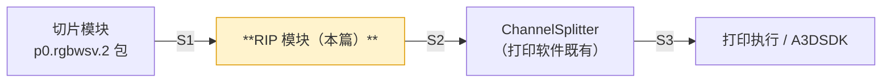

# INT_03 RIP 模块 API 对接与使用协议（契约先行 v0.1）

> 目录：`docs/claude/INTEGRATION/`。日期：2026-07-27。状态：**契约先行草案，待 RIP 侧确认**。
> 说明：RIP 源码当前不可访问，本篇由**打印软件侧（消费方）反向定义**「RIP 应如何被调用」，RIP 侧据此适配或提出修订。
> 标记：A=已核实事实（来自打印软件/切片代码）、P=设计建议、**TBD**=必须由 RIP 侧确认。

## 1. RIP 在链路中的位置与职责



**RIP 的职责边界（P）**：

| ✅ RIP 负责 | ❌ RIP 不负责 |
|---|---|
| 色彩分色：`RGB → CMYK` | 几何切片、支撑、光油几何（切片模块） |
| 墨量限制 / 总墨量控制 | 12 物理喷头映射（`ChannelSplitter`） |
| 半色调 / 网点 | 设备运动、pass 规划（A3DSDK） |
| **W/S/V 墨滴量化**（见 §4，关键）| 作业队列、UI |
| ICC / 色彩管理（若支持）| 层顺序与 Z 语义（沿用切片输出） |

## 2. 输入契约（S1：来自切片模块）

RIP 的输入是切片产出的 **`p0.rgbwsv.2`** 包（A，协议已冻结）：

```text
<packageDir>/
├─ manifest.json          schema = "p0.rgbwsv.2"
├─ layers/layer_%06d.tif  每层一个 TIFF
├─ reports/*.json
└─ preview/*.png          （可选，RIP 应忽略）
```

**每层 TIFF 的硬性事实（A）**：

```text
通道数    6，固定顺序 R, G, B, W, S, V
位深      8 bit（uint8）
存储      stripped 或 tiled（manifest 中声明；RIP 需两者都能读）
极性      black_is_print → printValue = 0（出墨）, emptyValue = 255（空）
背景      模型外区域 6 通道均为 255
语义      R/G/B=彩色  W=白墨  S=支撑  V=光油
```

**manifest 关键字段（A）**：`schema`、grid（宽高像素）、`dpiX`/`dpiY`、`pixelSize`、`originMm`、`layerThicknessMm`、层列表、`{polarity:"black_is_print", printValue:0, emptyValue:255}`。

> ⚠ **极性提醒（P）**：`0 = 出墨` 与多数图像处理直觉相反。RIP 内部若按"值越大墨越多"处理，**必须先做极性归一**，否则出图全反。建议 RIP 在读入后立即转成内部统一表示，并在自检里加一条极性断言。

## 3. 输出契约（S2：交给 ChannelSplitter）—— `rip.ch7.1`

这是**最关键的契约**，由打印软件既有代码的硬校验反推得出（A，`ChannelSplitter.cpp:406-461`）：

```cpp
if (outInfo.samplesPerPixel < 7)  { /* 报错 */ }
if (outInfo.bitsPerSample != 8)   { /* 报错 */ }
if (outInfo.planarConfig != PLANARCONFIG_CONTIG) { /* 报错：不支持 planar */ }
```

### 3.1 格式要求（强制）

| 项 | 要求 | 违反后果 |
|---|---|---|
| samples/pixel | **≥ 7** | 直接报错拒绝 |
| bits/sample | **必须 8** | 直接报错拒绝 |
| planarConfig | **必须 `PLANARCONFIG_CONTIG`（chunky 交错）** | 直接报错拒绝 |
| 读取方式 | 消费方用 `TIFFReadScanline`（逐扫描行）| 不支持 tiled，**RIP 输出禁止 tiled** |
| 逻辑通道顺序 | `C, M, Y, K, White, Support, Varnish`（前 7 个）| 顺序错 = 材料错位 |
| 尺寸一致性 | 同一作业所有层 **宽高必须完全一致** | `ImageSizeMismatch` |

> 注（A）：消费方取 `validChannels = min(samplesPerPixel, routes.size())`，即**第 8 个及以后的 sample 会被静默忽略**。若 RIP 需输出附加通道，可放在第 8 位之后，但不要指望被消费。

### 3.2 取值语义（**最易出错，重点**）

消费方对不同通道采用**不对称**的解释（A，`ChannelSplitter.cpp:623-646`）：

```cpp
int TiffSampleToDropCount(std::uint8_t value, int logicalChannel) {
    if (value == 0) return 0;
    if (logicalChannel >= 4) {          // White / Support / Varnish
        return static_cast<int>(value); // 直接作为 0–9 墨滴总数
    }
    if (value >= 200) return 3;         // CMYK：阈值映射
    if (value >= 120) return 2;
    return 1;
}
```

因此：

| 逻辑通道 | 索引 | 取值含义 | RIP 应输出 |
|---|:--:|---|---|
| Cyan | 0 | 阈值映射：`0`=无，`1–119`→1 滴，`120–199`→2 滴，`≥200`→3 滴 | 半色调后的**灰度值**（0–255）|
| Magenta | 1 | 同上 | 同上 |
| Yellow | 2 | 同上 | 同上 |
| Black | 3 | 同上 | 同上 |
| **White** | 4 | **直接取值 = 墨滴总数** | **量化后的 0–9 整数**（不是 0–255！）|
| **Support** | 5 | 同上 | 同上 |
| **Varnish** | 6 | 同上 | 同上 |

> ⚠ **头号集成风险（P）**：切片侧 W/S/V 是 **0/255 二值**（`0=出墨`）。若 RIP 直接透传，消费方会把 `255` 当作"255 滴"——远超 0–9 合法范围，行为未定义；把 `0` 当作"0 滴"，即**白墨完全不出**。
>
> **所以 RIP 必须完成 W/S/V 的"二值 → 0–9 墨滴数"量化**，量化档位由材料工艺参数决定（如白墨打底 6 滴、支撑 9 滴、光油 3 滴）。**这一条必须在编码前确认。**（TBD-1）

### 3.3 输出组织形式（TBD-2）

消费方支持两种输入组织（A，`ValidateLayers`）：

```text
模式 A（LayerImages）  ：prefix_<layer>.<ext>            ← 推荐，每层一个多通道 TIFF
模式 B（ChannelMatrix）：prefix_<layer>_<channel>.<ext>
```

约束（A）：两模式**不可混用**；层号必须**连续**（不要求从 1 开始）；每层通道集合必须一致；扩展名支持 `.bmp/.png/.tif/.tiff`。

**建议（P）**：RIP 采用**模式 A**，每层输出一个 ≥7 通道 contig TIFF，命名 `rip_%06d.tif`，与切片层号一一对应。

## 4. RIP 模块 API（C ABI，与切片模块同一套 SPI）

为使宿主 `ModuleRegistry` 用同一段代码装载所有模块，RIP 应实现与切片模块相同的 SPI（详见 `../PLANNING/CLAUDE_12`）。

```c
/* rip_module.dll 导出（C ABI，MSVC x64） */
#define PM_SPI_VERSION 1

typedef struct pm_module_s pm_module_t;
typedef struct pm_job_s    pm_job_t;

int  pm_spi_version(void);                       /* 必须返回 1 */
int  pm_module_info(char* json_out, int cap);    /* 见 §4.1 */

pm_module_t* pm_create (const char* options_json);
void         pm_destroy(pm_module_t*);

pm_job_t* pm_submit (pm_module_t*, const char* request_json);   /* 见 §5 */
int       pm_poll   (pm_job_t*, char* progress_json, int cap);  /* 见 §6 */
int       pm_cancel (pm_job_t*);                                /* 协作式取消 */
int       pm_result (pm_job_t*, char* result_json,  int cap);   /* 见 §7 */
void      pm_release(pm_job_t*);

int  pm_self_test(pm_module_t*, char* report_json, int cap);
```

**ABI 硬性约束（P，防崩溃）**：

```text
1. 只用 C 类型；禁止跨边界传 std::string / std::vector / Qt 对象
2. 字符串一律 UTF-8，调用方分配缓冲；cap 不足时返回所需长度（负值或约定码）
3. 句柄不透明，创建/释放必须成对，且由同一 DLL 完成（禁止跨 DLL delete）
4. 不得抛异常越过 DLL 边界；内部异常必须转为错误码
5. 声明并遵守运行时：建议统一 MSVC x64 /MD（Release）与 /MDd（Debug）
6. 线程安全：pm_module_t 允许多线程提交；同一 pm_job_t 只由一个线程操作
```

### 4.1 `pm_module_info` 返回（能力自述）

```json
{
  "id": "rip",
  "name": "RY RIP Module",
  "version": "0.1.0",
  "spi": 1,
  "runtime": "MSVC-x64-MD",
  "buildConfig": "Release",
  "consumes": [{ "contract": "p0.rgbwsv.2", "kind": "package" }],
  "produces": [{ "contract": "rip.ch7.1",   "kind": "layerdir" }],
  "capabilities": {
    "logicalChannels": ["C","M","Y","K","White","Support","Varnish"],
    "outputSamplesPerPixel": 7,
    "outputBitsPerSample": 8,
    "outputPlanarConfig": "contig",
    "halftone": ["error_diffusion", "ordered"],
    "iccSupported": false,
    "dropLevelsMax": 9,
    "maxThreads": 8
  },
  "profileKeys": ["material.*", "color.*", "device.channelCount", "output.dpi"]
}
```

> **TBD-3**：`halftone` 支持的算法名、是否支持 ICC、并发上限，请 RIP 侧据实填写。

## 5. 作业请求（`pm_submit` 的 `request_json`）

```json
{
  "jobId": "job-20260727-0001",
  "correlationId": "trace-abc123",
  "input": {
    "contract": "p0.rgbwsv.2",
    "packageDir": "D:/jobs/0001/slice",
    "manifest": "D:/jobs/0001/slice/manifest.json"
  },
  "output": {
    "contract": "rip.ch7.1",
    "dir": "D:/jobs/0001/rip",
    "naming": "rip_%06d.tif",
    "organization": "layer_images"
  },
  "profile": {
    "profileVersion": "2026-07-27.1",
    "profileHash": "sha256:…",
    "color": {
      "mode": "device_cmyk",
      "iccInput": null,
      "iccOutput": null,
      "totalInkLimitPct": 280,
      "blackGeneration": { "gcr": 0.8, "ucr": 0.0 }
    },
    "halftone": { "algorithm": "error_diffusion", "levels": 4 },
    "dropQuantization": {
      "white":   { "mode": "constant", "drops": 6 },
      "support": { "mode": "constant", "drops": 9 },
      "varnish": { "mode": "constant", "drops": 3 }
    },
    "polarity": { "input": "black_is_print", "output": "drops_positive" }
  },
  "options": { "threads": 0, "overwrite": true, "dryRun": false }
}
```

要点（P）：

- `profileVersion` + `profileHash` 由宿主 `ProfileService` 生成并留档，**RIP 必须原样回写到结果里**，用于事后追溯"这张图用的哪套参数"；
- `dropQuantization` 就是 §3.2 那条关键语义的参数化入口（**TBD-1** 的落点）；
- `threads: 0` 表示由模块自决；`dryRun` 用于只校验参数不产图。

## 6. 进度（`pm_poll` 的 `progress_json`）

```json
{
  "jobId": "job-20260727-0001",
  "state": "running",
  "stage": "halftone",
  "percent": 42,
  "layersDone": 86,
  "layersTotal": 205,
  "elapsedMs": 12840,
  "etaMs": 17300,
  "message": "processing layer 86"
}
```

约定（P）：`state ∈ {queued, running, cancelling, succeeded, failed, cancelled}`；`stage` 建议 `read → color → inklimit → halftone → quantize → write`；轮询间隔建议 200–500ms；**进度必须单调不回退**。

## 7. 结果（`pm_result` 的 `result_json`）与校验

```json
{
  "jobId": "job-20260727-0001",
  "ok": true,
  "code": "PM-RIP-OK-0000",
  "output": {
    "contract": "rip.ch7.1",
    "dir": "D:/jobs/0001/rip",
    "layerCount": 205,
    "width": 4960, "height": 7016,
    "samplesPerPixel": 7,
    "bitsPerSample": 8,
    "planarConfig": "contig",
    "channelOrder": ["C","M","Y","K","White","Support","Varnish"],
    "dropRange": { "min": 0, "max": 9 }
  },
  "profileEcho": { "profileVersion": "2026-07-27.1", "profileHash": "sha256:…" },
  "stats": { "inkUsageMl": { "C":1.2,"M":0.8,"Y":0.9,"K":0.4,"White":8.1,"Support":12.3,"Varnish":2.0 } },
  "issues": [],
  "elapsedMs": 30120
}
```

### 7.1 `rip_output_validator`（宿主侧强制校验，S2 闸门）

宿主在 RIP 成功后**必须**跑一遍校验才允许进入通道化（P）：

```text
C1 层数 == 输入切片层数，且层号连续
C2 每层 samplesPerPixel ≥ 7、bitsPerSample == 8、planarConfig == contig
C3 所有层 宽高一致
C4 通道顺序 == C,M,Y,K,White,Support,Varnish
C5 抽样检查 W/S/V 取值 ∈ [0,9]     ← 拦截"透传 255"的头号错误
C6 命名与组织模式一致（不得混用 LayerImages 与 ChannelMatrix）
C7 profileEcho 与本次下发的 profileHash 一致
```

任一失败 → fail-closed，不进入 `ChannelSplitter`，返回稳定错误码。

## 8. 错误码（统一命名空间）

格式：`PM-RIP-<类别>-<四位>`。建议最小集（P）：

| 错误码 | 含义 | 处置建议 |
|---|---|---|
| `PM-RIP-OK-0000` | 成功 | — |
| `PM-RIP-INPUT-0001` | 输入包不存在/不可读 | 检查切片产物 |
| `PM-RIP-INPUT-0002` | manifest schema 非 `p0.rgbwsv.2` | 版本不匹配 |
| `PM-RIP-INPUT-0003` | 层文件缺失/层号不连续 | 上游切片未完整发布 |
| `PM-RIP-INPUT-0004` | 通道数/位深不符合 S1 契约 | 上游异常 |
| `PM-RIP-PROFILE-0010` | 必需参数缺失 | 宿主 Profile 投影错误 |
| `PM-RIP-PROFILE-0011` | 参数越界（如墨滴档 >9、墨量 >100%）| fail-closed，不钳制 |
| `PM-RIP-PROFILE-0012` | ICC 不支持但被指定 | 能力协商应提前拦截 |
| `PM-RIP-COLOR-0020` | 分色失败 | — |
| `PM-RIP-HALFTONE-0030` | 半色调失败 | — |
| `PM-RIP-QUANT-0040` | 墨滴量化失败/超范围 | 检查 `dropQuantization` |
| `PM-RIP-OUTPUT-0050` | 输出目录不可写 | — |
| `PM-RIP-OUTPUT-0051` | 磁盘空间不足 | — |
| `PM-RIP-CONTRACT-0060` | 自检发现输出不符合 `rip.ch7.1` | RIP 内部 bug |
| `PM-RIP-CANCELLED-0070` | 已取消 | 已清理临时产物 |
| `PM-RIP-INTERNAL-0099` | 内部错误 | 附诊断信息 |

**要求（P）**：错误码稳定不复用；`issues[]` 里每条带 `{code, severity, layer?, channel?, message}`；宿主 `ErrorTranslator` 负责转中文文案。

## 9. 安全发布与取消（P）

与切片、通道化保持一致的语义（A，双方均已采用"暂存 + 原子发布"）：

```text
1. 输出先写到 <dir>.staging/
2. 全部层成功且自检通过后，原子改名为 <dir>
3. 任何失败或取消：删除 staging，绝不暴露半成品目录
4. 取消是协作式：pm_cancel 后应在合理时间（建议 ≤2s）内回到 cancelled
```

这条很重要：宿主的 Ready 闸门以"目录存在且完整"为准，半成品目录会造成误判。

## 10. 一致性测试（RIP 侧交付时应附）

```text
L1 SPI 一致性：宿主提供的 conformance suite 可直接跑（元信息/提交-轮询-取消/错误码格式/无泄漏）
L2 契约测试 ：给定 golden 切片包 → 输出必须过 C1–C7 全部校验
L3 负例测试 ：损坏包/缺层/参数越界/磁盘满/取消 → 必须返回预期稳定码且不留残留
L4 数值回归 ：固定输入 + 固定 Profile → 输出逐字节可复现（同版本内）
```

**建议 RIP 侧提供 `pm_self_test`**，安装后一键验证版本、契约、样例链路。

## 11. 待确认清单（TBD，请 RIP 侧回复）

| 编号 | 问题 | 影响 |
|---|---|---|
| **TBD-1** | W/S/V 的"二值 → 0–9 墨滴数"量化是否由 RIP 承担？档位如何配置？ | **最高**，不确认无法接线 |
| TBD-2 | 输出采用模式 A（每层一个多通道 TIFF）还是模式 B？ | 高 |
| TBD-3 | 支持的半色调算法名、是否支持 ICC、并发上限 | 中 |
| TBD-4 | 是否已有既定的 API 形态（若有，本篇改为适配它）| 高 |
| TBD-5 | 单层典型耗时与峰值内存（用于决定进程内/子进程承载）| 中 |
| TBD-6 | 是否需要"预览用低分辨率快速通道" | 低 |

## 12. 版本与演进

```text
本契约版本：rip.ch7.1（数据契约） + PM_SPI_VERSION=1（调用契约）
变更规则  ：数据契约与 SPI 独立版本化；破坏性变更必须升主版本并提供迁移说明
兼容策略  ：宿主维护"宿主版本 ↔ 模块版本"兼容矩阵，装载时协商，不匹配 fail-closed
```

> 拿到 RIP 源码或既有 API 后，本篇应从"契约先行草案"升级为"实现一致版"，并把 TBD 全部关闭。
