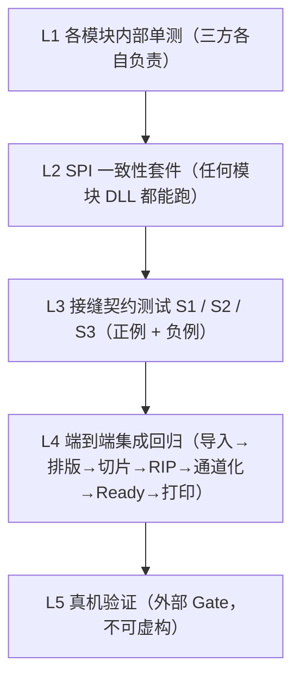

# INT_05 联调验收与测试计划

> 目录：`docs/claude/INTEGRATION/`。日期：2026-07-27。证据等级：A=已核实事实，P=建议。

## 1. 测试分层



**纪律（P，沿用双方既有证据分级）**：低层通过不代表高层通过；**任何一段 diagnostic/preview 通过都不等于生产通过**；未实际运行的不得写 PASS。

## 2. L2：SPI 一致性套件（宿主提供，模块共用）

宿主实现一套可执行的 conformance suite，**任何模块 DLL 都能被它跑**：

| 用例 | 断言 |
|---|---|
| C-SPI-01 | `pm_spi_version()` == 宿主 `PM_SPI_VERSION` |
| C-SPI-02 | `pm_module_info` 返回合法 JSON，含 `id/version/spi/runtime/buildConfig/provides/produces` |
| C-SPI-03 | `runtime`/`buildConfig` 与宿主一致，否则应被拒绝装载 |
| C-SPI-04 | `pm_create/pm_destroy` 成对，无泄漏 |
| C-SPI-05 | 提交→轮询→结果 正常闭环；进度**单调不回退** |
| C-SPI-06 | `pm_cancel` 后 ≤2s 进入 `cancelled`，且**无残留临时目录** |
| C-SPI-07 | 错误码格式符合 `PM-<模块>-<类别>-<四位>` |
| C-SPI-08 | 非法请求（缺字段/越界）→ 稳定错误码，不崩溃 |
| C-SPI-09 | `pm_self_test` 可运行并返回结构化报告 |
| C-SPI-10 | 缓冲区 `cap` 不足时行为符合约定，不越界写 |

**价值**：这套跑通 = 模块可替换。换一个 RIP 实现，链路照跑。

## 3. L3：三个接缝的契约测试

### 3.1 S1（切片 → RIP）：`p0.rgbwsv.2`

| 用例 | 期望 |
|---|---|
| S1-P01 正例包 | 校验通过 |
| S1-N01 通道数 ≠ 6 | 拒绝 |
| S1-N02 位深 ≠ 8 | 拒绝 |
| S1-N03 通道顺序错乱 | 拒绝 |
| S1-N04 层号不连续/缺层 | 拒绝 |
| S1-N05 manifest schema 不符 | 拒绝 |
| S1-N06 极性标记缺失 | 拒绝 |
| S1-N07 半成品目录（staging 未发布）| 不应被识别为可用包 |

**复用（A）**：切片侧已有 `rip_reader_test` 与 bad-package 生成脚本，可直接作为 S1 校验器与负例来源。

### 3.2 S2（RIP → 通道化）：`rip.ch7.1` —— **最关键**

| 用例 | 期望 | 备注 |
|---|---|---|
| S2-P01 正例（7ch/8bit/contig）| 通过 | — |
| S2-N01 `samplesPerPixel < 7` | 拒绝 | 消费方硬校验（A）|
| S2-N02 `bitsPerSample ≠ 8` | 拒绝 | 同上 |
| S2-N03 **planar（非 contig）** | 拒绝 | 消费方明确不支持（A）|
| S2-N04 tiled TIFF | 拒绝 | 消费方用 `TIFFReadScanline`（A）|
| S2-N05 **W/S/V 取值 > 9（如透传 255）** | **拒绝** | **头号风险，必测**（见 INT_03 §3.2）|
| S2-N06 通道顺序 ≠ C,M,Y,K,W,S,V | 拒绝 | 材料错位 |
| S2-N07 层间宽高不一致 | 拒绝 | `ImageSizeMismatch`（A）|
| S2-N08 混用 LayerImages 与 ChannelMatrix 命名 | 拒绝 | `ChannelMismatch`（A）|
| S2-N09 层数与上游切片层数不符 | 拒绝 | — |
| S2-N10 `profileEcho` 与下发 hash 不符 | 拒绝 | 防串参数 |

> **S2-N05 是本次集成最容易踩的坑**：切片侧 W/S/V 是 0/255 二值，RIP 若透传，消费方会当成"255 滴"。此用例必须在 M4 之前先写。

### 3.3 S3（通道化 → 打印）：切片目录

| 用例 | 期望 |
|---|---|
| S3-P01 正例目录（12 通道、层连续、尺寸一致）| 通过并可被 `PrintService` 消费 |
| S3-N01 通道缺失 | ReadyGate 拒绝 |
| S3-N02 层号不连续 | 拒绝 |
| S3-N03 尺寸不一致 | 拒绝 |
| S3-N04 半成品目录 | 拒绝 |
| S3-N05 未过 ReadyGate 直接调 `StartJob` | 应被守卫阻止 |

**复用（A）**：`ChannelSplitter::ValidateLayers` 已实现这些规则，提升为入口守卫即可。

## 4. L4：端到端集成回归

### 4.1 主链路用例

| 用例 | 场景 | 判据 |
|---|---|---|
| E2E-01 | 单模型全链路 → Ready | 三接缝全过，目录可被 `StartJob` 识别 |
| E2E-02 | **3–5 模型排版 + 联合切片** | 无碰撞/越界；单一包；per-instance 统计齐全 |
| E2E-03 | 幅面越界 | fail-closed，稳定错误码，UI 有可读文案 |
| E2E-04 | 实例碰撞 | 同上 |
| E2E-05 | 拓扑阻断模型（自交/非流形）| strict 拒绝，**不得静默降级** |
| E2E-06 | 中途取消（各阶段各测一次）| ≤2s 停止，无残留，作业状态正确 |
| E2E-07 | 重复运行一致性 | 同输入 + 同 Profile → 稳定投影一致 |
| E2E-08 | Profile 变更 | `profileHash` 变化并写入作业留档与 manifest |
| E2E-09 | 大场景（接近实例上限）| 自动切子进程承载；宿主不崩、不 OOM |
| E2E-10 | 模块缺失/版本不匹配 | 装载期 fail-closed，提示清晰 |

### 4.2 稳定性专项（P，工业场景必测）

| 用例 | 场景 | 判据 |
|---|---|---|
| ST-01 | **边打印边切片** | 打印作业不受影响；切片崩溃/OOM 不波及宿主 |
| ST-02 | 切片子进程被强杀 | 宿主感知并报错，无僵尸进程/残留目录 |
| ST-03 | 磁盘写满 | 稳定错误码，staging 清理 |
| ST-04 | 长时连续 10 作业 | 无内存增长、无句柄泄漏 |

> ST-01 是 `../PLANNING/CLAUDE_13` §1.3 那条决定性场景的验证，**必须在 MVP 内跑通**。

## 5. 与既有验收项的对齐（A）

| 既有验收项 | 对应用例 |
|---|---|
| `AC-28-03` 无设备可验证切片/RIP→数据包 | E2E-01/02 在无设备环境执行 |
| `AC-28-04` 打印运行时不加载切片/RIP 引擎 | 专项：纯打印路径下检查 DLL 未装载（`/DELAYLOAD` 生效）|
| `AC-28-19` 核心 API 可在无 QWidget 测试调用 | L2/L3 全部不依赖 Qt Widgets |
| 架构守卫（presentation 边界）| 既有 `test_presentation_source_boundary.cpp` 持续通过 |
| 依赖方向 | CI 检查：prepress/platform 未链接 A3DSDK/PrintSDK |

## 6. Fixture 与 Golden（P）

```text
fixtures/
├─ models/        小型 OBJ/STL/3MF（含正例 + 拓扑病态负例）
├─ scenes/        单模型 / 多模型排版场景 JSON（含碰撞、越界负例）
├─ profiles/      固定 Profile（含 hash），用于可复现性
├─ s1/            p0.rgbwsv.2 正例 + 7 类负例包
├─ s2/            rip.ch7.1 正例 + 10 类负例（含 W/S/V=255 的 N05）
└─ s3/            切片目录正例 + 5 类负例
golden/
├─ manifest 投影（剔除时间戳/环境敏感字段）
├─ 通道统计与 channel-hash
└─ per-instance 统计
```

**Golden 纪律（A，双方既有做法一致）**：只比稳定投影，不比时间、路径、内存等环境敏感值。

## 7. 里程碑 → 测试映射

| 里程碑 | 必须通过 |
|---|---|
| M0 契约冻结 | 文档评审；schema 可被校验器加载 |
| M1 平台层 + 切片可装载 | L2 全套（切片模块）+ AC-28-04 专项 |
| M2 单模型离线链路 | S1 正/负例 + E2E-01 |
| M3 多模型排版 | E2E-02/03/04 + 排版负例 |
| M4 接 RIP + 通道化 | L2（RIP 模块）+ S2 全套（**含 N05**）+ S3 + E2E-05 |
| M5 打通打印 | E2E-06..10 + ST-01..04 |
| 真机 | L5，外部 Gate，**不可由软件侧宣称通过** |

## 8. 缺陷分级与放行标准（P）

| 级别 | 定义 | 放行 |
|---|---|---|
| S1 致命 | 数据错位、材料错误、宿主崩溃、静默降级 | **必须清零** |
| S2 严重 | 接缝校验漏判、取消残留、内存泄漏 | 必须清零 |
| S3 一般 | 文案/交互/性能不达预期但不影响正确性 | 可带入下一里程碑 |
| S4 轻微 | 视觉与措辞 | 记录即可 |

**MVP 放行门槛**：S1/S2 清零，三接缝全部强制校验生效，ST-01 通过。
