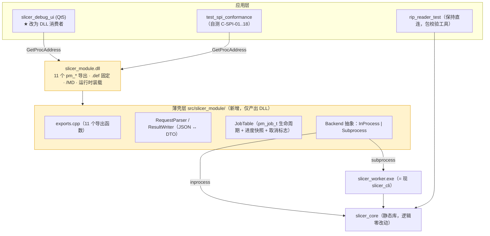

# INT_07 SPI 薄壳与 UI 拆分自举方案

> 目录：`docs/claude/INTEGRATION/`。日期：2026-07-28。视角：切片软件构建者。
> 回答：**如何产出 `slicer_module.dll`（SL-01），并把现有 Qt UI 拆出来改走 DLL 调用，从而完整模拟打印软件的调用逻辑。**
> 遵循规范：打印侧 `CLD_10 模块库封装实施规范`（权威）+ `CLD_05 SPI 总纲`。
> 证据等级：A=已核实事实，B=对方规范，P=本方方案。

---

## 0. 结论：你这个想法价值被低估了

你提出"UI 层拆分，UI 针对 DLL 调用，完全模拟打印软件对切片软件的调用逻辑"——**这不只是解耦，它是本次集成里投入产出比最高的一步工程动作**。

理由（P）：

```text
打印软件是 slicer_module.dll 的第一个消费者 → 但它还没写
如果 UI 先成为消费者，那么：
  ① ABI 的每一个缺口在切片侧就被发现，而不是在跨团队联调时
  ② 既有 UI smoke / self-test 自动变成 ABI 的持续回归
  ③ UI 成为打印软件的"参考实现"，对方照着抄即可
  ④ C-SPI-01..18 一致性套件我方能先自测，M1 门禁一次过
  ⑤ 双后端（进程内/子进程）的行为一致性由 UI 天然验证
```

一句话：**用自己的 UI 当小白鼠，把跨团队的集成风险提前到本仓库内部消化掉。**

---

## 1. 目标形态

### 1.1 现状（A）

```text
apps/slicer_debug_ui (Qt5) ──直接链接──> slicer_core (静态库)
apps/slicer_cli            ──直接链接──> slicer_core
apps/rip_reader_test       ──直接链接──> slicer_core
```

UI 侧规模（A）：`MainWindow.cpp` ~1611 行、`UiSmokeTestRunner.cpp` ~2618 行、约 20 个 services + 22 个 widgets。

### 1.2 目标（P）



**关键点**：`slicer_core` **逻辑零改动**。薄壳只做三件事：JSON ↔ DTO 翻译、作业生命周期管理、后端派发。

**两层分工（`INT_13` §4 裁定，勿混淆）**：

```text
src/slicer_core/api/   Qt-free facade —— 仍在 core 内，C++ 接口，CLI / UI / DLL 三方共用
src/slicer_module/     C ABI 薄壳     —— 仅产出 DLL：11 个导出、句柄、JSON 翻译、后端派发
```

---

## 2. 薄壳实现规格（严格按 CLD_10）

### 2.1 导出与调用约定（B，不可自行发挥）

```c
/* src/slicer_module/print_module_spi.h —— 直接采用打印侧 contracts/ 的同名头，不另立一套 */
#if defined(PM_MODULE_STATIC)
#  define PM_API
#elif defined(PM_MODULE_BUILD_SHARED)
#  define PM_API __declspec(dllexport)
#else
#  define PM_API __declspec(dllimport)
#endif
#define PM_CALL __cdecl          /* ⚠️ 禁止 __stdcall：x86 会产生 _pm_create@4 修饰，破坏 GetProcAddress */
#define PM_SPI_VERSION 1
```

**`.def` 文件固定导出面（恰好 11 个）**：

```
; src/slicer_module/slicer_module.def
LIBRARY slicer_module
EXPORTS
    pm_spi_version
    pm_module_info
    pm_create
    pm_destroy
    pm_submit
    pm_poll
    pm_cancel
    pm_result
    pm_release
    pm_self_test
    pm_last_error
```

验证：`dumpbin /EXPORTS slicer_module.dll` → 恰好 11 个 `pm_*`，**无 `?` 开头的 C++ 修饰名**（= C-SPI-16）。

### 2.2 CMake 目标（P）

**先明确四个目标的产物关系（v1.1，详见 `INT_10` §1.1 与 `INT_16` §3.1）**：

```text
slicer_base    →  slicer_base.lib    静态·稳定层  · 中间产物 ·【不进交付包】
slicer_engine  →  slicer_engine.lib  静态·迭代层  · 中间产物 ·【不进交付包】
slicer_module  →  slicer_module.dll  链 base（不含 engine）· 交付 · 宿主唯一入口
slicer_worker  →  slicer_worker.exe  链 base + engine = 切片引擎 · 交付 ·【可独立替换】
```

现状（A）：`CMakeLists.txt:29` 为 `add_library(slicer_core ...)`，默认 STATIC，**尚未分层**。拆分是 14B-00（可行性验证）+ 14B-01A（落地）。

> ⚠️ **v1.1 撤销"同一次构建"约束**：原要求 DLL 与 Worker 同构建成对替换，现改为 **`file_contract_v1` 启动协商**（`INT_10` §3.3）。因为切片只在 Worker 执行，不存在双后端行为分叉。

```cmake
# src/slicer_module/CMakeLists.txt
add_library(slicer_module SHARED
    exports.cpp RequestParser.cpp ResultWriter.cpp JobTable.cpp
    WorkerClient.cpp)          # v1.1：只保留 Worker 后端，移除 InProcessBackend（切片）

# ★ 只链 base，【不得】链 engine —— 保证 DLL 里没有切片算法
target_link_libraries(slicer_module PRIVATE slicer_base)
target_compile_definitions(slicer_module PRIVATE PM_MODULE_BUILD_SHARED)
target_link_options(slicer_module PRIVATE "/DEF:${CMAKE_CURRENT_SOURCE_DIR}/slicer_module.def")

set_target_properties(slicer_module PROPERTIES
    OUTPUT_NAME "slicer_module"
    PREFIX ""                                    # 不要 lib 前缀
    CXX_STANDARD 20 CXX_STANDARD_REQUIRED ON)

# ★ 运行时必须与宿主一致：Release=/MD  Debug=/MDd
set_property(TARGET slicer_module PROPERTY MSVC_RUNTIME_LIBRARY "MultiThreadedDLL")

target_compile_options(slicer_module PRIVATE /W4 /permissive- /bigobj /EHsc)

# 部署为 modules/slicer/（自带依赖 DLL，避免与宿主版本互踩）
install(TARGETS slicer_module RUNTIME DESTINATION "modules/slicer")
install(FILES module.json      DESTINATION "modules/slicer")
```

**不做的事（B）**：不生成/不分发 import `.lib`；不使用 `/DELAYLOAD`。宿主用 `LoadLibraryEx(..., LOAD_WITH_ALTERED_SEARCH_PATH)` + `GetProcAddress` 运行时装载（CLD_10 §8.4a 唯一权威口径）。

### 2.3 `module.json`（按 CLD_10 §12 schema，`additionalProperties:false`）

```json
{
  "id": "slicer",
  "name": "SliceSoft Geometry Slicer",
  "dll": "slicer_module.dll",
  "spi": 1,
  "version": "0.9.0",
  "runtime": "MSVC-x64-MD",
  "buildConfig": "Release",
  "provides": [
    "model.import", "geometry.preflight", "scene.transform",
    "slice.rgbwsv", "package.verify"
  ],
  "consumes": [],
  "produces": [ { "contract": "p0.rgbwsv.2", "kind": "package" } ],
  "profileKeys": [
    "output.*", "slicingMode", "texture.*", "support.*",
    "materialClosure.*", "autoOrient.*", "buildVolume.*"
  ],
  "subprocess": { "exe": "slicer_worker.exe", "protocol": "file_contract_v1" }
}
```

> 注：`provides` 按 `INT_06` 采纳的方案 C 只列 5 项；`geometry.repair` / `scene.viewdata` 待启用时再加。`delayLoad` 字段因与运行时装载矛盾，**待打印侧裁定**（`INT_06` PR-02）后再决定是否写入。

### 2.4 生命周期与线程（B）

```cpp
// exports.cpp 要点
BOOL APIENTRY DllMain(HMODULE, DWORD, LPVOID) { return TRUE; }   // ★ 只能有这一行

PM_API int PM_CALL pm_spi_version(void) { return PM_SPI_VERSION; }  // 无副作用，可在 pm_create 前调

PM_API pm_module_t* PM_CALL pm_create(const char* options_json) {
    try {
        static std::once_flag once;
        std::call_once(once, InitProcessWideOnce);   // ★ 进程级一次性初始化放这里，不放 DllMain
        return new pm_module_s{ParseOptions(options_json)};
    } catch (...) { SetLastErrorJson("PM-SLICER-INTERNAL-0099", "..."); return nullptr; }
}
```

约束清单（逐条对齐 CLD_10）：

```text
□ DllMain 只 return TRUE（不建线程/不 LoadLibrary/不 IO/不日志/不抛异常）
□ 任何导出函数不得让异常逃逸 → 一律 catch(...) 转错误码
□ pm_destroy(NULL) / pm_release(NULL) 为合法 no-op
□ pm_module_t 支持多线程 pm_submit（内部锁）；单个 pm_job_t 单线程操作
□ 允许 A 线程 poll + B 线程 cancel → 取消标志用 std::atomic<bool>
□ pm_release 对 running job 必须先取消并 join，不得杀线程
□ pm_destroy 时仍有未 release 的 job → 先取消并 join，不泄漏不崩溃（C-SPI-14）
□ 不在 DLL_PROCESS_DETACH 里 join 线程
□ 模块只在 options.paths.tempDir 下创建临时文件，禁用系统 TEMP
□ 不链接 Qt、不链接 PrintSDK（C-SPI-17：dumpbin /DEPENDENTS 不含 Qt5*.dll / PrintSDK.dll）
```

### 2.5 缓冲区三态协议（B，最易写错）

```cpp
// 全模块唯一实现点，所有出参函数都走它
int WriteOut(const std::string& s, char* out, int cap, int* out_required) {
    const int need = static_cast<int>(s.size());          // 不含结尾 NUL
    if (out_required) *out_required = need;
    if (out == nullptr || cap == 0) return PM_ERR_BUFFER_SMALL;   // 探测长度
    if (cap < need + 1)            return PM_ERR_BUFFER_SMALL;   // ★ 禁止部分写
    std::memcpy(out, s.data(), static_cast<size_t>(need));
    out[need] = '\0';
    return need;                                                  // >=0 恒表示成功
}
```

三态与 C-SPI-05a/b/c 一一对应：`out=NULL,cap=0` → `-2` 且 `required>0`；`cap=required`（差 1）→ `-2` 且**缓冲未被触碰**（哨兵字节验证）；`cap=required+1` → 返回 `required` 且末尾 `'\0'`。

### 2.6 后端抽象（P）

```cpp
class ISlicerBackend {
public:
    virtual ~ISlicerBackend() = default;
    virtual JobId  Submit(const SliceRequest&) = 0;
    virtual Progress Poll(JobId) const = 0;
    virtual void   Cancel(JobId) = 0;
    virtual Result Result(JobId) const = 0;
};
```

| 后端 | 实现 | 用于 |
|---|---|---|
| `InProcessBackend` | 直接调 `slicer_core` | `model.import` / `geometry.preflight(fast)` / `scene.transform` / `package.verify` |
| `SubprocessBackend` | 起 `slicer_worker.exe`，按 `file_contract_v1` 交互 | `slice.rgbwsv` / `geometry.repair` / `preflight(full)` |

`options.backend = auto | inprocess | subprocess`；`auto` 按实例数/预估内存/是否 Global/是否 repair 任一超阈值即走子进程（阈值由 `INT_06` SL-06 的实测表标定）。

### 2.7 `file_contract_v1`（子进程协议，对应 SL-02 / M0-10）

```text
请求   宿主写 <tempDir>/<jobId>/request.json → 命令行 slicer_worker.exe --spi-request <path>
进度   worker stdout 逐行输出（冻结为契约）：
       SLICE_PROGRESS phase=<s> current=<n> total=<n> percent=<n> elapsedMs=<f.3>
       SLICE_TIMING   engine=<s> totalMs=<f.3> workingSetBytes=<n> peakWorkingSetBytes=<n>
结果   worker 写 <tempDir>/<jobId>/result.json；退出码见下表
取消   薄壳向 worker 发终止信号；worker 启动时与薄壳兜底各清理一次 .staging
```

退出码表（P，M0 前冻结）：

| 退出码 | 含义 | 映射错误码 |
|---:|---|---|
| 0 | 成功 | `PM-SLICER-OK-0000` |
| 2 | 输入错误 | `PM-SLICER-INPUT-000x` |
| 3 | Profile 错误 | `PM-SLICER-PROFILE-003x` |
| 4 | 拓扑阻断 | `PM-SLICER-TOPOLOGY-001x` |
| 5 | 资源不足 | `PM-SLICER-RESOURCE-0040` |
| 6 | 输出失败 | `PM-SLICER-OUTPUT-005x` |
| 7 | 自检不符契约 | `PM-SLICER-CONTRACT-0060` |
| 8 | 已取消 | `PM-SLICER-CANCELLED-0070` |
| 其他 | 内部错误 | `PM-SLICER-INTERNAL-0099` |

> ⚠️ **取消兜底的硬要求（B，CLD_38 DEC-S3）**：杀进程后**必须**保证 `.staging` 被清理，否则会残留巨量中间产物（对方记录过 82 GB 的教训）。双保险：worker 启动时清理本 jobId 的历史 staging + 薄壳在 `pm_cancel`/`pm_release` 后清理。

---

## 3. UI 拆分：分阶段自举

> ⚠️ **2026-08-03 方案修订（`INT_14` §1）**：本节 U0–U5（把现有 `slicer_debug_ui` 整体改走 DLL）**降级为"可选后置"**，理由：① UI 已过度膨胀（`MainWindow.cpp` 3659、`UiSmokeTestRunner.cpp` 6963）；② 原方案假设"等 13F-R2 拆完 UI 再迁"，但**主仓库 13F 只有 R0/R1，R2 并不存在**，前置消失；③ 成本 10–15 人日与收益不对等。
>
> **改为首选**：新增独立控制台程序 **`apps/slicer_host_sim/`**（约 400–600 行，无 Qt，不碰现有 UI），完全按打印软件的方式调用 DLL——`LoadLibraryEx` + `GetProcAddress` 11 符号 → 版本/运行时校验 → 三车道调用 → 轮询/取消/取结果 → 模块缺失的 fail-closed 演示。
>
> **收益对比**：成本 2–3 人日（vs 10–15）、零文件冲突、可进 CI 常驻（无 Qt 依赖）、且因为是纯 C 调用，**可直接作为打印侧的参考实现被抄**。唯一损失是"真实拖拽手感"，由打印软件自验 + `Host→DLL 调用次数`可证伪指标替代。
>
> 现有 `slicer_debug_ui` **保持直连 `slicer_core` 不变**，待 DLL 稳定且 UI 拆分专项真正立项后再评估迁移。下文 U0–U5 保留作为后置方案设计。

### 3.1 原则

```text
1. 一次只切一类调用，切完即可跑 —— 不做长命分支
2. 只读能力先行，写能力其后 —— 风险递增排序
3. 每阶段 UI self-test 与 overlay smoke 必须绿
4. 最终由 CMake + CI 强制"UI 不得直连 slicer_core"
```

### 3.2 阶段表

| 阶段 | 内容 | 出口门 |
|---|---|---|
| **U0 盘点** | 列出 `slicer_debug_ui` 对 `slicer_core` 的全部调用点，按"只读/写/直读内部结构"分类 | 产出调用面清单；标出必须先消除的"直读内部结构"项 |
| **U1 薄壳可用** | 建 `src/slicer_module/`，实现 11 个导出 + `JobTable` + `InProcessBackend`；写 `test_spi_conformance` 自测 | **C-SPI-01..18 全绿**（我方自测，不等打印侧） |
| **U2 只读迁移** | UI 的能力查询、`package.verify`、报告读取改走 DLL | UI self-test 绿；行为不变 |
| **U3 交互迁移** | `model.import`、`geometry.preflight(fast)`、`scene.transform` 改走 DLL；建立"UI 本地乐观显示 + 提交式权威求值"闭环 | 拖拽手感不退化；`SceneRevisionStale` 回滚路径可演示 |
| **U4 切片迁移** | `slice.rgbwsv` 改走 DLL，默认 `SubprocessBackend`；进度/取消全走 `pm_poll`/`pm_cancel` | 30 层 TIFF SHA-256 与迁移前一致；取消后无 `.staging` 残留 |
| **U5 断直连** | CMake 移除 `slicer_debug_ui → slicer_core` 链接；加 CI 守卫禁止该依赖复现 | 构建图中 UI 只依赖 DLL；`dumpbin /DEPENDENTS` 验证 |

### 3.3 U3 的关键设计：UI 侧的乐观/权威两态

这是要"完全模拟打印软件"的核心，必须做对（P）：

```text
UI 编辑态（本地，零延迟）
  拖拽中：纯矩阵变换 + 本地 bbox 近似 → 只用于画面
        ↓ 松手，携 expectedSceneRevision 提交
权威求值（DLL，进程内）
  scene.transform → { newSceneRevision, effectiveBBox, collisions[], outOfBounds[], preflightDelta[] }
        ↓
UI：以权威结果刷新；若返回 LAYOUT-0022(Stale) → 重取场景后重试；若碰撞/越界 → 回滚显示并提示稳定错误码文案
```

**红线**：UI 本地变换只作显示近似；**任何进入切片的变换必须以 DLL 求值结果为准**。这条与打印侧 CLD_04 §4.3 完全一致——UI 先把它验证一遍，打印软件就能照抄。

### 3.4 U0 需要先消除的历史包袱（P）

我方既有红线是"UI 不得访问 `slicer.cpp` 内部临时结构"。U0 盘点若发现残留，必须先消除——因为**这类调用无法过 ABI**（不透明句柄 + JSON 边界不允许传内部结构）。这恰好是 DLL 化带来的附带收益：**ABI 会物理性地强制架构边界，比文档约定可靠得多。**

---

## 4. 一石三鸟：UI 拆分同时解决的三件事

| 收益 | 说明 |
|---|---|
| **① 打印侧的 M1 门禁提前通过** | `C-SPI-01..18` 在我方自测阶段就全绿，M1-07 交付即过，不占对方排期 |
| **② 双后端一致性被持续验证** | UI 可切 `inprocess`/`subprocess` 跑同一场景，产物 SHA-256 比对 → 防"双后端行为分叉"（对方风险登记表里的一项） |
| **③ 参考实现现成** | 打印侧 `business/prepress/SlicerService` 可直接照抄 UI 的调用序列与错误处理，减少跨团队理解成本 |

---

## 5. 风险与缓解

| 风险 | 等级 | 缓解 |
|---|---|---|
| ABI 化后 UI 大数据传输变慢（预览层、俯视数据） | 🟡 | **大数据不过 ABI**：一律走文件路径/共享缓冲；`scene.viewdata` 首版不做（用 bbox） |
| 进程内后端崩溃仍会拖垮 UI | 🟡 | 重作业默认 `subprocess`；UI 提供强制切换开关便于排障 |
| `/MD` 与 Qt Debug 混配 | 🟡 | 严格 Release=/MD、Debug=/MDd；`pm_module_info` 自述并由消费方校验（UI 也要校验，模拟宿主行为） |
| 薄壳成为第二个 god file | 🟢 | 薄壳只做翻译/生命周期/派发；单文件 ≤500 行；业务逻辑一律回落 `slicer_core` |
| UI 迁移期出现"半直连半 DLL" | 🟡 | 每阶段可运行；U5 用 CMake+CI 强制断开，不留灰色地带 |
| 子进程残留 `.staging` | 🔴 | 双保险清理 + `C-SPI-09` 用例常驻 CI |

---

## 6. 工作量估算（P）

| 阶段 | 估算 | 说明 |
|---|---:|---|
| U1 薄壳 + 自测套件 | **4–6 人日** | 打印侧估 SL-01 为 3–5 天，我方加上自测套件故略高 |
| U0 盘点 | 1 人日 | |
| U2 只读迁移 | 2–3 人日 | |
| U3 交互迁移 | 4–6 人日 | 含乐观/权威两态闭环 |
| U4 切片迁移 | 3–4 人日 | 含子进程协议与取消兜底 |
| U5 断直连 + CI 守卫 | 1–2 人日 | |
| F-1/F-2 TIFF 对齐修复 + libtiff 互操作自查 + golden 重基线 | **3–5 人日** | 见 `INT_06` §5，**必须最先做** |
| **合计** | **18–27 人日** | 可与打印侧 F 阶段并行 |

**建议顺序**：`F-1/F-2 修复` → `U1` → `U0` → `U2` → `U3` → `U4` → `U5`。先修 TIFF 缺陷的理由：它会改变字节输出，越晚做重基线成本越高，且打印侧 M0-11 会验它。

---

## 7. 修订记录

| 日期 | 版本 | 变更 |
|---|---|---|
| 2026-07-28 | v1.0 | 首版。按 CLD_10 规范定义薄壳（11 导出 / `.def` / `__cdecl` / `/MD` / DllMain 红线 / 缓冲三态 / 运行时装载）；提出 UI 分阶段自举 U0–U5 与"UI 当第一消费者"的三项收益；冻结 `file_contract_v1` 退出码表；估 18–27 人日 |
