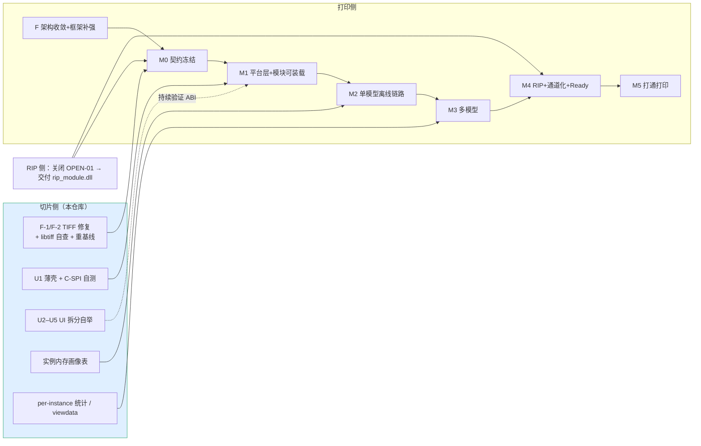

# INT_08 两侧契约对齐台账与联合实施计划（含 RIP）

> 目录：`docs/claude/INTEGRATION/`。日期：2026-07-28。
> 综合来源：切片侧 `docs/claude/INTEGRATION/INT_01..07` + `PLANNING/CLAUDE_09..13`；打印侧 `docs/claude/` 的 `CLD_04/05/06/07/10/18/19/20/27/28/38`。
> 证据等级：A=已核实代码事实，B=对方正式文档，P=本方判断。
> **本篇是两侧规划的唯一对齐台账**：谁的口径为准、我方需改哪些、RIP 契约中的切片侧责任、以及联合里程碑与互锁 Gate。

---

## 0. 对齐结论：以打印侧为契约主导，切片侧修正三处口径

两侧独立产出的规划**高度收敛**（SPI 形态、四接缝、三根支柱、错误码格式、安全发布模式、承载分派几乎逐条一致），这说明设计判断是可靠的。差异集中在三处，**全部以打印侧为准**：

| # | 差异 | 我方原口径 | **采纳口径（打印侧）** | 处理 |
|---|---|---|---|---|
| 1 | S3 接缝契约名 | 切片目录 `slice_{layer}_{channel}.bmp`（无 manifest） | **`printdata.v1`**（manifest + checksums，CLD_19 为正式契约） | 我方 `INT_01/04/05` 相关表述作废，改引 CLD_19 |
| 2 | W/S/V 墨滴上限 | 统一 `0–9` | **按通道 × 按位深**：grayBits=2 → CMYK 0–3 / **White 0–6** / S,V 0–9；grayBits=1 → 1/2/3/3 | 我方 `INT_03/05` 的"0–9"表述修正 |
| 3 | 模块装载方式 | DLL + `/DELAYLOAD` | **运行时装载（`GetProcAddress`）**，不提供 import `.lib`、不用 `/DELAYLOAD` | 我方 `CLAUDE_10..13`、`INT_01..05` 相关表述修正 |

另有一处**我方补充、打印侧应知**：SPI 头本身我方全盘采纳打印侧版本（含 `out_required` 出参与 `pm_last_error`）——这两项正是打印侧在我方 `INT_03` 草案上做的改进，改得对，无异议。

---

## 1. 逐项对齐台账

图例：✅ 已对齐 ｜ 🔄 我方需改 ｜ ⚠️ 双方待裁定 ｜ ➕ 我方补充

### 1.1 调用契约（SPI）

| 项 | 切片侧 | 打印侧 | 状态 |
|---|---|---|---|
| 形态 | DLL 门面 + 重作业子进程 | 同 | ✅ |
| ABI | C ABI + 不透明句柄 + JSON | 同 | ✅ |
| 导出数 | 未定 | **恰好 11 个 `pm_*`** + `.def` 固定 | ✅ 采纳 |
| 调用约定 | 未定 | **`__cdecl`**，禁 `__stdcall` | ✅ 采纳 |
| 缓冲协议 | `cap` 不足返回约定码 | **三态 + `out_required` 出参，禁止部分写** | ✅ 采纳（对方改进） |
| 失败详情 | 无 | **`pm_last_error`（TLS）** | ✅ 采纳（对方改进） |
| 运行时 | 未定 | **Release `/MD`、Debug `/MDd`**，自述并校验 | ✅ 采纳 |
| 装载 | `/DELAYLOAD` | **运行时装载** | 🔄 我方改 |
| 作业状态机 | queued→running→… | 同 | ✅ |
| 一致性套件 | C-SPI-01..10（我方草案） | **C-SPI-01..18（CLD_10 §13 唯一权威）** | ✅ 采纳 |
| `DllMain` | 未约束 | **只 `return TRUE`**，初始化入 `pm_create` + `call_once` | ✅ 采纳 |
| 线程 | 未细化 | 多线程 submit / 单线程 job / poll+cancel 可并发 | ✅ 采纳 |
| 依赖边界 | core 已 Qt-free | **C-SPI-17：模块不得依赖 Qt5*/PrintSDK** | ✅ 天然满足 |

### 1.2 数据契约（四接缝）

| 接缝 | 契约 | 切片侧 | 打印侧 | 状态 |
|---|---|---|---|---|
| **S1** | `p0.rgbwsv.2` | 已冻结、已实现 | 只校验不修改 | ✅ |
| S1 校验器 | — | `rip_reader_test` / `validate_slice_package()`，23 码 | 直接复用为 S1 校验器 | ✅ ➕ 见 §1.5 |
| **S2** | `rip.ch7.1` | 我方不产出 | ≥7ch / 8bit / **contig 强制禁 tiled** / C,M,Y,K,W,S,V | ✅ |
| S2 墨滴上限 | `0–9` | **按通道 × 位深** | 🔄 我方改 |
| S2 校验器 | `rip_output_validator` C1–C7 | 同（`PM-SEAM-S2-0001..0007`） | ✅ |
| **S3** | `printdata.v1` | 原写"切片目录" | **CLD_19 正式契约** | 🔄 我方改 |
| **S4** | `ReadyTicket` | 我方无此概念 | `{ok,packageDir,stableCode,issues[],profileVersion,profileHash,totalLayers,channels}` + `ReadyGate` | ✅ 采纳（对方补齐） |

### 1.3 能力边界

| 项 | 切片侧原案 | 打印侧建议 | 状态 |
|---|---|---|---|
| 能力项数 | 8 项（`INT_02`） | **方案 C：5 必需 + 2 可选**，删 `scene.layout` | ✅ 采纳（见 `INT_06` §1） |
| 排版归属 | 包内 `scene.layout` | 手感归 UI、真值（bbox/碰撞/越界）归包 | ✅ 一致 |
| 碰撞/越界出口 | `scene.layout` 出参 | 需要真值 | ➕ 我方改由 **`scene.transform` 出参**提供 |
| 设置/Profile | 宿主提供 | 宿主提供，模块不带业务默认值 | ✅ |
| `buildVolume` | 宿主提供 | 同 | ✅ |

### 1.4 错误码与治理

| 项 | 状态 |
|---|---|
| 格式 `PM-<MODULE>-<CATEGORY>-<CODE4>` | ✅ 两侧一致 |
| 码段分配（0000/0001-09/0010-19/…/0099） | ✅ 采纳 CLD_05 §6.3 |
| 三铁律（码稳定不复用 / 不静默钳制 / severity 三级无中间态） | ✅ |
| `PM-SLICER-*` 15 条 | ✅ 两侧同表 |
| 安全发布 `.staging`→自检→原子 rename | ✅ 两侧既有实现一致 |

### 1.5 我方"免费给出"与由此产生的义务（➕，重要）

打印侧把我方 `rip_reader_test` 直接用作 S1 接缝校验器，这是本次集成成本最低的一项复用。但由此产生一个**新增义务**（P）：

> **`validate_slice_package()` 的 23 个错误码与逐层 6 通道 `uint64` checksum，自此成为对外契约面。** 今后修改等同于修改接缝契约，须走契约变更流程，不得作为内部重构随意变动。

这一条要写入我方 `AGENTS.md` 的协议红线段，否则日后极易被当作内部实现改掉。

---

## 2. RIP 契约中的切片侧责任

RIP 由第三方模块承担，但**其契约有四处直接依赖切片侧**。这是本篇必须讲清的部分。

### 2.1 切片侧对 RIP 的义务

| # | 义务 | 说明 | 状态 |
|---|---|---|---|
| R-1 | **诚实声明存储与极性** | RIP 明确"必须读，不得假设"：`tiff.storage` / `rowsPerStrip` / `tiled` / `polarity` / `printValue` / `emptyValue`。我方 manifest 已含全部字段 | ✅ 已满足 |
| R-2 | **两种存储都可被读** | 我方支持 stripped 与 tiled；RIP 需两者都能读 → **建议 Profile 层约束生产用 stripped**，减少 RIP 负担 | ✅ 建议采纳 |
| R-3 | **X/Y DPI 独立** | RIP 须读 `grid.dpiX`/`dpiY`（对方设备 X=635/720、Y=600，不相等）。我方 12E-09C 已支持 DPI 区间与 X/Y 独立 | ✅ 已满足 |
| R-4 | **manifest 权威来源唯一** | `layers` 与 `tiff.layers` 重复 → 我方确认以 **`tiff.layers`** 为权威（`SL-08`） | 🔄 M0 前修 |
| R-5 | **单/多模型包字段可选性** | `scene` 与 `reports.scene` 仅多模型包存在，RIP 解析须容忍缺失 | ✅ 已告知 |
| R-6 | **TIFF 字对齐必须合规** | 见 §2.3 —— 这是我方缺陷，直接影响 RIP 能否用 libtiff 读我方产物 | 🔴 M0 前必修 |

### 2.2 切片侧**不承担**的（红线）

| 项 | 归属 | 依据 |
|---|---|---|
| `RGB → CMYK` 分色 | RIP | 我方无色彩管理，且 `p0.rgbwsv.2` 冻结 |
| 半色调 / 墨量限制 | RIP | 同上 |
| **W/S/V 二值 → 墨滴数量化** | **RIP**（`dropQuantizationOwned = true`） | 打印侧 CLD_06 §6 推荐方案 A；方案 C（切片输出覆盖量）**被明确判定为违反我方冻结协议红线** |
| 7 逻辑 → 12 物理通道映射 | 既有 `ChannelSplitter` | — |
| `grayBits` 相关钳位 | RIP（从 `profile.device.grayBits` 读） | 我方不使用该字段 |

> ⚠️ **一个需要长期留意的门（P）**：CLD_06 §5.2 为 `dropQuantization.mode = from_coverage` 留了后门，注明"留待切片侧输出真实覆盖量后启用"。这意味着**将来可能要求切片侧输出连续覆盖量而非二值**。那将是 `p0.rgbwsv.2` → `p0.rgbwsv.3` 级别的协议演进，需独立决策（我方 G4 授权）。现在不做，但要记录在案，避免日后被当作"小改动"提出。

### 2.3 🔴 我方 TIFF 缺陷对 RIP 的直接影响

打印侧 CLD_10 §7.3 读我方代码发现：

```text
tiff_io.cpp:118-121  溢出区未字对齐 —— tag 270 ImageDescription 写 "RGBWSV"=7 字节（奇），
                     导致 tag 273 StripOffsets 落在奇偏移。【当前已生效，属未定义行为】
tiff_io.cpp:404      IFD 起始偏移未对齐 —— 被 samples_per_pixel=6（偶）掩盖
```

**为什么这对 RIP 是阻塞级的**：我方 reader 逐字节 `read_u32` 所以无感知，但 **RIP 与 `ChannelSplitter` 用 libtiff**。libtiff 多数平台容忍非对齐 value，但这是未定义行为区，不应依赖。

**处置（见 `INT_06` §5）**：M0 前修复 + 我方先做 libtiff 互操作自查 + 固化为 CI 用例 + 一次受控 golden 重基线。

---

## 3. 联合里程碑与互锁 Gate

打印侧里程碑为 `F → M0 → M1 → … → M7`（其侧工作量 139–216 人日，2 人并行约 4.5–7 个月）。切片侧交付物按下表**挂进对方里程碑**。



### 3.1 互锁 Gate 表

| Gate | 条件 | 阻塞谁 | 责任方 |
|---|---|---|---|
| **G-M0-A** | `file_contract_v1` 规格（进度行 + 退出码）冻结 | 打印侧 M0-10 | **切片侧** |
| **G-M0-B** | manifest 权威来源确认（`tiff.layers`） | 打印侧 M0-02 | **切片侧** |
| **G-M0-C** | 真实 manifest 样例提供（供 schema 校验） | 打印侧 M0-02 | **切片侧** |
| **G-M0-D** | **F-1/F-2 修复完成 + libtiff 互操作通过** | 打印侧 M0-11、RIP 侧输入读取 | **切片侧** 🔴 |
| **G-M0-E** | OPEN-01 关闭（W/S/V 量化归属签字） | 打印侧 M4、RIP 编码 | **RIP 侧** 🔴 |
| **G-M0-F** | `SL-07/09` 确认 | 打印侧 M0-07 | 切片侧 ✅ 已答 |
| **G-M1** | `slicer_module.dll` + `module.json` 过 C-SPI-01..18 | 打印侧 M1 退出 | **切片侧** |
| **G-M2** | 实例内存画像表（`SL-06`） | `backend=auto` 阈值标定 | **切片侧** |
| **G-M2-B** | strict-PASS 测试资产确认（见 §3.3） | 打印侧 M2-10 E2E | 双方 |
| **G-M3** | per-instance 统计字段（`SL-04`）+ viewdata 决议（`SL-05`） | 打印侧 M3 | **切片侧** |
| **G-M4** | `rip_module.dll` 交付 + S2 校验器 | 打印侧 M4 | **RIP 侧** |

### 3.2 关键路径判断（P）

```text
真正的关键路径不是"打印侧写代码"，而是三个签字：
  ① OPEN-01（RIP 是否承担 W/S/V 量化）—— 阻塞 RIP 编码与 M4 验收
  ② SL-10（三个必需 OBJ 的处置）      —— 阻塞真实模型 E2E
  ③ F-1/F-2（我方 TIFF 对齐）         —— 阻塞 libtiff 侧一切读取
其中 ③ 完全在我方掌控，应立刻做，不等任何人。
```

### 3.3 强烈建议：把"集成联调"与"三个必需 OBJ"解耦（P）

打印侧把三个必需 OBJ 被 strict 阻断列为"唯一无法用桩或 fixture 解耦的阻塞"。切片侧提供一个解法：

> **我方已有 7 个 strict-PASS 资产**（5 个 `xiao_ma_wu_yu_new` + `yecan/3.obj` + `yecan/4.obj`），**足以支撑 M1–M5 全链路联调**。

建议：用这 7 个资产立刻开工 M2/M3 的 E2E，同时并行做三个必需 OBJ 的外部修模与资产入库。这与打印侧用 `passthrough_rip` 桩解耦 RIP 的思路完全同构——**先解耦，再治理**。

### 3.4 切片侧排期（P，可与打印侧 F 阶段并行）

| 序 | 工作 | 人日 | 对应 Gate |
|---:|---|---:|---|
| 1 | **F-1/F-2 TIFF 修复 + libtiff 自查 + golden 重基线** | 3–5 | G-M0-D 🔴 |
| 2 | `file_contract_v1` 规格 + manifest 权威确认 + 样例包 | 1–2 | G-M0-A/B/C |
| 3 | U1 薄壳 + `test_spi_conformance` 自测 | 4–6 | G-M1 |
| 4 | U0 盘点 + U2 只读迁移 | 3–4 | — |
| 5 | U3 交互迁移（乐观/权威两态） | 4–6 | 为打印侧提供参考实现 |
| 6 | U4 切片迁移（子进程 + 取消兜底） | 3–4 | G-M1 |
| 7 | 实例内存画像实测（1/4/11/22） | 2–3 | G-M2 |
| 8 | U5 断直连 + CI 守卫 | 1–2 | — |
| 9 | per-instance 统计 + viewdata（按需） | 2–4 | G-M3 |
| — | **合计** | **23–36** | |

---

## 4. 待双方裁定的开放项（合并清单）

| 编号 | 事项 | 需谁答 | 阻塞 |
|---|---|---|---|
| **OPEN-01** | W/S/V 墨滴量化归属（建议方案 A：RIP 承担） | **RIP 侧** | 🔴 M4 验收、RIP 编码 |
| **OPEN-27-01** | 采纳方案 A/B/C（切片侧已表态支持 C） | **产品/你** | 能力清单定稿 |
| **SL-10** | 三个必需 OBJ 处置（建议 ②外部修模 + ③换资产并行） | **产品/你** | 真实模型 E2E |
| **PR-02** | `module.json.delayLoad` 与"不用 /DELAYLOAD"矛盾 | 打印侧 | 清单字段 |
| **PR-03** | C-SPI 是 17 项还是 18 项（表有 18 行） | 打印侧 | M1 验收命名 |
| **PR-04** | `profile.device.grayBits` 请求路径未在 CLD_06 §5 示例中 | 打印侧 + RIP | S2 校验 |
| **PR-06** | per-instance 是否需材料体积/成本量 | 打印侧 | `SL-04` 字段 |
| **PR-07** | golden 重基线时间点知晓 | 打印侧 | M0 排期 |
| **NEW-01** | `from_coverage` 后门是否可能在第二阶段内被要求（影响是否需预研 `p0.rgbwsv.3`） | 产品 + RIP | 长期 |

---

## 5. 我方需修订的既有文档

为免两侧口径分裂，以下我方文档需按 §0 的三处修正更新：

| 文档 | 需改 |
|---|---|
| `INT_01` §2/§3 | S3 契约改 `printdata.v1`；M1 装载方式改运行时装载 |
| `INT_02` §1.1 | 能力清单 8 → 5(+2)；碰撞/越界改由 `scene.transform` 出参 |
| `INT_03` §3.2/§7.1 | W/S/V 上限改"按通道 × 位深"；C5 判据同步 |
| `INT_04` §4.2/§5 | S3 名称与 Ready 闸门改引 CLD_19 / CLD_18 §7.3；补 S4 `ReadyTicket` |
| `INT_05` §3.2/§3.3 | S2-N05 判据改按通道上限；S3 用例改 `printdata.v1` |
| `PLANNING/CLAUDE_10..13` | 装载方式改运行时装载；能力清单收缩说明 |
| `AGENTS.md`（协议红线段） | ➕ 新增：`validate_slice_package()` 的 23 码与逐层 checksum 属对外契约面，变更须走契约流程 |

> 建议做法：**不逐篇重写**，在每篇顶部加"⚠️ 以 `INT_08` §0 的三处修正为准"的定向说明，正文按上表定点改动。理由与 `VERIFICATION/CLAUDE_08` 的做法一致——保持**单一差异真源**，避免多处重复叙述再次不同步。

---

## 6. 修订记录

| 日期 | 版本 | 变更 |
|---|---|---|
| 2026-07-28 | v1.0 | 首版。确立以打印侧为契约主导；修正三处口径（S3=`printdata.v1`、墨滴上限按通道×位深、改运行时装载）；建立逐项对齐台账与四接缝状态；明确 RIP 契约中的切片侧六项义务与两条红线；给出联合里程碑互锁 Gate 与我方 23–36 人日排期；合并开放项清单 |
