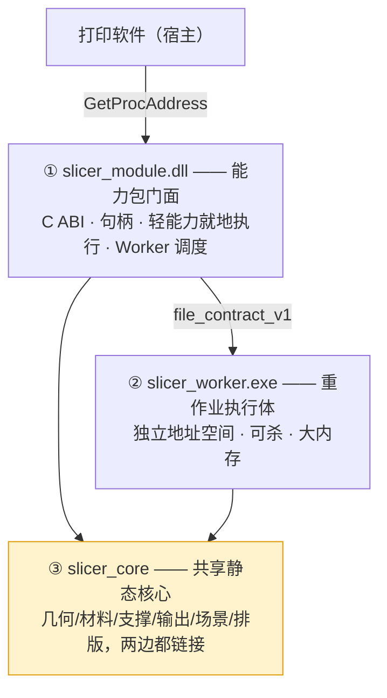

# INT_10 三层边界与模块归属规范（DLL / Worker / 核心）

> 目录：`docs/claude/INTEGRATION/`。日期：2026-08-02。视角：切片软件构建者。
> 回答：**功能包 DLL 与切片引擎 EXE 的分工边界是否明确？现有框架是否已包含边界？哪些模块归 Worker、哪些归 DLL？扩展接口如何预留？**
> 证据等级：A=已核实事实，B=外部文档，P=本方规范。
>
> 🔴 **v1.1 修订（2026-08-03，重要）**：本篇 v1.0 把 Worker 定为"DLL 的承载壳，必须与 DLL 同一次构建、成对替换"。该定位**已撤销**——Worker 现定为**可独立迭代替换的切片引擎**，core 拆分为 `slicer_base`（DLL+Worker 共用）与 `slicer_engine`（仅 Worker）。撤销原因：原约束源自一个非必要的 `backend=inprocess` 切片调试选项。
>
> **本篇受影响章节已就地修订**：§1.1 产物表、§2 承载判定、§3.3 版本边界、§3.5 语义边界、§4 归属表。完整推导见 [`INT_16`](INT_16_Worker定位重定义与三层契约完善.md)。

---

## 0. 结论

| 问题 | 结论 |
|---|---|
| 边界是否明确？ | ⚠️ **部分明确、未成规范**。`INT_07` 有承载分派表与 `ISlicerBackend` 抽象，但缺"判定准则、状态所有权、失败域、版本绑定、数据传输"五个维度 |
| 现有框架是否包含边界？ | 🔴 **不包含**。`src/slicer_core/` 下**没有 `api/`、`steps/`、`orchestration/` 任何一个目录**（A：Glob 确认）；`slicer_module`/`slicer_worker`/`.def` 全仓库零命中 |
| 本质是两层还是三层？ | 🔴 **是三层，不是两层**。见 §1 —— 这是本篇最重要的修正 |
| 扩展接口 | 见 §5，预留五个扩展点 |

---

## 1. 关键修正：这是三层结构，不是"DLL vs EXE"二选一

你问的是"功能包动态库与切片引擎 exe 的分工"。但真实结构是**三层**，把它当两层会立刻产生代码重复：



**三层各自的存在理由（P）**：

| 层 | 唯一职责 | 为什么不能合并 |
|---|---|---|
| ① `slicer_module.dll` | **对外唯一入口**：ABI、句柄生命周期、JSON↔DTO、能力协商、承载派发 | 合并进 core → core 被 ABI 污染；合并进 worker → 宿主要管进程 |
| ② `slicer_worker.exe` | **重作业执行体**：长时/大内存/可能崩的计算 | 合并进 DLL → 崩溃与 OOM 拖垮宿主（边打印边切片场景） |
| ③ `slicer_core` | **算法与领域逻辑**：几何、材料、支撑、场景、排版、输出 | ①②**必须共用同一份**，否则进程内与子进程行为分叉 |

> **最关键的一条（吸纳 s14 `DOC_DECISION_14` §3，措辞极准）**：
>
> **`slicer_worker.exe` 是 DLL 包的内部实现细节，不允许宿主绕过 DLL 直接依赖其私有协议。**
>
> 这一条杜绝了"宿主同时面对两套 API"的耦合。宿主永远只认 DLL；worker 的路径、命令行、IPC 协议全部是模块内部实现，可以随时改。

### 1.1 各层的构建产物与交付边界（关键澄清）

**"三层"是我方内部的构建结构，不是打印软件看到的三个东西。打印软件只看到一个：DLL。**

| 层 | 构建产物 | 是否进交付包 | 打印软件是否接触 |
|---|---|:--:|:--:|
| ③a **`slicer_base`** | **`slicer_base.lib`（静态·稳定层）** | ❌ 否 | ❌ 完全不接触 |
| ③b **`slicer_engine`** | **`slicer_engine.lib`（静态·迭代层）** | ❌ 否 | ❌ 完全不接触 |
| ① `slicer_module.dll` | `slicer_module.dll`（链 base，**不含 engine**）| ✅ 是 | ✅ **唯一入口** |
| ② `slicer_worker.exe` | `slicer_worker.exe`（链 base + engine）= **切片引擎** | ✅ 是 | ❌ 否（协议为模块内部实现）|

> 现状（A）：`CMakeLists.txt:29` 为 `add_library(slicer_core ...)`（无 `SHARED`、未设 `BUILD_SHARED_LIBS` → 默认 STATIC）。**尚未分层**；拆为 base/engine 是 14B-00/14B-01A 的任务。

**两个 .lib 都是"中间产物"，不是"交付物"。** 交付包里没有任何名为 `slicer_base` / `slicer_engine` / `slicer_core` 的文件。

**为什么用静态库而不是再做 DLL（P）**：

```text
若做成 DLL → 打印软件 → slicer_module.dll → slicer_core.dll
  ✗ core 的 C++ 接口（STL 容器、异常、模板）跨 DLL 边界 → CRT/ABI 不匹配即崩
  ✗ 违反"跨 ABI 只用 C 类型"的红线
静态链接 → C++ 类型只在各自模块内流动，ABI 风险归零
  代价：base 在 DLL 与 Worker 各一份——可接受
```

**为什么要拆 base / engine（P，v1.1 核心变更）**：

```text
目的：让 DLL 里【没有切片算法】，从而 Worker 成为可独立替换的引擎
  slicer_base   稳定、变更少 → DLL 与 Worker 共用
  slicer_engine 迭代频繁（12E/12F/13B/13G 都在改）→ 仅 Worker
效果：算法改进只需替换 slicer_worker.exe，不触碰 DLL 与宿主装载逻辑
单向规则：slicer_base 不得依赖 slicer_engine；slicer_module 依赖闭包中不得出现 engine 符号（CI 强制）
```

**关于"同一次构建"（v1.1 撤销）**：v1.0 曾要求 DLL 与 Worker 必须同一次构建、成对替换。该约束**已撤销**——它源自"同一能力可跑两个后端"的假设，而取消 `backend=inprocess` 切片后该假设不再成立。替换规则改为 §3.3 的**契约版本协商**。

### 1.2 两个"接口"，别混淆

| 接口 | 形态 | 消费者 |
|---|---|---|
| **内部接口** `slicer_core/api/` | C++ facade（Qt-free，STL 类型可用）| `slicer_module` / `slicer_worker` / `slicer_cli` / `slicer_debug_ui` / 单测 —— **均为我方内部** |
| **外部接口** 11 个 `pm_*` 导出 | C ABI（不透明句柄 + UTF-8 JSON）| **打印软件（唯一）** |

**红线**：`slicer_core/api/` 的任何类型都**不得**出现在 `contracts/print_module_spi.h` 中。跨边界只有 C 基本类型、`const char*` 与不透明句柄。

---

## 2. 承载判定准则（五问法）

一个能力该放 DLL 进程内还是 Worker，按五个问题判定（P）。**任一命中"是"即走 Worker**：

```text
Q1 是否可能长时运行（> 2 秒）？
Q2 是否可能大内存（峰值 > 数百 MB，或随实例数线性增长）？
Q3 是否可能因输入病态而崩溃（几何/修复类）？
Q4 是否不可安全中断（无取消令牌的计算循环）？
Q5 是否需要独立的失败域（失败不得影响宿主）？
```

**判定结果（A 级依据）**：

| 能力 | Q1 | Q2 | Q3 | Q4 | Q5 | 承载 |
|---|:--:|:--:|:--:|:--:|:--:|---|
| `model.import` | 否* | 否 | 否 | 否 | 否 | **DLL 进程内**（*超大模型例外，见阈值）|
| `model.get_metadata` / `release` | 否 | 否 | 否 | 否 | 否 | DLL |
| `scene.apply_operation` | 否 | 否 | 否 | 否 | 否 | DLL（交互路径，必须低延迟）|
| `scene.get_snapshot` / `get_viewdata` | 否 | 否 | 否 | 否 | 否 | DLL |
| `geometry.collision` | 否 | 否 | 否 | 否 | 否 | DLL |
| `geometry.preflight`（fast）| 否 | 否 | 否 | 否 | 否 | DLL |
| `geometry.preflight`（full）| **是** | 否 | **是** | **是** | 是 | **Worker** |
| `geometry.repair` | **是** | 是 | **是** | **是** | 是 | **Worker** |
| **`slice.rgbwsv`** | **是** | **是** | **是** | **是** | **是** | **Worker** |
| `package.verify` | 否 | 否 | 否 | 否 | 否 | DLL |
| `package.get_summary` / `read_report` | 否 | 否 | 否 | 否 | 否 | DLL |
| `package.get_layer_descriptor` | 否 | 否 | 否 | 否 | 否 | DLL |
| `package.render_layer_preview` | 否 | 否* | 否 | 否 | 否 | DLL（*受 LRU 上限约束）|

**支撑事实（A）**：`slice.rgbwsv` 五问全中——Global 模式峰值内存 8.19–8.74×、`slicer.cpp` 中 `cancel` 出现 **0 次**（无取消令牌）、几何输入常态病态（三个必需 OBJ 全部 strict 阻断）。

**`backend=auto` 阈值（P，待 M2 实测标定）**：

```text
走 Worker 的任一触发条件：
  实例数 > N_inst        （待测，初值建议 4）
  预估峰值内存 > M_mem   （待测，初值建议 1 GB）
  slicePipeline.mode == global_surface_shell
  geometry.repair.enabled == true
  模型三角面数 > N_tri   （待测，初值建议 200 万）
否则走进程内。auto 只能在能力表与资源预算内选择，
【不允许改变业务语义，不允许 silent fallback】
```

---

## 3. 五个维度的边界规范（补齐 `INT_07` 的缺口）

### 3.1 状态与所有权边界

| 状态 | 持有者 | 规则 |
|---|---|---|
| 场景编辑态（拖拽中） | **宿主** | 不跨 DLL |
| 场景 canonical 快照 | **DLL** | 可缓存于 `scene_handle`，但**必须能由版本化快照重建**，不得成为第二套持久化真源 |
| 作业状态 | **宿主** | 模块无状态化倾向；模块崩溃后宿主可重建 |
| 临时目录 | **DLL 分配、Worker 使用** | 只在 `options.paths.tempDir` 下；禁用系统 TEMP |
| 包产物 | **文件系统** | staging→自检→原子发布；identity 由模块返回 |
| Profile | **宿主** | 模块不带业务默认值，越界 fail-closed |

### 3.2 失败域边界

| 失败 | 影响范围 | 处置 |
|---|---|---|
| Worker 崩溃 / OOM | **仅 Worker** | DLL 感知退出码 → 报稳定错误码 → 清理 staging → 宿主不受影响 |
| Worker 被杀 | 仅 Worker | 同上；无僵尸进程 |
| DLL 内轻能力异常 | DLL 内 | `catch(...)` 转错误码，**绝不越过 ABI** |
| 模块缺失/损坏 | 预处理入口不可用 | **纯打印入口仍可启动**（`D14-E-03`）|
| 磁盘满 | 当前作业 | `OUTPUT-0051` + staging 清理 |

### 3.3 版本边界（v1.1 改为契约协商，不再要求同版本）

```text
契约：file_contract_v1，语义化 major.minor，独立于 SPI 版本轴
协商：DLL 首次启动 Worker 时执行 `slicer_worker.exe --contract-info`
Worker 返回：{ contract, major, minor, engineVersion, produces[], capabilities[] }
兼容规则：
  major 不等              → 拒绝，PM-SLICER-INTERNAL-0099（附两侧版本）
  Worker minor 更高       → 允许（DLL 只用它认识的字段）
  Worker minor 更低       → 允许但降级（DLL 不得使用高于该 minor 的可选字段）
  produces 不含 p0.rgbwsv.2 → 拒绝

Worker 可独立替换，当且仅当：
  ① major 相同  ② produces 仍含 p0.rgbwsv.2  ③ 通过引擎一致性套件 E-01..08
替换不需要：重编 DLL、重装打印软件、改宿主代码
```

### 3.4 数据传输边界

```text
过 ABI 的：JSON（配置、结果、进度、错误）+ 小型标量
不过 ABI 的：层图、预览位图、网格数据 → 文件路径 或 只读共享映射
禁止：大图像 Base64 编进 JSON
```

### 3.5 语义边界（v1.1 修订）

```text
切片【只】在 Worker 执行，没有第二条路径
→ 不存在"同一能力两个后端结果不同"的风险
→ 原"双后端产物 SHA-256 比对"要求【已取消】（因为没有双后端）

改为两条约束：
① Worker 输出必须过 package.verify 自检（S1 契约）后才原子发布
② 更换 Worker 版本时跑引擎一致性套件 E-03：golden 场景逐层 6 通道 checksum
   与基线一致；若算法改进导致变化，必须在 release note 显式声明并更新基线
   —— 允许有据变更，禁止静默漂移
```

**调试路径的替代（v1.1）**：取消 `backend=inprocess` 后，切片调试改为直接运行 Worker：

```powershell
slicer_worker.exe --spi-request <req.json>   # 独立运行后附加调试器
```

---

## 4. 模块归属表（目录级，覆盖 295 个文件）

**归属含义（v1.1 细化）**：`base` = 编入 `slicer_base`（DLL 与 Worker 共用）；`engine` = 编入 `slicer_engine`（**仅 Worker**）；`dll` = 仅 DLL 薄壳；`worker` = Worker 专有可执行代码。

> 下表 v1.0 的 `core` 列已按 base/engine 重新判定；判定依据是"轻量交互能力需要它 → base；只有切片/修复需要它 → engine"。

| 目录 | v1.1 归属 | 判定理由 |
|---|:--:|---|
| `scene/` · `layout/` · `config*` | **base** | 交互路径（变换/碰撞/越界求值）必需 |
| `output/`（读取侧：`rip_reader`、tiff 读）· `preview/` | **base** | 包查询与预览必需 |
| `geometry/`（bbox、点在网格内、基础拓扑体检）| **base** | fast preflight 必需 |
| `importers/` · `model.*` | **base（待验证）** | 14B-00 需验证能否与几何解耦；若不能则 `model.import` 改 Worker 承载 |
| `geometry/`（完整自交分析）· `geometry/repair/` | **engine** | 仅 full preflight 与 repair 需要 |
| `slicer.cpp` · `steps/` · `materials/` · `material/` · `support/` · `raster/` | **engine** | 切片主链路 |
| `output/`（写入侧：`RgbwsvPackageWriter`、tiff 写）| **engine** | 仅切片产出需要 |
| `reports/` · `diagnostics/` | **按用途分** | 读取/展示侧入 base；切片期生成侧入 engine |
| `pipeline/` | **engine**（编排逐步上提至 `api/`）| 切片编排 |
| `system/`（`ProcessMemoryStats`）| **base** | 两侧都可能用 |
| `third_party/miniz` | **base** | 3MF 解压，导入需要 |
| `tests/` | 不入任何库 | 测试目标 |

### 4.1 ⛔【已作废 · v1.0 旧表，仅作行数参考】

> **下表的「归属」列是 v1.0 的 `core` 单层口径，已被上方 v1.1 的 `base` / `engine` 判定取代，
> 不得据以实施。** 保留本表的唯一目的是它带有**文件数与行数的实测数据（A 级）**，
> 拆分与工作量估算仍可参考；**凡涉及归属，一律看上方 v1.1 表。**
>
> 若两表冲突：**上方 v1.1 表为准**。正式树的权威承载分派见 `docs/slice/DEV/DEV_14_...md` §5。

| 目录 | 文件数/行数（A）| ~~归属~~（作废）| 说明 |
|---|---|:--:|---|
| `src/slicer_core/geometry/`（含 `repair/`）| — | ~~core~~ | 算法，两边共用 |
| `src/slicer_core/materials/` + `material/` | — | **core** | 同上 |
| `src/slicer_core/support/` | — | **core** | 同上 |
| `src/slicer_core/scene/` | 14 / 3508 | **core** | 场景 DTO 与求值，两边共用 |
| `src/slicer_core/layout/` | 4 / 1479 | **core** | 碰撞/越界真值；packing 策略不外露 |
| `src/slicer_core/preflight/` | 14 / 2857 | **core** | fast 在 DLL 调、full 在 Worker 调，实现同一份 |
| `src/slicer_core/diagnostics/` | — | **core** | |
| `src/slicer_core/raster/` | — | **core** | |
| `src/slicer_core/importers/` + `model.*` | 1970 | **core** | |
| `src/slicer_core/config*` | 1168+390 | **core** | |
| `src/slicer_core/output/`（`rgbwsv/`、`tiff/`）| — | **core** | writer 单一实现 |
| `src/slicer_core/reports/` | — | **core** | |
| `src/slicer_core/preview/`（`TiffLayerSource` 1188）| — | **core** | 供 `package.render_layer_preview` |
| `src/slicer_core/pipeline/` | 44 / 10195 | **core** | 编排逻辑；见下方拆分注 |
| `src/slicer_core/slicer.cpp` | **5157** | **core**（逐步收缩）| 见 `INT_11` |
| **`src/slicer_module/`（新建）** | — | **dll** | `ModuleApi` / `HandleRegistry` / `BufferApi` / `ErrorApi` / `WorkerClient` |
| **`src/slicer_core/api/`（新建）** | — | **core** | Qt-free facade：`ModelFacade` / `SceneFacade` / `SliceFacade` / `PackageQueryFacade` |
| **`apps/slicer_worker/`（新建）** | — | **worker** | `JobServer` / `JobExecutor` / `StagingPublisher`（可由现 `slicer_cli` 演进）|
| `apps/slicer_cli/` | 871 | **worker**（演进）| 保留 CLI 形态，同时充当 worker |
| `apps/slicer_debug_ui/` | 152 / 42429 | 消费方 | ⚠️ **2026-08-04 更正：主干【保持直连 core，一行不改】**。`INT_07` U0–U5 整体迁移已降级为可选后置；改走 DLL 的是**新建**的 `apps/slicer_ui_host_sim/`，见 `DOC_DECISION_14_UI_宿主模拟改造专项.md` |
| **`apps/slicer_ui_host_sim/`（新建）** | — | 消费方 | Qt 宿主模拟，**只链 `slicer_module.dll`**，禁 include `slicer_core` |
| `apps/rip_reader_test/` | — | 工具 | 保持直连 core |

> **`pipeline/` 的归属注（P）**：它现在混装了两类东西——**编排**（`MultiModelSliceOrchestrator`、`MultiModelProductionService` 1126 行）与**计算**（`SceneLayerComposer` 1163 行）。目标是把编排上提到 `api/` 与 `orchestration/`，把计算下沉为 `steps/`。这是 `INT_11` 的拆分对象，不是本篇的归属问题。

---

## 5. 预留的五个扩展点

为保证后续多轮开发**不动核心**（P）：

| 扩展点 | 机制 | 未来场景 |
|---|---|---|
| **新增能力** | 在 `capabilities` 声明 + facade 加一个方法 + `module.json` 的 `provides` 加一项 | `scene.layout`（若产品确认）、`geometry.simplify` |
| **新增切片步骤** | 实现 `ISliceStep` 注册进序列 | 跨模型联合支撑、色彩预处理 |
| **新增承载后端** | 实现 `ISlicerBackend` | 远程/GPU/容器化执行 |
| **新增管线模式** | 扩 `SlicePipelineMode` + Router 分支 | 第三条端到端模式 |
| **新增契约版本** | 契约独立版本化 + 适配器 | `p0.rgbwsv.3`（若 RIP 要求覆盖量输出）|

**ABI 向后兼容的三条机械保证（吸纳 s14 `DOC_DECISION_14` §5）**：

```text
① 所有跨 ABI 结构带 size + version 字段，新增字段【只向后追加】
② 能力用 capability_bits / capabilities[] 声明，宿主按位/按名协商，不假设
③ opaque handle 必须由创建方释放；不得跨 CRT 释放 STL/Qt/裸 new 内存
```

---

## 6. 现有框架的差距（要建什么）

| 需要 | 现状（A）| 动作 |
|---|---|---|
| `src/slicer_core/api/`（Qt-free facade）| **不存在** | 新建 |
| `src/slicer_module/`（C ABI 薄壳）| **不存在** | 新建 |
| `apps/slicer_worker/` | **不存在**（有 `slicer_cli` 871 行）| 由 `slicer_cli` 演进 |
| `src/slicer_core/steps/` | **不存在** | 随拆分建立 |
| `contracts/` | **不存在** | 新建（见 `INT_09` G-6）|
| `ISlicerBackend` 抽象 | **不存在** | 随 DLL 建立 |
| cancel token | **`slicer.cpp` 中 `cancel` 命中 0 次** | 随 `steps/` 贯穿 |

---

## 7. 修订记录

| 日期 | 版本 | 变更 |
|---|---|---|
| 2026-08-02 | v1.0 | 首版。修正为**三层结构**（core/dll/worker）；吸纳"Worker 是 DLL 私有实现细节"；给出五问法承载判定与逐能力结果；补齐状态/失败域/版本/传输/语义五个边界维度；出具目录级模块归属表；预留五个扩展点与 ABI 三条兼容保证；列出现有框架七项缺口 |
