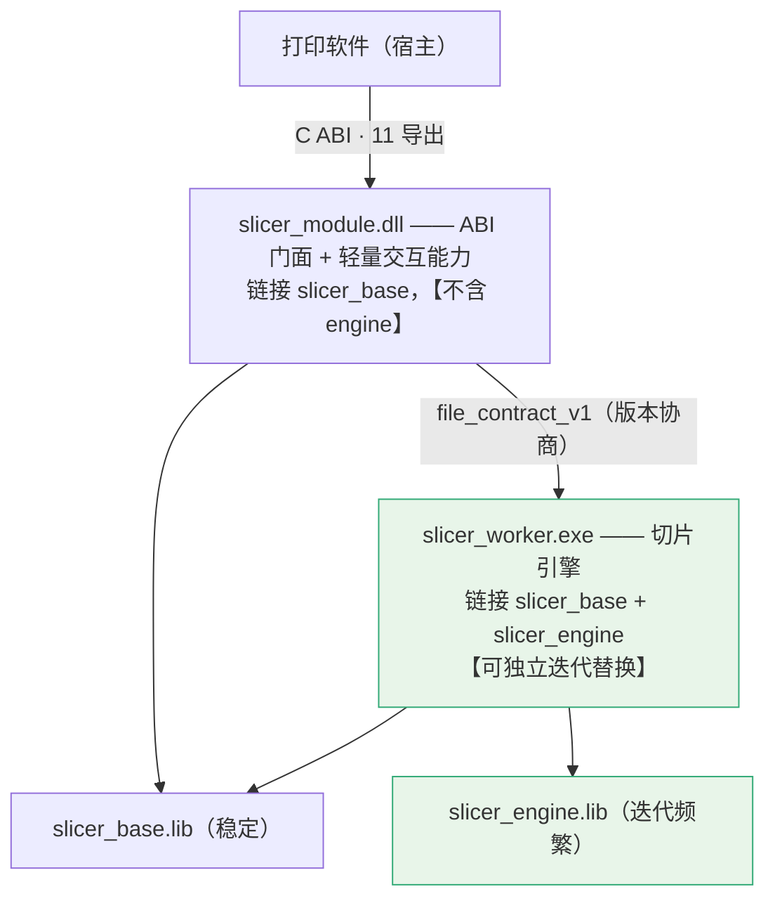

# INT_16 Worker 定位重定义与三层契约完善

> 目录：`docs/claude/INTEGRATION/`。日期：2026-08-03。
> 回答：Worker 到底该是"承载壳"还是"切片引擎"？两种模型差在哪？采纳哪个？并补齐 **打印软件→DLL** 与 **DLL→Core** 两条契约。
> 证据等级：A=已核实事实，P=本方判断。**本篇修订 `INT_10` §1/§3.3 与 `DOC_DECISION_14` §3 的 Worker 定位。**

---

## 0. 结论：采纳你的模型，而且它让设计变简单了

| 项 | 结论 |
|---|---|
| 你的理解（Worker = 可独立迭代的切片引擎）| ✅ **正确，且优于我原设计** |
| 我原设计（Worker = DLL 的承载壳，必须同版本成对替换）| ❌ **过度约束**——约束来自一个我自己加的、其实不必要的需求 |
| 采纳后能否独立替换 Worker | ✅ **能**，但要接受一个明确代价（见 §2.3）|
| 需要的改造 | 三项：核心库分层、切片只在 Worker、契约版本化。见 §3 |

**我原设计错在哪（P）**：我要求"进程内后端与子进程后端产物逐字节一致"，由此推出"必须同一次构建"。但复盘发现——**这条需求只在"同一能力可以跑在两个后端"时才必要**，而实际上只有 `slice.rgbwsv` 有双后端，且那是我为了"方便调试"自己加的 `backend=inprocess` 选项。**把这个调试选项去掉，整条约束链就消失了。**

---

## 1. Worker 现在（设计上）负责什么

先把事实摆清。**注意：Worker 目前只存在于设计中，代码尚未创建**（A：全仓库 `slicer_worker*` 零命中）。所以这里说的是"我此前设计成什么样"。

| 维度 | 我原设计（`INT_10` §1）| 你的理解 |
|---|---|---|
| 定位 | **承载壳**：起进程、跑 core、报进度、原子发布 | **切片引擎本体** |
| 算法归属 | 在 `slicer_core`，Worker 只是宿主 | 在 Worker 内 |
| 版本语义 | Worker 版本 = core 版本（静态链接）| Worker 有独立版本 |
| 能否独立替换 | ❌ 必须与 DLL 同构建成对替换 | ✅ 保接口一致即可换 |
| 对外可见性 | DLL 的私有实现细节 | 引擎，可独立迭代 |

**两者的实质差异不是"叫什么"，而是"算法的家在哪"**：

```text
我原设计：算法在 core → core 静态链进 DLL 和 Worker 各一份 → 两份必须同版本
你的模型：算法在引擎（Worker）→ DLL 里没有算法 → 换引擎不影响 DLL
```

---

## 2. 为什么你的模型更好

### 2.1 它符合"引擎独立迭代"的真实业务需求（P）

切片算法是这个项目**迭代最频繁**的部分（12E 双模式、12F 性能、13B 联合切片、13G 支撑铺底都在改算法）。而 ABI 门面是**最应该稳定**的部分。把二者绑成同一个发布单元，等于**让最稳定的东西跟着最不稳定的东西一起发版**——方向反了。

### 2.2 它让"打印软件不用重装"成为可能（P）

采纳后的升级路径：

```text
算法改进（新支撑策略/性能优化）→ 只替换 modules/slicer/slicer_worker.exe
ABI 或能力面变化              → 才需要替换 slicer_module.dll（并可能需宿主适配）
```

对打印软件是明显收益：引擎热修不触碰宿主的装载逻辑。

### 2.3 但要接受一个代价：**放弃"进程内切片"**

这是采纳你的模型的**唯一实质代价**（P）：

| 项 | 影响 |
|---|---|
| 失去 `backend=inprocess` 的切片调试路径 | 不能在 DLL 进程里直接断点跟到切片全过程 |
| 替代手段 | **Worker 是 exe，可以直接调试**——用请求文件独立运行 `slicer_worker.exe --spi-request req.json`，附加调试器。**其实比进程内更方便** |
| 净影响 | 我判断为**可接受，甚至是改善** |

**同时得到一条更干净的不变量**：

```text
切片只在 Worker 执行，没有第二条路径
→ 不存在"同一能力两个后端结果不同"的风险
→ "双后端逐字节一致"这条测试要求可以取消
→ DLL 与 Worker 得以独立版本化
```

---

## 3. 采纳后的改造方案（三项）

### 3.1 改造一：核心库分层为 base + engine

这是让"DLL 里没有算法"落地的关键（P）。

```text
slicer_base.lib（静态，DLL 与 Worker 都链接）—— 稳定、变更少
├─ scene/            场景与实例 DTO、变换求值
├─ layout/           碰撞与幅面越界判定
├─ config/ config.*  配置解析与校验
├─ geometry/（查询子集）bbox、点在网格内、基础拓扑体检
├─ output/（读取侧）  rip_reader、tiff 读取
├─ preview/          TiffLayerSource（包预览）
└─ api/（交互门面）   ModelFacade / SceneFacade / PackageQueryFacade

slicer_engine.lib（静态，【仅】Worker 链接）—— 迭代频繁
├─ slicer.cpp / steps/   切片主链路
├─ materials/ material/  材料策略与合成
├─ support/              支撑生成
├─ raster/               栅格映射
├─ geometry/repair/      网格修复
├─ output/（写入侧）      RgbwsvPackageWriter、tiff 写出
└─ api/（切片门面）       SliceFacade
```

**边界规则（P）**：

```text
① slicer_base 不得依赖 slicer_engine（单向）
② DLL 只链 slicer_base；Worker 链 base + engine
③ 若某能力发现需要 engine 才能实现 → 该能力必须改为 Worker 承载，不得把 engine 拉进 DLL
④ CI 加依赖方向检查：slicer_module 的依赖闭包中不得出现 slicer_engine 的任何符号
```

**能力归属复核（按此分层重新判定）**：

| 能力 | 需要 | 承载 |
|---|---|---|
| `model.import` / `get_metadata` | base（importers 归 base）| DLL 进程内 |
| `scene.apply_operation` / `get_snapshot` / `get_viewdata` | base | DLL 进程内 |
| `geometry.collision` | base | DLL 进程内 |
| `geometry.preflight`（**fast**）| base（基础拓扑体检）| DLL 进程内 |
| `geometry.preflight`（**full**）| engine（完整自交分析）| **Worker** |
| `geometry.repair` | engine | **Worker** |
| **`slice.rgbwsv`** | engine | **Worker（唯一路径）** |
| `package.verify` / `get_summary` / `get_layer_descriptor` / `render_layer_preview` / `read_report` | base（只读侧）| DLL 进程内 |

> ⚠️ `model.import` 归 base 需要确认：`model.cpp`(1970 行) 目前与几何耦合较深。若拆不干净，退路是把 `import` 也改为 Worker 承载（代价是导入有进程往返延迟）。**这是 14B 的一个待验证点。**

### 3.2 改造二：切片只在 Worker，取消 `backend=inprocess`

```text
options.backend 取值收敛为： worker（默认，唯一）
  —— 移除 inprocess / auto 中与切片相关的分支
  —— 轻量能力天然在 DLL 进程内，不需要 backend 选项
调试手段改为：slicer_worker.exe --spi-request <req.json>  独立运行 + 附加调试器
```

**由此可取消的测试要求**：原 `INT_10` §3.5「双后端产物 SHA-256 比对」不再需要（因为没有双后端）。**但要新增一条**：Worker 输出必须过 `package.verify` 自检（这条本来就有）。

### 3.3 改造三：`file_contract_v1` 版本化与启动协商

这是"保证接口一致性就能替换"的**机制保障**（P）。

```text
契约版本：file_contract_v1（语义化：major.minor）
协商时机：DLL 首次启动 Worker 时执行 `slicer_worker.exe --contract-info`
Worker 返回：{ "contract": "file_contract", "major": 1, "minor": 0,
              "engineVersion": "0.9.3",
              "produces": ["p0.rgbwsv.2"],
              "capabilities": ["slice.rgbwsv","geometry.preflight.full","geometry.repair"] }
兼容规则：
  major 不等        → 拒绝，报 PM-SLICER-INTERNAL-0099（附两侧版本）
  Worker minor 更高 → 允许（向后兼容，DLL 只用它认识的字段）
  Worker minor 更低 → 允许但降级：DLL 不得使用高于该 minor 的可选字段
  produces 不含 DLL 期望的契约 → 拒绝
```

**替换 Worker 的完整条件（这就是你要的"接口一致即可替换"的准确定义）**：

```text
✅ 可以替换，当且仅当：
   ① file_contract major 相同
   ② produces 仍含 p0.rgbwsv.2
   ③ 新 Worker 通过独立的引擎一致性套件（见 §3.4）
✅ 不需要：重编 DLL、重装打印软件、改宿主代码
❌ 仍然不允许：跨 major 替换；或输出协议变化（那属于 p0.rgbwsv.3 级变更，需 G4 授权）
```

### 3.4 新增：引擎一致性套件（替换 Worker 的准入门）

既然 Worker 可独立替换，就必须有一套**验证新引擎是否合格**的门（P）：

```text
E-01 --contract-info 返回合法 JSON，major 与宿主 DLL 匹配
E-02 给定 golden 场景请求 → 产出的包过 package.verify（S1 契约）
E-03 golden 场景的 TIFF 逐层 6 通道 checksum 与基线一致（除显式声明的算法改进）
E-04 取消：≤2s 进入退出，.staging 清理干净
E-05 退出码表符合 file_contract_v1
E-06 进度行格式符合契约且单调不回退
E-07 磁盘满 / 目录不可写 → 预期退出码，无残留
E-08 峰值内存与耗时记录（用于回归监控，不做硬门）
```

> **E-03 的例外处理**：算法改进本来就会改变输出。所以 E-03 的判据是"**要么一致，要么在引擎的 release note 中显式声明变更范围并更新基线**"——不允许静默漂移。

---

## 4. 修订后的三层结构（替代 `INT_10` §1）



| 层 | 产物 | 交付 | 可独立替换 |
|---|---|---|---|
| `slicer_base` | `slicer_base.lib` | ❌ 中间产物 | — |
| `slicer_engine` | `slicer_engine.lib` | ❌ 中间产物 | — |
| `slicer_module` | `slicer_module.dll` | ✅ | 与宿主 SPI major 绑定 |
| **`slicer_worker`** | **`slicer_worker.exe`** | ✅ | ✅ **可独立替换**（满足 §3.3 三条件）|

---

## 5. 契约完善（一）：打印软件 → DLL

现有 SPI 机制层已完整（11 导出、缓冲三态、错误码）。缺的是**能力级字段规格**。以下补齐三个最关键的（P，其余同构）。

### 5.1 `scene.apply_operation`（Commit 车道，交互核心）

```jsonc
// 请求
{
  "capability": "scene.apply_operation",
  "operationId": "op-7f3a2c",          // 幂等键：同 id 重试必须幂等
  "sceneHandle": 12,                    // 可选；无则用 scene 全量
  "expectedSceneRevision": 42,          // 乐观并发
  "operations": [
    { "type": "translate", "instanceId": "inst-01", "deltaMm": [12.0, 8.0, 0.0] },
    { "type": "rotateZ",   "instanceId": "inst-01", "degrees": 90.0 },
    { "type": "uniformScale", "instanceId": "inst-01", "factor": 1.25 },
    { "type": "mirror",   "instanceId": "inst-01", "axis": "x" }
  ]
}
// 响应
{
  "ok": true, "code": "PM-SLICER-OK-0000",
  "newSceneRevision": 43,
  "sceneHash": "sha256:9ac3...",         // Production 车道只接受此 hash
  "instances": [
    { "instanceId": "inst-01",
      "canonicalTransform": { "translationMm":[12,8,0], "rotationZDeg":90,
                              "uniformScale":1.25, "mirrorX":true, "mirrorY":false },
      "effectiveBBoxMm": { "min":[...], "max":[...] },
      "outOfBounds": false }
  ],
  "collisions": [ { "a":"inst-01", "b":"inst-03" } ],
  "outOfBoundsInstances": [],
  "preflightDelta": [ { "instanceId":"inst-01",
                        "admissionBefore":"passed", "admissionAfter":"blocked",
                        "reason":"PM-SLICER-TOPOLOGY-0010" } ],
  "viewdataIdentity": "vd:43:inst-01:lod0"
}
```

失败：`LAYOUT-0020` 碰撞 / `0021` 越界 / `0022` `SceneRevisionStale` / `0023` 实例超上限。

### 5.2 `slice.rgbwsv`（Production 车道）

```jsonc
// 请求（关键差异：只接受已提交的 sceneHash）
{
  "capability": "slice.rgbwsv",
  "jobId": "job-20260803-0001",
  "correlationId": "corr-8b2e",
  "sceneHash": "sha256:9ac3...",        // 必填；与当前 revision 不符则拒绝
  "scene": { /* 完整场景，供 Worker 独立重建 */ },
  "output": { "contract": "p0.rgbwsv.2", "packageDir": "..." },
  "profile": { "profileVersion": "...", "profileHash": "sha256:...", /* ... */ }
}
// 响应
{
  "ok": true, "code": "PM-SLICER-OK-0000",
  "output": { "packageDir": "...", "manifestPath": "...", "layerCount": 184,
              "grid": { "widthPx":303, "heightPx":614, "dpiX":635, "dpiY":600 } },
  "perInstance": [ { "instanceId":"inst-01", "layerRange":[0,183],
                     "printPixels": {"R":0,"G":0,"B":0,"W":5041,"S":0,"V":0},
                     "bboxMm": {...} } ],
  "profileEcho": { "profileVersion":"...", "profileHash":"sha256:..." },
  "engineVersion": "0.9.3",             // ← 新增：便于追溯是哪个引擎产出
  "elapsedMs": 8882
}
```

### 5.3 `package.render_layer_preview`

```jsonc
// 请求
{ "capability": "package.render_layer_preview",
  "packageDir": "...", "layerIndex": 91,
  "mode": "composite",                  // single_channel | composite
  "channels": ["R","G","B","W","S","V"],// composite 时的参与通道
  "maxWidthPx": 1024,                   // LOD 上限
  "outputPath": "<tempDir>/preview_91.bmp" }   // 大数据走文件，不过 ABI
// 响应
{ "ok": true, "outputPath":"...", "widthPx":303, "heightPx":614,
  "cacheKey": "pkg:sha256:ab12|layer:91|mode:composite|ch:RGBWSV|w:1024|sem:1" }
```

**红线**：预览必须从**生产 TIFF** 解码/合成；`cacheKey` 必须含 package identity + layer + mode + channel + 尺寸/LOD + 语义版本。

---

## 6. 契约完善（二）：DLL → Core（`slicer_core/api/`）

这条契约此前**完全没有定义**（`api/` 目录不存在）。以下是接口草案（P）。

```cpp
// src/slicer_core/api/Facades.h —— C++ 接口，仅内部使用，允许 STL；禁止 Qt
namespace slicer_core::api {

// ---- 统一结果类型（不抛异常越过 facade 边界）----
struct ApiError { std::string code; std::string message; std::string detail; };
template <class T> struct ApiResult {
    bool ok{false}; T value{}; std::optional<ApiError> error;
};

// ---- 取消令牌（贯穿 engine，14D-04 落地）----
class ICancelToken {
public:
    virtual ~ICancelToken() = default;
    [[nodiscard]] virtual bool IsCancelRequested() const noexcept = 0;
};

// ---- 进度回调 ----
struct ProgressEvent { std::string stage; int percent{0};
                       int layersDone{0}; int layersTotal{0};
                       std::string currentInstanceId; };
using ProgressSink = std::function<void(const ProgressEvent&)>;

// ============ base 侧（DLL 与 Worker 都可用）============

class ModelFacade {                                   // 归 slicer_base
public:
    ApiResult<ModelMetadata> Import(const ImportRequest&);
    ApiResult<ModelMetadata> GetMetadata(ModelId);
    void Release(ModelId);
};

class SceneFacade {                                   // 归 slicer_base
public:
    ApiResult<SceneSnapshot> ApplyOperation(const SceneOperationRequest&);  // Commit 车道
    ApiResult<SceneSnapshot> GetSnapshot(SceneId) const;
    ApiResult<ViewData>      GetViewData(const ViewDataRequest&) const;
    ApiResult<CollisionReport> CheckCollision(const SceneSnapshot&) const;
};

class PreflightFacade {                               // fast 在 base；full 在 engine
public:
    ApiResult<PreflightResult> RunFast(const PreflightRequest&) const;
};

class PackageQueryFacade {                            // 归 slicer_base
public:
    ApiResult<PackageSummary>   GetSummary(const std::filesystem::path&) const;
    ApiResult<LayerDescriptor>  GetLayerDescriptor(const std::filesystem::path&, int layer) const;
    ApiResult<PreviewResult>    RenderLayerPreview(const PreviewRequest&) const;
    ApiResult<VerifyResult>     Verify(const std::filesystem::path&) const;
    ApiResult<std::string>      ReadReport(const std::filesystem::path&, std::string_view name) const;
};

// ============ engine 侧（仅 Worker 可用）============

class SliceFacade {                                   // 归 slicer_engine
public:
    ApiResult<SliceResult> Run(const SliceRequest&,
                              const ICancelToken&,        // ★ 取消令牌必传
                              const ProgressSink&);
};

class PreflightFullFacade {                           // 归 slicer_engine
public:
    ApiResult<PreflightResult> RunFull(const PreflightRequest&, const ICancelToken&) const;
};

class RepairFacade {                                  // 归 slicer_engine
public:
    ApiResult<RepairResult> Run(const RepairRequest&, const ICancelToken&);
};

}  // namespace slicer_core::api
```

**六条 facade 规则（P）**：

```text
① 不抛异常越过 facade 边界 —— 一律经 ApiResult 返回
② 禁止 Qt 类型；允许 STL（因为不跨 ABI）
③ 所有耗时操作【必须】接受 ICancelToken —— 这是 cancel token 贯穿的强制点
④ facade 不做 I/O 路径决策 —— 目录由调用方（DLL/Worker）传入
⑤ base 侧 facade 不得依赖 engine 侧任何符号（CI 检查）
⑥ 错误码字符串直接用 PM-SLICER-* 全集，与对外一致，避免二次映射
```

---

## 7. 三条契约的完整视图

| 边界 | 契约 | 形态 | 版本轴 | 状态 |
|---|---|---|---|---|
| 打印软件 ↔ DLL | `print_module_spi.h` + 能力 DTO | C ABI + JSON | `PM_SPI_VERSION` | ✅ 机制完整；DTO 本篇 §5 补齐范式 |
| **DLL ↔ Worker** | **`file_contract_v1`** | 文件 + 退出码 + stdout | **`major.minor` 独立版本** | 🟡 本篇 §3.3 定协商；完整 schema 归 14A-03 |
| **DLL/Worker ↔ Core** | **`api/Facades.h`** | C++ 接口 | 随 core 源码 | 🟡 本篇 §6 给草案；14B-01 落地 |

---

## 8. 对既有文档的修订

| 文档 | 修订内容 |
|---|---|
| `INT_10` §1/§1.1/§3.3/§3.5 | Worker 定位改为"切片引擎，可独立替换"；核心库分层为 base+engine；取消"同一次构建"硬约束与"双后端 SHA 比对" |
| `INT_15` §3.3 | 结论从"当前不能独立替换"改为"经三项改造后可以独立替换" |
| `DOC_DECISION_14` §3 | 三层结构与边界规则同步更新 |
| `TASKS_14` | 14B 增加 base/engine 分层任务；14D 增加契约协商与引擎一致性套件；移除双后端一致性卡 |

---

## 9. 风险与缓解

| 风险 | 等级 | 缓解 |
|---|---|---|
| `model.cpp`(1970 行) 与几何耦合，拆不进 base | 🟡 | 14B 先做可行性验证；退路是 `model.import` 改 Worker 承载 |
| base/engine 分层引入循环依赖 | 🟡 | CI 单向依赖检查；base 不得引用 engine |
| 引擎独立替换后出现"版本组合矩阵" | 🟡 | 只保证 major 内兼容；引擎一致性套件（§3.4）作为准入门 |
| 失去进程内切片调试 | 🟢 | Worker 可独立运行 + 附加调试器，实际更好用 |
| 算法改进导致 E-03 基线漂移 | 🟡 | 允许显式声明变更并更新基线，禁止静默漂移 |

---

## 10. 附：对 RIP 侧的确认清单（可直接发出）

> 以下六项阻塞集成推进，建议一次性发给 RIP 负责人。

```text
【Q1｜最高优先】W/S/V 二值 → 墨滴数量化，是否由 RIP 承担？
  背景：切片输出 W/S/V 为二值（0=出墨 / 255=空）；ChannelSplitter 期望 0..N 墨滴数。
  若直接透传：0 → 0 滴（白墨完全不出）；255 → 被钳到上限（变成满墨）。两个方向都错。
  另请确认是否已知：grayBits=2 时 White 上限为 6（不是 9），Support/Varnish 为 9。
  需要答复：① 是否由 RIP 承担量化；② 档位如何配置；③ 输出是否保证在按通道上限内。

【Q2｜高】白区识别能否放弃"带内像素哨兵"，改用语义 sidecar 掩膜？
  背景：现行以 W/S/V=0/0/0 作为白区私有信号，但该组合在 black_is_print 下的物理含义是
        "三通道同时打印"，不属于自包含语义。
  另：曾提议改用 0/0/0/255/255/255，经实测【否决】——它与 5 份现有样例配置的普通模型
      像素输出逐字节相同（rgb=[0,0,0] + whiteValue=255 + varnishValue=255），且多数配置
      设 fallbackRgb=[0,0,0]，使"缺纹理回退像素"与"白区信号"无法区分。
  需要答复：RIP 侧读取 per-layer 1-bit sidecar 掩膜是否可行；若不可行，障碍是什么。

【Q3｜高】白色的语义类型（opaque white / transparent knockout）由谁定义、如何传递？
  背景：表达"这里出白墨"已有正解（W=0）。RIP 真正缺的是白色的语义类型维度。

【Q4｜中】是否支持 PackBits 压缩输入？
  背景：切片侧 03E-02 已实现 output.tiffCompression = none|packbits，默认 none，
        当前判定 NO_GO_DEFAULT，等待目标 RIP 确认。

【Q5｜中】grayBits 的请求路径请固化。
  背景：CLD_06 §5 的请求 JSON 示例中没有 profile.device.grayBits，但 CLD_10 §14
        要求从该路径读取。

【Q6｜中】RIP 输出能否在 manifest 回写 dropRange，并保证 W/S/V ∈ [0, 按通道上限]？
  背景：这是 S2 校验器 C5 的判据来源。
```

---

## 11. 修订记录

| 日期 | 版本 | 变更 |
|---|---|---|
| 2026-08-03 | v1.0 | 首版。采纳"Worker=可独立替换的切片引擎"模型；复盘并撤销我原设计中"同一次构建"的过度约束（其根源是我自加的 `backend=inprocess` 调试选项）；提出三项改造（base/engine 分层、切片只在 Worker、`file_contract_v1` 版本协商）与引擎一致性套件 E-01..08；补齐打印软件→DLL 的三个能力 DTO 范式与 DLL→Core 的 `api/Facades.h` 草案（含强制 `ICancelToken`）；附可直接发出的 RIP 六项确认清单 |
