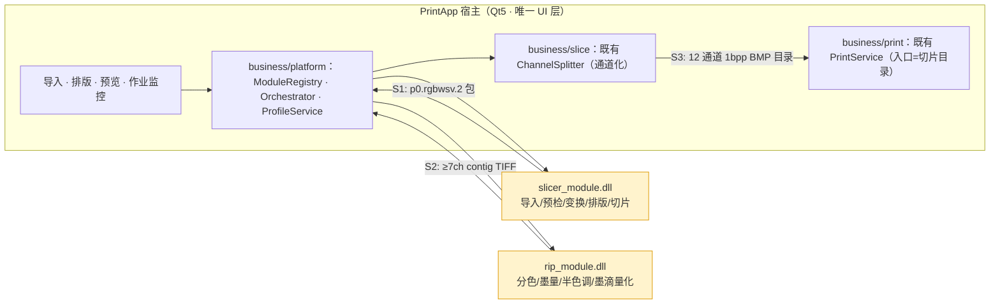

# INTEGRATION 集成文档集（切片 · RIP · 打印）

> 目录位置：`docs/claude/INTEGRATION/`。创建日期：2026-07-27。
> 视角：**打印软件项目（`ry_print_demo`，分支 `feature/v0.1.1`）构建者** + 资深产品经理 + 高级架构师。
> 定位：本会话产出的**集成落地文档集**，独立成folder，供后续持续修改。

## 0. 背景与前提（已确认）

```text
切片模块：E:\__Code\__Work\slice_test_demo\slice_soft_demo（本仓库，作为基线提供）
打印软件：E:\__Code\__Work\ry_print_demo\PrintSolution（宿主，分支 feature/v0.1.1）
RIP 模块：独立仓库，已出 DLL，单模块测试通过，可处理切片输出；暂无 API 文档
拓扑决策：分模块使用，每个模块各自提供独立动态库
MVP 范围：含多模型排版（导入 → 排版 → 切片 → RIP → 通道化 → Ready → 打印）
RIP 文档：契约先行（由打印软件侧定义 API，RIP 侧据此适配）
```

## 1. 文档索引

| 编号 | 文档 | 回答什么 | 主要读者 |
|---|---|---|---|
| — | [README](README.md)（本篇）| 集成全貌、索引、维护约定 | 全体 |
| INT_01 | [MVP 集成方案与里程碑](INT_01_MVP集成方案与里程碑.md) | MVP 做什么、怎么分期、验收口径 | 产品、架构、管理 |
| INT_02 | [切片模块对接规范](INT_02_切片模块对接规范.md) | 打印软件如何调用切片能力包 | 打印软件开发、切片开发 |
| INT_03 | [RIP 模块 API 对接与使用协议](INT_03_RIP模块API对接与使用协议.md) | RIP DLL 的 API、数据契约、协议 | RIP 开发、打印软件开发 |
| INT_04 | [打印软件重构判断与改造清单](INT_04_打印软件重构判断与改造清单.md) | 现在要不要重构、最小改动是什么 | 打印软件开发、架构 |
| INT_05 | [联调验收与测试计划](INT_05_联调验收与测试计划.md) | 怎么验证集成成功 | QA、全体 |

## 2. 集成全貌（一张图）



**三个接缝（每个都必须有强制校验器）**：

| 接缝 | 生产者 → 消费者 | 契约 | 校验器 |
|---|---|---|---|
| **S1** | 切片 → RIP | `p0.rgbwsv.2`：6ch `R G B W S V`、8bit、`black_is_print`（0=出墨/255=空）| `rip_reader_test`（**已有**）|
| **S2** | RIP → 通道化 | `rip.ch7.1`：≥7 samples/pixel、8bit、**contig 强制**、C M Y K W S V、W/S/V 为 0–9 墨滴数 | `rip_output_validator`（**待建**，见 INT_03 §7）|
| **S3** | 通道化 → 打印 | 切片目录：`slice_{layer}_{channel}.bmp`（12 通道 1bpp，层号连续）| `PackageVerifier`（**待建**，见 INT_05）|

## 3. 四个问题的结论速查

| 问题 | 结论 | 详见 |
|---|---|---|
| ① 切片如何对接、MVP 怎么做 | 切片以 **独立 DLL（能力包）** 接入 `business/platform/`；MVP 用**离线链路先通、再接设备**的两步走，含多模型排版 | INT_01 |
| ② RIP 如何对接 | **契约先行**：定义 `rip_module.dll` 的 C ABI + `rip.ch7.1` 数据契约 + 参数/错误/进度协议，RIP 侧据此适配 | INT_03 |
| ③ 打印软件要不要重构 | **不需要大重构**。`PrintService::StartJob(sliceFolderPath, ...)` 已是目录契约入口，打印链路可零改动；只需**新增**前置 prepress 链路 + Ready 闸门 | INT_04 |
| ④ 文档存放 | 本目录 `docs/claude/INTEGRATION/`，命名 `INT_<序号>_<主题>.md` | 本篇 |

## 4. 最需要先对齐的一件事（风险第一）

**S2 接缝的通道与墨滴语义**（A 级事实）：

- 切片输出 **6 通道 RGBWSV**；`ChannelSplitter` 硬性要求 **≥7 samples/pixel** 且为 **CMYK+W+S+V**（`ChannelSplitter.cpp:406-461`，不足即报错）；
- `ChannelSplitter` 对 **W/S/V 直接取 0–9 墨滴总数**，而 CMYK 走阈值映射 1–3 滴；切片侧 W/S/V 当前是 0/255 二值。

**结论**：RIP 不只做 `RGB→CMYK` 分色，**还必须做 W/S/V 的墨滴量化**，否则白墨只有 0/9 两档。这一条必须在写代码前与 RIP 侧确认（INT_03 §4）。

## 5. 命名与维护约定

```text
文件命名：INT_<两位序号>_<中文主题>.md
新增文档：序号顺延（06、07…），并在本 README §1 登记
修改约定：改动"事实类"内容时标注日期；与代码冲突以代码为准
证据等级：A=已核实代码事实 / P=Claude 建议 / TBD=待 RIP 侧确认
```

后续你要修改任何一篇，直接说编号即可（例如"改 INT_03 的错误码表"）。
