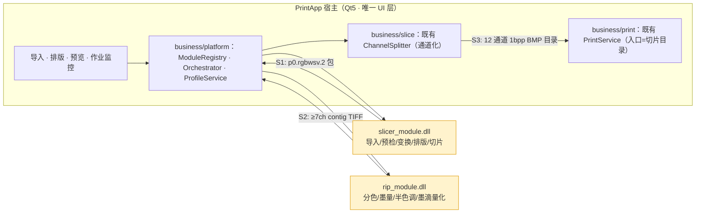

# INTEGRATION 集成文档集（切片 · RIP · 打印）

> 目录位置：`docs/claude/INTEGRATION/`。创建日期：2026-07-27。
> 视角：**打印软件项目（`ry_print_demo`，分支 `feature/v0.1.1`）构建者** + 资深产品经理 + 高级架构师。
> 定位：本会话产出的**集成落地文档集**，独立成folder，供后续持续修改。

## 0. 背景与前提（已确认）

```text
切片模块：E:\__Code\__Work\slice_test_demo\slice_soft_demo（本仓库，作为基线提供）
打印软件：E:\__Code\__Work\ry_print_demo\PrintSolution（宿主，分支 feature/v0.1.1）
RIP 模块：独立仓库，已出 DLL，单模块测试通过，可处理切片输出；暂无 API 文档
拓扑决策：分模块使用，每个模块各自提供独立动态库
MVP 范围：含多模型排版（导入 → 排版 → 切片 → RIP → 通道化 → Ready → 打印）
RIP 文档：契约先行（由打印软件侧定义 API，RIP 侧据此适配）
```

## 1. 文档索引

| 编号 | 文档 | 回答什么 | 主要读者 |
|---|---|---|---|
| — | [README](README.md)（本篇）| 集成全貌、索引、维护约定 | 全体 |
| INT_01 | [MVP 集成方案与里程碑](INT_01_MVP集成方案与里程碑.md) | MVP 做什么、怎么分期、验收口径 | 产品、架构、管理 |
| INT_02 | [切片模块对接规范](INT_02_切片模块对接规范.md) | 打印软件如何调用切片能力包 | 打印软件开发、切片开发 |
| INT_03 | [RIP 模块 API 对接与使用协议](INT_03_RIP模块API对接与使用协议.md) | RIP DLL 的 API、数据契约、协议 | RIP 开发、打印软件开发 |
| INT_04 | [打印软件重构判断与改造清单](INT_04_打印软件重构判断与改造清单.md) | 现在要不要重构、最小改动是什么 | 打印软件开发、架构 |
| INT_05 | [联调验收与测试计划](INT_05_联调验收与测试计划.md) | 怎么验证集成成功 | QA、全体 |
| **INT_06** | [能力边界详细化与切片侧答复](INT_06_能力边界详细化与切片侧答复.md) | 采纳方案 C、逐能力规格、答复 SL-01..10 与 OPEN-27-04、自认 5 个缺陷 | 切片/打印开发、架构 |
| **INT_07** | [SPI 薄壳与 UI 拆分自举方案](INT_07_SPI薄壳与UI拆分自举方案.md) | 如何产出 `slicer_module.dll`；UI 改走 DLL 当第一消费者 | 切片开发 |
| **INT_08** | [两侧契约对齐台账与联合计划](INT_08_两侧契约对齐台账与联合计划.md) | **对齐真源**：三处口径修正、四接缝状态、RIP 中的切片责任、互锁 Gate | 全体（**先读**）|
| **INT_09** | [契约完整性审计与补齐](INT_09_契约完整性审计与补齐.md) | 7 处契约缺口（三车道/包预览/取消语义…）与补齐方案、v2 能力清单 | 架构、两侧开发 |
| **INT_10** | [三层边界与模块归属规范](INT_10_三层边界与模块归属规范.md) | core/DLL/Worker **三层**边界、五问法承载判定、目录级归属、扩展点 | 架构、切片开发 |
| **INT_11** | [文件拆分与结构治理专项](INT_11_文件拆分与结构治理专项.md) | 实测规模、门禁止血、拆分矩阵与 Owner 分配 | 切片开发、管理 |
| **INT_12** | [短中长期总体计划与 s14 吸纳台账](INT_12_短中长期总体计划与s14吸纳台账.md) | **总计划**：v0.1/v1.0/v2.0 三级封装交付、里程碑、s14 评估 | 全体（**决策入口**）|
| **INT_13** | [封装层级一致性核对与完善清单](INT_13_封装层级一致性核对与完善清单.md) | 六套编号对齐、4 处不一致裁定、16 项待补齐清单 | 架构、全体 |
| **INT_14** | [开工前冲突清理与优先级裁定](INT_14_开工前冲突清理与优先级裁定.md) | **开工前必读**：7 项冲突、03X 完成度、优先级三方案、UI 模拟改方案 | 全体（**决策项**）|
| **INT_15** | [冲突处理方案与白区信号评估](INT_15_冲突处理方案与白区信号评估.md) | 白区哨兵实证否决、7 项冲突处理、UI 模拟双轨 | 全体 |
| **INT_16** | [Worker 定位重定义与三层契约完善](INT_16_Worker定位重定义与三层契约完善.md) | **Worker=可独立替换的引擎**；base/engine 分层；三条契约完善；RIP 确认清单 | 架构、两侧开发 |

| **INT_17** | [base/engine 改造计划与设计同步台账](INT_17_base_engine改造计划与设计同步台账.md) | **同步真源**：五条变更点、逐文档台账、P0–P5 改造计划、Stage 14 齐备度 | 全体（**开工前必读**）|

> ⚠️ **v1.0 表述统一作废（见 `INT_17` §3）**：凡出现"core 静态链接进 DLL 与 Worker 各一份"、"必须同一次构建/成对替换"、"backend=auto\|inprocess\|subprocess"、"双后端 SHA-256 比对"、"Worker 不可独立替换"等表述，一律以 `INT_16` / `INT_10` v1.1 为准。`INT_02/06/09/12/13/15` 与 `PLANNING/CLAUDE_09/13` 中的相关段落属此类。

### Stage 14 已成立并激活（正式文档，✅ ACTIVE）

```text
docs/slice/DOC/DOC_DECISION_14_切片能力包封装与打印软件集成专项.md   ← 成立决策
docs/codex_task/current/TASKS_14_切片能力包封装与打印软件集成任务清单.md ← 40 张原子任务卡
状态：✅ ACTIVE（2026-08-04 用户授权激活；Stage 15 已 COMPLETE，优先级冲突自然解除）
S2（RIP 接缝）权威条款见 `docs/slice/DOC/DOC_DECISION_14_S2_RIP接口合同定案.md`；
本目录 INT_* 为设计底稿，与合同定案冲突时以定案为准。
```

> ~~🔴 2026-08-03 开工前提醒：封装（Stage 14）尚未在 `docs/slice` 立项，本目录全部文档属分析建议层（P 级），不具备开工资格~~
> ✅ **2026-08-04 已失效**：Stage 14 已在 `docs/slice` 完整立项（DOC_DECISION/PRD/DEV/DEMO/REPORT/TASKS/PROMPT 七件套 + S2 合同定案），
> 并由用户授权转为 **ACTIVE**。`INT_14` §5 的 D-1/D-3/D-4 三项阻塞已全部裁定或闭合。
> **本目录 INT_* 仍为设计底稿（P 级）；与 `docs/slice` 正式文档冲突时，一律以正式文档为准。**

### 术语约定（`INT_13` §4 裁定，避免"三"字歧义）

```text
封装结构三层 = slicer_core / slicer_module.dll / slicer_worker.exe   （物理组成）
封装交付三级 = v0.1 / v1.0 / v2.0                                    （成熟度）
薄壳目录     = src/slicer_module/（C ABI，仅产出 DLL）
门面目录     = src/slicer_core/api/（Qt-free C++ facade，三方共用）
能力清单权威 = INT_09 §3 的 v2 清单（15 项）
```

**产物与交付边界（`INT_10` §1.1）——"三层"是我方内部构建结构，打印软件只看到一个 DLL**：

```text
slicer_base.lib    静态 · 稳定层（scene/layout/config/几何查询/包读取/preview）
                   → DLL 与 Worker 都链接 · 中间产物 · 不进交付包
slicer_engine.lib  静态 · 迭代层（slicer.cpp/steps/materials/support/raster/writer/repair）
                   → 【仅】Worker 链接 · 中间产物 · 不进交付包
slicer_module.dll  ABI 门面 + 轻量交互能力 · 链 base ·【不含 engine】· 交付 · 宿主唯一入口
slicer_worker.exe  切片引擎 · 链 base + engine · 交付 ·【可独立迭代替换】

跨边界唯一头文件 = contracts/print_module_spi.h（只含 C 类型与不透明句柄）
切片【只】在 Worker 执行，无进程内切片路径 → 不存在双后端行为分叉
Worker 可独立替换的条件：file_contract major 相同 + produces 含 p0.rgbwsv.2 + 过 E-01..08
```

> ⚠️ **2026-07-28 重要**：`INT_01..05` 中有三处口径已被修正，**以 [`INT_08` §0](INT_08_两侧契约对齐台账与联合计划.md) 为准**——① S3 接缝契约名改为 `printdata.v1`（对方 CLD_19）；② W/S/V 墨滴上限改为"按通道 × 按位深"（grayBits=2 时 White 上限是 **6** 不是 9）；③ 模块装载方式改为**运行时装载（`GetProcAddress`）**，不用 `/DELAYLOAD`。

## 2. 集成全貌（一张图）



**三个接缝（每个都必须有强制校验器）**：

| 接缝 | 生产者 → 消费者 | 契约 | 校验器 |
|---|---|---|---|
| **S1** | 切片 → RIP | `p0.rgbwsv.2`：6ch `R G B W S V`、8bit、`black_is_print`（0=出墨/255=空）| `rip_reader_test`（**已有**）|
| **S2** | RIP → 通道化 | `rip.ch7.1`：≥7 samples/pixel、8bit、**contig 强制**、C M Y K W S V、W/S/V 为 0–9 墨滴数 | `rip_output_validator`（**待建**，见 INT_03 §7）|
| **S3** | 通道化 → 打印 | 切片目录：`slice_{layer}_{channel}.bmp`（12 通道 1bpp，层号连续）| `PackageVerifier`（**待建**，见 INT_05）|

## 3. 四个问题的结论速查

| 问题 | 结论 | 详见 |
|---|---|---|
| ① 切片如何对接、MVP 怎么做 | 切片以 **独立 DLL（能力包）** 接入 `business/platform/`；MVP 用**离线链路先通、再接设备**的两步走 | INT_01 / INT_06 |
| ② RIP 如何对接 | **契约先行**：`rip_module.dll` 的 C ABI + `rip.ch7.1` 数据契约 + 参数/错误/进度协议；已与打印侧 CLD_06 对齐 | INT_03 / INT_08 §2 |
| ③ 打印软件要不要重构 | **不需要大重构**。`PrintService::StartJob(sliceFolderPath, ...)` 已是目录契约入口，打印链路可零改动；只需**新增**前置 prepress 链路 + Ready 闸门 | INT_04 |
| ④ 文档存放 | 本目录 `docs/claude/INTEGRATION/`，命名 `INT_<序号>_<主题>.md` | 本篇 |
| ⑤ 能力边界到哪（只给引擎还是给包） | **方案 C 几何真值包**：5 必需 + 2 可选，不含 `scene.layout`、不含设置 | INT_06 |
| ⑥ 切片侧 UI 要不要拆 | **要拆，且价值很高**：UI 改走 DLL = ABI 的第一个消费者，把跨团队风险提前到本仓库消化 | INT_07 |
| ⑦ 两侧规划如何合并 | 以打印侧为契约主导，我方修正三处口径；建立互锁 Gate 与合并开放项清单 | INT_08 |

## 4. 最需要先对齐的两件事（风险第一）

### 4.1 S2 接缝的通道与墨滴语义（A 级事实）

- 切片输出 **6 通道 RGBWSV**；`ChannelSplitter` 硬性要求 **≥7 samples/pixel** 且为 **CMYK+W+S+V**（`ChannelSplitter.cpp:406-461`，不足即报错）；
- `ChannelSplitter` 对 **W/S/V 直接取墨滴数**，CMYK 走阈值映射；切片侧 W/S/V 当前是 0/255 二值；
- **墨滴上限按通道 × 按位深**（对方 CLD_06 §8.2.1 实测 `ApplyTiffDropsToBuffers()`）：grayBits=2 → CMYK 0–3 / **White 0–6** / Support,Varnish 0–9；grayBits=1 → 1/2/3/3。

**结论**：RIP 不只做 `RGB→CMYK` 分色，**还必须做 W/S/V 的墨滴量化并按正确上限钳位**。若直接透传：`0`（我方=出墨）→ 0 滴 = **白墨完全不出**；`255`（我方=空）→ 被钳到上限 = **变成满墨**——两个值都错且方向相反，打出"底片"且无任何报错。这是 `OPEN-01`，必须签字关闭后才能写 `RipService` 代码。

### 4.2 🔴 切片侧 TIFF 字对齐缺陷（我方必修）

打印侧读我方代码发现两处未字对齐（`tiff_io.cpp:118-121` 与 `:404`），其中一处**已在生产输出中生效**：tag 270 写 `"RGBWSV"`=7 字节（奇），使 tag 273 `StripOffsets` 落在奇偏移。我方 reader 逐字节解析故无感知，但 **RIP 与 `ChannelSplitter` 用 libtiff** —— 属未定义行为区。详见 [`INT_06` §5](INT_06_能力边界详细化与切片侧答复.md)：必须在 M0 前修复，并会带来一次受控的 golden 重基线。

## 5. 命名与维护约定

```text
文件命名：INT_<两位序号>_<中文主题>.md
新增文档：序号顺延（06、07…），并在本 README §1 登记
修改约定：改动"事实类"内容时标注日期；与代码冲突以代码为准
证据等级：A=已核实代码事实 / P=Claude 建议 / TBD=待 RIP 侧确认
```

后续你要修改任何一篇，直接说编号即可（例如"改 INT_03 的错误码表"）。
