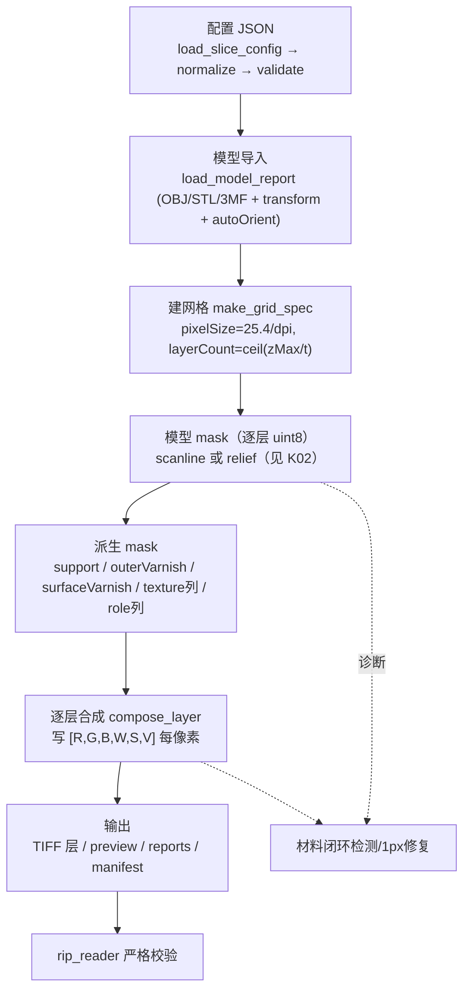

# CLAUDE_K01 切片总流程与数据流

> 证据等级：A=代码事实。核心实现集中在 `src/slicer_core/slicer.cpp` 的自由函数 `run_slice(...)`（约 slicer.cpp:3960 起）。行号为近似，以符号名为准。

## 1. 一句话概览

切片就是把"连续三维模型 + 材料意图"离散化为"逐 Z 层的二维材料通道图（RGBWSV）"，再封装成可交付下游 RIP 的包（TIFF 层 + manifest + reports + preview）。全流程当前由 `run_slice()` 单体顺序驱动（这也是架构分析中"14 步概念管线尚未拆出"的现状，见 `ANALYSIS/CLAUDE_02`）。

## 2. 端到端数据流



**核心不变量**：`model_masks`（`vector<vector<uint8_t>>`，每像素 1 字节，逐层）是**唯一真源**；support / varnish / texture / role 全部由它派生。

## 3. `run_slice()` 的阶段序列（A）

下表是代码里真实的顺序（对照 `DefaultSlicePipelineSteps()` 的 14 个概念步骤名，但当前是在一个函数内顺序执行，不是独立 step）：

| # | 阶段 | 关键函数 / 位置（约）| 产物 |
|---|---|---|---|
| 1 | 载入配置 | `load_slice_config` → `NormalizeConfigJson` → `validate_slice_config`（config.cpp）| `SliceConfig` |
| 2 | 载入模型 | `load_model_report`（model.cpp）| `ModelReport`（三角、UV、材质、bbox）|
| 3 | 建网格 | `make_grid_spec` slicer.cpp:403-420 | `GridSpec` |
| 4 | 采样模型 mask | scanline `sample_model_masks`:1113 / relief `sample_relief_heightfield_masks`:1174（按 `slicingMode` 分派 :4010-4022）| `model_masks` |
| 5 | 派生列/范围 | `compute_first_model_layers` / `compute_*_column_ranges` | 支撑源层、列范围 |
| 6 | 纹理/角色列 | `build_relief_texture_columns`:2326（**仅 relief**，见 K02/K04）| 每列颜色/角色 |
| 7 | 光油 mask | `BuildOuterVarnishMasks`:828 / `BuildSurfaceVarnishMasks`:911 | 外壳/表面光油 mask |
| 8 | 支撑 | `generate_support_masks`:1834（+ 可选 `OptimizeSupportShape`）| 支撑 mask + 类型 |
| 9 | 逐层合成 | `compose_layer`:2914-3101 | 每层 `[R,G,B,W,S,V]` buffer |
| 10 | 材料闭环 | 诊断 / `repair_then_report`（:4117 起）| 闭环报告（可选 1px 修复）|
| 11 | 写 TIFF | `WriteRgbwsvProductionLayerTiff`:4267 | `layers/layer_*.tif` |
| 12 | 预览 | `write_layer_previews`:684 | preview PNG/PPM |
| 13 | 报告 + manifest | `write_json_file`:429 系列（:4723-4808）| `reports/*.json` + `manifest.json` |

## 4. 网格离散化（A，`make_grid_spec` slicer.cpp:403-420）

```text
pixel_size_x_mm = 25.4 / dpiX          （dpi 现为区间校验 IsSupportedOutputDpi，非固定 600；600 时≈0.042333mm=42.3µm）
pixel_size_y_mm = 25.4 / dpiY
width_px  = max(1, ceil(width_mm  / pixel_size_x_mm))
height_px = max(1, ceil(height_mm / pixel_size_y_mm))
z_max     = max(layerThicknessMm, bbox.max.z + support.offset_mm)
layer_count = max(1, ceil(z_max / layerThicknessMm))
每层采样 Z： z_mm = (layerIndex + 0.5) * layerThicknessMm   （体素中心约定）
```

- `layerIndex` 是离散标识，`z_mm` 是物理中心位置，UI/报告/映射必须两者一致。
- **2026-07-27 更新**：DPI 不再固定 600，改为 `IsSupportedOutputDpi()` 区间校验 + `IsOutputPixelSizeConsistent()` 一致性校验（12E-09C X/Y DPI 专项），X/Y 可各自取值。详见 `VERIFICATION/CLAUDE_08` §2.3。
- 若 `outerVarnish.allowXYExpansion`，网格原点向 −X/−Y 外扩 `padding*pixelSize`，宽高各 +`2*padding*pixelSize`（slicer.cpp:407-414），使模型外的光油壳层有落点。

## 5. 进度协议（A）

核心通过 `NotifyProgress → options.progress_callback`（slicer.cpp:45-64）在阶段边界上报结构化进度，阶段与百分比大致为：

```text
config_load(0) → model_load(3) → grid_setup(10) → mask_sampling(12)
→ texture_prepare(28) → support_generation(32)
→ layer_processing(36 + 已完成*56/层数, 有节流) → report_build(92) → report_write(95) → completed(100)
```

字面令牌 `SLICE_PROGRESS` 由 **CLI 打印**（`apps/slicer_cli/main.cpp:289`，`PrintSliceProgress`），UI 侧由 `SliceProgressProtocolParser.cpp:9` 解析。核心库本身不打印该字符串（保持 core 与 UI 解耦）。

## 6. 输出与校验（A）

- 每层 buffer 经 `WriteRgbwsvProductionLayerTiff`（:4267）按 `storageMode`（stripped/tiled）写 6 通道、8 位、contiguous 的 TIFF；
- `manifest.json` schema 固定 `p0.rgbwsv.2`，携带 grid/dpi/pixelSize/originMm/slicingMode 与极性块 `{polarity:black_is_print, printValue:0, emptyValue:255}`（:4711-4713）；
- reports 覆盖 slice/support/support_shape/texture/material_policy/material_process/cross_section/material_closure/material_role_mapping/relief/contour/obj_mtl_material/three_mf；
- `rip_reader_test` 对包做严格校验（结构、schema、通道、位深、极性、存储、层列表）。**它验证"交付契约"，不等于完整 RIP 或真机可打印。**

## 7. 与 K05 的衔接

K05 用 `model/obj/meigui_fudiao/04.obj` + `samples/configs/material_process/obj_mtl_texture_rgb_white_varnish.json`（relief_heightfield）把上述阶段走一遍，展示每个阶段对该模型具体做了什么、每个通道最后写了什么值。
