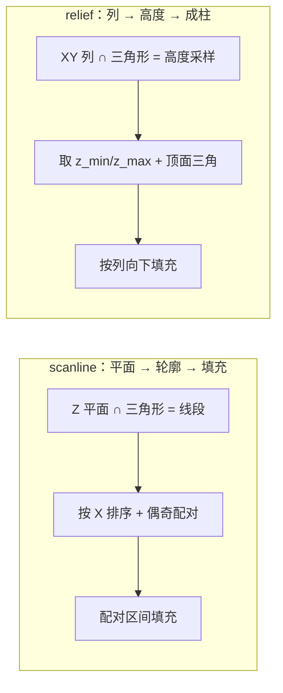

# CLAUDE_K02 几何切片模式：closed_mesh_scanline 与 relief_heightfield

> 证据等级：A=代码事实。这是"模式轴一"——`config.slicingMode`，决定**模型 mask 怎么算**。两种模式当前均已实现，由 `run_slice` 在约 slicer.cpp:4010-4022 分派。行号为近似。

## 1. 两种模式的定位

| | closed_mesh_scanline | relief_heightfield |
|---|---|---|
| 面向对象 | 闭合实体网格（closed mesh）| 浮雕/甲片等 2.5D 表面（relief）|
| 核心思想 | 每个 Z 平面与三角形求交 → 轮廓 → 扫描线填充 | 每个 XY 列求顶面高度 → 向下填充成柱 |
| 关键函数 | `sample_model_masks`:1113 → `slice_triangles_to_segments`:1045 → `rasterize_segments`:1083 | `sample_relief_heightfield_masks`:1174 |
| 对网格质量要求 | **高**：需闭合、可配对交点 | **低**：对开放/单面 relief 稳健 |
| 是否支持 legacy 纹理 | **否**（纹理列仅在 relief 下构建）| **是** |
| 配置键 | `slicingMode: "closed_mesh_scanline"`（默认）| `slicingMode: "relief_heightfield"` + `relief.fillMode` |

## 2. closed_mesh_scanline（闭合网格·扫描线）

### 原理

对每一层的采样高度 `z_mm=(i+0.5)*t`：

1. **求交成段**（`slice_triangles_to_segments`:1045）：对每个三角形，用半开区间判据 `a.z<=z && b.z>z` 测三条边是否穿越该 Z 平面（`edge_intersects_plane`:1036），插值出交点；恰好 2 个且非退化时生成一条二维线段 `Segment2`。
2. **扫描线填充**（`rasterize_segments`:1083）：对每条 Y 扫描行 `y_mm=origin+(y+0.5)*pixelSizeY`——
   - 求所有线段与该行的交点 X；
   - 沿 X **排序**；
   - **偶奇配对**（even-odd）：两两成对，每对之间 `fill_span` 填充为模型像素；
   - 若交点数为**奇数**，`++odd_intersection_rows`（记入 `LayerDiagnostics`）。

```text
交点排序 → 两两配对 → 配对区间填充
交点为奇数 → 记 odd_intersection_rows（提示开放边界/非流形/数值退化/轮廓异常）
```

`fill_span`（:1071）用 `−0.5` 规则把 mm 边界换算成像素中心：`start_x=ceil((left-origin)/px-0.5)`，`end_x=floor((right-origin)/px-0.5)`。

### 关键健康指标

`odd_intersection_rows` 是"这层轮廓是否闭合"的体检值：正常闭合体每行交点应为偶数；出现奇数行往往意味着网格开放、非流形或自交。这正是 12E 真实模型（如 `meigui_fudiao`，nonManifoldEdges=10940）在 strict 准入下被阻断的底层信号来源（见 `ANALYSIS/CLAUDE_03` §2）。

## 3. relief_heightfield（浮雕·高度场）

### 原理（`sample_relief_heightfield_masks`:1174-1290）

不按平面求轮廓，而是**按 XY 列建高度场**：

1. **Pass 1（:1189-1229）**：把每个三角形在 XY 平面栅格化，对覆盖到的像素中心用重心坐标 `point_in_triangle_xy`（:1143）判断落在哪个三角形内，插值出该点 `z_mm=w0*a.z+w1*b.z+w2*c.z`；对每个 XY 列记录 `z_min / z_max / hit_count`，并在**最高 z** 处记录 `top_triangle_index + top_barycentric`（存入 `ReliefColumnInfo`:185）。这份"顶面三角 + 重心"记录，就是后续**纹理/角色取色**的来源。
2. **Pass 2（:1243-1287）**：把每列的高度区间转成填充的层范围——

```text
start_z = (fillMode=="surface_to_base") ? relief.baseZMm : z_min[col]
end_z   = z_max[col]
start_layer = first_layer_at_or_above_z(start_z)   // ceil(z/t - 0.5)
end_layer   = last_layer_at_or_below_z(end_z)      // floor(z/t - 0.5)
for layer in [start_layer, end_layer]: model_masks[layer][col] = 1
```

### `relief.fillMode` 两种填法（A）

| fillMode | 语义 | 适用 |
|---|---|---|
| `surface_to_base` | 从平整底板 `baseZMm` 一直填到顶面 `z_max` | 需要实心底座的浮雕（默认值）|
| `intersection_range` | 只填该列网格自身的进入 `z_min` 到离开 `z_max` | 贴合网格自身厚度（多数 relief 样例、meigui 示例用此）|

## 4. 两者本质区别（P 总结）



- **对闭合性的依赖**：scanline 依赖"每行交点可偶配对"，网格不闭合就出 `odd_intersection_rows` 甚至错误填充；relief 只看每列高度，天然容忍开放/单面网格。
- **内部空腔**：scanline 通过偶奇规则能表达同层内的孔洞；relief 是"向下实心柱"，不重建列内的中空结构。
- **纹理能力**：relief 在 Pass 1 记录了顶面三角，因此**能取顶面 UV 颜色**；scanline 没有这份记录——所以 **legacy 引擎里，纹理/材料角色列只在 relief 下构建**（`slicingMode!=relief` 时这些列为空；config 校验也要求纹理相关 applyMode 搭配 relief）。要给**闭合网格**上纹理，得走另一条轴的 `surface_shell_from_sdf`（OpenVDB）或 `global_surface_shell`（专用管线，见 K03）。
- **选择准则**：实心闭合件 → scanline；浮雕/甲片/带贴图的 2.5D 表面 → relief。

## 5. 常见误区（P）

1. **把"浮雕/fudiao"当成一定用 relief**：`fudiao` 是题材，不是模式。`meigui_fudiao/04.obj` 既被 relief 配置用作贴图浮雕切片（K05），也被 12E 当作闭合网格做 strict 准入测试——同一模型，两种几何模式下含义不同。
2. **以为 scanline 也能上纹理**：legacy 下不能，纹理列只在 relief 构建。
3. **把几何模式和管线模式混为一谈**：几何模式（本篇）决定 mask 怎么算；管线模式（K03）决定整条端到端怎么走。二者正交。
