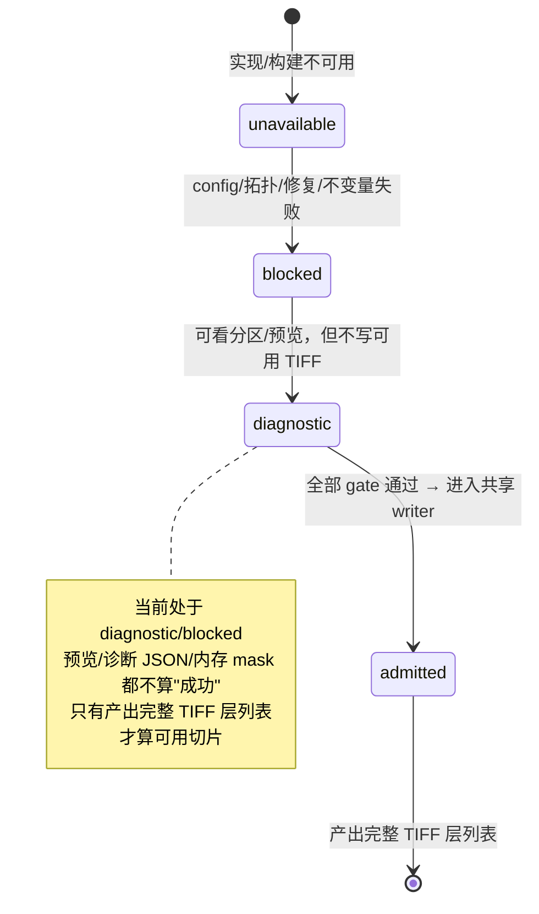

# CLAUDE_K03 端到端管线模式：legacy 与 global_surface_shell

> 证据等级：A=代码事实，B=正式目标。这是"模式轴二"——`slicePipeline.mode`，决定**整条端到端生产路径怎么走**。深度架构分析见 `ANALYSIS/CLAUDE_02` §3/§4；本篇作知识性对比。
>
> ⚠ **2026-07-27 重要更新**：双模式**已落地**——`config/SlicePipelineConfig.h` 有 `SlicePipelineMode{Legacy, GlobalSurfaceShell}`，`pipeline/SlicePipelineRouter.h` 提供 `ResolveSlicePipelineRoute`/`RequireSlicePipelineRoute`（含 `fallback_applied` 审计、11 个稳定错误码），并有 `GlobalSurfaceShellProductionPipeline/Package/LayerAdapter/MaterialEvidence`。Global 已作为**显式 opt-in Profile（0.01mm）**准入，`xiao_ma`/`yecan` 的 TIFF 与 RIP strict 通过；但 Global 比 Legacy **慢 4.09–5.92×、峰值内存 8.19–8.74×**，故 **Legacy 仍为默认**、禁止静默回退。本篇下文标注为"未落地/目标态"的部分请以此更新为准，详见 `VERIFICATION/CLAUDE_08` §2.2。

## 1. 先厘清：这与几何模式（K02）不是一回事

- 几何模式（K02，`slicingMode`）：模型 mask 怎么算（scanline / relief），**都已实现**。
- 管线模式（本篇，`slicePipeline.mode`）：整条端到端如何编排与准入（legacy / global_surface_shell），**目标态、尚未落地**——`config.h` 当前无 `slicePipeline` 字段（已核实）。
- 关系：legacy 管线内部可用 scanline 或 relief；global 是另一条独立候选管线。二者正交。

## 2. legacy（当前唯一生产路径，默认）

- **状态（A）**：可生成完整 `p0.rgbwsv.2` 包，是默认、受回归保护的生产路径。
- **入口**：`RunSlicePipelineLegacy()`（`pipeline/SlicePipeline.cpp`）经模型预检门后整体调用 `run_slice()`（约 SlicePipeline.cpp:45）。
- **能力**：K01 描述的全流程都在此路径内；两种几何模式、五套材料策略、支撑、光油、材料闭环都可用。
- **不依赖 OpenVDB**。

## 3. global_surface_shell（诊断/候选路径，目标态）

- **要解决的问题（B）**：给**闭合网格**做"全局三维纹理壳层 + 模型填充"的互补分区——即把模型体积精确划分为"贴图表面壳层 TextureSurface"与"内部填充 ModelFill"，满足：

```text
ModelMask = TextureSurfaceMask ∪ ModelFillMask
TextureSurfaceMask ∩ ModelFillMask = ∅
模型外两者皆 0
```

- **现状（A）**：12E 已建成 CPU 全局距离后端、OpenVDB conformance、width sweep（宽度单调性）、纹理转移、栅格映射、full closure 诊断，并有 golden——**但只到"诊断（diagnostic）"，不写生产 TIFF**。
- **首个候选后端用 OpenVDB-OFF 的 Legacy CPU 全局距离**；OpenVDB 仅作可选 conformance，默认 OFF。用户选的是"端到端模式"，**不是**选 backend。

### Global 状态机（B）



## 4. 两种管线模式的区别（对比表）

| 维度 | legacy | global_surface_shell |
|---|---|---|
| 生产可用性 | ✅ 生产路径（默认）| ❌ 诊断/候选，未准入（BLOCKED）|
| 目标场景 | 现有全部切片能力 | 闭合网格的全局三维纹理壳层/填充分区 |
| 纹理上闭合网格 | 不支持（纹理仅 relief）| 支持（其核心目的）|
| 几何后端 | 扫描线/高度场（CPU）| CPU 全局距离（首选）/ OpenVDB conformance（可选）|
| 是否写生产 TIFF | 是 | 否（准入前不写可用 TIFF）|
| OpenVDB 依赖 | 无 | 可选、默认 OFF |
| 配置字段 | 现有全部 | `slicePipeline.mode`（**尚未实现**）|

## 5. 关键红线：禁止静默回退（B）

目标设计明确（已冻结稳定错误码）：

- global 失败**不得**静默切到 legacy；
- **不得**把 legacy 生成的包冒充为 global 结果；
- **不得**把"预览成功"当作"生产成功"；
- 应返回稳定 blocker（如 `E_12E_PIPELINE_GLOBAL_NOT_ADMITTED`、`E_12E_PIPELINE_SILENT_FALLBACK_FORBIDDEN`、`E_12E_PIPELINE_PRODUCTION_TIFF_REQUIRED`），用户重选 legacy 属于**一次新的显式请求**。
- 两模式准入后**共享同一 RGBWSV writer / manifest / preview/report 规则**，不允许出现第二套 TIFF 协议。

## 6. 现状与阻断（A/B，指向 12E-08D）

global 之所以还停在诊断态，根因是三个必需真实 OBJ 在 strict 准入下失败（自交/非流形/边界边），mesh repair 仅保守且默认关闭、Release 预算未冻结、R3-04=NO-GO。要把 global 从 diagnostic 推到 admitted（即 12E-08D 生产写包），需要：修复后的输入 + 四例闭包 + 冻结预算 + Quick CI 基线解决 + **用户显式授权**。完整阻断链见 `ANALYSIS/CLAUDE_03` §2，落地剧本见 `PLANNING/CLAUDE_06`。

## 7. 与 experimental OpenVDB 的关系（A，别混淆）

`experimental.openvdbPipeline`（config.h:297）是另一个**独立**的实验开关（默认全关：`enabled=false`、`writeProductionRgbwsv=false`）。它、`texture.applyMode=surface_shell_from_sdf`、以及未来的 `slicePipeline.mode=global_surface_shell` 是三个不同层面的东西：experimental 是"OpenVDB 实验管线开关"，applyMode 是"纹理如何贴"，slicePipeline.mode 是"端到端模式"。正式产品选择的是**端到端模式**，backend 是实现细节。
