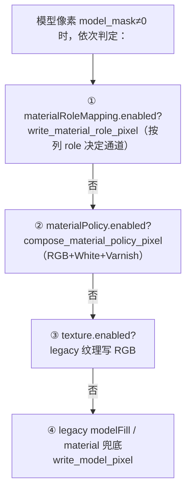

# CLAUDE_K04 材料策略体系

> 证据等级：A=代码事实，P=Claude 判断。核心在 `compose_layer`（约 slicer.cpp:2914-3101）与 `config.h`/`config.cpp`。行号近似。
> 这是"每个像素最终写成什么材料"的完整规则集。

## 1. 六通道与极性（先记住这个）

输出固定六通道 `[R, G, B, W, S, V]`（`rgbwsv_channel_count=6`）：`R/G/B` 彩色纹理、`W` 白墨/白色、`S` 支撑、`V` 光油。

**极性 black_is_print（A）**：`printValue=0`（打印/有墨）、`emptyValue=255`（空/无墨）。所以配置里 `rgb:[0,0,0]` 表示"黑=有色打印"，`whiteValue=255/varnishValue=255` 表示"该通道不出墨"。buffer 初始化为 `background.value=255`（强制 255，config.cpp:597），未被任何策略写到的像素在六通道上都保持 255（=空）。检测器把 `通道值<255` 视为"已打印"。

## 2. 五套材料意图 + 生效优先级（最关键）

`SliceConfig` 里有**五处**可能重叠表达材料意图的结构，很多人会混淆：

| 配置块 | 结构 | 角色 |
|---|---|---|
| `material`（legacy）| `MaterialConfig` config.h:49 | 最底层的 RGB/W/V 基础写入 |
| `materialPolicy` | `MaterialPolicyConfig` config.h:102 | RGB/白墨/光油的策略化写入 |
| `modelFill` | `ModelFillConfig` config.h:113 | 纹理表面下方/周围的"填充"材料 |
| `materialProcessProfile` | `MaterialProcessProfileConfig` config.h:157 | 工艺命名 + 验收——**仅报告，不写像素** |
| `materialRoleMapping` | `MaterialRoleMappingConfig` config.h:173 | 按输入材质名映射到 role（rgb/white/varnish/support）|

**代码里没有单一 merge 函数**；生效优先级由 `compose_layer` 的分支顺序决定（A，约 slicer.cpp:2946-3039）：



即优先级：**materialRoleMapping ＞ materialPolicy ＞ legacy texture ＞ modelFill/material（兜底）**。

关键澄清（A，纠正常见误解）：

- **`materialProcessProfile` 是"仅报告（report-only）"**：它**从不写像素**，只（a）在 `modelFill.material="profile_default"` 时提供一个默认填充材料，（b）驱动验收计数。代码里有直接证据（slicer.cpp:3660）：`"materialProcessProfile is report-only; no materialPolicy or materialRoleMapping is enabled"`。所以只启用 profile 而不启用 policy/role，**不会真正把白墨/光油写进通道**。
- **`modelFill` 是正交的"填充"**：它填在纹理表面之下/周围（scope 如 `below_texture_surface`），受 `ModelFillUsesExplicitPolicy = enabled && !legacyRgbFallback` 门控；其材料由 `ResolveModelFillMaterial`（:2501）决定，优先级：显式 `white/varnish/rgb` ＞ `material_role`（按列 role）＞ `profile_default`（→ profile → policy → legacy）。

> 实践红线（P）：**不要在同一配置里用五套互相矛盾的意图**。教程也警告过。改完务必看 `effective config` 与 `material_process` 报告确认真实生效的是哪一套。

## 3. 纹理策略（texture）

`TextureConfig`（config.h:71）：`enabled / applyMode / topSurfaceLayers / sampler / uvAddressMode / flipV / fallbackRgb / missingTexturePolicy / nonSurfaceRgbPolicy`。

### applyMode（A，`ShouldApplyTextureToLayer`:2678）

| applyMode | 语义 |
|---|---|
| `solid_volume_from_top_surface` | 顶面颜色**整列向下**铺满（默认）|
| `top_surface_only` | 只顶部 1 层 |
| `top_surface_band` | 顶部 `topSurfaceLayers` 层（meigui 示例用此，取 1 层）|
| `surface_shell_from_sdf` | 历史 OpenVDB candidate，需 `experimental.openvdbPipeline.engine=openvdb` |
| `global_surface_shell` | 12E 全局壳层，需 `modelFill.scope=complement_of_global_texture_shell`（走 K03 那条轴）|

**重要（A）**：前三种简单 applyMode 只在 **relief_heightfield** 下工作——纹理颜色取自 relief Pass 1 记录的顶面三角 + 重心 UV。闭合网格上纹理要走 SDF/global 壳层。

### 采样（A，texture_image.cpp）

- `sampler`：`nearest`（`lround` 取最近纹素）/ `bilinear`（四邻 `lerp_u8` 双线性）；
- `uvAddressMode`：`clamp`（夹到 [0,1]）/ `repeat`（`u-floor(u)`），越界会置 `out_of_range`；
- `flipV`：先对 V 做 `1-v` 再寻址；
- 像素坐标 `x=u*(width-1), y=v*(height-1)`；
- `missingTexturePolicy`：`warn_and_fallback`（缺纹理时用 `fallbackRgb` 或材质漫反射并计数）/ `fail_fast`（抛错）。

纹理**每列只在顶面取一次色**，再按 applyMode 决定铺哪些层——不是逐层各自采样。

## 4. 白墨与光油策略

- **白墨（White，`materialPolicy.white` / `materialProcessProfile.white`）**：模式如 `underbase`（打底）/`all_model`，覆盖 `all_model` 或 top-n；写 `W` 通道（值 0 = 出白墨）。注意：profile 里的 white **只有在 policy 或 role 同时启用时才真正落墨**（见 §2）。
- **表面光油 `surfaceVarnish`（config.h:241）**：模型表面像素上的一层薄光油膜。`BuildSurfaceVarnishMasks`（:911）以 `radiusPx=max(1,thicknessPx)` 扫邻域，把可从边界到达的空邻域标为 `outer_surface`、被包裹的空邻域标为 `inner_surface`；合成时写到模型像素的 `V` 通道。
- **外侧光油 `outerVarnish`（config.h:228）**：模型**之外**的附加光油壳层。`BuildOuterVarnishMasks`（:828）= `外部空 ∩ 膨胀模型(thicknessPx) ∩ ¬模型`；厚度像素 `=max(1, ceil(thicknessMm*1000/pixelPitchUm))`（默认 pitch 42.3µm）。它可**扩张网格**（allowXYExpansion，见 K01 §4），优先级高于支撑（`varnish_shell_wins` 会清掉冲突支撑）。
- **光油几何目标（正式枚举）**：`InPlaceTopLayers / AdditiveGrow / CompensatedShrink`，其中 `CompensatedShrink` 仅为目标/实验，不是当前生产能力。

## 5. 支撑策略（support）

支撑详解见 K01/K06，这里给策略要点（A，`generate_support_masks`:1834）：

- **placement**：`lower`（底面投影，`bottom_projection`）/ `upper`（可拆上表面支撑）/ `both` / `unsupported_only`（仅孤岛）/ `full_vertical_projection`（整列，调试用）；`placement_explicit` 决定用新枚举还是回退到旧 `mode`。
- **孤岛**：`find_island_components`（:1753）按 `connectivity`(4/8) 洪泛连通域，与下层"已支撑基底"求重叠比 `overlap_ratio`；`<min_overlap_ratio` 判为悬空孤岛，`area<minIslandAreaPx` 则过滤。
- **内部空腔 `internalVoid`**：先从边界洪泛出"外部空"，剩下被模型包裹、`size>=minAreaPx` 的空腔填 `InternalVoid` 支撑。
- **形态优化 `shape`**：小连通域过滤 → 膨胀 → 闭合小缝 → 桥接（horizontal/vertical）→ `preserveModelPriority`（清除压到模型的新增）→ `maxAddedSupportRatio` 守门（新增超比例则**整体回滚**并告警）。
- **类型优先级**：`InternalVoid(5) > UnsupportedIsland(4) > FullVertical(3) > Upper(2) > Bottom(1)`；`SupportType` 只进报告/调试，**绝不编码进 S 通道取值**。
- **性能**：支撑是头号热点（逐层全网格洪泛 + O(层×像素) 统计扫描），见 `ANALYSIS/CLAUDE_03`/`PLANNING/CLAUDE_04` §4.1。

## 6. 逐像素合成的总优先级（A，compose_layer）

每个像素按此顶层优先级写六通道（约 slicer.cpp:2942 / 3078 / 3081）：

```text
① model_mask≠0      → 走 §2 的模型内部优先级（role ＞ policy ＞ texture ＞ modelFill/material）
                       并可叠加 surfaceVarnish 到 V
② 否则 outerVarnish  → 写 V = outerVarnish.value
③ 否则 support(启用) → 写 S = support.value
④ 否则              → 六通道保持 255（Empty）
```

即总优先级 **Model ＞ OuterVarnish ＞ Support ＞ Empty**（比教程里简化的"Model>Support>Empty"多了 OuterVarnish 这层）。

## 7. 材料闭环与 1px 修复（material closure）

`MaterialClosureConfig`（config.h:265，默认 `mode="diagnostic"`, `maxGapPx=1`, `failOnGap=true`）：

- **diagnostic**：只检测不修。基于语义 mask（不是从 TIFF 反推）判定候选缝隙——像素满足 `层内为空 && 属于预期占据域 && 非外部背景` 才是候选，再按 `maxGapPx` 邻域关系分成 **5 类缝隙**：`ColorFillGap`（纹理↔填充）/`ModelSupportGap`（模型↔支撑）/`ColorSupportGap`/`InternalVoidGap`/`VarnishSupportGap`。
- **repair_then_report**（需成对：`mode=repair_then_report` && `repair.enabled` && `maxGapPx=1` && `modelFill.enabled` && `support.enabled`，默认关闭）：**保守 1px 修复**——含 2×2 实心块的候选判为"超过 1px"直接拒绝（`ContainsTwoByTwoBlock`）；只对确属 1px 的缝按类型补对应通道；修复必须限制在预期占据域、保护外部背景；修完**重新检测**剩余缝隙并分类报告 `repaired/rejected/remaining`。
- **candidate vs exact**：从 TIFF 反推邻接的是 candidate（仅诊断）；生产验收必须用 exact（语义 mask）。`manual_repair_required` 永远不算 production pass。

## 8. 一页速查（P）

```text
六通道 [R G B V? ]  →  实为 [R,G,B,W,S,V]，print=0 / empty=255
材料意图优先级       role ＞ policy ＞ texture ＞ modelFill/material；profile 仅报告
像素总优先级         Model ＞ OuterVarnish ＞ Support ＞ Empty
纹理                 仅 relief 生效；顶面取一次色，按 applyMode 铺层
白墨/光油            policy/profile 写 W/V；surfaceVarnish=表面膜，outerVarnish=外壳(可扩网格)
支撑                 placement + 孤岛 + 内腔 + 形态优化；类型只进报告
闭环                 diagnostic 默认；1px 保守修复默认关；candidate≠exact
```
