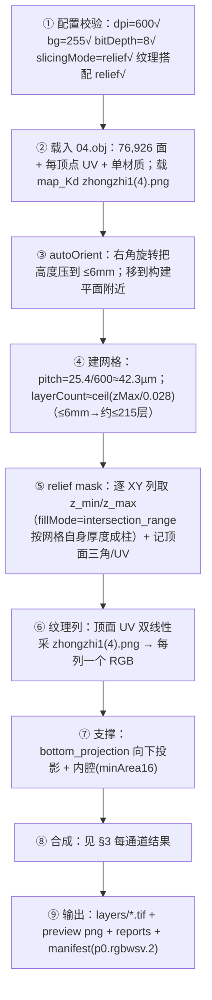

# CLAUDE_K05 实战示例：切片 `model/obj/meigui_fudiao/04.obj`

> 证据等级：A=代码/模型/配置事实，P=Claude 推断。本篇用真实模型 + 真实配置把 K01 的流程走一遍。
> 注意：本会话沙箱不可用，**未实际运行**；涉及"最终各通道是否有像素/具体层数"的结论应以实际运行后的 `reports/` 为准（见 §6）。

## 1. 模型与配置（A，已核实）

**模型 `model/obj/meigui_fudiao/04.obj`**：
- 顶点 `v` 228,991；面 `f` 76,926；纹理坐标 `vt` 228,991（每顶点一组 UV）；含法线 `vn`；
- 头部：`mtllib 04.mtl`、`usemtl color_808080_texture_zhongzhi(2)`（**单材质**）；
- `04.mtl`：材质 `color_808080_texture_zhongzhi(2)`，`Kd≈0.98`，`map_Kd zhongzhi1(4).png`（同目录有该贴图）；
- 量级约 76 万行、~25–35MB（近似）。

**配置 `samples/configs/material_process/obj_mtl_texture_rgb_white_varnish.json`**（A，已读）关键字段：

```text
slicingMode           = relief_heightfield         ← 几何轴用 relief（K02）
relief.fillMode       = intersection_range, baseZMm=0
output                = dpi 600/600, layerThicknessMm 0.028, storage stripped, channelOrder R G B W S V
autoOrient            = enabled, maxHeightMm 6, minimize_height_by_right_angle_rotation
texture               = enabled, applyMode top_surface_band, topSurfaceLayers 1, bilinear, clamp, flipV, fallbackRgb[0,0,0]
materialRoleMapping   = enabled, rules: name含"white"→white / 含"varnish"→varnish, 默认 rgb
materialPolicy.white  = enabled
modelFill             = enabled, material white, scope below_texture_surface, value 0
materialProcessProfile= enabled（仅报告）, 要求 rgb/white/varnish 像素, varnish all_model value0, white all_model value0
modelMaterial         = rgb[0,0,0], whiteValue 255, varnishValue 255（legacy 兜底）
support               = enabled, bottom_projection, placement lower, internalVoid minAreaPx16
outerVarnish/surfaceVarnish = 均关闭
preview               = png, 通道 texture_rgb/white/varnish/support
```

## 2. 逐阶段走一遍（对照 K01 §3）



关于层数（P）：`autoOrient.maxHeightMm=6` 会把朝向后的高度压到 ≤6mm，故 `layerCount≈ceil(6/0.028)≈215` 是上界；实际值取决于朝向后的真实 bbox 高度，需 `--inspect-model` 或看 `reports/slice`。像素宽高由朝向后的 XY 尺寸 ÷ 42.3µm 决定，同样需实测。

## 3. 每个通道最终写什么（A 规则 + P 推断）

按 K04 的优先级，对该配置：

| 通道 | 来源 | 说明 |
|---|---|---|
| R/G/B | **纹理**（role 默认 rgb）| 单材质名不含 white/varnish → 命中 `materialRoleMapping` 默认 role=rgb；顶面 `top_surface_band` 取 1 层写贴图色；其余层的 RGB 视 role/fill 规则 |
| W（白墨）| **modelFill**（white, below_texture_surface, value0）| 纹理表面之下填白墨打底；`materialPolicy.white` 亦启用 |
| S（支撑）| **support**（bottom_projection）| 模型下方空像素投影为支撑；内腔按需 |
| V（光油）| ⚠ 见下方"坑" | 本配置 surfaceVarnish/outerVarnish 关、policy.varnish 未启用 |
| 背景 | 255（空）| 未写到的像素六通道保持 255 |

⚠ **一个值得注意的坑（P，需运行验证）**：配置里 `materialProcessProfile.varnish=all_model` 且 `validation.requireVarnishPixels=true`，但 **profile 仅报告、不写像素**（K04 §2，slicer.cpp:3660）。而本配置里真正能写 `V` 的策略（`surfaceVarnish`/`outerVarnish`/`materialPolicy.varnish`）都没开。因此**最终是否真有 V 像素、`requireVarnishPixels` 是否满足，应以运行后的 `reports/material_process*.json` 为准**——这正好演示了"profile 声明 ≠ 通道落墨"这条关键规则。（我无法在本会话运行，故不臆断结果。）

## 4. 为什么这个模型用 relief 而不是 scanline（P）

`04.obj` 是带 UV 贴图的玫瑰浮雕表面。要在 legacy 引擎里给它上色，就必须走 `relief_heightfield`——因为纹理/角色列只在 relief 下构建（K02 §4）。若强行用 `closed_mesh_scanline`，既拿不到顶面 UV 颜色，又会因该网格非闭合（见 §5）在扫描线里产生大量 `odd_intersection_rows`。

## 5. 同一模型的"另一种身份"（A/B，别混淆）

`meigui_fudiao` 也出现在 12E 的真实模型准入测试里，作为**闭合网格**候选：报告显示它 `nonManifoldEdges=10940`、存在 confirmed self-intersection，在 strict 准入下被 **BLOCKED**（见 `ANALYSIS/CLAUDE_03` §2）。也就是说：
- 作为 **relief 贴图浮雕**（本篇配置）→ legacy 可切片、出彩色包；
- 作为 **global_surface_shell 的闭合网格候选** → 因拓扑问题当前进不了生产写包。

这恰好说明 K02（几何模式）与 K03（管线模式）两条轴是正交的、且同一模型在不同轴下命运不同。

## 6. 如何实际运行与验证（A，需可用构建/沙箱）

```powershell
# 概念命令（Debug 构建下）：先查模型，再切片，再严格校验包
.\build\apps\slicer_cli\Debug\slicer_cli.exe --config samples\configs\material_process\obj_mtl_texture_rgb_white_varnish.json --inspect-model
.\build\apps\slicer_cli\Debug\slicer_cli.exe --config samples\configs\material_process\obj_mtl_texture_rgb_white_varnish.json
.\build\apps\rip_reader_test\Debug\rip_reader_test.exe <上一步的 packageDir>
```

运行后重点看：
- `reports/slice*.json`：网格宽高、层数、各通道统计；
- `reports/material_process*.json`：`requireRgb/White/VarnishPixels` 的实际满足情况（尤其上文 §3 的 V 通道坑）；
- `reports/relief*.json`、`reports/texture*.json`：relief 列范围与纹理 fallback 计数；
- `manifest.json`：`p0.rgbwsv.2`、极性块；
- preview png：直观看 RGB/白/光油/支撑分布。

> 本会话沙箱不可用，以上未执行；这些命令供你或后续可用环境复现。
