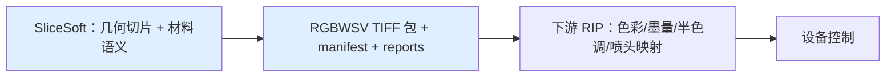

# CLAUDE_K06 关键领域知识

> 证据等级：A=代码/协议事实，P=Claude 说明。本篇是读懂切片与材料所需的基础概念与术语速查。

## 1. 离散化三件套：DPI、层厚、像素间距

切片把连续几何做三重离散化：

```text
Z 方向：按 layerThicknessMm 分层，层采样 z=(i+0.5)*t（体素中心）
XY 方向：按 dpi 转像素，pixelSize=25.4/dpi（dpi 现为区间可配，600 时 = 42.3µm）
每像素：按模型/纹理/填充/支撑/光油策略写六通道材料
```

600 DPI 单像素 ≈ `25.4/600 ≈ 0.04233 mm = 42.33 µm`。层厚、DPI、模型尺寸共同决定：层数、像素数、内存、耗时与细节上限。层厚越薄、DPI 越高 → 越精细但越慢越占内存。

## 2. RGBWSV 六通道语义

| 通道 | 含义 | 典型来源 |
|---|---|---|
| R/G/B | 彩色 / 纹理色 | 顶面 UV 采样、材质漫反射、fallback |
| W | 白墨 / 白色材料 | materialPolicy.white、modelFill white、underbase 打底 |
| S | 支撑材料 | 支撑生成（底投影/孤岛/内腔）|
| V | 光油 / 透明 | surfaceVarnish（表面膜）、outerVarnish（外壳）、policy/profile |

核心问题不只是"哪里有实体"，而是"每个位置用什么材料、是否互斥、是否连续、是否允许空白"——这也是为什么材料闭环、准入、报告这么重（K04）。

## 3. 极性 black_is_print（务必牢记）

```text
printValue = 0     打印/出墨（"黑=打印"）
emptyValue = 255   空/不出墨
背景 background.value = 255（强制）
```

所以配置里 `rgb:[0,0,0]` 是"出黑色/满色打印"，`whiteValue=255` 是"不出白墨"。预览时会做 `visible = 255 - value` 反相以便人眼观看。检测器把 `通道<255` 视为"已打印"。

## 4. 像素总优先级

```text
Model  ＞  OuterVarnish  ＞  Support  ＞  Empty(255)
模型内部再细分： materialRoleMapping ＞ materialPolicy ＞ legacy texture ＞ modelFill/material
（materialProcessProfile 仅报告，不写像素）
```

## 5. 网格拓扑术语（决定能不能 strict 准入）

| 术语 | 含义 | 影响 |
|---|---|---|
| closed mesh（闭合网格）| 每条边恰属两个面、无洞、可定向 | scanline 切片与 strict 准入的前提 |
| boundary edge（边界边）| 只属一个面的边 | 网格有洞/开放；strict 阻断（如 `nai_you_new` boundaryEdges=113）|
| non-manifold edge（非流形边）| 被 >2 个面共享的边 | 拓扑病态；strict 阻断（如 `meigui_fudiao` 10940）|
| self-intersection（自交）| 面之间穿插相交 | confirmed 自交 **fail fast**，不得修前放行 |
| odd intersection rows（奇交点行）| 扫描线某行交点为奇数 | 开放/非流形/退化的体检信号（K02）|

这些正是 12E 真实模型进不了生产写包的底层原因；mesh repair 的目标就是把它们保守修复后重新 strict（见 `ANALYSIS/CLAUDE_03`、`PLANNING/CLAUDE_06` T-20/T-21）。

## 6. UV 与纹理

- **UV**：模型表面到贴图 `[0,1]×[0,1]` 的映射坐标；`04.obj` 每顶点带一组 `vt`。
- **采样**：`nearest`（最近纹素）/`bilinear`（双线性）；`uvAddressMode` `clamp`/`repeat`；`flipV` 处理 V 轴翻转。
- **legacy 限制**：纹理只在 `relief_heightfield` 生效，顶面每列取一次色再按 `applyMode` 铺层；闭合网格上纹理需 `surface_shell_from_sdf`/`global_surface_shell`（K02/K03）。
- **fallback**：缺纹理/无 UV 时按 `missingTexturePolicy` 用 `fallbackRgb` 或材质色，并计数（`fail_fast` 则报错）。

## 7. 支撑为什么存在、SupportType 为什么不进通道

支撑为悬空、底面、内部空腔、可拆区域提供制造支撑。项目把**支撑原因**记为 `SupportType`（InternalVoid/UnsupportedIsland/FullVertical/Upper/Bottom，有优先级），但生产 TIFF 里 **S 通道只有"是否支撑"一个值**——原因信息只存在于报告/调试数据，**绝不能编码进 S 通道取值**（红线）。

## 8. 光油两种语义（别混）

- `surfaceVarnish`：写在**模型表面像素**上的 V（表面膜），分 inner/outer surface。
- `outerVarnish`：模型**外侧**的附加 V 壳层，可能扩张 XY 网格边界，优先级高于支撑。
- 几何目标枚举 `InPlaceTopLayers/AdditiveGrow/CompensatedShrink` 中，`CompensatedShrink` 仅为目标/实验。

## 9. RIP 边界：本项目做到哪



本项目冻结**上游交付契约** `RGBWSV TIFF + manifest + reports`，并用 `rip_reader_test` 严格校验包（结构/schema/通道/位深/极性/存储/层列表）。它**不实现**完整 RIP（色彩变换、墨量限制、半色调、喷头 bitstream、设备通信），也不等于真机可打印。

## 10. 证据分级与"诊断 ≠ 生产"

```text
A 当前代码/CMake/测试/fixture   —— 可作实现依据
B docs/slice 正式目标设计        —— 只证明方向
C 归档/历史/聊天/已完成任务      —— 仅背景
D 废弃/冲突                      —— 仅追溯
```

任何一段 diagnostic/preview/candidate 通过，都**不等于**整条链 production 通过；`manual_repair_required` 不算 pass；strict blocker 不得静默降级；确认自交必须 fail fast。这套纪律是项目最重要的护城河（详见 `BASELINE/CLAUDE_00`）。

## 11. 固定协议常量（红线，改动需独立决策）

```text
schema        = p0.rgbwsv.2
channelOrder  = R G B W S V
bitDepth      = 8 (uint8)
polarity      = black_is_print   printValue=0  emptyValue=255
优先级         Model > Support > Empty（合成层面 Model > OuterVarnish > Support > Empty）
background    = 255
OpenVDB       = 可选、默认 OFF、非普通构建强依赖
```

## 12. 术语速查表

| 术语 | 一句话 |
|---|---|
| GridSpec | 网格规格：像素尺寸、宽高、层数、原点 |
| model_mask | 逐层逐像素的"是否模型"字节图，唯一真源 |
| compose_layer | 逐像素写六通道的合成函数 |
| scanline / relief | 两种几何切片模式（K02）|
| legacy / global_surface_shell | 两种端到端管线模式（K03）|
| applyMode | 纹理如何贴（顶面/整列/band/壳层）|
| materialRoleMapping | 按输入材质名映射到 role（rgb/white/varnish/support）|
| materialPolicy | RGB/白墨/光油的策略化写入 |
| modelFill | 纹理表面下/周围的填充材料 |
| materialProcessProfile | 工艺命名 + 验收，**仅报告** |
| materialClosure | 材料缝隙检测（5 类）+ 保守 1px 修复 |
| SupportType | 支撑成因（只进报告，不进通道）|
| surfaceVarnish / outerVarnish | 表面光油膜 / 外侧光油壳 |
| rip_reader | 包严格校验器（契约级，非真机）|
| strict admission | 拓扑严格准入（自交/非流形/边界边阻断）|

## 13. 延伸阅读

- 流程：`KNOWLEDGE/CLAUDE_K01`；几何模式：`K02`；管线模式：`K03`；材料：`K04`；实战：`K05`。
- 架构与技术债：`ANALYSIS/CLAUDE_02`、`CLAUDE_03`；演进与任务：`PLANNING/CLAUDE_04`、`CLAUDE_06`。
