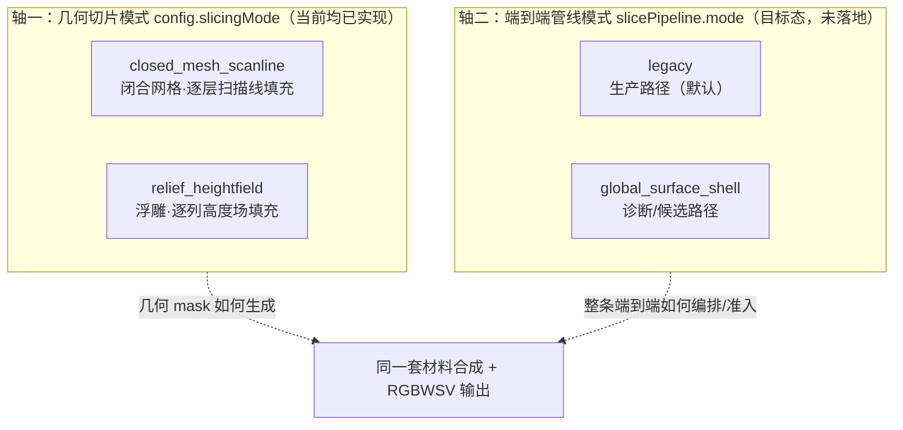

# KNOWLEDGE 切片与材料知识库（Claude）

> 目录位置：`docs/claude/KNOWLEDGE/`。作者：Claude（资深产品 + 高级架构师视角）。基线日期：2026-07-22。
> 定位：**讲清"切片与材料到底怎么工作"的知识库**，与代码实现对齐；随后续咨询持续更新。
> 证据等级：A=代码事实（附 `文件:行` 近似定位，行号可能随改动漂移，以符号名为准）、B=正式目标、P=Claude 判断。

## 0. 这个知识库解决什么

`ANALYSIS/PLANNING/BASELINE/VERIFICATION` 讲的是"项目处于什么状态、该怎么演进"；**KNOWLEDGE 讲的是"当前系统的切片与材料机制本身"**——策略、流程、两种模式、关键领域知识。它面向想真正读懂切片引擎的产品、算法、应用、QA。

内容与你提出的四个问题的对应关系：

| 你的问题 | 对应文档 |
|---|---|
| ① 材料 + 切片各种策略处理方式（完整）| K04（材料）+ K02（几何切片）+ K03（管线）|
| ② 切片各种策略 + 流程（以 `model/obj/meigui_fudiao/04.obj` 为例）| K01（总流程）+ K05（实战示例）|
| ③ 当前切片的"2 种处理方式"及区别（两组轴都讲）| K02（几何模式）+ K03（管线模式）|
| ④ 切片涉及的关键知识 | K06（关键领域知识）|

## 1. 文档索引与阅读顺序

| 序号 | 文档 | 讲什么 |
|---|---|---|
| K01 | [切片总流程与数据流](CLAUDE_K01_切片总流程与数据流.md) | 从 OBJ 到 RGBWSV 包，`run_slice` 各阶段与数据流 |
| K02 | [几何切片模式：scanline 与 relief](CLAUDE_K02_几何切片模式_scanline与relief.md) | closed_mesh_scanline vs relief_heightfield，原理与区别 |
| K03 | [端到端管线模式：legacy 与 global](CLAUDE_K03_端到端管线模式_legacy与global.md) | slicePipeline.mode = legacy vs global_surface_shell，状态机与区别 |
| K04 | [材料策略体系](CLAUDE_K04_材料策略体系.md) | 五套材料意图与优先级、纹理、白墨、光油、支撑、通道合成、闭环修复 |
| K05 | [meigui_fudiao/04.obj 切片实战示例](CLAUDE_K05_meigui_fudiao_04实战示例.md) | 用真实模型 + 真实配置，逐阶段走一遍切片 |
| K06 | [关键领域知识](CLAUDE_K06_关键领域知识.md) | DPI/层厚/像素间距、RGBWSV、极性、拓扑、UV、支撑成因、术语表 |

推荐路线：

- **先建立全局**：K06（术语）→ K01（流程）→ K05（示例）；
- **懂两种"模式"**：K02（几何轴）+ K03（管线轴）——注意这是**两条正交的轴**，别混淆；
- **专攻材料**：K04。

## 2. 两条容易混淆的"模式轴"（务必先看）

项目里"切片的处理方式"其实分属**两条正交的轴**，不是一回事：

- **轴一（几何切片模式）**决定"模型 mask 怎么算"：闭合网格用扫描线，浮雕用高度场。二者**现在都能跑**，由 `config.slicingMode` 选。详见 K02。
- **轴二（端到端管线模式）**决定"整条生产路径怎么走"：legacy 是当前唯一生产路径；global_surface_shell 是诊断/目标双模式，`config.h` 尚无 `slicePipeline.mode` 字段。详见 K03。
- 二者正交：legacy 管线内部既可用 scanline 也可用 relief；global 是另一条独立候选管线。**"我用 relief 切浮雕"和"我走 legacy 还是 global"是两个独立选择。**

## 3. 命名与更新约定

- 本知识库文件命名：`CLAUDE_K<两位序号>_<中文主题>.md`（`K` = KNOWLEDGE 系列，与 `ANALYSIS` 的 `CLAUDE_0X` 序列区分）。
- 后续新增知识主题依次用 K07、K08…；大主题可拆子文件并在本 README 索引登记。
- 每次更新：先改对应 Kxx 与本 README 索引；涉及事实变化的，标注日期并尽量给出 `文件:符号` 定位。
- 与代码冲突时**以代码为准**，回头修订本库；行号为近似，符号名（函数/结构名）更稳。
