# CLAUDE_04 中长期路线图与演进计划

> 证据等级：A=代码事实，B=正式目标，P=Claude 建议。目录位置：`docs/claude/PLANNING/`。
> 本篇是"从当前原型到正式 Host Software"的演进主张，须与 `docs/slice/ROADMAP/*` 正式路线对齐；冲突时以正式 ROADMAP 与用户授权为准。

## 1. 演进原则（P，承接项目既有纪律）

1. **不做"一次性大重构"。** 按明确 PRD/Decision/阶段 Gate、可回退的小任务推进（教程 15 §6 已明确要求）。
2. **legacy 永远保留可回退证据。** 任何替换/并行都要有 legacy 回退与不变量证据。
3. **每一步都有验证门。** 复用 `.agents/docs/build-and-test.md`：`cmake --build`→`run_ci_quick.ps1`→`--self-test`（改 UI 加 overlay smoke），生产路径加 full 回归 + RIP strict + 真实模型。
4. **红线不碰。** `p0.rgbwsv.2`/`R G B W S V`/`uint8`/`black_is_print`/OpenVDB 默认 OFF/禁止静默回退/confirmed self-intersection fail fast。
5. **诊断 ≠ 生产。** 任何一段 diagnostic PASS 不代表整链 production PASS。

## 2. 三阶段总览（P）

```mermaid
flowchart LR
  subgraph N["近期 0–1 季度：打通与收口"]
    N1["管线拆解 S0–S3<br/>(D-01/02/03 根债)"]
    N2["模型资产治理<br/>(重建/修复流程 + 入库标准)"]
    N3["双模式 Router + 共享 writer S4/S5<br/>-> 12E-08D 收口"]
    N4["低风险清债<br/>(D-05/06/12/13)"]
  end
  subgraph M["中期 1–3 季度：可投产 + 产品雏形"]
    M1["12F 性能预算冻结 R1–R5"]
    M2["作业/项目管理<br/>队列/取消/恢复"]
    M3["设备 & 材料 Profile 生命周期"]
    M4["输入资产质量 + 人工修复闭环"]
  end
  subgraph L["长期 3+ 季度：正式 Host Software"]
    L1["与 RIP/设备团队独立接口 + 真机验收"]
    L2["可观测性/日志/崩溃恢复/升级"]
    L3["安全/权限/审计/客户资产保护"]
    L4["多模型排版 + 增量重算 + 缓存"]
    L5["输出版本化兼容与下游交付"]
  end
  N --> M --> L
```



## 3. 近期（0–1 季度）：把主干打通并收口双模式

**目标（P）**：还清根债（D-01/02/03），让 12E-08D 具备"结构上可接入"的前提，同时完成模型资产治理，为真实模型准入创造条件。

| 工作项 | 依赖 | 出口门（验证）| 关联 |
|---|---|---|---|
| 管线观测 wrapper + 步骤 DTO（S0/S1）| 无 | 30 层 TIFF SHA-256 不变 + RIP strict；每步 DTO 单测 | 02 §5.2、06 P1 |
| 迁移非热点步（S2）| S1 | 每步 legacy 回归 TIFF hash 不变 | 06 P1 |
| 迁移热点步（S3：几何/支撑/合成）| S2 | 可复现历史剖面；channel-hash 不变 | 02 §3、12F 前置 |
| 模型资产治理流程 | 无（可并行）| 3 必需 OBJ 产出"外部修复/审计"版本并 strict-PASS | 03 §2 |
| 双模式 Router + 共享 writer（S4/S5）| S3 + 资产治理 | 缺省=legacy 100% 不变；global fail-closed；共享 writer 双模式 RIP 通过 | 02 §4/§5 |
| 12E-08D 生产写包收口 | 上述全部 + **用户显式授权** | 四例 strict/global 闭包 + Release 预算冻结 + Quick CI 基线解决 | 03 §2 |
| 低风险清债 | 无 | 常量单一真源；仓库瘦身；D-13 转绿或豁免 | 03 §3 |

> **关键排序判断（P）**：管线拆解（S0–S3）与模型资产治理**可并行**，二者是 08D 的两个独立前置；Router/共享 writer（S4/S5）依赖 S3；08D 收口依赖两条前置**全部**完成 + 授权。不要在 S3 完成前赶 08D，否则极易复制第二套 TIFF 协议（架构风险，见 02 §7）。

## 4. 中期（1–3 季度）：性能冻结 + 产品雏形

### 4.1 12F 性能预算（B → 落地）

正式 `PRD_12F` 已定义 Release core-only 度量口径与热点（A/B）：

```text
度量：modelLoadMs（独立）| sliceProcessingMs（grid+mask+texture+support+layer）| outputWriteMs | totalMs
热点：supportGenerationMs≈2801.9 + layerComposeMs≈1595.7（meigui_fudiao 历史 Release 剖面）
```

建议顺序（B 的 R1–R5，P 补充打法）：先 `Release benchmark` 冻结基线 → `support generation` → `layer compose` → `relief occupancy provider` → `incremental slicing / preview I/O`。**每项优化先 profile、再 wrapper/adaptor、保留 legacy 回退**，并以 `grid/modelPixels/supportPixels/channel-hash 不变`为硬门（`PRD_12F` §验收）。管线拆解（S3）为此提供了独立计时/替换点，故 12F 应排在近期 S3 之后。

### 4.2 作业 / 项目管理（P，新建产品能力）

从"单次 CLI/UI 运行"走向"作业"：任务队列、优先级、取消、失败恢复、断点续跑、批处理。建议以 02 §5.3 的 `SliceEntryFacade` 为承载，先在 CLI/UI 之上加一层 **JobService**（core 内、无 Qt），把"进度协议雏形"（`SLICE_PROGRESS`）升级为结构化作业事件。

### 4.3 设备 & 材料 Profile 生命周期（P）

当前 `MaterialProcessProfile`（A）是"配置内的一段"，尚无"Profile 作为一等资产"的生命周期（创建/版本/校验/复用/迁移）。建议建立 **ProfileRegistry**：设备 Profile（DPI/层厚/通道能力/边界）与材料工艺 Profile（RGB/W/S/V 语义与覆盖）分离、可版本化、可被作业引用。

### 4.4 输入资产质量 + 人工修复闭环（P）

03 §2 显示 7/15 资产需重建、1 需人工修复。建议把"预检 → 分级（PASS/人工修复/重建）→ 修复/重建 → 复检 → 入库"固化为**资产治理工作流**，并与 mesh repair（保守、可审计、post-strict）对接。**红线**：`manual_repair_required` 不得计入 production pass。

## 5. 长期（3+ 季度）：正式 Host Software

对齐教程 15 §6 的产品级方向，Claude 补充结构与顺序：

| 方向 | 内容 | 说明（P）|
|---|---|---|
| RIP/设备接口 + 真机验收 | 与下游团队建立**独立接口**、层顺序/通道语义/兼容性契约、真机闭环 | 项目边界当前止于交付契约；此为跨团队工程，需独立立项与真机证据（L6 证据级）|
| 可观测性 / 运维 | 结构化日志、指标、崩溃恢复、安装/升级、诊断包导出 | 支撑生产环境长期运行 |
| 安全 / 权限 / 审计 | 客户资产保护、访问控制、操作审计 | 商用 Host Software 的合规前提 |
| 多模型排版 + 增量重算 + 缓存 | 超越"自动朝向"的真正排版/碰撞/嵌套；参数变更增量重算 | 依赖近期管线拆解带来的 step 边界 |
| 输出版本化兼容 | 多版本包兼容/迁移、向后兼容策略 | 填补 D-15 空白 |

## 6. 关键决策点（Gate）与授权（P）

以下节点必须**停下来取得用户显式确认**（与 `.agents/AGENTS.md §7` "大改动先确认"一致）：

```text
G1  正式引入 slicePipeline.mode 字段与 Router（改动公共配置与入口）
G2  12E-08D 生产写包接入（需修复输入 + 四例闭包 + 预算冻结 + Quick CI 基线 + 授权）
G3  冻结 Release 性能预算阈值（thresholdsFrozen=true 之前）
G4  任何触碰 p0.rgbwsv.2 / 通道 / 位深 / 极性 的改动（需独立 Decision + 完整迁移）
G5  将 OpenVDB 从可选变为默认/强依赖（默认不允许；如需必须独立决策）
G6  作业/设备/材料 Profile 等新增产品面的 PRD 立项
```

## 7. 里程碑与验证门映射（P）

| 里程碑 | 完成定义（DoD）| 主验证门 |
|---|---|---|
| M-A 管线可组合 | 14 步为独立 step，legacy 由 step 组合而成 | full 回归 + 30 层 TIFF SHA-256 不变 + RIP strict |
| M-B 资产可准入 | 3 必需 OBJ 有审计过的 strict-PASS 版本 | strict admission + 四例 global 闭包 |
| M-C 双模式投产 | global_surface_shell 经 admission 复用共享 writer | 双模式 RIP strict + 预算冻结 + 授权(G2) |
| M-D 性能达标 | 12F 阈值冻结且优化不破坏不变量 | Release benchmark + channel-hash 不变(G3) |
| M-E 产品雏形 | JobService + ProfileRegistry + 资产治理工作流上线 | 端到端作业 smoke + Profile 校验用例 |
| M-F 正式产品 | RIP 接口 + 真机验收 + 运维/安全/交付 | L6 真机证据 + 运维/安全验收 |

## 8. 小结（P）

演进主线是清晰的：**近期还根债并收口双模式（结构问题）→ 中期冻结性能并长出产品雏形（可投产）→ 长期建接口/运维/安全并真机闭环（正式产品）**。所有阶段都应挂在"小任务 + 明确 Gate + 可回退 + 生产 TIFF 不变"的既有纪律上。近期最高杠杆动作只有一个：**把 `slicer.cpp` 单体安全地拆成可组合的 14 步管线**——它同时解锁双模式、性能、增量与产品化编排。
