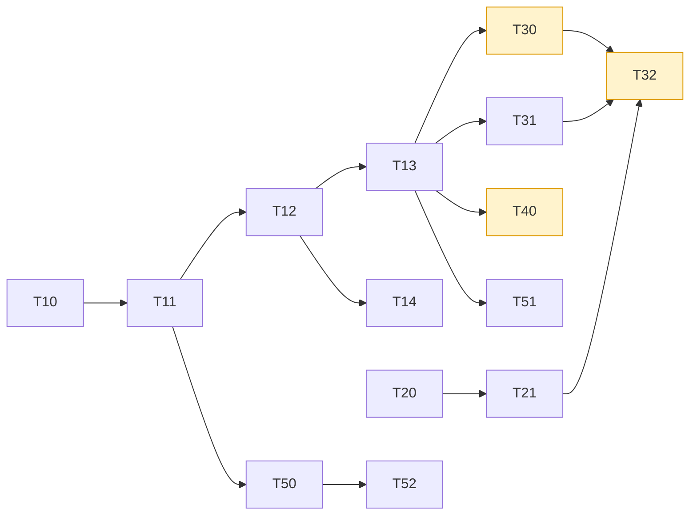
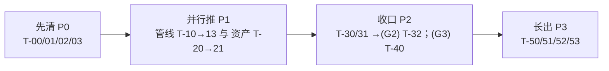

# CLAUDE_06 重构与迁移任务底稿（Backlog + 迁移剧本）

> 证据等级：本篇为 **P 级（Claude 建议）**，是可执行的任务底稿，供后续在 Claude / codex 中逐项推进。目录位置：`docs/claude/PLANNING/`。
> 执行前必须：`git branch --show-current` + `git status --short`，遵循 `.agents/AGENTS.md §7` 实现计划模板与 §8 验证门；大改动先取用户授权（Gate 见 04 §6）。

## 1. 如何使用本底稿

- 每个任务卡是**最小可回退单元**，带明确出口门与回退方式；
- 优先级：**P0 立即可做（低风险）→ P1 根债（高杠杆）→ P2 收口（需授权）→ P3 产品雏形**；
- 依赖用 `←` 表示"依赖于"；标 `【授权】` 的任务须先过对应 Gate；
- 后续在 Claude 中推进时，把任务卡内容套进 `.agents` 的实现计划模板（§4 给出样例），逐卡执行、逐卡验证、逐卡提交。

## 2. Backlog 看板（P）

| ID | 任务 | 优先级 | 依赖 | 出口门 | 回退 | 规模 |
|---|---|:--:|---|---|---|:--:|
| T-00 | 协议常量单一真源 `RgbwsvProtocol.h` | P0 | — | 抽常量后生产 TIFF 逐字节不变 + RIP strict | 还原头文件引用 | S |
| T-01 | 仓库瘦身（构建产物出库）| P0 | — | 瘦身后完整 CI 仍绿 | git 恢复 `.gitignore` | S–M |
| T-02 | `material/` 合并入 `materials/` | P0 | — | 编译 + 全单测通过 | 还原目录/include | M |
| T-03 | Quick CI 已知红基线定位（widthPx 48 vs 226）| P0 | — | 转绿或显式豁免文档 | 保持记录基线 | S–M |
| T-10 | 管线 S0：14 步观测 wrapper | P1 | — | 30 层 TIFF SHA-256 不变 + RIP strict | 移除 wrapper 记录 | M |
| T-11 | 管线 S1：`SliceStepContext` 与 step DTO | P1 | ← T-10 | 每步 DTO 单测；行为不变 | DTO 仅新增不接线 | M |
| T-12 | 管线 S2：迁移非热点步 | P1 | ← T-11 | 每步 legacy 回归 TIFF hash 不变 | 逐步回退单步 | M |
| T-13 | 管线 S3：迁移热点步（几何/支撑/合成）| P1 | ← T-12 | channel-hash 不变 + 可复现历史剖面 | 逐步回退单步 | L |
| T-14 | `importers/` 真正拥有解析，`model.cpp` 收缩 | P1 | ← T-12 | importer fixture + 旧格式回归 | 保留 `model.cpp` 入口 | M |
| T-20 | 模型资产治理工作流 + 3 必需 OBJ 审计修复 | P1(并行) | — | 3 OBJ strict-PASS（审计版）| 维持诊断-only | L |
| T-21 | mesh repair 分级链 `preflight→eligibility→conservative→post-strict→evidence` | P1 | ← T-20 | 修复后 strict 通过；`manual_repair_required≠pass` | 保守 OFF 回退 | L |
| T-30 | 引入 `slicePipeline.mode` + Router 【授权 G1】 | P2 | ← T-13 | 缺省=legacy 100% 不变；global fail-closed | 移除字段与 Router | M |
| T-31 | 抽共享 `RgbwsvPackageWriter`，两模式复用 | P2 | ← T-13, T-00 | 不复制第二套协议；双模式 RIP strict | 还原 writer 调用 | M |
| T-32 | 12E-08D 双模式生产写包收口 【授权 G2】 | P2 | ← T-30,T-31,T-20,T-21 | 四例闭包 + 预算冻结 + Quick CI 基线 | global 退回 diagnostic | L |
| T-40 | 12F 性能预算冻结 + support/compose 优化 【授权 G3】 | P2 | ← T-13 | 阈值冻结；优化不破坏不变量 | 关优化走 legacy 路径 | L |
| T-50 | `EffectiveConfig` 归一 + 材料意图优先级 | P3 | ← T-11 | effective golden；UI=core 一致 | 保留旧解析路径 | M |
| T-51 | `SliceEntryFacade` → `JobService`（作业化）| P3 | ← T-13 | 端到端作业 smoke | 退回单次运行 | L |
| T-52 | `ProfileRegistry`（设备/材料 Profile 生命周期）| P3 | ← T-50 | Profile 校验用例 | 退回配置内 profile | L |
| T-53 | UI god file 拆分（runner/case、window/panel）| P3 | — | `--self-test` + smoke 通过 | 分支回退 | M |

依赖关系图：



## 3. 迁移剧本：把 `slicer.cpp` 单体拆成 14 步管线（T-10 → T-13）

这是本底稿的核心，也是全项目最高杠杆的工程。总原则：**行为零漂移，生产 TIFF 逐字节不变，每步可回退。**

### 3.1 安全底线（贯穿全程）

```powershell
# 每次迁移后必跑（Debug）
cmake --build build --config Debug
.\scripts\run_ci_quick.ps1
# 生产不变性硬门（30 层 TIFF SHA-256 + RIP strict）
.\scripts\run_material_closure_tests.ps1 -Mode RepairDisabled
```

- **不变量**：`grid / modelPixels / supportPixels / channel-hash / 30 层 TIFF SHA-256` 全部不变；
- 任一门失败即回退当前单步，不进入下一步；
- 提交粒度 = 一步一提交，commit message 标注"行为不变、门通过"。

### 3.2 S0 观测 wrapper（T-10）

目的：在**不改逻辑**前提下，为 14 个概念步骤建立可观测边界。

做法：在 `run_slicer()` 内每个逻辑段前后插入轻量记录（step 名、进入、耗时、产物摘要如像素数/层数/通道 hash），产物写入 `SliceRunTelemetry`。不改变任何计算与写出。

出口门：`run_ci_quick` 绿；30 层 TIFF SHA-256 不变；telemetry 报告出现 14 步计时。

### 3.3 S1 步骤上下文与 DTO（T-11）

目的：定义可承载状态的 `SliceStepContext`，替代散落的单体内联结构。

```text
struct SliceStepContext {
  const SliceConfig& config;        // 只读配置
  EffectiveConfig    effective;     // 归一后（T-50 前可先放最小子集）
  SceneModel         scene;         // 导入后
  GridSpec           grid;          // 网格
  LayerMasks         masks;         // model/support/varnish/texture 语义 mask
  ComposeStats       stats;         // 语义统计
  RunDiagnostics     diag;          // ValidationIssue 汇总
};
```

做法：先**只定义并单测 DTO**，不接线到主流程；为每步定义 `StepInput/StepOutput` 契约与不变量。

出口门：DTO 单测通过；主流程行为不变（DTO 尚未接线）。

### 3.4 S2 迁移非热点步（T-12）

顺序（低风险优先）：`LoadConfig → ValidateConfig → LoadInputScene → NormalizeScene → ResolveMaterials → WriteReports → ValidatePackage`。

做法：把 `run_slicer()` 中对应段落**原样搬**到独立 step 函数，输入输出走 `SliceStepContext`；`run_slicer()` 改为按序调用这些 step（此时几何/支撑/合成仍是单体内联）。

出口门：每迁一步跑 legacy 回归，TIFF hash 不变；`ValidatePackage` step 与 `rip_reader` 结果一致。

### 3.5 S3 迁移热点步（T-13）

顺序：`SliceGeometry → GenerateSupport → ComposeMaterialChannels`（并把 `PrepareTextureSources / ApplyTextureApplicationPolicy / PrepareVarnishGeometryPolicy / WriteRGBWSVPackage` 一并 step 化）。

做法：迁移时**复用已有一等模块**（`support/`、`raster/`、`material(s)/`、`geometry/`），删除 `slicer.cpp` 内对应匿名 ns 结构（消除 D-03 重复）。`ComposeMaterialChannels` 复用 `MaterialChannelComposer`；`GenerateSupport` 暴露独立计时点（为 T-40 铺路）。

出口门：`channel-hash` 与 30 层 TIFF SHA-256 不变；`support_shape`/`material_closure`/`texture_fill_partition` 全套单测绿；能复现历史 Release 剖面（`supportGenerationMs`/`layerComposeMs` 量级一致）。

### 3.6 完成态

`RunSlicePipelineLegacy()` 从"预检门 + 单次 `run_slicer()`"变为"预检门 + 顺序执行 14 个 step"；`slicer.cpp` 大幅收缩为薄编排 + 遗留细节；双模式（T-30）、性能（T-40）、增量重算获得插入点。

## 4. 任务卡样例（套用 `.agents/AGENTS.md §7` 模板）

> 说明：以下表头（`### Problem Type` 等）逐字复刻 `.agents/AGENTS.md §7` 的强制格式，以便直接套用到项目工作流，故保留英文；表头后的内容用中文填写。

### T-00 协议常量单一真源（可直接执行）

```markdown
## Implementation Plan
### Problem Type        输出/协议一致性（技术债 D-05/06）
### Layer(s) Involved   output/rgbwsv, tiff_io, rip_reader, apps(cli/ui)
### Official Documents   .agents/AGENTS.md §5（协议红线、常量集中）
### Historical Documents docs/tutorials/10_输出包报告与RIP验证.md
### Current Code Reality tiff_io.h 定义 rgbwsv_channel_count=6；rip_reader.h 重复硬编码
                         {"R","G","B","W","S","V"}；SLICE_PROGRESS 在 cli/main.cpp:289 与
                         SliceProgressProtocolParser.cpp:9 双处硬编码
### Current State        常量分散，存在漂移风险
### Target State         新增 output/rgbwsv/RgbwsvProtocol.h 为单一真源，全部引用它
### Historical State     协议随阶段冻结，历史上各处独立硬编码
### Pending Confirmation 无（不改协议取值，仅集中定义）
### Risk Points          误改取值 -> 生产 TIFF 变化（用 SHA-256 门拦截）
### Files To Change      新增 RgbwsvProtocol.h；改 tiff_io.*/rip_reader.*/cli/ui 引用
### Verification Plan    cmake build + run_ci_quick + RepairDisabled(SHA-256) + rip_reader_test
```

### T-10 管线观测 wrapper（可直接执行）

```markdown
## Implementation Plan
### Problem Type        架构/可观测（根债 D-01 的 S0）
### Layer(s) Involved   pipeline, slicer(core)
### Official Documents   docs/slice/DOC_DECISION_12E_双切片模式；.agents §6（wrap first）
### Current Code Reality SlicePipeline.cpp:45 整体调用 run_slicer()；14 步仅字符串
### Target State         run_slicer() 内 14 段落被观测 wrapper 包裹，行为不变，产出 telemetry
### Pending Confirmation 无（不改行为）
### Risk Points          插桩误改控制流（保持纯记录、无副作用）
### Files To Change      slicer.cpp（插桩）、SliceRunTelemetry.h（扩展字段）
### Verification Plan    cmake build + run_ci_quick + RepairDisabled(SHA-256 不变)
```

## 5. 全局验证门与安全网（P）

| 场景 | 最低验证（沿用 `13_测试体系` / `.agents §8`）|
|---|---|
| 纯常量/整洁重构 | build + `run_ci_quick.ps1` + `RepairDisabled` SHA-256 不变 |
| 管线单步迁移 | 上 + 对应模块单测 + legacy full 回归 + RIP strict |
| 引入 Router/字段 | 上 + 缺省=legacy 100% 不变用例 + global fail-closed 负向用例 |
| 生产写包（08D）| full build + CTest + quick/full 回归 + RIP + 四例闭包 + Release 预算 + 真实模型 |
| 性能优化 | Release benchmark + `grid/modelPixels/supportPixels/channel-hash` 不变 |
| UI 改动 | `slicer_debug_ui --self-test` + `overlay-load-real` smoke |

**安全网口令（每卡完成时自检）**：
1. 是否把目标态冒充当前态？2. 是否破坏固定协议？3. 是否出现反向依赖？4. 是否静默 fallback？5. 是否丢失 UV/材质/单位/layerIndex？6. 是否把 diagnostic 当 production？7. 是否只测 happy path？8. 是否在热路径引入二次复杂度/频繁分配？9. 是否覆盖用户未提交改动？10. 是否陈述**实际**验证结果而非推测？

## 6. 推进节奏建议（P）



先用 P0 建立"低风险高回报"的信任与整洁基线；再以 P1 还根债（管线拆解与资产治理并行）；P2 在授权下收口双模式与性能；P3 长出产品雏形。全程保持"小步、可回退、生产 TIFF 不变"。
