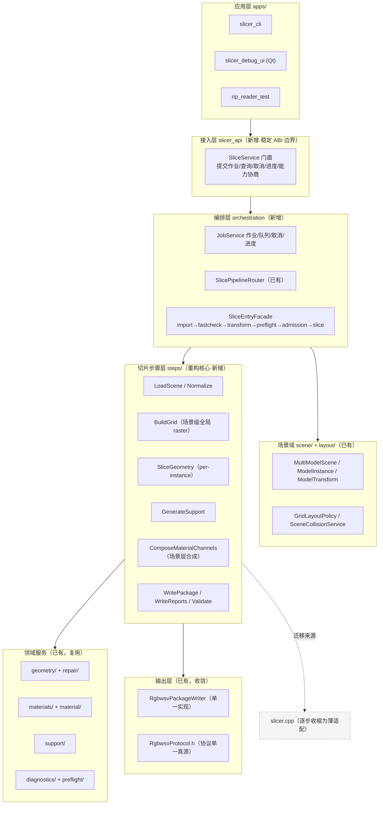
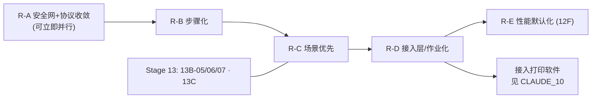

# CLAUDE_09 重构方案与目标架构（供审核）

> 目录位置：`docs/claude/PLANNING/`。日期：2026-07-27。基线含 Stage 13 与双模式落地（见 `VERIFICATION/CLAUDE_08`）。
> 证据等级：A=代码事实，B=正式目标，P=Claude 方案。**本篇是待审核方案，不是已批准计划。**

## 1. 结论：需要重构，但不是"推倒重来"

**判断（P）：需要，且时机就是现在——但必须是"绞杀式渐进重构（strangler-fig）"，不是重写。**

三条理由：

1. **结构债正在被新功能放大。** 双模式、场景、排版、TIFF 预览这些新能力都是**在 `slicer.cpp` 单体旁边新增模块**长出来的（A：`run_slicer()` 仍在 slicer.cpp:3964）。新子系统边界清晰，但**生产执行体仍是单体**，于是每加一条能力就要在单体里再开一个分支或再复制一份内联结构。
2. **Stage 13 的联合切片会成为压垮点。** 13B-05/06 要做"全局 XY raster + 逐实例材料/支撑层映射 + 场景层合成 + 单一 package"。单模型时代的 `run_slicer(configPath)` 签名与"一个模型一套 mask"的内部假设，**无法自然承载 N 个实例**。若不先重构，只能在 4800 行里塞实例循环——这会让后续每一轮开发都更贵。
3. **性能默认化需要可替换的步骤边界。** Global 目前慢 4.09–5.92×、内存 8.19–8.74×（A）。要把它优化到能做默认，必须能对"几何/支撑/合成"逐段计时、缓存、并行、替换——而这些今天都埋在单体里。12F-02..09 全部 NOT ACTIVE 也正卡在这。

**但不能重写**，因为项目最宝贵的资产恰恰是单体里那些经过 golden/RIP/真实模型验证过的行为细节。重写必然丢失这些不可见的正确性。

## 2. 重构原则（红线内）

```text
1. 行为零漂移      每步以"生产 TIFF 逐字节不变 + RIP strict"为硬门
2. 绞杀式推进      新架构在旁边长出，旧路径逐步失去调用者，最后才删
3. 单向依赖        新模块不得反向依赖 slicer.cpp
4. 一步一回退      每个 PR 独立可回退，禁止长命分支大爆炸
5. 协议不动        p0.rgbwsv.2 / R G B W S V / uint8 / black_is_print 不变
6. 默认不变        legacy 默认、OpenVDB 默认 OFF、禁止静默回退
7. 先合同后实现    每层先定 DTO/错误码/不变量，再迁移逻辑
```

## 3. 目标架构（P）

### 3.1 分层总图



### 3.2 关键设计决策（P）

**① 引入 `steps/` 层，把 14 步做成一等公民**

```cpp
// 统一步骤契约（示意）
struct SliceStepContext {            // 可变状态容器（场景级）
    const SliceConfig&      config;
    const SceneEffectiveConfig& sceneEffective;
    MultiModelScene         scene;        // 1..N 实例
    GridSpec                grid;         // 场景级全局 XY raster
    PerInstance<LayerMasks> instanceMasks;// 逐实例语义 mask
    SceneLayerBuffers       layers;       // 场景层合成结果
    ComposeStats            stats;
    RunDiagnostics          diag;
};

class ISliceStep {                   // 每步可独立测试/计时/替换/缓存
public:
    virtual ~ISliceStep() = default;
    virtual std::string_view Name() const noexcept = 0;
    virtual StepResult Run(SliceStepContext& ctx) = 0;   // 稳定错误码，不吞错
};
```

理由：一次性解决四个问题——可测（每步单测）、可剖析（每步计时，12F 前置）、可替换（Global/优化实现换步）、可增量（按步缓存失效）。

**② 数据模型从"单模型"升为"场景优先"（scene-first）**

单模型 = 只有一个实例的场景。这样 Stage 13 联合切片不再是特例，而是通用路径；旧单模型入口降级为便捷包装。这是本次重构**最重要的语义收敛**。

**③ 网格分两层：场景级全局 raster + 实例级局部映射**

```text
SceneGrid   ：全局 XY 原点/尺寸/DPI/层序（幅面级，唯一）
InstanceView：实例在 SceneGrid 中的偏移与裁剪窗口
```

逐实例只在自己的窗口内算 mask，再映射到 SceneGrid 合成。这既是 13B-05 的需求，也天然带来内存与并行收益（每实例窗口远小于整幅）。

**④ 输出收敛为单一 writer + 协议单一真源**

`RgbwsvPackageWriter` 唯一实现，legacy/global/scene 三条路径共用；`RgbwsvProtocol.h` 集中通道顺序/位深/极性/schema/进度令牌（还 D-05/D-06）。

**⑤ 显式的能力协商（capability）**

为后续接入打印软件（见 `CLAUDE_10`）预留：`QueryCapabilities()` 返回支持的 DPI 区间、通道、模式、最大实例数、协议版本。避免宿主端硬编码假设。

### 3.3 目标目录结构（P）

```text
src/slicer_core/
├─ api/          SliceService 门面 + DTO + 稳定错误码（对外唯一入口）
├─ orchestration/ JobService / SliceEntryFacade / SlicePipelineRouter
├─ steps/        14 步实现（每步一文件 + 单测）
├─ scene/        场景与实例（已有，扩展）
├─ layout/       排版与碰撞（已有）
├─ geometry/     几何与 repair（已有）
├─ materials/    材料策略（合并 material/，见 D-08）
├─ support/      支撑（已有）
├─ diagnostics/  诊断与准入（已有）
├─ preflight/    预检（已有）
├─ raster/       栅格映射（扩展：场景级映射）
├─ output/       writer + RgbwsvProtocol.h（协议真源）
├─ reports/      报告（收敛序列化栈）
└─ legacy/       slicer.cpp（隔离，逐步收缩至删除）
```

## 4. 分阶段重构路线（P）

> 每阶段结束都必须：`cmake --build` → `run_ci_quick.ps1` → `RepairDisabled` SHA-256 不变 → RIP strict → UI self-test。

### R-A 安全网与协议收敛（先做，零行为变更）

| 任务 | 内容 | 出口门 |
|---|---|---|
| A-1 | 新增 `output/rgbwsv/RgbwsvProtocol.h` 协议真源，改造 writer/reader/CLI/UI 引用 | TIFF 逐字节不变 |
| A-2 | 建立**场景级黄金基线**：为 1 实例与 N 实例各固化 TIFF SHA-256 + 报告投影 | 基线可复现 |
| A-3 | `material/` 并入 `materials/`；仓库瘦身（构建产物出库）| 全测试通过 |
| A-4 | 定位并转绿 Quick CI 已知红基线（`material_process_top2 widthPx 48 vs 226`）| CI 全绿或显式豁免 |

**价值**：把"行为不变"变成可自动验证的事实，后续所有迁移才敢动手。

### R-B 步骤化（绞杀单体，核心）

| 任务 | 内容 | 出口门 |
|---|---|---|
| B-1 | 定义 `ISliceStep` + `SliceStepContext` + `StepResult`（仅合同，不接线）| DTO 单测 |
| B-2 | 在 `run_slicer()` 内为 14 段加**观测 wrapper**（纯记录）| 每步计时可见，TIFF 不变 |
| B-3 | 迁移**非热点步**：LoadConfig/Validate/LoadScene/Normalize/ResolveMaterials/WriteReports/ValidatePackage | 每步单测 + TIFF 不变 |
| B-4 | 迁移**热点步**：SliceGeometry / GenerateSupport / ComposeMaterialChannels，复用 `support/ materials/ geometry/` 一等模块并**删除单体内联结构**（还 D-03）| channel-hash 不变 + 可复现历史剖面 |
| B-5 | `run_slicer()` 改为"按序执行 14 个 step"的薄编排，移入 `legacy/` | 全回归通过 |

### R-C 场景优先（承接 Stage 13）

| 任务 | 内容 | 出口门 |
|---|---|---|
| C-1 | `SliceStepContext` 升为场景级；单模型转为"1 实例场景" | 单模型行为 100% 不变 |
| C-2 | 网格分层：`SceneGrid` + `InstanceView`；实例窗口化计算 | 与 13B-05 fixture 一致 |
| C-3 | 场景层合成：逐实例 mask → 全局 raster → 单一 package + scene report | 13B-06 出口门 |
| C-4 | 逐实例准入与 fail-closed（碰撞/幅面/profile 不一致）| 负向用例齐备 |

> C 系列应与 13B-05/06 **同一节奏推进**，避免"先在单体里塞实例循环、再回头重构"。

### R-D 接入层与作业化（为打印软件集成铺路）

| 任务 | 内容 | 出口门 |
|---|---|---|
| D-1 | `api/SliceService` 门面 + 稳定 DTO/错误码 + `QueryCapabilities` | CLI/UI 均改走门面 |
| D-2 | `JobService`：提交/查询/取消/进度事件（core 内、无 Qt）| 端到端作业 smoke |
| D-3 | 结构化进度事件替代字符串令牌（保留 CLI 文本兼容）| UI/CLI 双通 |
| D-4 | 打包为可复用库边界（见 `CLAUDE_10` 的 DLL 方案）| 宿主可集成 |

### R-E 性能默认化（解锁 12F）

| 任务 | 内容 | 出口门 |
|---|---|---|
| E-1 | 12F-02 Release benchmark 在新步骤边界上重建基线并冻结 | 阈值冻结（G3）|
| E-2 | 逐项优化：支撑统计扫描融合 / bottom projection range / layer compose 融合 / relief occupancy | 每项独立 profile 证据 + 不变量 |
| E-3 | 实例级并行 + 窗口化内存优化（Global 内存 8.19–8.74× 的主攻方向）| 内存/耗时达标 |
| E-4 | 按步增量缓存（参数微调只重算受影响步）| 交互延迟达标 |

## 5. 扩展性设计（面向后续多轮开发）

这是你特别关心的一点。目标架构通过五个"扩展点"保证后续加功能不再动核心（P）：

| 扩展点 | 怎么扩 | 未来场景举例 |
|---|---|---|
| **新增切片步骤** | 实现 `ISliceStep` 并注册进管线序列 | 增加"跨模型联合支撑"、"色彩管理预处理" |
| **新增管线模式** | 扩 `SlicePipelineMode` + Router 分支 + 独立步骤组合 | 第三条端到端模式（若产品需要）|
| **新增几何后端** | 在 `SliceGeometry` 步后面挂可选后端接口 | OpenVDB / GPU / 第三方内核 |
| **新增材料语义** | 在 `materials/` 加 policy/composer，不动 writer | TCWS（12G，当前冻结）、CMYK 角色 |
| **新增输出协议版本** | `RgbwsvProtocol` 版本化 + writer 适配器 | `p0.rgbwsv.3`（需 G4 授权）|

另外三条工程约束保障长期可维护（P）：

1. **单文件上限**：新代码单文件 ≤ 500 行，超出即拆——防止再长出第二个 `slicer.cpp`；
2. **依赖方向自动化检查**：加一条 CI 规则禁止 `steps/ → legacy/` 反向依赖与 core 引入 Qt；
3. **每步必须有负向测试**：新步骤合并前需有 fail-closed 用例，防止"只测 happy path"。

## 6. 风险与缓解（P）

| 风险 | 缓解 |
|---|---|
| 迁移引入行为漂移 | 场景级 golden + TIFF SHA-256 硬门；一步一提交 |
| 与 Stage 13 开发冲突 | R-C 与 13B-05/06 同节奏；同一文件所有权按任务划分 |
| 重构占用产品排期 | R-A/R-B 可与 13B 并行（触及文件不同）；R-C 才需对齐 |
| 场景化后单模型回归 | "单模型=1 实例场景"必须有专门等价性用例 |
| 步骤化带来性能损耗 | 步骤边界用引用传递、避免拷贝；E-1 基线验证 |
| 单体删除过早 | 保留 `legacy/` 直到全部调用者迁完且两轮回归通过 |

## 7. 建议排期与与现有专项的关系（P）



- **R-A 立刻可做**，不与 13B-05 冲突（改的是输出协议常量与测试基线）。
- **R-B 与 13B-05 fixture 并行**，注意 `slicer.cpp` 的写入冲突：建议 13B-05 的联合合成**直接写成 step**，而不是塞进单体——这样 R-B/R-C 与 Stage 13 是同一件事，而非两件事。
- **R-D 完成后**才具备干净的集成边界，是接入打印软件的前置。
- **R-E 最后**，因为它需要步骤边界与冻结基线。

## 8. 需要你决策的 Gate（P）

```text
G-A 批准 R-A（零行为变更，风险最低，建议先批）
G-B 批准 R-B 步骤化，并确认"13B-05 直接写成 step"这一做法
G-C 批准 R-C 场景优先语义收敛（含"单模型=1实例场景"）
G-D 批准 R-D 接入层形态（与 CLAUDE_10 的 DLL 方案绑定）
G-E 批准 R-E 前先冻结 12F 性能阈值
```

## 9. 一句话总结（P）

**需要重构，方式是"绞杀式渐进"：先用协议收敛与场景级 golden 建好安全网（R-A），再把 14 步做成一等公民把单体绞杀掉（R-B），顺势把语义从单模型升级为场景优先以承接 Stage 13（R-C），然后长出稳定接入层与作业化（R-D），最后在干净的步骤边界上做性能默认化（R-E）。** 全程 TIFF 逐字节不变、legacy 默认不变、一步一回退。
