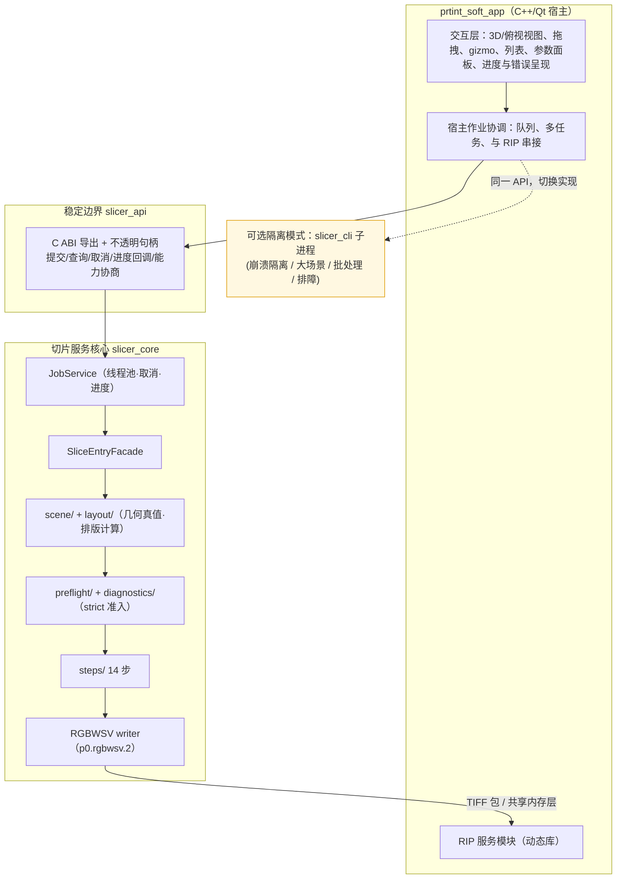

# CLAUDE_10 切片服务接入打印软件的架构分析与建议

> 目录位置：`docs/claude/PLANNING/`。日期：2026-07-27。
> 场景：本切片项目将作为**切片服务模块**整合进打印软件（C++/Qt 桌面程序，同机运行）；**RIP 服务模块以动态库形式接入**。
>
> ⚠ **本篇部分结论已被取代（2026-07-27）**：真实打印项目为 `E:\__Code\__Work\ry_print_demo`（`PrintSolution`，分支 `feature/v0.1.1`），已完成代码级分析。**以 [`CLAUDE_11 ry_print_demo 接入方案定稿`](CLAUDE_11_ry_print_demo接入方案定稿.md) 为准**，其中修正了两点：① 模型处理应归打印软件的 Qt-free `business/prepress/` 层（**不是 UI 层**），几何真值由切片库提供；② 发现**通道契约不匹配**（我方 6ch RGBWSV vs 对方 `ChannelSplitter` 要求 ≥7ch CMYK+W+S+V），需由 RIP 补位分色与墨滴量化。本篇的业界参照（§2）与 ABI 设计要点（§3.3）仍然有效。
> 证据等级：A=本仓库代码事实，P=Claude 分析与建议，E=业界方案（据公开架构常识，非本仓库事实）。

## 1. 结论摘要（P）

| 问题 | 建议 |
|---|---|
| 切片以什么形式接入？ | **主推：进程内动态库（DLL）+ C 风格稳定 ABI 边界 + 内部工作线程**；与 RIP 的接入方式保持一致。**同时**保留 CLI 子进程作为**可选隔离模式**（崩溃隔离/批处理/排障）。即"**一套核心，两种宿主形态**"。 |
| 模型处理放哪？ | **分层拆开，不整块归属**：交互与呈现归打印软件；**几何真值、预检准入、变换语义、排版计算、切片合成归切片服务**。你倾向的"UI 侧主导"在**交互层面成立**，但**几何/准入必须留在服务侧**，否则会出现"UI 认为可以、服务认为不行"的双真源问题。 |
| 为什么不是纯 UI 侧？ | 因为项目最强的资产是 strict 准入 + 证据纪律（A）。把预检/变换/排版的**计算与判定**搬到 UI，会立刻产生第二套几何实现，破坏"UI effective config ≠ core actual"的既有红线。 |

## 2. 业界参照（E，用于校准而非照搬）

| 方案 | 架构形态 | 模型处理归属 | 对我们的启示 |
|---|---|---|---|
| **PrusaSlicer / Slic3r++** | 单体桌面应用 + `libslic3r` **进程内库**；UI 与切片同进程，切片跑后台线程 | 模型导入/摆放/变换在应用层，几何与切片在 libslic3r | 进程内库最简单、延迟最低；适合"同机、同栈、单用户"——与我们的情形高度吻合 |
| **Cura** | Python/Qt 前端 + **CuraEngine 独立进程**，经 libArcus/protobuf socket 通信 | 场景/摆放/变换在前端，切片在引擎进程 | 跨语言、需崩溃隔离时最优；代价是 IPC 序列化、进程管理、调试复杂度 |
| **Bambu Studio / OrcaSlicer** | PrusaSlicer 派生，仍为进程内库 | 同 PrusaSlicer | 工业化产品在同栈场景下仍选进程内 |
| **闭源桌面切片（Simplify3D / Chitubox / Lychee 等）** | 普遍单进程 + 内部模块化，部分插件化 | 前端主导交互，核心库做几何 | 商业产品重视启动速度与一体化体验 |
| **工业 RIP（Caldera / ColorGATE 等）** | 常为服务/热文件夹 + 设备驱动模块 | 上游只交付栅格数据 | 印刷侧习惯"契约化交付"，与我们冻结 `p0.rgbwsv.2` 的做法一致 |

**归纳（P）**：选择进程内库还是独立进程，主要由**语言一致性、崩溃容忍度、内存规模**决定。你的情形是 C++/Qt 同栈、同机、RIP 已走 DLL——**进程内 DLL 是同构且摩擦最小的选择**。但我们有一个特殊变量：**Global 模式峰值内存是 Legacy 的 8.19–8.74×（A）**，大场景下有 OOM 拖垮宿主的风险，所以必须保留"可选隔离模式"作为安全阀。

## 3. 推荐方案：一套核心，两种宿主形态（P）



### 3.1 为什么主推 DLL（P）

1. **与 RIP 一致**：宿主已按动态库集成 RIP，切片同构可复用同一套加载/版本/错误处理约定；
2. **零 IPC 开销**：切片产出的层数据（整幅 6 通道 × N 层）非常大，进程内可直接传指针/共享缓冲，避免序列化；
3. **交互延迟低**：后续增量重切片、实时预览需要频繁小请求，IPC 往返会明显拖慢；
4. **调试与部署简单**：单进程、单套符号，崩溃栈完整。

### 3.2 为什么必须保留子进程隔离模式（P）

1. **内存风险**：Global 峰值内存 8.19–8.74×（A），22 实例大场景可能触顶；子进程 OOM 只死自己；
2. **崩溃隔离**：几何/修复对病态网格敏感（自交/非流形是常态输入），不应让宿主一起崩；
3. **既有资产**：`slicer_cli` 已存在并被回归覆盖（A），保留它几乎零成本；
4. **批处理/无人值守**：热文件夹、夜间批量更适合子进程。

> 实现方式：宿主只依赖 `slicer_api` 一套接口，底层用 `InProcessBackend` 或 `SubprocessBackend` 两种实现，**由配置切换**。这就是同一 API 两种形态。

### 3.3 ABI 边界设计要点（P）

```c
/* 稳定 C ABI：避免 C++ ABI/STL 跨边界问题（示意） */
typedef struct slice_service_t slice_service_t;   /* 不透明句柄 */
typedef struct slice_job_t     slice_job_t;

int  slice_api_version(void);                                  /* 版本协商 */
int  slice_query_capabilities(char* json_out, int cap);         /* DPI区间/通道/模式/最大实例数 */
slice_service_t* slice_service_create(const char* options_json);
slice_job_t* slice_submit(slice_service_t*, const char* scene_json, const char* config_json);
int  slice_poll(slice_job_t*, char* progress_json_out, int cap); /* 或注册回调 */
int  slice_cancel(slice_job_t*);
int  slice_result(slice_job_t*, char* result_json_out, int cap); /* 含 packageDir/报告路径/稳定错误码 */
void slice_job_release(slice_job_t*);
void slice_service_destroy(slice_service_t*);
```

要点：**JSON 传配置与结果、二进制走文件/共享内存、错误用稳定码、跨边界不传 C++ 对象、不传 Qt 类型**（延续 core 对 Qt 零依赖的红线，A）。

## 4. 模型处理的职责划分（核心问题，P）

你的倾向是"UI 侧主导"。我的建议是**把"模型处理"拆成三类**，交互归 UI、真值与判定归服务、结果呈现回 UI：

| 环节 | 打印软件（UI 侧）| 切片服务（DLL）| 理由 |
|---|---|---|---|
| 文件选择/最近列表/资产库 | ✅ 全责 | — | 纯应用体验 |
| **模型解析（OBJ/STL/3MF/MTL/纹理）** | 只做轻量预览解析（可选）| ✅ **权威解析** | 避免两套解析产生几何差异 |
| 3D/俯视视图渲染、拾取、相机 | ✅ 全责 | — | 渲染是宿主强项（Stage 13A-R2 也规划 VTK/QOpenGL）|
| 拖拽/gizmo/吸附等**交互手感** | ✅ 全责 | — | 必须即时响应，不能过边界 |
| **变换语义（scale/rotateZ/mirror/落台）** | 发起意图 | ✅ **权威求值**（`ModelTransform`）| 已有 DTO 与 post-transform preflight（A）|
| **排版计算（11×2 规则/间距/碰撞/幅面）** | 提供参数、展示结果、允许手调 | ✅ **权威计算**（`GridLayoutPolicy`/`SceneCollisionService`）| 确定性 + fail-closed + 稳定错误码已在服务侧（A）|
| **预检与 strict 准入（拓扑/自交/非流形）** | 只展示结论与引导 | ✅ **唯一裁决者** | 红线：strict 不得静默降级；`manual_repair_required ≠ pass` |
| **网格修复（mesh repair）** | 触发与展示 | ✅ 权威执行（保守、默认关）| 证据链与 post-repair strict 在服务侧 |
| 切片/材料/支撑/光油/合成 | — | ✅ 全责 | 核心算法 |
| **层预览** | ✅ 呈现与交互 | ✅ 提供数据源（TIFF 解码/合成，13C）| 数据来自生产 TIFF，避免第二套预览口径 |
| 设备 Profile / buildVolume 管理 | ✅ 主责（设备是宿主域）| 消费并校验 | 设备是宿主的领域；服务按传入值 fail-closed |
| 作业队列/多任务/与 RIP 串接 | ✅ 主责 | 提供单作业能力 | 宿主编排，服务只管一次切片 |

### 4.1 一条判定准则（P）

> **凡是"会影响最终能否打印/切片结果正确性"的计算与判定，必须在切片服务内；凡是"只影响操作手感与呈现"的，放打印软件。**

按此准则，你说的"UI 侧主导"应精确为：**UI 主导交互与呈现，服务主导真值与准入**。排版是最容易踩坑的一项——它看着像 UI 功能，但 `GridLayoutPolicy` 已经是确定性、带 scene revision 乐观并发与 7 个稳定错误码的服务级模块（A），若在 UI 再实现一套摆放逻辑，必然与服务判定分叉。

### 4.2 场景数据的所有权（P）

建议：**UI 持有"编辑态场景"，服务持有"求值态场景"**。

```text
UI  编辑态：用户当前拖拽/选中/未提交的临时状态（可高频变化，不需服务参与）
       ↓ 提交（scene_json + expectedSceneRevision）
服务 求值态：变换求值 → 排版计算 → 碰撞/幅面 → 预检准入 → 返回 placements + issues
       ↓ 回传
UI  用结果刷新显示（并可继续手调）
```

`GridLayoutRequest` 里已有 `currentscenerevision/expectedscenerevision`（A），正好支撑这种"乐观并发 + 原子事务"的交互；UI 不必等服务就能流畅拖拽，提交时再由服务裁决。

## 5. 与 RIP 模块的关系（P）


建议：

1. **保持契约交付**：切片仍产出 `p0.rgbwsv.2` 包作为**权威交付物**（可审计、可回归、可用 `rip_reader_test` 校验），不要为了省一次落盘就让 RIP 直接读切片内部结构；
2. **可选零拷贝快路**：对实时性要求高时，增加"层缓冲直传"通道（共享内存 + 层描述），但**必须与包路径产出一致**，且以包路径为回归基准；
3. **边界不要互穿**：切片不做半色调/ICC/墨量/喷头映射（现有边界，A），RIP 不反向要求切片改协议；跨模块变更走独立决策（G4）。

## 6. 分阶段落地建议（P）

| 阶段 | 内容 | 依赖 |
|---|---|---|
| I-0 | 冻结 `slicer_api` 契约草案（DTO/错误码/能力协商/进度事件）| `CLAUDE_09` R-D 前置 |
| I-1 | 把 CLI 与 Qt 调试 UI **都改走** `slicer_api`（自证边界可用）| R-D-1 |
| I-2 | 产出 `slicer_core.dll` + 导入库 + 版本号；宿主接入 `InProcessBackend` | I-1 |
| I-3 | 实现 `SubprocessBackend`（复用 `slicer_cli`），配置可切换 | I-2 |
| I-4 | 宿主侧接管设备 Profile/buildVolume，向服务传入并 fail-closed 校验 | Stage 13 外部 Gate |
| I-5 | 场景交互对接：UI 编辑态 ↔ 服务求值态（含 revision 并发）| R-C |
| I-6 | 层预览对接 13C（TIFF 原生数据源）| 13C-01..03 |
| I-7 | 与 RIP 串接（先包路径，后可选零拷贝）| RIP 模块就绪 |

**关键前置提醒（P）**：I-1/I-2 应在 `CLAUDE_09` 的 R-B/R-D 之后或同步进行。若在单体尚未步骤化时就冻结对外 ABI，会把"单模型 + 一次性整跑"的旧假设固化进对外接口，后续支持场景、增量、取消都要破坏性改接口。

## 7. 风险与缓解（P）

| 风险 | 缓解 |
|---|---|
| DLL 崩溃拖垮宿主 | 保留 `SubprocessBackend`；宿主对大场景自动切隔离模式 |
| 大场景内存触顶（Global 8.19–8.74×）| 隔离模式 + 实例窗口化（R-C-2）+ 内存优化（R-E-3）|
| ABI 过早冻结 | 先出草案，等 R-B/R-C 稳定再定版；预留 `slice_api_version` |
| UI 与服务判定分叉 | 排版/预检/变换只有服务一套实现；UI 只展示结论 |
| C++ ABI 兼容问题 | 用 C ABI + 不透明句柄 + JSON，禁止跨边界传 STL/Qt 对象 |
| 双方进度/错误语义不一致 | 稳定错误码 + 结构化进度事件，UI 不吞码 |
| 协议漂移 | `RgbwsvProtocol.h` 单一真源（R-A-1）+ `rip_reader_test` 守门 |

## 8. 附：如何让我访问你的私有仓库 `prtint_soft_app`（P）

我查了连接器注册表，**当前没有可用的 GitHub 连接器**，因此推荐按以下顺序：

1. **最简单、立即可用**：把它克隆到本机，然后在 Cowork 的文件夹选择器里把该目录（或它与本仓库的共同父目录 `E:\__Code\__Work`）加进来——我就能像读本仓库一样读它。

   ```powershell
   git clone https://github.com/polarbao/prtint_soft_app.git E:\__Code\__Work\prtint_soft_app
   ```

   之后我可以直接分析它的 CMake、模块划分、Qt 结构，把本篇建议落到它的真实代码上。
2. 如果只想给部分内容：把关键文件（根 `CMakeLists.txt`、主窗口、模块目录树、已有 RIP 动态库接入代码）贴给我或放进当前工作目录。
3. 仓库名请确认：`prtint_soft_app` 看起来可能是 `print_soft_app` 的笔误——我这边按你给的名字访问返回为空（也可能仅因私有）。

> 说明：我不会绕过受限渠道去抓取私有内容；上述方式都是通过你显式授予的本地文件访问来读取。
