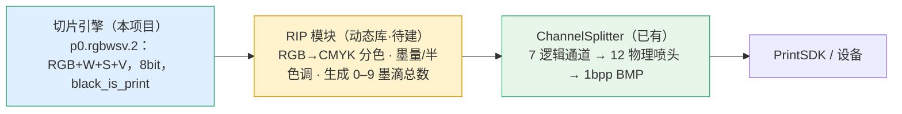
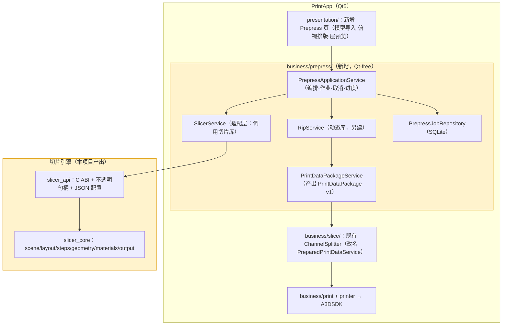

# CLAUDE_11 切片引擎接入 ry_print_demo 的方案（基于真实代码分析·定稿建议）

> 目录位置：`docs/claude/PLANNING/`。日期：2026-07-27。
> 被分析对象：`E:\__Code\__Work\ry_print_demo`（分支 `feature/v0.1.1`），`PrintSolution` 解决方案。
> 证据等级：A=已核实代码/文档事实，P=Claude 建议。
> **本篇取代 `CLAUDE_10` 中基于假设的部分结论**（尤其"模型处理归 UI 侧"一条，见 §6）。

## 1. 结论速览（P）

| 决策项 | 结论 |
|---|---|
| 接入形态 | **静态库/共享库 + 延迟加载（`/DELAYLOAD`）的 DLL 边界**，落位为 DEV_51 已规划的 `SlicerService` 槽位。**不做子进程**（首版），因为对方文档已把子进程列为"第二阶段后半 POC"。 |
| 交付契约 | 复用对方已设计的 **`PrintDataPackage v1`（DEV_52）** 作为落地契约，我方 `p0.rgbwsv.2` 作为**RIP 前**契约，二者由 RIP 衔接。 |
| 模型处理 | 归 **PrintApp 的 prepress 业务层**（Qt-free）编排，**几何能力由切片库提供**，Qt UI 只做渲染与交互。**不放在 UI 层实现**。 |
| 最关键风险 | **通道契约不匹配**：我方输出 6 通道 RGBWSV，对方 `ChannelSplitter` 要求 **≥7 samples/pixel 的 CMYK+W+S+V**。这不是接线问题，而是 **RIP 必须补位**（见 §4）。 |

## 2. ry_print_demo 现状（A，已核实）

**技术栈**：C++20 / CMake 3.20 / MSVC / Qt 5.15（**仅 `presentation/` 依赖 Qt**）。依赖 `nlohmann_json`、`protobuf`、`SQLiteCpp`、`spdlog`、`GTest`、`libhv`、`OpenCV`、`TIFF`。子项目：`A3DSDK`、`PrintApp`、`tests`。

**分层（已很清晰）**：

```text
presentation/   Qt Widgets（唯一 Qt 层）：MainWindow + 5 页 QStackedWidget
business/       printer / print / slice / config / device / security / alert ...（Qt-free）
communication/  libhv 传输抽象（TCP 真实；MQTT/FTP 为编译桩）
data/           SQLite 仓储 + 异步写队列（Qt-free）
A3DSDK          厂商预编译 DLL（IMPORTED SHARED + INTERFACE + /DELAYLOAD）
```

**四个决定性事实（A）**：

1. **完全没有几何切片能力**。`src/` 内无 `.stl/.obj/.3mf`、无 mesh/triangle/几何代码、无 3D 视图（无 QOpenGL/VTK）。唯一预览是 `PrintControlPage` 里的**二维单层位图预览**（滚轮缩放 + 拖拽）。
2. **`business/slice/` 是命名误导**：它是 **RIP 之后**的通道化模块（`ChannelSplitter.h:6` "RIP 后切片图的通道化拆分模块"），负责把栅格图拆成 12 个物理喷头通道的 1bpp BMP。对方文档已计划改名为 `PreparedPrintDataService`（PRD_00:76），并明确 "当前 `SliceService` … **不等价第二阶段的几何模型切片引擎**"。
3. **第二阶段架构已有正式设计基线**（DEV_51，正式）：

```text
Qt Widgets
  -> PrepressApplicationService
      -> ModelImportService / GeometryPreflightService / SlicerService
      -> RipService / PrintDataPackageService / PrepressJobRepository
  -> PackageVerifier / 兼容适配器
  -> 既有 SliceService / Ready 闸门
  -> PrintService -> PrinterManager / PrinterRuntime -> VendorEngineAdapter -> A3DSDK
```

   并明确要求：`SlicerService` 与既有 `SliceService` **必须保持不同命名和职责**（DEV_51:57）；**预处理模块不得依赖 A3DSDK/PrintSDK/motionControlSDK**（DEV_51:20）。

4. **阶段状态**：第一阶段 P0–P12 已"软件侧封账"并冻结；**第二阶段（切片/RIP）仅到设计基线，零实现**；DEV_52（`PrintDataPackage v1`）为**待评审**。P12-E 真机验证未完成。

## 3. 现有接入范式可直接复用（A）

对方接入厂商 DLL 的做法就是我们该照抄的模板（`A3DSDK/CMakeLists.txt`）：

```cmake
add_library(PrintSDKImported SHARED IMPORTED GLOBAL)
set_target_properties(PrintSDKImported PROPERTIES
    IMPORTED_IMPLIB   ".../PrintSDK.lib"
    IMPORTED_LOCATION ".../PrintSDK.dll")
add_library(A3DSDK INTERFACE)
target_include_directories(A3DSDK INTERFACE include)
target_link_libraries(A3DSDK INTERFACE PrintSDKImported)
if(MSVC)   # 关键：单测/非生产路径不强制装载厂商 DLL
    target_link_options(A3DSDK INTERFACE "/DELAYLOAD:PrintSDK.dll")
    target_link_libraries(A3DSDK INTERFACE delayimp)
endif()
```

延迟加载的动机（A，`A3DSDK/CMakeLists.txt:21-24`）：厂商 DLL 的内部线程/退出逻辑会影响测试进程收口。**这个理由对几何/修复栈同样成立**，所以我们的库也应延迟加载。

## 4. ⚠ 最关键发现：通道契约不匹配（A）

这是本次分析最重要的一条，直接决定接入的**数据面**设计。

| | 我方切片输出 | 对方 ChannelSplitter 期望输入 |
|---|---|---|
| 通道数 | **6**（固定 `R G B W S V`）| **≥7 samples/pixel**（不足则报错）|
| 通道语义 | R,G,B（显示色域）+ W,S,V | **C,M,Y,K**（印刷色域）+ White, Support, Varnish |
| 位深 | 8 bit | 8 bit（一致 ✅）|
| 存储 | stripped / tiled | **仅 contig（chunky）**，`TIFFReadScanline` 读取 |
| 取值语义 | `black_is_print`：0=出墨，255=空 | CMYK：阈值映射 1–3 滴；W/S/V：**直接取 0–9 墨滴总数** |
| 层组织 | `layers/layer_*.tif` + `manifest.json` | **扁平目录**，文件名解析 `prefix_<layer>[_<channel>]` |

代码证据（`ChannelSplitter.cpp:406-461`）：

```cpp
if (outInfo.samplesPerPixel < 7)  { outError = "TIFF samplesPerPixel 小于 7"; return false; }
if (outInfo.bitsPerSample != 8)   { outError = "TIFF bitsPerSample 不是 8";   return false; }
if (outInfo.planarConfig != PLANARCONFIG_CONTIG) { outError = "不支持 planar TIFF 输入"; }
```

物理通道顺序已按 P6-B4 冻结（A）：`Cyan, Magenta, Yellow, Black, White1, White2, Support1..3, Varnish1..3`（12 个）。

### 4.1 正确的解读：这不是缺陷，而是 RIP 的位置

**我方是 RIP 前上游，对方 ChannelSplitter 是 RIP 后下游**——两者本来就不该直接对接。完整链条应是：



**结论（P）：我方切片协议 `p0.rgbwsv.2` 不需要改**，也不该为了迁就下游而改（那会破坏红线 G4）。需要补的是 **RIP 模块承担 `RGB→CMYK` 分色与墨滴量化**——这恰好就是你说的"RIP 以动态库形式接入"的职责。RIP 的输出才需要满足 `≥7ch contig` 契约。

**必须澄清的一点（P）**：对方 `ChannelSplitter` 对 W/S/V 直接取 0–9 墨滴总数，说明它期望**已量化的墨滴数**，而我方 W/S/V 目前是 0/255 的二值语义。所以即便 W/S/V 不需要分色，**也需要 RIP 做"二值 → 墨滴数"的量化**。这一点建议尽早与 RIP 负责人对齐，否则会出现"白墨只有 0 和 9 两档"的工艺问题。

## 5. 推荐接入方案（P）

### 5.1 总体形态：库 + 延迟加载 DLL，落位 `SlicerService`



### 5.2 为什么是"库 + 延迟加载"而不是子进程（P）

1. **对方文档已定调**：DEV_51 §8.3「拆为可独立单测的 library」；PRD_28 §11「PrepressWorker 子进程是**第二阶段后半 POC**」；PRD_28 §11 明确第二阶段**不开放动态插件**。逆着他们的阶段边界走会增加协调成本。
2. **无 IPC 可复用**（A）：`protobuf` 已链接但**零 `.proto` 文件、零 `#include`**（纯历史包袱）；`libhv` 的 MQTT/FTP 是**编译桩**；无 HTTP 服务端、无 gRPC。走子进程等于**从零自建传输**。
3. **同栈同机**：C++20/MSVC/CMake 完全一致，进程内零序列化开销；层数据量大，避免 IPC 拷贝。
4. **`/DELAYLOAD` 已解决"不想加载就不加载"**：这正好满足对方硬性验收 **AC-28-04「打印运行时不需要加载模型或切片/RIP 引擎即可消费 Ready 输入」**——延迟加载后，纯打印路径不会触发装载我方 DLL。

### 5.3 但要预留子进程后路（P）

我方 Global 模式峰值内存是 Legacy 的 **8.19–8.74×**（本项目 A 级事实），22 实例大场景有触顶风险；几何/修复对病态网格敏感。因此：

- `SlicerService` 内部用 **`ISlicerBackend` 接口**，首版实现 `InProcessBackend`；
- 预留 `SubprocessBackend`（复用我方已有 `slicer_cli`，零新增传输代码）；
- 由配置切换。这与 PRD_28「先冻结传输无关 API」的思路完全一致，也为他们后半段的子进程 POC 铺好路。

### 5.4 ABI 与契约要点（P）

```c
/* 稳定 C ABI，避免跨边界传 STL/Qt；配置与结果走 JSON，二进制走文件 */
int  slicer_api_version(void);
int  slicer_query_capabilities(char* json_out, int cap);   /* DPI区间/通道/模式/最大实例数/协议版本 */
slicer_handle* slicer_create(const char* options_json);
slicer_job*    slicer_submit(slicer_handle*, const char* scene_json, const char* config_json);
int  slicer_poll(slicer_job*, char* progress_json, int cap);
int  slicer_cancel(slicer_job*);
int  slicer_result(slicer_job*, char* result_json, int cap); /* packageDir + 报告路径 + 稳定错误码 */
void slicer_job_release(slicer_job*); void slicer_destroy(slicer_handle*);
```

约束：不传 C++ 对象/Qt 类型（延续我方 core 对 Qt 零依赖）、错误用稳定码、取消协作式、进度结构化。

### 5.5 落地契约：直接复用 `PrintDataPackage v1`

对方 DEV_52 已设计（待评审）：

```text
<packageId>/manifest.json + checksums.json
           + layers/layer_000001/channel_01.bmp
           + previews/ + reports/
```

含 `canvas`、`layers{count,indexBase,naming,z unit}`、有序 `channels[]`（`physicalIndex` 1..12），以及**暂存 + 原子改名发布**协议。

建议（P）：

- **我方产出仍是 `p0.rgbwsv.2` 包**（可审计、可回归、`rip_reader_test` 可校验）；
- 由 `PrintDataPackageService` 在 **RIP 之后**生成 `PrintDataPackage v1`；
- 我方顺势把 `manifest.json` 的字段命名与 DEV_52 对齐（如 `indexBase`、`z unit`、checksums），**降低适配层厚度**——这是低成本高收益的对齐动作；
- 我方"暂存 + 原子发布"与对方 `ChannelSplitter` 的 safe-publish 语义一致，可直接沿用同一套失败清理约定。

## 6. 模型处理归属：修正此前建议（P）

你此前倾向"UI 侧（打印软件）主导"。基于对方真实代码与正式设计，我要给出**更精确的修正**：

**模型处理应归 PrintApp 的 `business/prepress/` 层（Qt-free 业务层），而不是 `presentation/` UI 层；且几何计算能力由切片库提供，不在打印软件里重新实现。**

依据（A）：

1. DEV_51 已把 `ModelImportService` / `GeometryPreflightService` / `SlicerService` 放在 **PrepressApplicationService 之下**，并要求「Qt Widgets 只依赖 application facade」；
2. 对方存在**架构守卫测试**（`test_presentation_source_boundary.cpp`、`test_ui_import_entry_contract.cpp`），会对源码层级做断言——把几何塞进 `presentation/` 会**直接测试失败**；
3. AC-28-19 要求「核心任务 API 可在不引用 QWidget 的测试中调用」；
4. 对方 UI 层目前**没有任何 3D/网格能力**，从零建会与我方 `scene/`+`layout/` 重复，产生第二套几何真值。

### 6.1 职责划分表（定稿建议）

| 环节 | PrintApp `presentation/`（Qt UI）| PrintApp `business/prepress/` | 切片库（本项目）|
|---|---|---|---|
| 文件选择、拖拽导入、最近列表 | ✅ | 受理 | — |
| 模型解析（OBJ/STL/3MF/MTL/贴图）| — | 调用 | ✅ **权威实现** |
| 几何预检 / strict 准入 / 修复 | 展示结论与引导 | 编排 | ✅ **唯一裁决者** |
| 变换语义（scale/rotateZ/mirror/落台）| 发起意图、gizmo 手感 | 提交事务 | ✅ **权威求值**（`ModelTransform`）|
| 排版（规则排版/间距/碰撞/幅面）| 展示与手调 | 提交事务 | ✅ **权威计算**（`GridLayoutPolicy`/`SceneCollisionService`）|
| 俯视/3D 渲染、拾取、相机 | ✅ **全责**（新增，可用 QOpenGL/VTK）| — | 提供几何数据 |
| 切片 / 材料 / 支撑 / 光油 / 合成 | — | 编排 | ✅ 全责 |
| **RIP（RGB→CMYK、墨量、半色调、墨滴量化）** | — | 编排 | ❌ **不属我方边界** → RIP 动态库 |
| 通道化（7 逻辑→12 物理→1bpp BMP）| — | ✅ 既有 `ChannelSplitter` | — |
| 设备 Profile / buildVolume / 轴方向 | 配置界面 | ✅ **主责**（设备是宿主域）| 消费并 fail-closed 校验 |
| 作业队列 / 多任务 / 断点 | 展示 | ✅ 主责（`PrepressJobRepository`）| 提供单作业能力 |

判定准则不变（P）：**凡影响最终能否打印/结果正确性的计算与判定 → 切片库；凡只影响操作手感与呈现 → UI。**

### 6.2 顺带解决对方一个待决项

对方 Stage 13 级的外部 Gate（设备 `buildVolume`、机器原点与 X/Y 方向）在我方也是未关闭项。既然设备域归 PrintApp，建议：**由 PrintApp 的设备配置提供 buildVolume/原点/轴向，作为参数传入切片库**，我方按传入值 fail-closed 校验。这样两边的 Gate 一次性关闭。

## 7. 分阶段落地建议（P）

| 阶段 | 内容 | 前置 |
|---|---|---|
| J-0 | **契约对齐会**：确认 RIP 承担 `RGB→CMYK` + 墨滴量化；确认 `PrintDataPackage v1` 字段；确认 buildVolume/轴向来源 | — |
| J-1 | 我方按 `CLAUDE_09` R-A/R-B 推进（协议真源 + 步骤化），并冻结 `slicer_api` 草案 | R-A/R-B |
| J-2 | 我方产出 `slicer_core.dll` + `.lib` + 版本头；`manifest` 字段向 DEV_52 对齐 | J-1 |
| J-3 | PrintApp 新增 `business/prepress/`：`PrepressApplicationService` + `SlicerService`（`InProcessBackend`）+ `/DELAYLOAD` 接入 | J-2 |
| J-4 | RIP 动态库接入 `RipService`，打通 RGBWSV → ≥7ch contig TIFF | RIP 就绪 |
| J-5 | `PrintDataPackageService` 产出 v1 包 → 既有 `ChannelSplitter` → Ready 闸门 | J-4 |
| J-6 | UI 新增 Prepress 页（导入 / 俯视排版 / 层预览），复用我方 13C TIFF 原生预览思路 | J-3 |
| J-7 | 可选：`SubprocessBackend` + 大场景自动切隔离模式 | J-3 |

## 8. 风险与缓解（P）

| 风险 | 缓解 |
|---|---|
| **通道语义误接**（6ch 直连 7ch 校验必失败）| J-0 先定 RIP 职责；在 `slicer_api` 的 capabilities 里显式声明"输出为 RIP 前 RGBWSV" |
| W/S/V 墨滴量化缺失（只有 0/9 两档）| RIP 补量化；工艺侧确认档位 |
| 破坏对方冻结的第一阶段 | 只新增 `business/prepress/`，不改 `PrinterManager/PrintService/PrinterRuntime/VendorEngineAdapter`（DEV_51 非目标）|
| 架构守卫测试失败 | 几何一律不进 `presentation/`；新模块保持 Qt-free |
| 违反 AC-28-04 | 必须 `/DELAYLOAD`，纯打印路径不装载切片 DLL |
| 预处理误依赖 A3DSDK | `business/prepress/` 禁止链接 A3DSDK（DEV_51:20），CI 加依赖方向检查 |
| 大场景内存触顶 | `SubprocessBackend` 后路 + 我方实例窗口化（`CLAUDE_09` R-C-2）|
| 过早冻结 ABI | 先草案；等 R-B/R-C 稳定再定版；保留 `slicer_api_version` |

## 9. 一句话总结（P）

**以"静态/共享库 + `/DELAYLOAD` DLL"的形式，落位到对方 DEV_51 已规划的 `SlicerService` 槽位，产出仍为 `p0.rgbwsv.2`（RIP 前契约），由 RIP 动态库完成 `RGB→CMYK` 分色与墨滴量化后交给既有 `ChannelSplitter`；模型处理归 PrintApp 的 Qt-free `business/prepress/` 层编排、几何真值由切片库提供、UI 只做渲染与交互。** 最需要立刻对齐的不是接入形态，而是**通道契约（6ch RGBWSV vs ≥7ch CMYK+WSV）由 RIP 补位**这件事。
