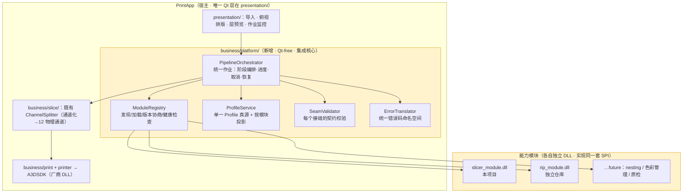
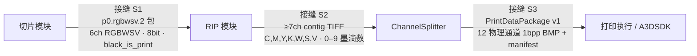
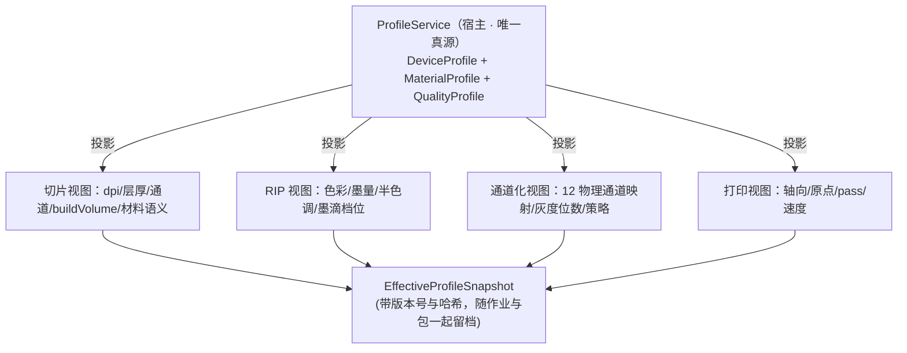

# CLAUDE_12 模块化集成架构定稿（切片 · RIP · 打印）

> 目录位置：`docs/claude/PLANNING/`。日期：2026-07-27。
> 前提（用户确认）：切片、RIP、打印**三模块本地均已跑通**；目标拓扑为**分模块使用，每个模块服务通过各自独立的动态库或相关文件实现**；RIP 位于独立仓库、已出 DLL。
> 证据等级：A=已核实代码/文档事实，P=Claude 建议。本篇是集成阶段的**架构定稿建议**，取代 `CLAUDE_11` §5.1 关于"切片内聚为库"的形态描述（职责划分与通道契约结论仍然有效）。

## 1. 一句话结论（P）

**把集成做成"能力提供者（SPI）架构"：宿主（PrintApp）只认一套统一的模块服务契约，切片 / RIP / 未来模块各自以独立 DLL 实现它；再配三根支柱——阶段间数据契约、单一 Profile 真源、统一作业编排。** 这样每个模块可独立开发、独立版本、独立替换、独立验证，而宿主代码不随模块增减而改动。

优雅的关键不在"怎么调用 DLL"，而在**三件事被收敛为唯一真源**：契约（Contract）、配置（Profile）、作业（Job）。三者若各留三份，集成必然腐化。

## 2. 集成阶段真正的风险（P，先看清再设计）

三个模块各自跑通 ≠ 集成会顺利。基于已核实事实，风险按严重度排序：

| # | 风险 | 证据 / 说明 | 后果 |
|---|---|---|---|
| 1 | **配置与 Profile 三份漂移** | DPI、层厚、通道语义、极性、buildVolume 在三模块各有一份 | 同一参数三处不一致，问题无法归因；这是最典型的集成腐化 |
| 2 | **接缝不校验，错位被静默吞掉** | 已发现：我方 6ch RGBWSV vs `ChannelSplitter` 要求 ≥7ch（A）；W/S/V 我方二值 vs 对方期望 0–9 墨滴数（A）| 出图"看起来对"但工艺错 |
| 3 | **ABI / 运行时不匹配** | 对方已踩过：因厂商 DLL 只有 Release 版，`PrintApp` 构建后**强制拷贝 Release 版 Qt5 DLL**，即使 Debug 构建也如此（A）| 跨 DLL 传 STL/Qt 对象、`/MD` 与 `/MDd` 混用 → 随机崩溃 |
| 4 | **作业模型三套** | 切片有自己的 task、`SliceService` 是单槽任务模型、`PrintService` 是独立状态机（A）| 进度/取消/失败恢复无法贯穿 |
| 5 | **错误码命名空间冲突** | 三模块各有稳定错误码（我方 `E_12E_PIPELINE_*`、对方 `SliceErrorCode`/`GridLayoutErrorCode`）| 宿主无法统一处理与展示 |
| 6 | **版本兼容无协商** | 三库独立演进 | 换一个 DLL 就静默行为变化 |

**设计目标就是逐条消灭以上 6 项。**

## 3. 目标架构

### 3.1 总图



### 3.2 三根支柱

```text
支柱一 契约（Contract）：一套 SPI + 每个接缝一份数据契约 + 接缝校验器
支柱二 配置（Profile） ：一个真源，按模块投影下发，模块不自带业务默认值
支柱三 作业（Job）     ：一个作业跨越全部阶段，统一状态/进度/取消/恢复/追溯
```

## 4. 支柱一：统一模块契约（SPI）

### 4.1 设计原则（P）

```text
1. C ABI + 不透明句柄        跨 DLL 不传 C++ 对象、STL、Qt 类型
2. 配置与结果走 JSON         大二进制走文件/共享内存，不走 ABI
3. 能力协商先行              宿主先问"你支持什么"，再决定能否编排
4. 稳定错误码 + 命名空间      每模块一个前缀，宿主不需理解内部语义
5. 协作式取消                取消是请求，不是杀死
6. 结构化进度                阶段 + 百分比 + 可选明细，不靠解析日志
7. 模块无状态化倾向          作业状态归宿主，模块只管一次计算
8. 延迟加载                  用不到的模块不装载（对方 AC-28-04 的硬要求）
```

### 4.2 统一 SPI（所有模块实现同一份头）

```c
/* print_module_spi.h —— 宿主与所有能力模块共享的唯一契约头 */
#define PM_SPI_VERSION 1

typedef struct pm_module_s pm_module_t;   /* 不透明模块句柄 */
typedef struct pm_job_s    pm_job_t;      /* 不透明作业句柄 */

/* --- 元信息与能力协商（装载后第一件事） --- */
int  pm_spi_version(void);                                  /* 必须 == PM_SPI_VERSION */
int  pm_module_info(char* json_out, int cap);
/* 返回：{ "id":"slicer", "name":"SliceSoft", "version":"0.3.1",
           "spi":1, "runtime":"MSVC-x64-MD", "buildConfig":"Release",
           "capabilities":{ ... 模块自述能力 ... } } */

/* --- 生命周期 --- */
pm_module_t* pm_create(const char* options_json);
void         pm_destroy(pm_module_t*);

/* --- 作业：提交 / 轮询 / 取消 / 取结果 --- */
pm_job_t* pm_submit(pm_module_t*, const char* request_json);
int  pm_poll   (pm_job_t*, char* progress_json, int cap);  /* {stage,percent,detail} */
int  pm_cancel (pm_job_t*);                                 /* 协作式 */
int  pm_result (pm_job_t*, char* result_json,  int cap);    /* {ok,outputs[],issues[],code} */
void pm_release(pm_job_t*);

/* --- 自检（用于安装校验与排障） --- */
int  pm_self_test(pm_module_t*, char* report_json, int cap);
```

**关键点（P）**：

- `pm_module_info` 里必须自述 **`runtime` 与 `buildConfig`**——这是防第 3 号风险（对方已因 Release-only 厂商 DLL 被迫混拷 Qt DLL）的直接手段；宿主装载时比对不一致就 fail-closed 报错，而不是等运行时随机崩。
- 每个模块**只实现这一套**，宿主 `ModuleRegistry` 用同一段代码加载全部模块。新增模块 = 放一个 DLL + 注册清单，**宿主零改动**。

### 4.3 模块清单（随 DLL 附带的"相关文件"）

每个模块目录附一份清单，宿主据此发现与校验：

```json
{
  "id": "slicer",
  "dll": "slicer_module.dll",
  "spi": 1,
  "version": "0.3.1",
  "runtime": "MSVC-x64-MD",
  "buildConfig": "Release",
  "provides": ["model.import", "geometry.preflight", "scene.layout", "slice.rgbwsv"],
  "consumes": [],
  "produces": [{ "contract": "p0.rgbwsv.2", "kind": "package" }],
  "profileKeys": ["device.buildVolume", "output.dpi", "output.layerThicknessMm", "material.*"],
  "delayLoad": true
}
```

`provides / consumes / produces` 让**编排可由清单推导**，而不是硬编码在宿主里——这是"优雅"的核心机制：宿主不知道"切片之后是 RIP"，它只知道"谁产出 `p0.rgbwsv.2`、谁消费它"。

## 5. 支柱一（续）：接缝数据契约与校验

### 5.1 三个接缝



### 5.2 每个接缝都要有"校验器"（P，消灭 2 号风险）

| 接缝 | 契约 | 校验器 | 现状 |
|---|---|---|---|
| S1 | `p0.rgbwsv.2`（通道序、8bit、极性、层列表、存储模式）| **已有**：我方 `rip_reader_test` | ✅ 可直接复用 |
| S2 | ≥7ch / 8bit / **contig only** / W·S·V 为 0–9 墨滴数 | **待建**：`rip_output_validator` | ⚠ 缺口，优先补 |
| S3 | `PrintDataPackage v1`（manifest + 12 通道 + checksums）| **待建**：`PackageVerifier`（对方 DEV_52 已设计）| ⚠ 设计有、实现无 |

**原则（P）**：**接缝校验必须是编排的强制步骤，不是可选的调试工具。** 每阶段产出后立即校验，失败即 fail-closed 并给稳定错误码。这样"6ch 接到 7ch"这类错位在第一时间被拦住，而不是流到设备端才发现。

另外两条契约细节（A，务必写进 S2 契约文档）：

1. `ChannelSplitter` 只接受 **contig（chunky）**，`TIFFReadScanline` 读取——我方支持 stripped/tiled，**RIP 输出必须落在 contig**；
2. `ChannelSplitter` 对 **W/S/V 直接取 0–9 墨滴总数**，而 CMYK 走阈值映射 1–3 滴——所以 RIP 不只做分色，**还要做 W/S/V 的墨滴量化**（否则白墨只有 0/9 两档）。

## 6. 支柱二：单一 Profile 真源（消灭 1 号风险）

这是"优雅"与"凑合"的分水岭。

### 6.1 设计（P）



规则（P）：

1. **设备域参数（buildVolume、原点、轴向、喷头/通道能力）只由宿主提供**，模块一律不自带默认值——顺带关闭我方 Stage 13 悬着的 buildVolume/轴向 Gate；
2. 模块**声明**自己需要哪些 key（清单里的 `profileKeys`），宿主按需投影下发；
3. 每次作业生成 **`EffectiveProfileSnapshot`（含版本 + 哈希）**，写入作业记录与最终包的 manifest——这样任何一张图都能回溯"当时用的是哪套参数"；
4. 模块若收到无法满足的参数（如 DPI 超出能力区间），**fail-closed**，不允许静默钳制。

> 我方切片已有 `EffectiveConfig`/`SceneEffectiveConfig` 概念（A），对方有 `EffectivePrintConfigResolver/Validator`（A）。集成时**不要各留一套**，统一由宿主 `ProfileService` 生成，模块只做"校验 + 消费"。

## 7. 支柱三：统一作业编排（消灭 4、5 号风险）

### 7.1 一个作业贯穿全部阶段

复用对方 PRD_28 已定义的作业状态机（A），扩展为跨模块：

```text
Created → Queued → Running(stage) → Publishing → Verifying → Succeeded
                                  ↘ Cancelling → Cancelled
                                  ↘ Failed
stage ∈ { Import, Preflight, Layout, Slice, Rip, Channelize, Verify, Ready }
```

`PipelineOrchestrator` 职责（P）：

- 依模块清单的 `produces/consumes` **推导阶段顺序**；
- 每阶段：投影 Profile → `pm_submit` → `pm_poll` 汇总进度 → 产出后跑 **SeamValidator** → 落库；
- **取消**：向当前阶段 `pm_cancel`，并保证已发布产物的原子性（沿用双方都已有的"暂存 + 原子改名"语义，A）；
- **恢复**：以阶段为断点粒度，凭 `EffectiveProfileSnapshot` 哈希判定可否复用上游产物（缓存键建议：`源文件摘要 + 归一化变换 + Profile版本 + 算法版本`，与对方 DEV_51 的缓存键设计一致，A）；
- **进度归一**：把各模块的 `{stage,percent}` 映射到全局权重（如 Slice 50% / Rip 30% / Channelize 20%），UI 只看一条总进度 + 当前阶段。

### 7.2 统一错误码命名空间（P）

```text
PM-<MODULE>-<CATEGORY>-<CODE>
  例：PM-SLICER-TOPOLOGY-0007   （几何拓扑阻断）
      PM-RIP-CONTRACT-0002      （输出非 contig）
      PM-HOST-PROFILE-0001      （DPI 超出设备能力）
      PM-SEAM-S2-0003           （samplesPerPixel < 7）
```

`ErrorTranslator` 把模块原生码映射到统一码 + 面向用户的中文文案 + 处置建议；**UI 不吞码**，日志与作业记录都带 `correlationId` 贯穿全链。

## 8. 版本与兼容（消灭 6 号风险）

| 机制 | 做法（P）|
|---|---|
| SPI 版本 | `pm_spi_version()` 必须等于宿主编译期 `PM_SPI_VERSION`，否则拒绝装载 |
| 模块版本 | 语义化版本；宿主维护**兼容矩阵**（宿主 x.y ↔ 模块版本区间）|
| 契约版本 | 数据契约独立版本化：`p0.rgbwsv.2`、`rip.ch7.1`、`printdata.v1`；模块清单声明所产所消 |
| 运行时 | 清单 + `pm_module_info` 双重声明 `runtime/buildConfig`，不匹配 fail-closed |
| 能力协商 | 编排前先聚合各模块 capabilities，**先判定"这条链能不能跑"**，再开始跑 |
| 变更纪律 | 契约变更需独立决策 + 迁移方案（延续我方 G4 红线）|

## 9. 一致性测试：让模块真正可替换（P）

优雅集成的验收标准是"**换一个实现，链路照跑**"。为此建三层测试：

```text
L1 SPI 一致性套件（conformance suite）
   宿主提供一套可执行测试，任何模块 DLL 都能被它跑：
   元信息/版本协商/提交-轮询-取消/错误码格式/自检/无内存泄漏
L2 接缝契约测试（golden fixtures）
   S1/S2/S3 各备正例与负例包；负例必须被校验器拦住
L3 端到端集成回归
   固定模型 + 固定 Profile → 全链产出，比对稳定投影
   （不比时间戳与环境敏感字段；沿用双方已有 golden 纪律）
```

配套（P）：把 `pm_self_test` 做成安装后自检入口，出厂/现场都能一键验证"三个 DLL 版本是否匹配、链路是否可跑"。

## 10. 部署形态（P）

```text
3DPrintApp/
├─ 3DPrintApp.exe
├─ modules/
│   ├─ slicer/  slicer_module.dll  module.json  [依赖DLL…]
│   └─ rip/     rip_module.dll     module.json  [依赖DLL…]
├─ profiles/    device/*.json  material/*.json  quality/*.json
├─ contracts/   p0.rgbwsv.2.schema.json  rip.ch7.1.schema.json  printdata.v1.schema.json
├─ PrintSDK.dll motionControlSDK.dll   （厂商，延迟加载）
└─ logs/  jobs/  packages/
```

要点：模块**各自独立目录**（含自己的依赖 DLL，避免版本互踩）；全部**延迟加载**；`contracts/` 让接缝 schema 成为可发布、可校验的一等资产。

## 11. 落地顺序（P）

| 阶段 | 内容 | 产出 |
|---|---|---|
| **N-0 契约冻结周** | 定 `print_module_spi.h`、三份接缝 schema、Profile key 清单、错误码命名规则 | 契约包（可评审）|
| N-1 宿主平台层 | `business/platform/`：ModuleRegistry + ErrorTranslator + ProfileService 骨架 | 能装载空模块并自检 |
| N-2 切片模块化 | 我方在 `slicer_api` 外再包一层 SPI 导出，产出 `slicer_module.dll` + `module.json` | 通过 L1 一致性套件 |
| N-3 S1 校验入链 | 复用 `rip_reader_test` 作为 SeamValidator(S1) | 正/负例通过 |
| N-4 RIP 模块化 | RIP 仓库同样实现 SPI，产出 `rip_module.dll`；补 **S2 校验器** | 通过 L1 + L2 |
| N-5 编排打通 | `PipelineOrchestrator` 串 Slice→Rip→Channelize→Verify→Ready | 端到端 fixture 通过 |
| N-6 Profile 收敛 | 三处配置改为宿主投影 + `EffectiveProfileSnapshot` 留档 | 参数单一真源 |
| N-7 UI 与作业面 | 导入/排版/层预览/作业监控与恢复 | 用户可用 |
| N-8 隔离与健壮 | 大场景可选子进程承载（复用各模块 CLI）、崩溃隔离、诊断包导出 | 生产加固 |

**建议顺序纪律（P）**：N-0 必须先做完再动代码。三模块已各自跑通的情况下，集成失败几乎都源于"契约没先冻结就开始接线"。

## 12. 与既有约束的一致性检查（A）

| 对方约束 | 本方案如何满足 |
|---|---|
| AC-28-04 打印运行时不需加载切片/RIP 引擎 | 全部模块延迟加载；纯打印路径不触发装载 |
| AC-28-03 无设备环境可验证切片/RIP→数据包 | 编排与校验器均不依赖 A3DSDK；L2/L3 可离线跑 |
| AC-28-19 核心 API 可在无 QWidget 测试中调用 | `business/platform/` 全 Qt-free |
| DEV_51 预处理模块不得依赖 A3DSDK/PrintSDK | 模块与平台层禁链厂商 SDK；CI 加依赖方向检查 |
| DEV_51 `SlicerService` 与既有 `SliceService` 命名分离 | 既有通道化改称 `PreparedPrintDataService`；新链路用 `Channelize` 阶段名 |
| 架构守卫测试（presentation 边界）| 几何/编排一律不进 `presentation/` |
| 我方红线：协议不变、禁静默回退 | 契约版本化 + 接缝 fail-closed，不允许降级通过 |

## 13. 为什么这个方案"优雅"（P）

```text
新增一个能力模块（如自动 nesting / 色彩管理 / 在线质检）：
  写一个实现 SPI 的 DLL + 一份 module.json（声明 provides/consumes/produces）
  → 宿主自动发现、协商、编入流水线
  → 宿主代码零改动，UI 只需加一个可选阶段的展示
```

同时：任一模块可被替换（只要过 L1+L2）、可被独立验证（离线 fixture）、可被独立发版（语义化版本 + 兼容矩阵）、故障可被精确归因（统一错误码 + correlationId + Profile 快照）。

**这三件事收敛为唯一真源——契约、Profile、作业——就是集成阶段全部工程优雅度的来源。**
