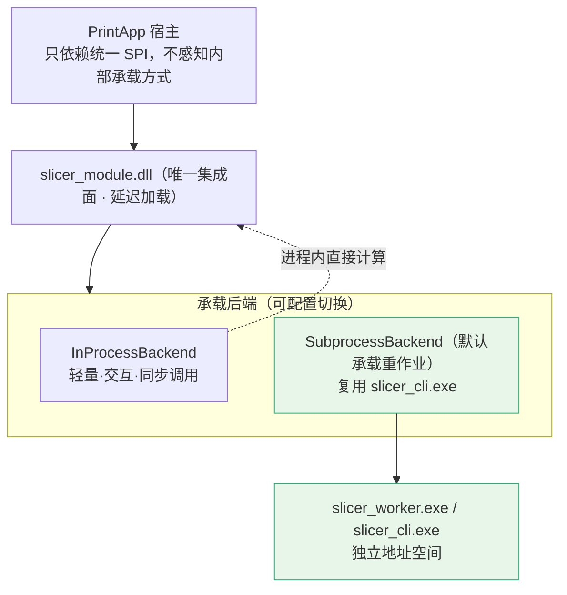
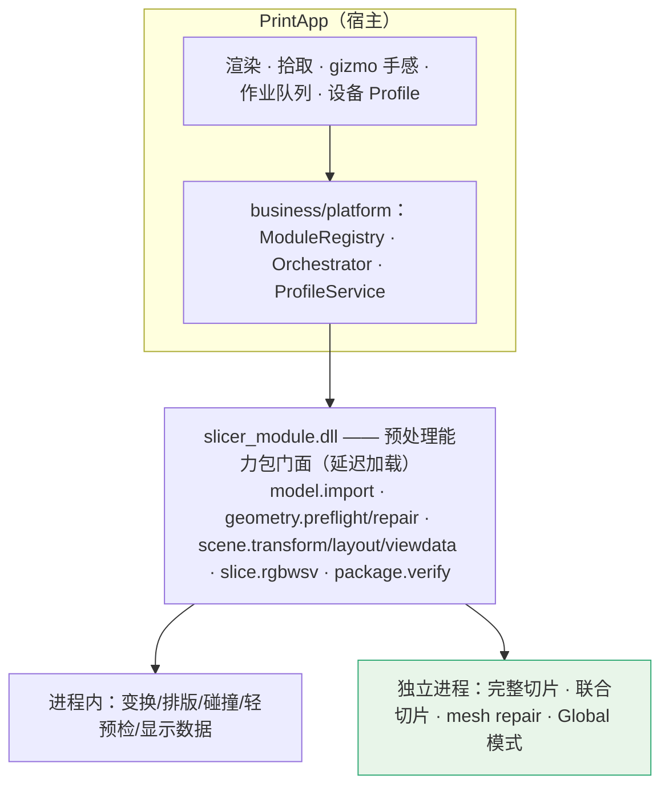

# CLAUDE_13 切片模块的交付形态与能力边界判断

> 目录位置：`docs/claude/PLANNING/`。日期：2026-07-27。
> 回答两个问题：① 切片软件应提供**动态库**还是**exe 可执行文件**；② 应只提供**切片引擎**，还是打包成含**模型排布/处理/移动**的能力包。
> 证据等级：A=已核实代码事实，P=Claude 判断。

## 0. 两个结论先给（P）

| 问题 | 结论 |
|---|---|
| **形态** | **DLL 作为唯一集成面（宿主只认 DLL），但重作业默认由 DLL 内部派发到独立 EXE 执行。** 即"一套核心、DLL 门面、EXE 工人"。不是二选一，而是分工——理由见 §1.3 的决定性场景。 |
| **边界** | **提供"预处理能力包"（导入 + 预检/修复 + 变换求值 + 排版/碰撞 + 切片 + 包读校验），不是只给切片引擎。** 但**不含**渲染、交互手感、设备域、RIP、作业队列。理由见 §2.2。 |

---

# 一、形态判断：DLL 还是 EXE

## 1.1 两种形态的真实权衡（P）

| 维度 | 纯 DLL（进程内）| 纯 EXE（独立进程）|
|---|---|---|
| 数据传递开销 | ✅ 零序列化，可传指针/共享缓冲 | ❌ 层数据量大，IPC 拷贝昂贵 |
| 交互延迟 | ✅ 亚毫秒级，适合排版/预览反馈 | ❌ 往返开销，交互卡顿 |
| 细粒度 API | ✅ 能力查询、增量重算、局部刷新 | ❌ 粗粒度，难做增量 |
| **崩溃隔离** | ❌ **崩溃即拖垮宿主** | ✅ 只死自己 |
| **内存隔离** | ❌ OOM 拖垮宿主 | ✅ 独立地址空间 |
| ABI / 运行时耦合 | ❌ `/MD` vs `/MDd`、C++ ABI、Qt 版本都要对齐 | ✅ 完全解耦 |
| 独立发版 | 一般 | ✅ 强 |
| 现成资产 | 需新建导出层 | ✅ **`slicer_cli` 已存在且被回归覆盖**（A）|
| 满足 AC-28-04 | 需 `/DELAYLOAD` | ✅ 天然满足（根本不装载）|

## 1.2 三条来自代码的硬约束（A）

1. **对方已有延迟加载的前车之鉴**：`A3DSDK/CMakeLists.txt:21-24` 明确因厂商 `PrintSDK.dll` 的**内部线程/退出逻辑影响测试进程收口**而启用 `/DELAYLOAD`，`tests/CMakeLists.txt` 还留有 `BLOCKED_SDK_MOCK_SAME_PROCESS` 记录。**这个理由对几何/修复栈同样成立，甚至更强。**
2. **AC-28-04 硬性要求**：打印运行时**不需要加载**模型或切片/RIP 引擎即可消费 Ready 输入。
3. **我方内存画像**：Global 模式峰值内存是 Legacy 的 **8.19–8.74×**；22 实例大场景有触顶风险。几何输入的常态是病态网格——三个必需 OBJ 全部因自交/非流形被 strict 阻断（`meigui_fudiao` 非流形边 10940）。

## 1.3 决定性场景：**边打印边切片（P）**

这是让我不选"纯 DLL"的关键推理：

```text
集成后必然出现的用户行为：A 作业正在打印（可能持续数十分钟至数小时）
                          用户同时对 B 作业做导入/排版/切片
若切片在宿主进程内 OOM 或崩溃 → 正在进行的打印一起死
→ 工业打印场景下意味着：废件 + 废料 + 可能的设备异常停机
```

工业设备软件的第一非功能需求是**宿主稳定性**。让"一次可能失败的重计算"与"一次不能中断的物理过程"共享地址空间，是不可接受的风险。**所以重量级切片计算必须在独立进程里跑。**

反过来，排版拖拽、俯视刷新、能力查询这类高频轻量交互，走 IPC 会明显拖慢手感，**必须在进程内**。

## 1.4 结论：DLL 门面 + EXE 工人（P）



**按工作负载分派（P）**：

| 调用类别 | 承载 | 理由 |
|---|---|---|
| 能力协商、版本、自检 | 进程内 | 微秒级，无风险 |
| 变换求值、bbox 重算 | 进程内 | 纯矩阵/包围盒运算，交互需即时 |
| 排版计算、碰撞检测 | 进程内 | 交互高频；`GridLayoutPolicy` 是确定性纯计算（A）|
| 快速预检（轻量拓扑体检）| 进程内 | 用于导入即时反馈 |
| 俯视显示数据（轮廓/bbox）| 进程内 | 渲染帧需要 |
| **完整切片 / 联合切片** | **子进程** | 长时、大内存、可能 OOM |
| **网格修复（mesh repair）** | **子进程** | 病态输入常态，崩溃风险最高 |
| **Global 模式** | **子进程** | 峰值内存 8.19–8.74×（A）|
| 包读取与校验 | 进程内 | 只读、内存可控 |

**为什么不让宿主直接调 EXE？** 因为那会把"进程管理、命令行拼装、退出码解析、进度解析、临时目录清理"全部泄漏到宿主，且与另一个模块（RIP）的接入方式不一致。**用 DLL 统一门面，宿主永远只面对一套 SPI**（`CLAUDE_12`），内部承载方式是实现细节——这既优雅又安全。

**配置开关（P）**：`backend = auto | inprocess | subprocess`。`auto` 规则建议：实例数/预估内存/是否 Global/是否 repair 任一超阈值 → 子进程；否则进程内。排障时可强制 `inprocess` 拿完整调用栈。

## 1.5 若必须二选一（P）

如果工程上暂时无力做双后端，我的选择是：**先做 EXE，再补 DLL**。理由：`slicer_cli` 已存在且被回归覆盖（A），可最快打通端到端并天然满足 AC-28-04 与崩溃隔离；交互体验可先用"提交式"过渡（选完参数点切片），待 DLL 门面就位再补实时排版反馈。**反过来（先纯 DLL）会把稳定性风险直接引入宿主，且日后拆分要改宿主调用点。**

---

# 二、能力边界判断：只给引擎，还是给能力包

## 2.1 现状事实（A）

**PrintApp 侧完全空白**：`src/` 内无 `.stl/.obj/.3mf`、无 mesh/triangle/几何代码、无 3D 视图（无 QOpenGL/VTK），唯一预览是二维单层位图。其 `business/slice/` 是 **RIP 后**通道化，与几何切片无关（对方文档明确"不等价第二阶段的几何模型切片引擎"）。

**我方侧已具备**（A）：

```text
model.cpp            OBJ/STL/3MF/MTL/贴图 权威解析
preflight/           ModelPreflightService + AdmissionPolicy（两段式预检 + fail-closed）
geometry/ + repair/  拓扑/自交/非流形诊断 + 保守修复链 + 证据校验
scene/               MultiModelScene / ModelInstance / ModelTransform / SceneEffectiveConfig / SceneViewGeometry
layout/              GridLayoutPolicy（确定性行主序、scene revision 乐观并发、7 个稳定错误码、fail-closed）
                     SceneCollisionService
steps/slicer         切片与材料合成
output/              p0.rgbwsv.2 包 + rip_reader 校验
```

**对方正式设计已经这么规划**（A，DEV_51）：`PrepressApplicationService → ModelImportService / GeometryPreflightService / SlicerService / RipService / PrintDataPackageService`，且要求 Qt Widgets 只依赖 application facade；另有**架构守卫测试**（`test_presentation_source_boundary.cpp`）会对源码层级做断言。

## 2.2 结论：提供能力包，五条理由（P）

### 理由一：几何真值必须唯一，而排版/碰撞/变换全都依赖几何

排版要算变换后的 bbox、实例间碰撞、幅面越界；这些**都是几何计算**。若排版放在打印软件，它就必须自己拿到并解释几何 → **产生第二套几何真值** → 与切片时的判定分叉。典型症状是"UI 说摆得下、切片说越界"。

### 理由二：排版结果直接就是切片输入，二者共用同一数据模型

Stage 13 的联合切片用的是"全局 XY raster + 逐实例变换"，输入正是 `MultiModelScene`。**排版与切片是同一个数据模型上的两个动作**。把它们拆到 DLL 边界两侧，意味着每次都要把整个场景序列化两遍，还要承担两侧模型不一致的风险。

### 理由三：变换会改变可打印性，准入必须在同一侧

`post-transform preflight` 已经是我方既有能力（13A-04，A）：旋转/镜像/缩放会改变拓扑表现与落台关系。如果变换在 UI 求值、准入在切片侧判定，用户会在提交那一刻才被拒绝——体验差，且责任边界模糊。

### 理由四：已经实现且有测试覆盖，重做是纯浪费

`GridLayoutPolicy` 已是确定性算法 + scene revision 乐观并发 + 7 个稳定错误码 + fail-closed，`SceneCollisionService` 同侧。打印软件从零重建这些，不仅重复投入，还必然在初期缺少同等的确定性与负向测试。

### 理由五：符合对方自己的正式架构与守卫测试

DEV_51 已把 `ModelImportService`/`GeometryPreflightService` 放在 prepress 层而非 UI 层；架构守卫测试会拦住把几何塞进 `presentation/` 的做法。**提供能力包正好填满 DEV_51 的四个槽位**，而只提供切片引擎会让对方不得不自己造导入/预检/排版三块。

## 2.3 能力包的精确边界（P）

### ✅ 包内提供

| 能力 ID | 内容 | 说明 |
|---|---|---|
| `model.import` | OBJ/STL/3MF/MTL/贴图解析 → 场景 DTO | 权威解析，唯一一份 |
| `geometry.preflight` | 拓扑/自交/非流形诊断 + strict 准入裁决 | **唯一裁决者**，不得静默降级 |
| `geometry.repair` | 保守修复 + 修复后重新 strict + 证据 | 默认关闭，`manual_repair_required ≠ pass` |
| `scene.transform` | 变换**求值**（scale/rotateZ/mirror/落台）+ 变换后 bbox | 求值权威在包内 |
| `scene.layout` | 规则排版、间距、幅面越界、实例间碰撞 | 确定性 + 乐观并发 + 稳定错误码 |
| `scene.viewdata` | 供 UI 渲染的**几何数据**（俯视轮廓、bbox、可选三角缓冲）| **只给数据，不做渲染** |
| `slice.rgbwsv` | 单模型/联合切片 → `p0.rgbwsv.2` 包 | 核心 |
| `package.verify` | 包读取与协议严格校验 | 复用 `rip_reader` |

### ❌ 包外（明确不提供）

| 不提供 | 归属 | 理由 |
|---|---|---|
| 渲染、拾取、相机、gizmo 手感 | PrintApp UI | 宿主强项；渲染栈不应进核心库 |
| 交互状态（选中/拖拽中/未提交）| PrintApp UI | 高频临时态，不需过边界 |
| 设备 Profile / buildVolume / 原点 / 轴向 | PrintApp | 设备是宿主领域；包内只消费并 fail-closed 校验 |
| RIP（分色/墨量/半色调/墨滴量化）| RIP 模块 | 既有边界，不越界 |
| 通道化（7 逻辑→12 物理）| PrintApp 既有 `ChannelSplitter` | 已实现，不重复 |
| 作业队列 / 多任务 / 持久化 | PrintApp | 宿主编排；包内只管一次作业 |
| Qt 任何类型 | — | 延续核心库对 Qt 零依赖红线 |

### 2.4 交互如何不卡：编辑态与求值态分离（P）

这是"排版归包内"后最容易被质疑的一点——**拖拽时不可能每次鼠标移动都过边界**。做法：

```text
UI 编辑态：拖拽过程中本地做纯矩阵变换 + 本地 bbox 做即时视觉反馈（廉价、乐观）
   ↓ 松手/提交（携带 expectedSceneRevision）
包内求值态：权威变换求值 → 排版 → 碰撞/幅面 → 预检准入 → 返回 placements + issues
   ↓
UI 用权威结果刷新（若被拒则回滚显示并给出稳定错误码文案）
```

`GridLayoutRequest` 已内置 `currentSceneRevision / expectedSceneRevision`（A），天生支持这种"乐观并发 + 原子事务"。**手感由 UI 保证，正确性由包保证。**

## 2.5 一句话划界（P）

> **凡影响"最终能否打印/结果是否正确"的计算与判定 → 能力包；凡只影响"操作手感与画面呈现" → 打印软件。**

按此准则："模型移动"这件事被切成两半——**移动的手感归 UI，移动的后果（bbox、碰撞、越界、准入）归能力包**。这不是折中，而是唯一能同时保证流畅与正确的划法。

---

## 三、两个结论的合并视图（P）



**落地建议顺序（P）**：

1. 先冻结能力包的 SPI 与能力清单（`provides` 就是 §2.3 的 ✅ 列表）；
2. 先出 **EXE 承载**打通端到端（最快、最安全、复用 `slicer_cli`）；
3. 再补 **DLL 门面**与进程内轻量调用，接上排版/俯视的实时交互；
4. 最后把 `backend=auto` 的分派阈值按真实内存/耗时数据标定。

## 四、风险与缓解（P）

| 风险 | 缓解 |
|---|---|
| 子进程 IPC 从零建（对方无可复用 IPC，A）| 首版用"文件契约 + 退出码 + stdout 结构化进度"，复用 `slicer_cli` 既有能力，零新增网络栈 |
| 双后端导致行为分叉 | 同一核心、同一契约；L1 一致性套件对两种后端各跑一遍，产物做 SHA-256 比对 |
| 能力包变大导致耦合 | 严格按 §2.3 的 ❌ 列表守边界；CI 加依赖方向检查（禁 Qt、禁厂商 SDK）|
| UI 本地变换与包内求值不一致 | 本地只做显示用的乐观近似；**任何进入切片的变换必须以包内求值结果为准**，并在提交时校验 revision |
| 进程内模式被误用于大场景 | `auto` 分派 + 超阈值强制子进程 + 日志记录实际承载方式 |
