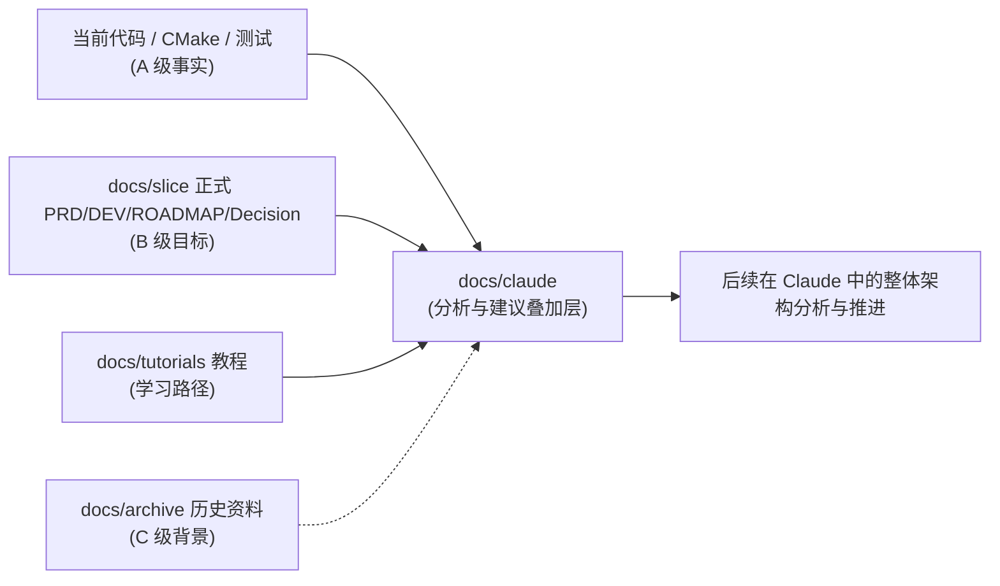

# Claude 架构分析文档集（SliceSoft）

> 文档作者：Claude（Opus 4.8）作为「资深产品经理 + 高级架构师」视角产出
> 生成日期：2026-07-22（2026-07-22 目录重组为二级结构）
> 分析基线：主线代码 + `docs/tutorials`（教程 v1.0，基线 2026-07-20）+ `docs/slice` 正式文档 + `.agents` 规则
> 定位：**分析与建议叠加层**，不是产品真源

## 0. 这套文档是什么、不是什么

本目录（`docs/claude/`）是 Claude 对 SliceSoft 仓库做整体架构、完整度与演进方向分析后产出的一组文档。之所以单独建目录并以 `CLAUDE_` 前缀命名，是为了和 **codex 主导开发**的正式文档（`docs/slice`、`docs/codex_task`）、教程（`docs/tutorials`）明确区分：

- 本目录**不修改**任何生产协议、代码、正式决策；
- 本目录中的「建议」「方案」「打分」均为 Claude 的分析结论，属于证据分级中的**推导/建议层（P 级）**，不能当作已批准的项目状态或已实现的功能；
- 当本目录与当前代码、`docs/slice` 正式决策冲突时，**以代码和正式决策为准**，并应回头修订本目录。

一句话概括当前判断：**SliceSoft 是一个工程化程度罕见地高、协议与证据纪律极强的"上游切片 + 交付契约"原型；它在 legacy 单模式下已能稳定产出合规 `p0.rgbwsv.2` 包，真正的瓶颈不在"能不能切片"，而在三处——① 概念管线（14 步）尚未从 4830 行的 `slicer.cpp` 单体中拆出；② 双模式生产写包（12E-08D）被真实模型拓扑修复与 Release 预算冻结阻断；③ 从"切片原型"到"正式 Host Software"的产品面（作业管理、设备/材料 Profile 生命周期、RIP 对接）尚未展开。**

## 1. 目录结构（二级）

借鉴 codex 在 `docs/slice` 的「按类型分文件夹」（PRD/DEV/DEMO/ROADMAP/REPORT/DOC）思路，本目录按 **BASELINE / ANALYSIS / PLANNING / VERIFICATION** 四类组织：

```text
docs/claude/
├─ README.md                         ← 本篇：索引 + 命名规范 + 结论速览
├─ BASELINE/                         ← 基线与方法（事实口径、证据分级、锚点）
│   └─ CLAUDE_00_分析方法与事实基线.md
├─ ANALYSIS/                         ← 分析（现状、架构、完整度/技术债、模块建议）
│   ├─ CLAUDE_01_项目现状评估.md
│   ├─ CLAUDE_02_系统架构分析与优化.md
│   ├─ CLAUDE_03_完整度评估与技术债清单.md
│   └─ CLAUDE_05_模块级完善建议.md
├─ PLANNING/                         ← 规划（路线图、可执行任务底稿）
│   ├─ CLAUDE_04_中长期路线图与演进计划.md
│   └─ CLAUDE_06_重构与迁移任务底稿.md
├─ VERIFICATION/                     ← 验证（事实校验记录、后续复核证据）
│   └─ CLAUDE_07_事实校验记录.md
├─ INTEGRATION/                      ← 集成落地（切片·RIP·打印三模块集成，持续修改）
│   ├─ README.md（集成索引）
│   ├─ INT_01_MVP集成方案与里程碑.md
│   ├─ INT_02_切片模块对接规范.md
│   ├─ INT_03_RIP模块API对接与使用协议.md
│   ├─ INT_04_打印软件重构判断与改造清单.md
│   └─ INT_05_联调验收与测试计划.md
├─ KNOWLEDGE/                        ← 知识库（切片与材料机制，随咨询持续更新）
│   ├─ README.md（知识库索引）
│   ├─ CLAUDE_K01_切片总流程与数据流.md
│   ├─ CLAUDE_K02_几何切片模式_scanline与relief.md
│   ├─ CLAUDE_K03_端到端管线模式_legacy与global.md
│   ├─ CLAUDE_K04_材料策略体系.md
│   ├─ CLAUDE_K05_meigui_fudiao_04实战示例.md
│   └─ CLAUDE_K06_关键领域知识.md
└─ CLAUDE_0X_*.md（根目录同名文件）  ← 过渡重定向占位，指向上述新路径
```

> **关于根目录占位文件**：初版 7 篇文档原本创建在 `docs/claude/` 根目录。本次重组已把权威内容复制进上述二级目录，并把根目录原文件改为「已迁移」重定向占位。因本会话本地沙箱（执行 `mv`/`rm` 所需）暂不可用，**占位文件暂无法自动删除**；沙箱恢复后可安全移除，一条命令即可：
>
> ```powershell
> Remove-Item docs\claude\CLAUDE_0*.md
> ```

## 2. 命名规范（统一规则）

```text
二级文件夹  =  按类型：BASELINE | ANALYSIS | PLANNING | VERIFICATION
文件名      =  CLAUDE_<两位序号>_<中文主题>.md
序号        =  全局阅读顺序，同时是跨文档引用键
              （正文中"见 02 §5.2""见 03 §2""06 剧本 P1"均指对应 CLAUDE_0X）
```

扩展约定（未来新增文件用）：

- 阶段/专题文档可加阶段码，借鉴 codex 的 `TYPE_STAGE_描述`：如 `ANALYSIS/CLAUDE_ANALYSIS_12E_<主题>.md`、`VERIFICATION/CLAUDE_VERIFY_<阶段>_<主题>.md`；
- 序号 08 起留给后续新增（00–07 已用）；专题文档若不进入主阅读序列，可只用 `TYPE` 前缀而不占序号。
- **KNOWLEDGE 知识库**自成一列，用 `CLAUDE_K<两位序号>_<主题>.md`（K01 起），与分析序列 `CLAUDE_0X` 区分；索引见 [`KNOWLEDGE/README.md`](KNOWLEDGE/README.md)。

## 3. 文档索引与阅读顺序

| 序号 | 文档（路径）| 回答的核心问题 | 主要读者 |
|---|---|---|---|
| — | [README](README.md)（本篇）| 这套文档怎么用、结论速览 | 全体 |
| 00 | [BASELINE/CLAUDE_00 分析方法与事实基线](BASELINE/CLAUDE_00_分析方法与事实基线.md) | 用什么证据、什么口径分析，基线是什么 | 架构师、后续 Claude 会话 |
| 01 | [ANALYSIS/CLAUDE_01 项目现状评估](ANALYSIS/CLAUDE_01_项目现状评估.md) | 现在到底做到了什么，处于哪个阶段 | 产品、架构、QA、管理 |
| 02 | [ANALYSIS/CLAUDE_02 系统架构分析与优化](ANALYSIS/CLAUDE_02_系统架构分析与优化.md) | 架构设计 vs 落地现实的差距，怎么演进 | 架构、C++/算法 |
| 03 | [ANALYSIS/CLAUDE_03 完整度评估与技术债清单](ANALYSIS/CLAUDE_03_完整度评估与技术债清单.md) | 完整度打分、阻断项、技术债台账 | 架构、C++/算法、QA |
| 04 | [PLANNING/CLAUDE_04 中长期路线图与演进计划](PLANNING/CLAUDE_04_中长期路线图与演进计划.md) | 近/中/长期怎么走，从原型到正式产品 | 产品、管理、架构 |
| 05 | [ANALYSIS/CLAUDE_05 模块级完善建议](ANALYSIS/CLAUDE_05_模块级完善建议.md) | 每个模块具体怎么补齐、怎么改 | C++/算法、模块负责人 |
| 06 | [PLANNING/CLAUDE_06 重构与迁移任务底稿](PLANNING/CLAUDE_06_重构与迁移任务底稿.md) | 可直接执行的 backlog + 迁移剧本 | 执行者、后续 Claude 会话 |
| 07 | [VERIFICATION/CLAUDE_07 事实校验记录](VERIFICATION/CLAUDE_07_事实校验记录.md) | 哪些断言经核验、哪些待复跑 | 架构、QA、后续 Claude 会话 |
| **08** | [VERIFICATION/CLAUDE_08 基线差异与文档更新清单](VERIFICATION/CLAUDE_08_基线差异与文档更新清单.md) | **当前事实的唯一入口**：07-22→07-27 变化与文档修订 | 全体（**先读**）|
| **09** | [PLANNING/CLAUDE_09 重构方案与目标架构](PLANNING/CLAUDE_09_重构方案与目标架构.md) | 是否重构、目标架构、分阶段方案（待审核）| 架构、管理、执行者 |
| **10** | [PLANNING/CLAUDE_10 切片服务接入打印软件架构分析](PLANNING/CLAUDE_10_切片服务接入打印软件架构分析.md) | DLL/子进程形态、业界参照、ABI 要点（部分结论被 11 取代）| 架构、产品、集成 |
| **11** | [PLANNING/CLAUDE_11 ry_print_demo 接入方案定稿](PLANNING/CLAUDE_11_ry_print_demo接入方案定稿.md) | 基于 ry_print_demo 真实代码的契约与职责划分（通道契约结论仍有效）| 架构、产品、集成 |
| **12** | [PLANNING/CLAUDE_12 模块化集成架构定稿](PLANNING/CLAUDE_12_模块化集成架构定稿.md) | **集成定稿**：SPI 能力模块架构、三根支柱、落地顺序 | 架构、产品、集成（**以此为准**）|
| **13** | [PLANNING/CLAUDE_13 交付形态与能力边界判断](PLANNING/CLAUDE_13_交付形态与能力边界判断.md) | DLL vs EXE 的判断；只给引擎 vs 给预处理能力包 | 架构、产品、集成 |

推荐路线：

- **想快速把握全局**：README → 01 → 04；
- **要做架构重构**：00 → 02 → 03 → 06 → 05；
- **要评估能否投产**：01 → 03（阻断项）→ 04（近期计划）；
- **要核对事实可信度**：07。

### 知识库（KNOWLEDGE，切片与材料机制）

面向"读懂切片/材料机制本身"的一组文档，随后续咨询持续更新，索引见 [`KNOWLEDGE/README.md`](KNOWLEDGE/README.md)：

- K01 切片总流程与数据流 · K02 几何切片模式（scanline/relief）· K03 端到端管线模式（legacy/global）
- K04 材料策略体系 · K05 `meigui_fudiao/04.obj` 实战示例 · K06 关键领域知识

## 4. 与项目既有文档体系的关系



本目录刻意复用项目已确立的三大纪律，以便和 codex 协作时无摩擦：

1. **证据分级 A/B/C/D/P**（见 00）——所有结论标注证据等级，绝不把「有设计/有报告字段/能出预览」当作「生产可用」；
2. **当前态 / 目标态 / 历史态 / 待确认**四抽屉——每条判断归位；
3. **红线不可碰**——`p0.rgbwsv.2`、`R G B W S V`、`uint8`、`black_is_print`、OpenVDB 默认 OFF、禁止静默回退等（见 `.agents/AGENTS.md` §4/§5，本集 00 复述）。

## 5. 结论速览（要点摘录）

以下为 Claude 判断，详细论证见对应文档。

**完整度**（详见 03）：作为"上游切片 + RGBWSV 交付契约"原型，Claude 评估整体完整度约 **72%**；其中协议/输出/校验、配置系统、测试与证据体系接近成熟（85–95%），几何与材料语义中上（70–80%），而"管线可组合性""真实模型准入""性能预算""产品化外围（作业/设备/交付）"是主要缺口。

**架构**（详见 02）：分层设计、依赖红线、`slicer_core` 对 Qt 零依赖等都**贯彻得很好**；核心缺口是**概念管线 14 步只有名字**——`RunSlicePipelineLegacy()` 经预检门后整体转调 `run_slicer()`（`pipeline/SlicePipeline.cpp:45`），全部真实逻辑仍集中在 `slicer.cpp`（约 4830 行）。这使得双模式、增量重算、单步测试、性能剖析都缺少插入点。建议按 `wrap first / move later / rewrite last` 分步落地真实管线。

**生产阻断**（详见 01/03/04）：双模式生产写包 **12E-08D 仍 BLOCKED**，根因是三个必需真实 OBJ 在严格准入下因 confirmed self-intersection / non-manifold / boundary edge 失败（`nai_you_new`、`aishen_fudiao`、`meigui_fudiao`），mesh repair 目前仅保守、默认关闭，`manual_repair_required` 不计入 production pass，且 Release 预算未冻结（`R3-04 = NO-GO/FROZEN`）。

**中长期**（详见 04）：近期（0–1 季度）聚焦"管线拆解 + 模型资产治理 + 双模式写包收口"；中期（1–3 季度）补"性能预算冻结（12F）+ 作业/项目管理 + 设备与材料 Profile 生命周期"；长期（3 季度以上）建"与 RIP/设备团队的独立接口 + 真机验收 + 可观测性/安全/交付"。

## 6. 维护约定

- 本目录任何"当前状态"结论都应带日期；阶段变化后，先更新 01/04，再更新受影响专题。
- 引用代码时链接到具体文件/符号（如 `src/slicer_core/slicer.cpp`、`pipeline/SlicePipeline.cpp:45`），不复制大段易失真代码。
- 新增分析/规划/验证文件时，按 §2 命名规范放入对应二级目录。
- 若后续在 Claude 中据此推进开发，请遵循 `.agents/AGENTS.md §7` 的实现计划模板与 §8 的验证门槛，并保持 legacy 回退证据。
