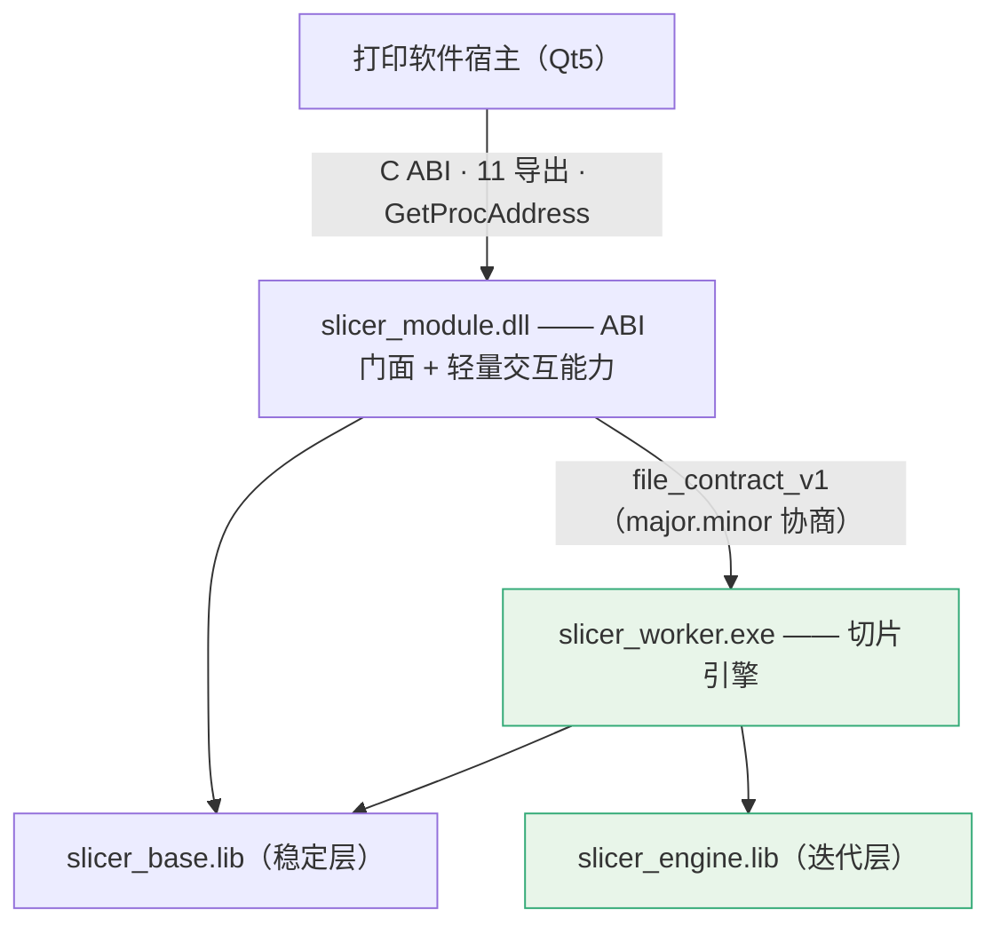

# DEV_14 切片能力包封装与打印软件集成（技术设计）

> 文档状态：✅ **ACTIVE / DESIGN BASELINE**（2026-08-04 激活，实现进行中）
> S2（RIP 接缝）权威条款见 `docs/slice/DOC/DOC_DECISION_14_S2_RIP接口合同定案.md`
> 版本：v1.1 ｜ 日期：2026-08-03 ｜ 双视图纹理修订：2026-08-05
> 作者：Claude 起草；实现前须主线开发确认
> 上游：`PRD_14`、`DOC_DECISION_14` ｜ 详细推导：`docs/claude/INTEGRATION/INT_09/10/16/17`

---

## 1. 架构总图



## 2. 目标目录结构

```text
contracts/                          可发布契约物料（三方共用）
├─ print_module_spi.h               唯一跨边界头（只含 C 类型与不透明句柄）
├─ p0.rgbwsv.2.schema.json
├─ slicer.capabilities.json
└─ file_contract_v1.md

src/slicer_core/
├─ api/                             Qt-free C++ facade（内部接口）
│   ├─ Facades.h                    ModelFacade / SceneFacade / PreflightFacade
│   │                               PackageQueryFacade / SliceFacade / RepairFacade
│   ├─ CancelToken.h                ICancelToken（所有耗时操作强制接受）
│   └─ dto/ errors/ capabilities/
├─ …（既有目录，按 base/engine 归属，见 INT_10 §4）

src/slicer_module/                  仅产出 DLL（链 base，不含 engine）
├─ exports.cpp                      11 个 pm_* 导出
├─ HandleRegistry.*                 pm_module_t / pm_job_t 生命周期
├─ BufferApi.*                      缓冲三态 WriteOut() 单一实现
├─ ErrorApi.*                       pm_last_error（TLS）
├─ RequestParser.* ResultWriter.*   JSON ↔ DTO
└─ WorkerClient.*                   契约协商 / 启动 / 进度解析 / 退出码映射

apps/slicer_worker/                 切片引擎（链 base + engine）
├─ main.cpp                         --contract-info / --spi-request
├─ JobExecutor.*                    调 SliceFacade，透传 ICancelToken
└─ StagingPublisher.*               staging → 自检 → 原子发布

apps/slicer_host_sim/               纯 C 控制台参考宿主（14E-01）
apps/slicer_ui_host_sim/            Qt5 Widgets 打印软件 UI 参考宿主（14E-02 起）
├─ module/ModuleClient.*            仅运行时解析 11 个 pm_* 导出
├─ scene/SceneInteractionController.*
├─ scene/TransformCommitPolicy.*
├─ render/TopViewRenderPolicy.*     top 带纹理 +Z 正交投影
├─ render/SceneRenderPolicy.*       three_d 带纹理网格
├─ render/AppearanceCache.*         identity 驱动的纹理/GPU 资源缓存
├─ camera/CameraController.*
└─ settings/ViewDisplaySettings.*   默认视图与 3D 投影设置
```

## 3. 三条契约

| 边界 | 契约 | 形态 | 版本轴 |
|---|---|---|---|
| 宿主 ↔ DLL | `print_module_spi.h` + 能力 DTO | C ABI + UTF-8 JSON | `PM_SPI_VERSION` |
| DLL ↔ Worker | `file_contract_v1` | 请求文件 + stdout 进度 + 退出码 + 结果文件 | **`major.minor` 独立** |
| DLL/Worker ↔ Core | `api/Facades.h` | C++ 接口（允许 STL，禁 Qt）| 随源码 |

### 3.1 宿主 ↔ DLL（要点）

11 个导出：`pm_spi_version / pm_module_info / pm_create / pm_destroy / pm_submit / pm_poll / pm_cancel / pm_result / pm_release / pm_self_test / pm_last_error`。

```text
调用约定 __cdecl（禁 __stdcall：x86 名称修饰会破坏 GetProcAddress）
导出面由 .def 固定；dumpbin /EXPORTS 恰好 11 个，无 C++ 修饰名
运行时 Release=/MD、Debug=/MDd，在 pm_module_info 自述并由宿主校验
缓冲三态：(char* out, int cap, int* out_required)，禁止部分写
DllMain 只 return TRUE；初始化放 pm_create + std::call_once
异常不得越过 ABI；一律转错误码 PM-SLICER-<CATEGORY>-<CODE4>
```

能力 DTO 字段级规格见 `INT_16` §5（`scene.apply_operation` / `slice.rgbwsv` / `package.render_layer_preview` 三个范式）。

### 3.2 DLL ↔ Worker（`file_contract_v1`）

```text
协商：slicer_worker.exe --contract-info
      → { contract, major, minor, engineVersion, produces[], capabilities[] }
兼容：major 不等 → 拒绝（PM-SLICER-INTERNAL-0099）
      Worker minor 更高 → 允许；更低 → 允许但 DLL 不用高版字段
      produces 不含 p0.rgbwsv.2 → 拒绝
执行：DLL 写 <tempDir>/<jobId>/request.json
      → slicer_worker.exe --spi-request <path>
进度：stdout 逐行 SLICE_PROGRESS phase=… current=… total=… percent=… elapsedMs=…
结果：<tempDir>/<jobId>/result.json + 退出码
取消：DLL 发终止信号；Worker 与 DLL 各清理一次 .staging（双保险）
```

### 3.3 DLL/Worker ↔ Core（`api/Facades.h`）

六条规则：① 不抛异常越过 facade；② 禁 Qt、允许 STL；③ **所有耗时操作必须接受 `ICancelToken`**；④ facade 不做 I/O 路径决策；⑤ base 侧不得依赖 engine 侧符号；⑥ 错误码直接用 `PM-SLICER-*` 全集。

接口草案见 `INT_16` §6。

## 4. 交互数据流（三车道）

```text
Transient  宿主本地矩阵 + 本地 bbox 近似 → 【不跨 DLL】
           碰撞仅作 non-authoritative 视觉反馈，不得显示为正式裁决
Commit     operationId + expectedSceneRevision → DLL 进程内权威求值
           ← newSceneRevision / sceneHash / canonicalTransform
             / collisions[] / outOfBoundsInstances[] / preflightDelta[] / viewdataIdentity
           正常成功直接采用 apply_operation 响应，不强制追加 get_snapshot
           revision 不符 → PM-SLICER-LAYOUT-0022（SceneRevisionStale），不静默覆盖
           仅 Stale、显式刷新或恢复流程调用 get_snapshot
           同 operationId 重试必须幂等
Production slice.rgbwsv 只接受已提交 sceneHash；Worker 内重跑 full preflight
```

### 4.1 关键不变量：权威判定必须在 Worker 内

因 base（随 DLL）与 engine（随 Worker）可能版本不同：

```text
① fast preflight 结果【只是提示】，返回时必须标注 authoritative: false
② 任何进入生产的准入判定必须在 Worker 内重新执行 full preflight
③ fast 只允许漏报（说通过但实际阻断），不允许误报为阻断
```

## 5. 承载分派

| 能力 | 需要 | 承载 |
|---|---|---|
| `model.import` / `get_metadata` / `release` | base（待 14B-00 验证）| DLL 进程内 |
| `scene.apply_operation` / `get_snapshot` / `get_viewdata` | base | DLL 进程内；`get_viewdata` 的纹理 Provider 由 14B-03A 落地 |
| `geometry.collision` / `preflight(fast)` | base | DLL 进程内 |
| `package.verify` / `get_summary` / `get_layer_descriptor` / `render_layer_preview` / `read_report` | base | DLL 进程内 |
| `geometry.preflight(full)` / `geometry.repair` | engine | **Worker** |
| **`slice.rgbwsv`** | engine | **Worker（唯一路径）** |

> 规则：若某轻量能力实际需要 engine → **该能力改为 Worker 承载**，不得把 engine 拉进 DLL。

> 🔑 **本表是承载分派的单一真源（2026-08-04 确立）。**
> `src/slicer_module/` 中的 `syncCapabilities[]` 数组必须与本表**逐条一致**：
> 凡本表标「DLL 进程内」的能力才可入该数组，标「Worker」的一律不得入。
> 14C-04 的验收包含该一致性检查；两者出现分歧时**以本表为准**，不得反向修改本表迁就实现。
>
> ⚠️ `model.import` 是 15 项中**唯一未定归属**的能力，结论由 **14B-00** 给出。
> 在 14B-00 出结论前，`syncCapabilities[]` 不得写入该项。

### 5.1 双视图纹理 ViewData

`scene.get_viewdata` 复用既有能力名和 `pm_submit/pm_result` blob 通道，不增加第 16 项能力或
第 12 个导出。合同版本由 `slicer_capability_dtos` 1.1 受控修订为 1.2：

```text
top       surfacePreview（RGBA8 / sRGB / straight alpha / top-left）+ 世界边界
three_d   mesh + texcoord0 + submeshes + materials + texture blobs
缓存      meshIdentity / appearanceIdentity / textureIdentity / previewIdentity 分离
失败      声明纹理但缺文件、解码失败或 UV/材质绑定无效 → INPUT-0001/0002
禁止      以“成功 + 灰模”掩盖纹理失败；auto LOD 只能降几何/纹理分辨率，不能删除纹理
```

新增原子任务 **14B-03A `TexturedSceneViewDataProvider`**。14A-04-R1 只冻结合同，
14B-03A 才负责从 OBJ/MTL/3MF 与现有模型缓存生成上述 ViewData；14E-04c 不得绕过该 Provider
直接读取 `slicer_core` 内部对象。

### 5.2 UI 参考宿主与渲染边界

参考宿主采用固定信息架构：顶部作业命令，左侧实例树，中央 top/three_d 纹理画布，右侧上下文
属性/切片设置，底部任务、层预览与模块诊断。工作区分为“准备”“切片预览”“模块诊断”，
避免把设备/RIP 诊断长期塞在建模画布中。

首版 3D 后端使用 **`QOpenGLWidget + QOpenGLFunctions`**：复用现有 Qt5 Widgets/Gui，
不引入新的 vcpkg 包；Qt3D 因部署模块、维护面和打印侧移植成本较高不采用。渲染后端不得拥有
Scene 真值：相机、拾取、纹理上传和瞬时矩阵均为宿主本地状态，Commit 仍由模块权威求值。

设置页保存默认 `top` / `three_d`；中央画布提供即时分段切换。两种入口只改变相机与呈现策略，
不得改变 scene revision、选中集、实例变换或作业状态。白色/近白纹理由非纯白平台、轮廓线、
选中高亮和透明棋盘格辅助辨识，辅助显示不得写回纹理或 TIFF。

## 6. 线程与取消

```text
pm_module_t  允许多线程并发 pm_submit（内部锁）
pm_job_t     单线程操作；允许 A 线程 poll + B 线程 cancel（std::atomic<bool>）
pm_release   对 running job 必须先取消并 join，不得杀线程
取消链路     pm_cancel → JobTable 置标志 → WorkerClient 发终止 →
             Worker 内 ICancelToken 在 step 边界与逐层循环检查 → 退出 → 清理 staging
状态         Cancelling ≠ Cancelled：真实退出后方可置 Cancelled
```

## 7. 安全发布

```text
① 写 <targetDir>.staging/
② 全部写完 → 模块自检（package.verify 校验自身输出符合 p0.rgbwsv.2）
③ 自检通过 → 原子 rename 为 <targetDir>
④ 失败或取消 → 删除 .staging，不留残留
校验器必须能识别并拒绝 .staging / .tmp / .bak 目录
```

## 8. 验证策略

| 层 | 内容 |
|---|---|
| L1 | facade 单测（每个 facade 正/负例）|
| L2 | C-SPI-01..18 一致性套件（`test_spi_conformance`）|
| L3 | 引擎一致性套件 E-01..08（Worker 替换准入门）|
| L4 | S1 接缝契约测试（正例 + 7 类负例）|
| L5 | 端到端：单模型 / 多模型 / 取消 / 大场景 / 模块缺失；top/three_d 纹理、视图切换、白色纹理辨识与纹理负例 |
| L6 | 稳定性：边打印边切片、强杀 Worker、磁盘满、长时连续 |
| L7 | 三方联调（打印侧 M1–M5 + RIP）|

统一硬门：`cmake --build` → `run_ci_quick.ps1` → `RepairDisabled` SHA-256 不变 → RIP strict。

## 9. base/engine 分层迁移

六步（P0 可行性验证 → P1 两库骨架 → P2 迁 base → P3 迁 engine → P4 CI 单向依赖门禁 → P5 DLL 只链 base 验证），详见 `INT_17` §6。

三个高风险切分点：`model.cpp`(1970 行) 与几何耦合；`geometry/` 需按"查询 vs 分析"切开；`reports/`/`diagnostics/` 需按"读取展示 vs 切片期生成"切开。

## 10. 风险

| 风险 | 缓解 |
|---|---|
| `model.cpp` 拆不进 base | 14B-00 先验证；退路是 `model.import` 改 Worker 承载 |
| base/engine 循环依赖 | CI 单向检查（P4）|
| 引擎替换引入版本组合矩阵 | 只保证 major 内兼容 + E-01..08 准入门 |
| fast/full 判定不一致 | §4.1 三条不变量 |
| ABI 过早冻结 | 机制层先冻（11 导出稳定），能力面用 capability 声明扩展 |
| 分层退化回单库 | P4 门禁 + 新文件必须显式归属 |
| 14A-04 冻结后缺少纹理字段 | 通过 14A-04-R1 受控 minor 修订补齐，保持 11 个导出、15 项能力和 `PM_SPI_VERSION=1` 不变；打印侧按 1.2 回签 |
| 合同已有字段但 Provider 未实现 | 14B-03A 成为 14E-04c 硬前置；不得用灰模假装完成 |
| UI Gate 自循环 | `14C-06 + 14D-05` 只形成 M-MVP-CANDIDATE；14E-01 纯 C 宿主闭环 PASS 后才形成 M-MVP 并解锁 Qt UI |
| 拖拽期碰撞被误当权威 | Transient 仅本地 bbox 提示；Commit 响应才显示权威碰撞/越界结果 |
| 3D 后端扩大依赖面 | 首版固定 QOpenGLWidget；不引入 Qt3D 或新第三方库 |

## 11. 修订记录

| 日期 | 版本 | 变更 |
|---|---|---|
| 2026-08-03 | v1.0 | 首版。四目标构建结构；三条契约与版本轴；三车道数据流与"权威判定必须在 Worker 内"不变量；承载分派；取消链路；L1–L7 验证策略；base/engine 六步迁移 |
| 2026-08-05 | v1.1 | 补齐双视图纹理 ViewData、14B-03A Provider、UI 参考宿主信息架构与 QOpenGL 后端；修正 M-MVP 自循环、Transient 碰撞权威性和 Commit 多余快照调用 |
