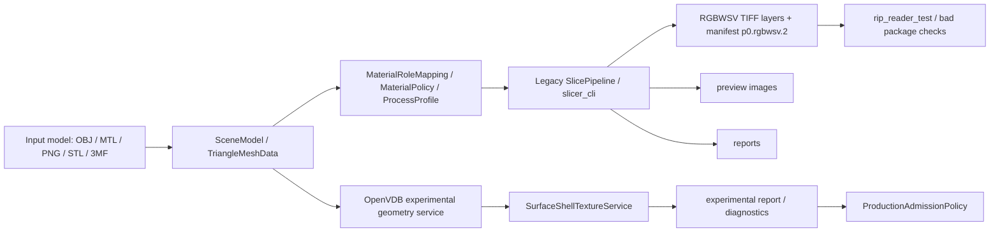

# DEV_DEMO_IMPLEMENTED_SliceSoft_当前Demo技术基线

> 文档版本：v1.0
> 文档状态：Implemented Demo DEV Baseline
> 生成日期：2026-06-30
> 当前阶段：Stage 10 已完成，当前执行 11 UI 切片层预览、交互配置与多模型能力评估
> 证据范围：当前仓库代码、`CMakeLists.txt`、脚本、测试目录、已归档阶段报告

## 1. 技术定位

当前实现采用 C++20 / CMake / Qt 5.15 可选 UI / vcpkg OpenVDB 可选依赖的工程结构。核心代码集中在 `slicer_core` 静态/对象库，CLI、demo app、Qt UI、测试和脚本围绕 `slicer_core` 建立。

OpenVDB 是可选实验能力：

```cmake
option(USE_OPENVDB "Enable optional OpenVDB adapter" OFF)
```

这意味着正式 production path 仍应能在 OpenVDB OFF 情况下构建和验证。

## 2. 当前构建目标

| 目标 | 类型 | 作用 |
|---|---|---|
| `slicer_core` | library | 切片核心、模型导入、RGBWSV、材料、支撑、报告、OpenVDB adapter |
| `slicer_cli` | executable | legacy production CLI 与 09P experimental diagnostic CLI 入口 |
| `rip_reader_test` | executable | RGBWSV/RIP 前置包读取和摘要验证 |
| `slicer_debug_ui` | Qt executable | 调试 UI、配置编辑、preview/profile 可视化 |
| `geometry_kernel_demo` | executable | experimental geometry kernel demo |
| `surface_shell_texture_demo` | executable | surface shell texture demo |
| `surface_shell_real_model_demo` | executable | 真实模型壳层纹理 demo |
| `surface_shell_robustness_demo` | executable | 鲁棒性诊断 demo |
| `*_unit_tests` | executable | 支撑、壳层纹理、admission、config、composer 等单测 |

## 3. 当前核心模块

| 模块 | 代码路径 | 职责 |
|---|---|---|
| 配置 | `src/slicer_core/config*`, `src/slicer_core/config/` | 配置解析、schema、migration、normalized config |
| 模型与场景 | `src/slicer_core/model.*`, `src/slicer_core/scene/` | demo 模型、SceneModel、基础几何数据 |
| 导入器 | `src/slicer_core/importers/` | OBJ、MTL、3MF package/XML/texture/material 解析 |
| 切片与栅格 | `src/slicer_core/slicer.*`, `src/slicer_core/raster/` | legacy slicing、栅格边界和层数据 |
| RGBWSV 输出 | `src/slicer_core/tiff_io.*`, `src/slicer_core/output/rgbwsv/` | TIFF 写入、package manifest、协议输出 |
| RIP 读取 | `src/slicer_core/rip_reader.*` | package reader、摘要和兼容性检查 |
| 材料策略 | `src/slicer_core/material*`, `src/slicer_core/materials/` | role mapping、process profile、policy、channel composer |
| 支撑 | `src/slicer_core/support/` | support policy、component analysis、shape optimization/report |
| 报告 | `src/slicer_core/reports/` | report base、schema、validator、writer |
| 几何内核 | `src/slicer_core/geometry/` | OpenVDB adapter、SDF shell、topology/robustness diagnostics |
| 实验纹理 | `src/slicer_core/materials/texture_application/` | surface shell texture、attribute map、texture transfer、benchmark/report |
| 系统指标 | `src/slicer_core/system/` | process memory stats |

## 4. 当前数据流



## 5. 已实现工程能力

### 5.1 协议与输出

```text
p0.rgbwsv.2 package manifest
RGBWSV channelOrder = R G B W S V
uint8 bit depth
black_is_print polarity
TIFF storage mode compatibility
legacy tiled package reader
bad package negative cases
```

### 5.2 输入与材料

```text
OBJ / MTL / PNG texture
3MF stored / deflate
3MF BaseMaterial / ColorGroup / Texture2DGroup
MaterialRoleMapping
MaterialPolicy
MaterialProcessProfile
MaterialChannelComposer
```

### 5.3 支撑与光油

```text
SupportPolicy
SupportShapePolicy
SupportShapePipeline
SupportComponentAnalysis
VarnishGeometryPolicy
support_shape_unit_tests
support shape reports
```

### 5.4 OpenVDB 实验链路

```text
OpenVDB optional dependency
OpenVdbAdapter
OpenVdbGeometryKernelService
OpenVdbLevelSetBuilder
OpenVdbSurfaceShell
SurfaceShellTextureService
SurfaceTextureTransfer
SurfaceShellRealModelPrototype
MeshTopologyDiagnostics
MeshRobustnessDiagnostics
ProductionAdmissionPolicy
```

### 5.5 测试与脚本

当前仓库存在以下验证入口：

```text
scripts/run_ci_quick.ps1
scripts/run_regression.ps1
scripts/run_schema_tests.ps1
scripts/run_golden_tests.ps1
scripts/run_3mf_negative_tests.ps1
scripts/run_openvdb_smoke.ps1
scripts/run_geometry_kernel_tests.ps1
scripts/run_surface_shell_texture_tests.ps1
scripts/run_surface_shell_real_model_tests.ps1
scripts/run_surface_shell_robustness_tests.ps1
scripts/run_surface_shell_benchmarks.ps1
scripts/run_09p_experimental_pipeline_tests.ps1
scripts/run_09p_cli_experimental_tests.ps1
```

本文件只记录这些入口存在；未声明本轮已运行全部验证。

## 6. 生产安全边界

当前必须保持：

```text
USE_OPENVDB 默认 OFF
OpenVDB 不是 mandatory dependency
legacy slicer_cli production path 不替换
experimental OpenVDB path 不写真实 OBJ/3MF production RGBWSV TIFF
p0.rgbwsv.2 不变
RGBWSV channel order 不变
bitDepth=8 不变
black_is_print 不变
warn_and_attempt 不 productionAllowed
confirmed self-intersection fail fast
non-manifold / duplicate / opposite duplicate / local winding block strict admission
```

## 7. 当前技术债

| 技术债 | 影响 |
|---|---|
| `model.cpp` / `slicer.cpp` 仍承载较多 legacy 职责 | 正式化前需继续拆分边界 |
| report schema 尚未完全产品化 | UI、CI、golden 难稳定对齐 |
| experimental report 与 production report 边界需更清楚 | 容易误把实验诊断当生产输出 |
| OpenVDB ON/OFF CI matrix 尚需收敛 | 不同环境验证结果难比较 |
| mesh repair 只有前置判断需求，未形成正式模块 | 真实模型准入仍会被拓扑问题阻断 |
| Qt Debug UI 仍是调试工具 | 不能替代正式作业工作台 |

## 8. 09P-R2 技术重点

```text
1. 固化 p0.experimental_openvdb_shell_cli_report.1；
2. 建立 productionAdmission gate matrix；
3. 定义 mesh repair pre-check，不做隐式自动 repair；
4. 收敛 OpenVdbGeometryKernelService / SurfaceShellTextureService / MaterialChannelComposer 数据契约；
5. 建立 OpenVDB OFF / ON CI matrix；
6. 让 Qt Debug UI 读取 report，而不是直接依赖 OpenVDB 内部类型；
7. 生成 REPORT_09P_R2。
```

## 9. 建议验证入口

常规验证：

```powershell
cmake --build build --config Debug
ctest --test-dir build -C Debug --output-on-failure
powershell -ExecutionPolicy Bypass -File .\scripts\run_ci_quick.ps1
```

OpenVDB OFF / unavailable 验证：

```powershell
powershell -ExecutionPolicy Bypass -File .\scripts\run_09p_cli_experimental_tests.ps1
```

OpenVDB ON 验证需要本机 vcpkg/OpenVDB 环境：

```powershell
powershell -ExecutionPolicy Bypass -File .\scripts\run_openvdb_smoke.ps1
powershell -ExecutionPolicy Bypass -File .\scripts\run_09p_experimental_pipeline_tests.ps1
```

## 10. 结论

当前技术基线已经具备正式项目化的骨架：核心库、CLI、UI、报告、测试、脚本、OpenVDB optional path 都已存在。
下一步不是重写 demo，而是把当前骨架中的实验能力、生产输出、准入策略、报告 schema 和 UI 展示边界整理成可回归、可解释、可审计的正式工程流程。
