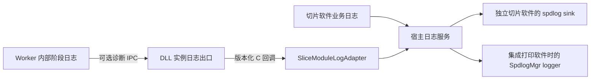

# LOGDUMP DLL 日志回调与双层复用接口草案

> 日期：2026-09-14；版本：v0.3（状态索引修订）；状态：PREPARATION_SNAPSHOT / SUPERSEDED_BY_IMPLEMENTATION。
> 本文第 1 节起保留 v0.2 接口草案的历史正文；“只有 11 个导出”“API 未实现”“待开发”“本轮未测试”等均为当时快照，不代表当前工作树。用户后续已授权按计划开发，本地准入见 [A00 开发准入与日志扩展定案](DOC_DECISION_LOGDUMP_A00_开发准入与日志扩展定案.md)。
> 当前可编译接口以 [slicer_logging.h](../../../contracts/slicer_logging.h) 为准，实际实现和覆盖范围见 [本地实现与验证状态](../REPORT/REPORT_LOGDUMP_本地实现与验证状态.md)。本草案不再作为实现细节的最终依据；保留原 SPI 签名与增量日志导出的界线仍有效。
> 关联：[准备快照及当前差异索引](DOC_PREP_LOGDUMP_日志与崩溃转储模块设计及实施准备.md)、[唯一任务状态源](../../codex_task/current/TASKS_LOGDUMP_日志与崩溃转储可复用模块专项任务清单.md)。模拟宿主验证不能替代真实 PrintApp 集成或全门禁验收。

## 0. 草案与当前接口差异索引

| 草案位置 / 预期 | 当前实现及限制 | 源码 / 决策 |
|---|---|---|
| §3、§8：函数声明、返回码和导出白名单待固化 | 扩展版本 1，已有 slicer_log_api_version、slicer_set_log_callback_v1、slicer_clear_log_callback_v1 三个可选导出，原 11 个 pm_* 签名不变。返回码为 OK=0、INVALID_ARGUMENT=-1、INVALID_STATE=-2、TIMEOUT=-3、RESOURCE_ERROR=-4；动态探测全部导出和精确版本后才注册 | [正式 C 头](../../../contracts/slicer_logging.h)、[绑定](../../../src/diagnostics/host/ModuleLogBinding.cpp) |
| §4：队列和关闭设计 | 模块每实例 256 条，宿主默认 1024 条，JSON 最大 16 KiB；注销成功才可释放 callback/context。绑定析构对任何非 OK 结果重试，LogSession::Close 排空并 join；永久阻塞时不保证有界关闭，也不强杀回调/日志线程 | [A00](DOC_DECISION_LOGDUMP_A00_开发准入与日志扩展定案.md)、[绑定](../../../src/diagnostics/host/ModuleLogBinding.cpp)、[宿主队列](../../../src/diagnostics/host/LogSession.cpp) |
| §5：timestampUtc 与扩展字段建议 | 已实现 timestampUtcMs（UTC 毫秒整数）及 sourcePid/sourceTid/sourceProcessRole；未定义 threadRole、ok、elapsedMs、pathShort 独立字段。message 最大 2048 字节、其他文本字段最大 128 字节；编码截断用 truncated，非零模块损失计数可附 diagnosticLoss | [LogEvent](../../../src/diagnostics/LogEvent.h)、[编码](../../../src/diagnostics/LogEvent.cpp) |
| §5：未知等级警告并保留原值 | 实际只接受 0..5 的事件等级、-1..5 的配置等级；未知等级与无效 schema/尺寸拒绝，不转为正常日志。未知扩展版本或部分导出只关闭模块日志功能，保留业务 SPI 兼容 | [事件校验](../../../src/diagnostics/LogEvent.cpp)、[绑定](../../../src/diagnostics/host/ModuleLogBinding.cpp) |
| §2、§6：Worker 尚未接专用环境；外部 RIP 标 sourceProcessRole=rip | Worker 已有专用 Unicode 环境块和本机非阻塞 pipe，接收端校验实际源 PID，关联 jobId/moduleInstanceId；原业务文件协议不变。外部 RIP 日志由宿主采集，sourceProcessRole/PID/TID 反映采集宿主，module=rip；不能将这些字段误读为 RIP 子进程原生事件 | [WorkerClient](../../../src/slicer_module/WorkerClient.cpp)、[转发校验](../../../src/slicer_module/logging/ModuleLogRegistry.cpp)、[应用日志](../../../src/diagnostics/host/ProcessDiagnostics.cpp) |
| §2、§5：宿主后端和复用交付 | spdlog 文件后端私有编入 slicesoft_diagnostics_host；注入自有 sink 后不创建默认文件后端。Qt 桥接位于参考宿主应用层，DLL 不依赖 Qt/spdlog；真实 PrintApp 桥接未实施，不能把 mock 共存测试等同实际 SDK 集成 | [实际 target](../../../cmake/SliceSoftDiagnostics.cmake)、[宿主服务](../../../src/diagnostics/host/LogSession.cpp)、[验证报告](../REPORT/REPORT_LOGDUMP_本地实现与验证状态.md) |
| §6、§7：DUMP 与验收计划 | reporter/helper 已在自有 EXE 接线，异常注入仅专用测试子进程；已实测的是未处理 AV，不承诺其他终止机制或外部 RIP。正文 L0..L5 为历史计划，完成项、既有失败和未验证项按当前报告及任务表判定，不在本文笼统标全通过 | [CrashReporter](../../../src/diagnostics/windows/CrashReporter.cpp)、[当前报告](../REPORT/REPORT_LOGDUMP_本地实现与验证状态.md) |

## 1. 已核实的打印 SDK 模式

参考根目录：`E:/__Code/__Work/ry_print_demo/PrintSolution`；只读源码与头文件，没有执行 SDK 或设备指令。

| 文件 | 读取证据 | 对本设计的影响 |
|---|---|---|
| `A3DSDK/include/A3DDefs.h:17,240` | LogLevel 为 Off=-1、Trace=0、Debug=1、Info=2、Warning=3、Error=4、Critical=5；LogCallback 为 std::function<void(LogLevel, const std::string&)> | 复用级别与“等级+内容”模型，但切片跨 DLL 接口使用 C 回调 |
| `A3DSDK/include/A3DSDK.h:117` | SetLogCallback 按 SDK 实例设置；头文件声明空回调可取消、可能由工作线程通知、SDK 同步注册/取消并隔离回调异常 | 按模块实例注册；切片自己明确并测试注销等待、线程和生命周期，不能仅凭参考注释证明实现 |
| `PrintApp/src/business/printer/VendorEngineAdapter.cpp:871,3231` | 设备专属 DeviceSdkLogger；回调按级别转入 m_sdkLogger，trace/debug 受 dev profile 控制，附 module/action/phase/threadRole 等信息 | 宿主管落盘，SDK 管事件；打印端只需同形 adapter，切片模块无需依赖 PrintApp |
| `PrintApp/src/business/foundation/LogSchema.h` | module/action/phase/tid/threadRole/deviceId/ok/code/elapsedMs/pathShort 字段 | 适配时沿用这些字段含义，增加切片作业关联字段，避免重新造一套宿主日志格式 |
| `A3DSDK/CMakeLists.txt:1` | 当前目标导入预编译 PrintSDK.dll，不编译 A3DSDK/src | src/core/PrinterEngineAdapter.cpp 和 Stub 不是现用 SDK 的内部实现证据；A3DLog.h 的 GlobalLogger 也不能证明现用 DLL 的具体路由 |

参考头文件提供的是供应方声明；本地可见宿主如何注册并转发。没有证据证明供应 DLL 的所有内部日志均到回调，也未实测其取消后在途回调保证。本组件必须自行完成该验证。

## 2. 两部分职责与数据流

| 部分 | 负责 | 不负责 |
|---|---|---|
| 切片模块日志 | DLL 初始化后生命周期、参数解析/校验、能力路由、Worker 启停与作业阶段/错误；Worker 内核心阶段通过独立诊断通道归集；按模块实例输出事件 | 文件目录、轮转、Qt、宿主全局 logger、崩溃过滤器 |
| 切片软件日志 | UI 操作、配置变更摘要、模型导入/排版/作业流程、RIP 子进程、部署环境；接收模块回调并管理持久化、查询/导出、等级与配额 | 从宿主外部猜测替代 DLL 内部原因，修改业务错误或生产数据规则 |

两部分按职责区分，不等同于两个进程；DLL 在宿主内，核心计算主要在 Worker 内。模块日志 domain 为 `slicer.module`，软件日志为 `slicer.app`；Worker 保留 `sourceProcessRole=worker`，外部 RIP 保留 `sourceProcessRole=rip`。



图中两个落盘目标为可选宿主实现；同一事件默认只写当前宿主选定的一个目标。嵌入 PrintApp 时不再额外创建一套 SliceSoft 全局轮转日志，不将切片模块归属强行绑定到某台打印设备。

建议开发目录：

```text
contracts/slicer_logging.h                可选扩展的 C 头文件，开发阶段新增
src/diagnostics/                          通用事件/级别/队列与宿主接口
src/slicer_module/logging/                实例日志出口、注册与注销实现
src/diagnostics/host/                     可复用宿主 adapter、实例绑定 RAII
src/diagnostics/spdlog/                   独立软件的私有文件后端
apps/slicer_worker/                       Worker 事件发送边界
apps/slicer_ui_host_sim/                  Qt 桥接、软件日志调用点
tests/diagnostics/                       C ABI、生命周期、双宿主与 IPC 测试
```

模块出口只依赖轻量纯 C++ 事件/调度组件，不链接 spdlog 或 Qt。可复用 host adapter 不依赖 PrintApp 类型；打印侧桥接代码最终在 PrintApp 工程中把事件传给已有 logger。当前仓库先交付 mock 宿主样例。

## 3. C 回调扩展草案及兼容范围

现状：`contracts/print_module_spi.h` 与 `src/slicer_module/slicer_module.def` 只有 11 个冻结 pm_* 导出，没有日志注册；`pm_create` 当前忽略 optionsJson。不能声称现有初始化 JSON 已支持回调，也不能把地址编码成 JSON/环境变量传递。

建议在**同一个 slicer_module.dll** 上新增独立版本的可选扩展导出；沿用 opaque pm_module_t 作为归属。既有 pm_* 函数签名和 PM_SPI_VERSION=1 不变，但导出表确实变化，必须记录为受控 ABI 增量并更新精确白名单，不能写成“ABI 完全没变”。

以下仅为可评审的接口草案，不是当前可编译 SDK。调用约定使用项目 PM_CALL（__cdecl），最终导出宏、返回码数值在 LD-A00 固化：

```c
typedef void (PM_CALL *slicer_log_callback_v1)(
    void* user_context,
    int level,
    const char* event_json_utf8,
    int byte_count);

int PM_CALL slicer_log_api_version(void);
int PM_CALL slicer_set_log_callback_v1(
    pm_module_t* module,
    slicer_log_callback_v1 callback,
    void* user_context,
    int minimum_level);
int PM_CALL slicer_clear_log_callback_v1(
    pm_module_t* module,
    int timeout_ms);
```

- `void*` 仅为不解引用、不释放的宿主上下文令牌；函数指针和该令牌是本扩展明确新增的边界元素。不得据此放开原 SPI 的结构体/STL/C++ 对象跨边界限制。
- `api_version` 只返回扩展版本，不创建会话；扩展头文件可由 C 编译器独立包含，不迫使旧宿主引入 spdlog、Qt、fmt 或打印 SDK。
- `event_json_utf8` 是长度限定的 UTF-8 单个事件；内容包括 message 与结构化字段。内存由 DLL 保持到回调返回，宿主如果异步处理必须先复制。空字节等消息内容按 JSON 转义，不把消息当格式串。
- C++ 宿主内部可提供 `SetLogCallback` 风格封装，但 std::function/std::string 仅留在宿主内部；切片 DLL 不采用供应 SDK 的 C++ 虚表 ABI。

| 组合 | 目标行为 |
|---|---|
| 旧宿主 + 新 DLL | 11 个旧接口继续有效；未注册时模块出口关闭，不产生自己的日志文件/线程 |
| 新宿主 + 旧 DLL | 动态探测扩展不存在，保留软件日志与既有错误接口；显示“不支持模块日志扩展”，切片功能仍可用 |
| 新宿主 + 新 DLL | 创建实例后注册回调，模块日志流入该宿主 logger |
| 新宿主 + 部分导出/未知版本 | 不调用不兼容函数，只禁用扩展并记录原因；不能把可选日志升级成装载切片 DLL 的硬前提 |

UI 的 `ModuleClient::ResolveExports` 和纯 C host 的 `HostModuleApi.c` 现有必需导出解析保留，另加可选 GetProcAddress 探测。新宿主不能静态强链接新导出，否则“兼容旧 DLL”会在加载前失效。导出白名单/加载器/符号清单的精确断言须增加新旧两套 fixture，而非删除限制。

## 4. 生命周期、并发与失败规则

1. 每个 pm_module_t 只有一个注册槽；宿主需要多文件/UI 展示时在宿主自行 fan-out。未注册时不调回调、不落盘；注册前的 pm_create 失败由 pm_last_error 和软件日志记录，首版不保证回放创建之前的日志。
2. setter 显式创建本实例有界调度资源。已注册时再次注册返回 invalid-state，必须先 clear 成功；`minimum_level=-1` 关闭事件投递，合法事件级别只有 0..5。版本/句柄/等级/空 callback 校验失败不得改变原状态。
3. DLL 生产线程只写入有界队列；一个实例的 dispatcher 串行调用回调，不持有模块、作业或注册锁跨回调。不同模块实例可以并发通知，严禁复用“当前实例”全局变量。
4. 回调必须快速复制/入队后返回，不执行磁盘 I/O、阻塞等待、GUI 访问或重新进入同实例的 pm_* / 注册接口；清理自身的调用返回 invalid-state 且不改变注册状态，避免自等待。宿主 UI 在自己的桥接层排队到 GUI 线程。
5. clear 先禁止新投递并丢弃尚未分发的队列事件，再等待在途回调完成；只有 success 保证后续不会再访问旧 callback/context。重复 clear 为幂等成功。
6. clear 超时返回明确 timeout，实例保持停止投递/等待在途完成状态。宿主必须保留 callback/context、模块句柄和 DLL，之后重试；不能在失败返回后释放上下文或 FreeLibrary，不能 detached 回调线程继续使用卸载代码。
7. 标准关闭顺序：停止提交 → 取消/等待作业并 pm_release → clear 成功 → pm_destroy → 释放宿主绑定对象 → FreeLibrary → 关闭宿主 logger。pm_destroy 在未先 clear 时防御性停止和等待回调；任意回调永久不返回时无法同时保证有界销毁与内存安全，不声称能强制安全回收，交由宿主显式退出策略处理。
8. 正常 C++ 回调异常应由宿主 thunk 捕获，DLL 也做边界保护；禁用该绑定并累计故障，防止递归写相同失败回调。访问异常/内存损坏不是普通异常隔离承诺，由进程 reporter 处理。
9. 队列溢出、截断、关闭时丢弃与回调失败计数分别记录；每实例序号与 source PID/TID 保留，跨进程不承诺严格总时序。错误事件不能变成业务状态的另一个真源。

信息查询、pm_self_test 和 pm_last_error 自身不发送会导致落盘的模块日志，即使已经注册；宿主可在调用边界记录用户动作。扩展注册/注销的失败使用扩展返回码，不覆盖既有 pm_last_error 业务详情，防止诊断路径污染诊断对象。

SDK 声明可同步取消，但没有给出本设计的成功后不再回调/超时策略；这些是切片端新增要求，须由压力测试证明。

## 5. 字段、等级和宿主复用

事件 `schema=diagnostics.event.v1`，最小字段建议为 `domain, moduleInstanceId, jobId, eventSequence, timestampUtc, sourcePid, sourceTid, sourceProcessRole, level, module, action, phase, code, message`；可附 `threadRole, ok, elapsedMs, pathShort`。公共消息/字段上限与截断编码在 LD-A00 定案；事件来源线程不能被 adapter 的回调线程 ID 覆盖。

等级映射显式 switch：0→trace、1→debug、2→info、3→warn、4→error、5→critical；Off=-1 仅为配置值。沿用打印 SDK 数值便于理解，但不依赖 SDK/spdlog enum 的二进制布局；异常未知值由 adapter 警告并保留原值。

独立软件推荐 `app.log` 和 `slicer_module.log` 分类保存，RIP 使用 `rip.log`，由同一宿主服务管理总配额。打印宿主可以将模块日志送入现有 ModuleLogger 或专属 slicer logger；仅当打印作业确实绑定设备时才附 deviceId/选择设备目录。

复用交付范围：扩展 C 头、动态探测与 RAII 绑定、通用级别/字段映射、事件解码器、mock PrintApp sink 示例与兼容测试。打印宿主只替换 sink adapter 和日志目录策略，DLL 与 Worker 不需要因换宿主重新编写日志实现。

## 6. Worker 与 DUMP 不能遗漏的边界

Worker 是独立进程，不能调用宿主地址空间的 callback/context。应通过独立诊断 IPC 将事件发到所属 DLL 实例，再由该实例调回调；文件请求/结果与 stdout/stderr 合同不变。

建议每作业随机命名的本机 pipe 作为诊断通道，当前用户访问控制、绑定预期 PID/会话和长度上限；端点由父进程专用 Unicode 环境块传递。现有 WorkerClient 的 CreateProcessW 环境参数为 nullptr，故这属于后续真实接线工作，不能仅增加环境变量文档就算完成。

诊断读取独立于结果等待/取消，队列与连接超时有界；旧 Worker 忽略新环境键，新 Worker 在键缺失/连接失败时沿用既有 stderr 和独立日志策略。端点失败不阻断 Worker 作业，也不修改 file_contract_v1。鉴于任意打印宿主会直接复用 DLL，IPC 接收端应随模块部署，不仅实现于 Qt UI。

DLL 内的日志实例有两部分职责，但 DUMP 按进程管理：DLL 崩溃由其所属 EXE 的 reporter 捕获；Worker 自有 reporter。嵌入 PrintApp 时沿用打印宿主 reporter，不重复安装过滤器。外部 rip_cli 仍只有进程输出证据，未获得供应方支持前不保证转储。

## 7. 必须补充的验收

| Gate | 核心断言 |
|---|---|
| L0 边界与兼容 | 11 个原 SPI 签名不变；新增导出精确白名单；C 头编译；新旧 host/DLL 四格兼容；未知/部分扩展不影响切片装载 |
| L1 DLL 真正产生日志 | 由 DLL 内参数错误、能力路由、Worker 启停产生可识别事件，不以宿主转写 pm_last_error 代替内部日志；模块无 spdlog/Qt/file sink |
| L2 回调生命周期 | 两实例隔离、并发投递、clear 在途等待/超时重试、替换拒绝、回调重入拒绝、抛异常隔离、卸载后零回调、上下文零悬空 |
| L3 宿主复用 | 相同 DLL 对接独立 spdlog sink 与 mock PrintApp sink；等级/字段一致；已有宿主 logger 仍工作；无重复默认落盘、无额外全局 shutdown |
| L4 Worker 与预算 | 真 Worker 事件保留 source PID/作业归属；新旧 Worker 兼容；IPC 中断/伪端点/超长帧/满队列不拖慢取消或破坏结果；量化资源上限 |
| L5 查询和业务隔离 | 注册/未注册两态查询与自检均无新持久化副作用；日志注册/失败不覆盖 pm_last_error 的既有业务错误；S1/S2/生产输出零语义漂移 |

以上为待开发测试清单，本轮仅进行文档与源码交叉核对，未编译扩展或执行运行测试。

## 8. 决策与剩余输入

已按用户本轮指示纳入专项目标：DLL 主动产生日志，软件负责接收与管理，两者可分别复用；推荐独立版本 C 回调扩展，并明确允许为此评审增量导出。原“首版无 DLL 日志回调”的建议不再适用。

开发首卡 LD-A00 负责将该草案固化为可执行头文件合同、导出基线与生命周期测试设计。依赖版本、数值预算和真实 PrintApp 工程修改仍按原阶段安排；本次文档修订不等于已经实施接口或完成外部兼容验收。
