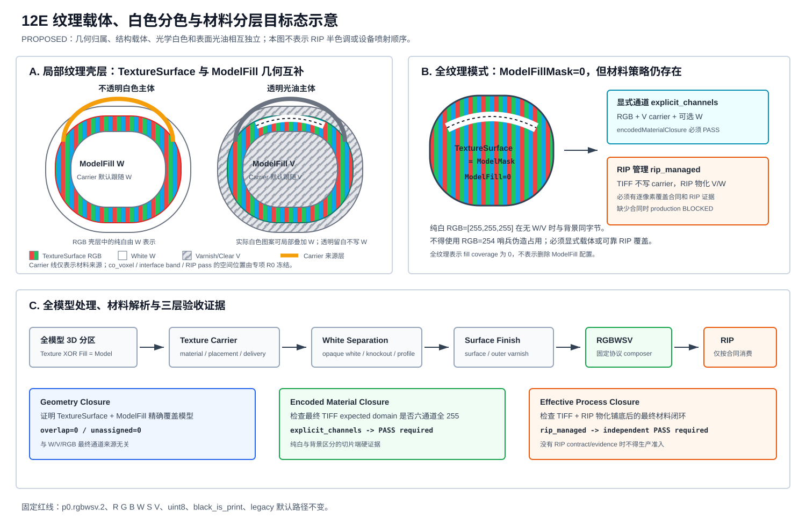

# DOC_PREP_12E 纹理载体、白色分色与 RIP 铺底专项准备

> 文档状态：FROZEN / PARTIAL RIP FACTS CONFIRMED / NO IMPLEMENTATION AUTHORIZATION
> 暂定专题代号：`12G-TCWS`，正式阶段编号待用户成立专项时确认
> 日期：2026-07-23
> 冻结日期：2026-07-27
> 最近复审：2026-07-31
> 上游：12A 材料语义、12D 材料闭环、12E 全局纹理壳层与模型填充
> 前置基线：12E-08D 双模式生产写包、12E-09A/09B UI、12E-10 阶段收口
> 同步示意图：`assets/DIAGRAM_12E_纹理载体白色分色与材料分层示意图.svg`
> 本轮策略比对：`DOC_REVIEW_12G_TCWS_现有RIP白区合同与六通道策略比对.md`

## 0. 冻结记录

2026-07-27 用户确认本专项的部分策略尚未讨论清楚，当前先冻结，不进入实现。

冻结范围：

```text
本文件 R0..R6 仅保留为候选路线，不是已激活任务；
不生成正式 TASKS/CODEX_PROMPT；
不新增配置字段、Qt 控件、resolver、composer 或 RIP contract；
不把本专项计入 12E/12F 当前未完成原子任务数量；
不影响普通 RGB、当前 W/S/V、Legacy/Global、12E-09A/10 和 Stage 13。
```

解冻条件仍以第 13 节阻断问题和第 15 节 G1..G8 为准。解冻时必须重新审查当前代码、RIP
版本、设备能力和 Stage 13 多模型/预览边界，不能直接把本准备文档中的候选 JSON 当作正式 schema。

### 0.1 2026-07-31 部分事实更新

本轮用户确认：

```text
同一组全 RGB 切片数据可由 RIP Profile 生成透明或白色/不透明两种模型；
当前 RIP 使用正常 RGB 纹理区，并以 W/S/V=0/0/0 区域区分白色；
专项继续保持 RGBWSV 六通道；
本专项暂不新增纹理铺底层，也不讨论额外 underbase 层数。
```

这些事实关闭了“是否需要同包透明/白色切换”和“是否保持六通道”两个方向问题，但没有关闭
`WSV=000` 与 `black_is_print` 的协议冲突。按当前协议，W/S/V=0 表示三种材料都打印；
若 RIP 把它当私有 mask，输入包必须被明确归类为 RIP-bound intermediate，并绑定可审计合同。
因此专项仍保持冻结。

## 1. 准备结论

本专项有必要，但不应立即以零散开关方式进入实现。当前问题横跨几何分区、材料语义、RGBWSV
通道组合、材料闭环、RIP 所有权、报告和 UI。如果继续沿用“白墨打底”一个概念，会把以下不同
职责混在一起：

```text
纹理区域的几何归属；
纹理区域的结构承载材料；
纹理中的白色是否要打印为真实白墨；
表面光油/外侧光油；
RIP 自动生成的铺底或打印 pass。
```

推荐把目标模型冻结为四条相互独立的策略轴：

```text
Geometry Partition:
  TextureSurfaceMask3D / ModelFillMask3D

Texture Carrier:
  纹理体积的结构承载材料及其空间位置

Optical Separation:
  RGB 颜色与可选 W 白色分色

Surface Finish:
  表面/内表面/外侧扩张光油
```

专项在未成立前只允许完成决策准备、RIP 事实收集、样件设计和文档评审。不得修改
`p0.rgbwsv.2`、RGBWSV 顺序、`black_is_print`、legacy 默认路径或 global production 权限。

## 2. 已提出问题的统一解答

### 2.1 白色纹理与背景如何区分

当前协议中：

```text
Background = [255,255,255,255,255,255]
```

如果纯白纹理也只写：

```text
RGB = [255,255,255]
W/S/V = 255
```

则 TIFF 字节和背景完全相同。仅靠普通 RGB 预览、TIFF 六通道或当前 full closure 都不能判断该
像素属于模型。

允许的解决路径只有两类：

```text
A. Self-contained：
   切片端显式写 W 或 V，使模型像素至少有一个通道 < 255。

B. RIP-bound：
   TIFF 不写载体通道，但 RIP 必须从独立、逐像素且可审计的模型覆盖数据生成铺底；
   生产验收改为同时检查切片包和 RIP 物化结果。
```

禁止使用 `RGB=254` 一类哨兵值伪造占用，因为它会改变实际下墨量并把协议语义耦合到设备容差。

### 2.2 白色纹理由 RGB 还是 W 表示

不是二选一：

```text
纹理源颜色/语义：保留在 RGB 或颜色 Profile 输入；
真实不透明白色：由 W 通道表示；
暖白/米白：W 提供白色遮盖，RGB 提供色相；
透明留白：不写 W，由透明载体和 RIP Profile 决定；
结构承载：由 Texture Carrier 决定，不应由“是否白色”反推。
```

因此，透明模型上的白色源像素必须有显式意图：

```text
opaque_white       -> 打印 W；
transparent_knockout -> 不打印 W，保留透明效果。
```

### 2.3 透明模型为什么不能固定使用白墨打底

透明模型的主体填充如果是 varnish/clear，纹理区域的结构载体默认也应是 varnish/clear，否则全量
白墨会改变透明度和颜色表现。

推荐 Profile 默认关系：

```text
modelFill.material=white   -> textureCarrier.material=white
modelFill.material=varnish -> textureCarrier.material=varnish
```

这是 Profile 默认继承关系，不是全局不变量。透明主体仍可在局部白色图案上叠加 W：

```text
V carrier + W white spot + optional RGB
```

### 2.4 全纹理模式为什么仍需保留材料策略

12E 的 allTexture 正式语义是：

```text
modelFill.enabled = true
ModelFillMask3D = Empty
TextureSurfaceMask3D = ModelMask3D
unassigned = 0
```

这表示 Model Fill 覆盖率为零，不表示删除 Model Fill 配置。保留配置可支持 Profile 继承，但
Texture Carrier 必须拥有独立的 resolved 字段，不能仅依赖一个当前没有体素的 ModelFillMask。

若实际 RIP 会在纯纹理作业中自动生成光油铺底，应表达为：

```text
textureCarrier.material = varnish
textureCarrier.delivery = rip_managed
modelFillCoverage = 0
encodedCarrierPixels = 0
```

该模式只有在 RIP 覆盖输入和物化输出可审计后，才能获得 production acceptance。

### 2.5 为什么仍要从全模型处理

Texture Carrier 和白色分色都必须读取已经建立的全模型 `TextureSurfaceMask3D`，不得在每张 2D
切片中重新腐蚀轮廓或用 RGB 颜色猜测纹理区域。

```text
Full transformed model
  -> ModelMask3D / distance field
  -> TextureSurfaceMask3D XOR ModelFillMask3D
  -> Carrier/White/Finish semantic masks
  -> layer mapping
  -> RGBWSV composition
```

白色识别可以使用纹理采样结果，但几何归属必须来自 TextureSurfaceMask3D。

## 3. 当前状态与目标状态

### 3.1 Current State

当前 A 级代码事实：

```text
1. 12E 已有全局 TextureSurface/ModelFill 互补分区与 exact masks。
2. ModelFill 可解析为 white/varnish/rgb/profile_default/material_role。
3. MaterialPolicy.white 只表达 disabled/underbase/all_model。
4. MaterialPolicy.varnish 主要表达 all_model/top_n_layers。
5. global diagnostic composer 只有 modelFillMaterial，没有 texture carrier 请求。
6. full closure 把六通道全部为 255 的模型像素判定为 gap。
7. MaterialProcessProfile 的 missingUnderbasePixels 只比较 RGB/W 数量。
8. UI 将“叠加白墨底层”和“模型内部填充材料”作为两个未联动控件。
9. 12E-08D-01 已获得独立授权并进入当前执行序列；本专项不纳入 08D 当前基线范围。
```

### 3.2 Target State

```text
1. 几何分区继续只负责 TextureSurface/ModelFill，保持 XOR/union 不变量。
2. 新增 TextureCarrierPolicy，负责承载材料、空间位置和交付责任。
3. 新增 TextureWhiteSeparationPolicy，负责白色视觉意图和白墨 mask。
4. SurfaceVarnish/OuterVarnish 保持独立，不复用为载体语义。
5. composer 接收来源明确的 semantic masks，再合并到固定 RGBWSV 通道。
6. closure 区分 geometry、encoded material 和 downstream process 三种证据。
7. RIP-managed 必须绑定经过验证的 RIP contract，不能隐式生效。
8. UI 显示请求值、解析值、交付方和准入状态。
9. legacy 旧配置继续保持原有输出，新增策略只由显式 Profile 启用。
```

### 3.3 Historical State

12A 横截面图和报告用于解释当时观察到的 RGB/W/V/S 材料带；它没有定义 Texture Carrier，也不
实现 RIP 半色调。12E 已把 Texture Surface 与 Model Fill 提升为全模型三维互补分区，但只规定
TextureSurface 可以叠加 W/V，尚未冻结载体来源、空间位置和 RIP 交付责任。

本专项不直接改写 12A 历史结论。专项被正式接受后，应通过新决策文档说明哪些 12A 图继续作为
历史/当前实现证据，哪些图被新的目标态示意替代。

## 4. 术语与不变量

### 4.1 术语

| 术语 | 定义 | 不表示 |
|---|---|---|
| TextureSurface | 全模型中归属纹理体积的几何区域 | 不等于 RGB 非空区域 |
| ModelFill | TextureSurface 在 ModelVolume 内的几何补集 | 不等于所有 W/V |
| TextureCarrier | 纹理体积的结构承载材料 | 不等于表面光油 |
| TextureWhiteInk | 为获得不透明白色而写入的 W | 不等于结构填充 |
| SurfaceVarnish | 模型表面/内表面的光油材料带 | 不等于 CarrierVarnish |
| OuterVarnishShell | 模型外包络之外的扩张光油 | 不等于模型内 V |
| RIP-managed | 由下游 RIP 物化的材料处理 | 不等于切片端已经输出该材料 |

### 4.2 固定不变量

```text
TextureSurfaceMask3D AND ModelFillMask3D = Empty
TextureSurfaceMask3D OR  ModelFillMask3D = ModelMask3D

TextureCarrierMask3D SUBSET_OF TextureSurfaceMask3D
TextureWhiteInkMask3D SUBSET_OF TextureSurfaceMask3D
SurfaceVarnishMask3D 的范围由独立 VarnishGeometryPolicy 决定

geometry overlap != channel overlap
```

通道合并允许表达为：

```text
FinalW =
  ModelFillWhiteMask
  OR TextureCarrierWhiteMask
  OR TextureWhiteInkMask

FinalV =
  ModelFillVarnishMask
  OR TextureCarrierVarnishMask
  OR SurfaceVarnishMask
  OR OuterVarnishShellMask
```

每个来源必须独立统计。最终 W/V 统计不能反推出其业务来源。

## 5. 建议策略对象

以下 schema 仅用于专项评审，不能直接视为已冻结配置。

```json
{
  "textureCarrier": {
    "enabled": true,
    "materialSource": "inherit_model_fill",
    "material": "varnish",
    "placement": "co_voxel",
    "delivery": "explicit_channels",
    "coverage": "texture_surface",
    "thicknessMm": 0.0,
    "value": 0,
    "ripContractId": null
  },
  "textureWhiteSeparation": {
    "enabled": true,
    "mode": "profile",
    "whiteIntent": "opaque_white",
    "source": "explicit_mask_or_profile",
    "profileId": "device_default",
    "value": 0
  }
}
```

### 5.1 materialSource

```text
inherit_model_fill：
  解析 modelFill.material 的最终材料角色；

explicit：
  使用 textureCarrier.material；

profile_default：
  从 MaterialProcessProfile 获得 resolved material。
```

未解析到 white/varnish/rgb/material_role 时必须 fail closed。

### 5.2 placement

```text
co_voxel：
  CarrierMask = TextureSurfaceMask；
  适合载体材料与颜色在同一输出体素组合的工艺。

inward_interface_band：
  Carrier 位于 TextureSurface 与 ModelFill 的内侧交界带；
  必须定义 thicknessMm、量化和 allTexture 退化规则。

rip_defined：
  切片端不猜测空间位置，由已登记 RIP contract 解释。
```

专项 R0 必须先确认真实 RIP 的铺底属于哪一种。未确认前不允许默认使用
`inward_interface_band`。

### 5.3 delivery

```text
explicit_channels：
  切片端将 Carrier 写入 W/V/RGB，生产 TIFF 自包含。

rip_managed：
  TIFF 不写 Carrier，RIP contract 必须提供逐像素覆盖和物化证据。

disabled：
  明确没有 Carrier；只允许经过 Profile 验证的特殊工艺。
```

`rip_managed` 和 `disabled` 必须是不同状态，不能使用一个 `none` 同时表示。

### 5.4 white separation mode

建议优先级：

```text
explicit_mask
  > material_role
  > calibrated_profile
  > colorimetric_soft_curve
```

首版不建议把固定 RGB 阈值作为 production 默认值。若必须提供 fallback，应记录阈值、色彩空间、
过渡曲线和命中统计，并将结果标记为 profile dependent。

## 6. 三类生产方案

### 6.1 方案 A：显式 Carrier，TIFF 自包含

```text
TextureSurface -> RGB + resolved W/V carrier
ModelFill      -> resolved W/V/RGB fill
```

优点：

```text
纯白区域不会与背景同字节；
现有 full closure 和 RIP Reader 容易扩展；
切片包可独立审计；
不依赖 RIP 隐式规则。
```

风险：

```text
可能与现有 RIP 自动铺底重复；
必须确认 W/V/RGB 同体素组合和总材料量；
可能改变透明度、颜色和材料成本。
```

### 6.2 方案 B：RIP-managed Carrier

```text
SliceSoft 输出 RGB/可选 W；
RIP 根据独立覆盖合同生成 V/W carrier。
```

优点：

```text
贴近现有纯纹理作业的实际处理；
避免重复铺底；
设备相关逻辑保留在 RIP。
```

风险：

```text
原始 TIFF 可能不是自包含模型材料；
纯白区域可能在进入 RIP 前表现为空；
当前 full closure 会报 gap；
需要跨团队、跨产物证据。
```

### 6.3 方案 C：Profile 驱动的混合模式

推荐最终方向：

```text
默认生产 Profile 选择 explicit_channels；
只有已登记并通过样件验证的 RIP Profile 可选择 rip_managed；
UI 不允许普通用户在未准入 Profile 中自由切换；
报告明确 requested/resolved/delivery/acceptance。
```

该方案兼顾自包含输出与现有 RIP 工艺，但实现和验收成本最高。

### 6.4 现有 `WSV=000` RIP 私有白区策略

当前 RIP 事实和完整优缺点见：

```text
DOC_REVIEW_12G_TCWS_现有RIP白区合同与六通道策略比对.md
```

本准备文档只冻结以下边界：

```text
不得把 W/S/V=0 自动解释成协议外“空操作”；
不得继续让 S 同时承担真实支撑和白区 mask 而没有版本合同；
同包透明/白色切换是明确产品意图；
候选优先比较 Hybrid V mask 与切片显式 W/V；
最终方案仍需真实 RIP 输入/输出证据。
```

## 7. 材料场景矩阵

| 场景 | ModelFill | Carrier | 白色意图 | 推荐通道 |
|---|---|---|---|---|
| 不透明白色模型、局部纹理 | W | W | 实际白色 | RGB + W |
| 透明模型、透明彩色纹理 | V | V | 白色为透明留白 | RGB + V |
| 透明模型、局部白色图案 | V | V | 实际白色 | RGB + V + 局部 W |
| 米白色不透明图案 | V 或 W | 由 Profile 决定 | 暖白 | W + 少量 RGB |
| allTexture、显式光油载体 | fill mask=0 | V | 由 Profile 决定 | RGB + V + 可选 W |
| allTexture、RIP 自动光油铺底 | fill mask=0 | V/RIP | 由 Profile 决定 | RGB + 可选 W，外加 RIP 证据 |
| RGB/custom fill | RGB/custom | 不自动假设 | 由 Profile 决定 | 必须显式解析 |

`shengdanjie_fudiao` 适合验证米白色和暖色细节，不适合单独承担纯白、透明 knockout 或 Alpha
验收。专项必须新增人工可计算的纯白/米白/透明意图 fixture。

## 8. 闭环与生产准入口径

必须拆分三种闭环：

```text
geometryClosure：
  TextureSurface + ModelFill 是否精确覆盖 Model。

encodedMaterialClosure：
  最终 RGBWSV TIFF 在 expected domain 中是否存在六通道全 255。

effectiveProcessClosure：
  TIFF 与已登记 RIP 物化结果合并后，是否形成真实材料闭环。
```

状态建议：

```text
pass
fail
not_evaluated
not_self_contained
blocked_by_rip_contract
```

生产规则：

```text
explicit_channels：
  geometryClosure=pass
  encodedMaterialClosure=pass

rip_managed：
  geometryClosure=pass
  encodedMaterialClosure 可为 not_self_contained
  effectiveProcessClosure 必须有独立 PASS
  缺少 RIP 证据时 productionAcceptance=blocked
```

不得为了让 `rip_managed` 通过而简单关闭当前 expected-domain gap 检查。

## 9. 模块影响

### 9.1 Config 与 DTO

预计涉及：

```text
src/slicer_core/config.h
src/slicer_core/config.cpp
12E effective config DTO/facade
Config help/schema tests
sample Profiles
```

改动：

```text
新增 TextureCarrierPolicy/TextureWhiteSeparationPolicy；
增加 requested/resolved 配置；
旧配置默认映射到 legacy_compatible，不改变输出；
非法组合在 config validation 阶段阻断。
```

### 9.2 Materials

建议新增职责清晰的模块，而不是继续扩大 `slicer.cpp`：

```text
materials/TextureCarrierPolicyResolver
materials/TextureWhiteSeparationResolver
materials/MaterialCombinationValidator
```

materials 只处理材料 DTO、Profile 和 composer 输入，不读取文件、不依赖 Qt、不决定生产准入。

### 9.3 Pipeline

```text
geometry/global partition：
  继续只输出 Model/Texture/Fill masks。

texture transfer：
  输出 surface RGB 和可选显式白色意图来源。

pipeline orchestration：
  调用 carrier/white resolver，构造 semantic masks。

composer：
  合并到 RGBWSV，不重新计算几何。
```

legacy 路径先通过 adapter 接入新 resolver，保持旧配置字节不变；global 路径在 08D 获准后复用相同
resolver 和 composer contract。

### 9.4 Closure 与 Admission

预计涉及：

```text
TextureFillPartitionFullClosureAdapter
MaterialClosureSemanticDetector
ProductionAdmissionPolicy
RIP handoff evidence/report
```

需要新增来源 mask、允许的通道组合和三类 closure 状态。reports 只能呈现结果，不承担业务决策。

### 9.5 Reports

建议新增：

```text
textureCarrier.requested/resolved
textureCarrier.material/placement/delivery
textureCarrier.semanticPixels/encodedPixels
textureWhiteSeparation.mode/intent/source
textureWhiteInkPixels
carrierWhitePixels/carrierVarnishPixels
modelFillWhitePixels/modelFillVarnishPixels
surfaceVarnishPixels/outerVarnishPixels
geometryClosure/encodedMaterialClosure/effectiveProcessClosure
ripContractId/ripEvidenceStatus
```

最终 `whitePrintPixels` 和 `varnishPrintPixels` 继续作为通道总数，不能替代上述来源统计。

### 9.6 Qt UI

建议在材料区域增加：

```text
纹理载体材料：
  跟随模型填充 / 白墨 / 光油 / Profile

载体输出方式：
  写入 TIFF / RIP 处理

白色纹理意图：
  打印白色 / 透明留白 / Profile

只读有效摘要：
  requested -> resolved material
  placement
  delivery owner
  closure/admission
```

联动规则：

```text
modelFill=varnish + inherit -> effective carrier=varnish；
allTexture 时 ModelFill coverage 显示 0，但材料选择不被删除；
rip_managed 缺少 contract 时生产按钮禁用；
Profile 禁止的 W+V 组合不可保存为 production config；
UI 不直接访问 3D grid 或 OpenVDB 类型。
```

Preview 增加来源伪彩：

```text
TextureSurface
ModelFill
CarrierWhite
CarrierVarnish
TextureWhiteInk
SurfaceVarnish
RIP-managed expected coverage
```

伪彩不能写回 TIFF。

### 9.7 Tests 与样件

最低矩阵：

```text
1. exact white texture + white background；
2. warm white texture（shengdanjie）；
3. transparent carrier + transparent knockout；
4. transparent carrier + opaque white spot；
5. partial shell + white fill；
6. partial shell + varnish fill；
7. allTexture + explicit V；
8. allTexture + RIP-managed V；
9. W+V 允许/禁止组合；
10. legacy omitted config byte/hash regression。
```

每个 case 至少验证：

```text
3D mask invariants；
per-layer semantic masks；
RGBWSV bytes；
source counters；
three closure states；
preview/probe；
RIP strict 或外部 RIP evidence；
background remains empty。
```

## 10. 分阶段实施计划

以下为专项成立后的建议顺序，不表示已经授权执行。

### Phase R0：事实与决策冻结

工作：

```text
确认 RIP 铺底覆盖来源、空间位置、pass 顺序和 W/V/RGB 组合；
确认“透明模型白色纹理”的默认产品意图；
确认 WSV=000 是物理材料值还是 RIP 私有选择码；
比较当前 WSV=000、显式 W/V 和 Hybrid V mask；
冻结术语、策略轴和 production acceptance；
选择 explicit、RIP-managed 或 hybrid。
```

完成标准：

```text
正式 DOC_DECISION；
开放问题全部有 owner/结论；
同步目标分层图；
08D/09B 依赖关系更新。
```

预计：2-4 个工程日，不含外部 RIP 等待时间。

### Phase R1：Config/DTO/Report Contract

工作：

```text
新增 policy DTO、解析、校验和 effective config；
定义 report schema 和稳定错误码；
旧配置兼容映射；
先不改变 composer 输出。
```

完成标准：

```text
config/schema/unit tests PASS；
旧配置 effective snapshot 不变；
非法组合 fail closed；
无生产行为变化。
```

预计：3-5 个工程日。

### Phase R2：Resolver 与 Semantic Masks

工作：

```text
实现 Carrier/White resolver；
生成独立来源 masks；
接入 global exact TextureSurfaceMask3D；
legacy 使用 wrapper/adapter，避免大范围重写。
```

完成标准：

```text
mask subset/union/来源统计 PASS；
不在 per-layer 重算 3D 几何；
white/varnish/rgb/material_role 解析矩阵 PASS。
```

预计：5-8 个工程日。

### Phase R3：Composer 与 Closure

工作：

```text
扩展 composer input；
验证允许的 W/V/RGB 组合；
实现 geometry/encoded/process closure；
加入 pure-white/background fixture。
```

完成标准：

```text
explicit 模式 self-contained closure PASS；
rip-managed 无合同稳定 BLOCKED；
背景保护和 legacy regression PASS。
```

预计：5-8 个工程日。

### Phase R4：RIP Handoff 与物化证据

工作：

```text
冻结 RIP contract id 和输入覆盖规则；
获取 RIP 前后样例包/报告；
验证 allTexture 无显式 V 的真实覆盖；
验证白色、透明和暖白样件。
```

完成标准：

```text
effectiveProcessClosure 可重复；
RIP 失败/缺失时 fail closed；
不把肉眼打印观察单独作为机器 PASS。
```

预计：5-10 个工程日，强依赖 RIP 团队和设备可用性。

### Phase R5：Qt UI 与 Preview

工作：

```text
新增策略控件、effective summary、blocked 状态；
新增来源 overlay 和像素探针；
更新 UI smoke/self-test。
```

完成标准：

```text
三种窗口尺寸无重叠；
配置事务和取消/刷新行为稳定；
UI 不暴露 backend 内部类型；
production 按钮严格受 admission 控制。
```

预计：4-6 个工程日。

### Phase R6：Production Matrix 与收口

工作：

```text
legacy/global、partial/allTexture、white/varnish、explicit/RIP-managed 矩阵；
共享 TIFF writer/RIP Reader 回归；
正式更新 PRD/DEV/DEMO/ROADMAP/任务清单和示意图。
```

完成标准：

```text
所有 required case PASS；
旧 legacy hash/统计无回归；
生产预算冻结；
独立 GO/NO-GO 和用户确认。
```

预计：4-7 个工程日。

### 总体工作量

单人连续实施的纯软件工作预计约 19-34 个工程日，即约 4-7 周。RIP/设备排期、色彩标定和真实
打印返工不包含在纯软件估算中；若外部证据不能及时提供，R4 可以单独保持 BLOCKED，而不虚构完成。

## 11. 建议实施时间

### 11.1 排期结论

可以并建议将本专项放到 12E-10 之后。原因是当前全 RGB/legacy 和 12E 已有材料语义足以完成基础
切片、global 双模式接入、诊断 UI 和阶段收口；本专项属于更高阶的材料工艺闭环，不需要阻断当前
基础切片主线。

推荐顺序：

```text
12E-08D：按当前已冻结材料语义完成双模式生产链；
12E-09A/09B：完成当前 diagnostic/production UI；
12E-10：完成当前基线 preview、真实模型矩阵、性能和报告收口；
12G-TCWS-R0：再成立纹理载体、白色分色与 RIP 铺底专项；
12G-TCWS-R1..R6：按本文件第 10 节实施。
```

12F Release runtime/性能专项保持独立，可按其自身 Gate 执行，不作为本专项的强制前置或替代阶段。

### 11.2 推迟成立的安全条件

将专项推迟到 12E-10 之后，需要当前 12E 保持以下边界：

```text
1. 08D/09B/10 只声明当前 MaterialPolicy/ModelFill 语义完成；
2. 不把“白墨打底”宣布为透明模型和所有纹理的唯一最终策略；
3. 不把 rip_managed Carrier 宣布为已实现或已生产准入；
4. 08D composer adapter 保留来源 mask/材料 resolver 的扩展位置；
5. 12E-10D REPORT_12E 明确记录本专项为 deferred follow-up；
6. 12E-10 不使用 RGB=254 或颜色阈值补丁掩盖纯白/背景问题；
7. 旧 Profile、TIFF 协议和 legacy 默认行为保持不变。
```

满足这些条件后，推迟不会影响当前基础切片能力，只会把高阶透明/白色/RIP 组合留给后续专项。

### 11.3 实施窗口

当前全 RGB/legacy 基础切片功能可继续使用，本专项不需要阻断普通 RGB 功能、12F 性能工作或
12E-09A 的只读 diagnostic 能力。

建议时间点：

```text
现在：
  保留本准备文档，继续收集 RIP 事实，不启动代码。

专项正式启动：
  12E-10D 完成当前基线收口；
  用户回答第 13 节问题；
  RIP 规则或验证 owner 已明确。

代码最佳插入点：
  12E-10 之后建立独立 12G-TCWS 分支/任务；
  以 12E 已稳定的 exact masks、共享 writer 和 UI facade 为输入；
  不回插或改写已完成的 12E 原子任务历史。
```

09A/09B 应保持 DTO 和 UI facade 可扩展，不提前冻结“白墨打底”作为唯一生产控件。

不建议：

```text
在 12E 收口过程中夹带本专项的半成品；
在没有 R0 决策时重写 composer 或材料 UI；
把本专项混入 12F 性能优化；
为了赶进度只实现纯白 RGB 阈值补丁。
```

## 12. 回滚与兼容

```text
1. 新策略仅由显式 Profile 启用，旧配置默认 legacy_compatible。
2. legacy writer、channel order、bit depth、polarity 不变。
3. 新 resolver 通过 wrapper 接入，可整体关闭而不影响旧路径。
4. rip_managed Profile 可撤销，不影响 explicit 模式。
5. 新 report 字段优先放入专项报告/可扩展对象，避免破坏稳定字段。
6. UI 新控件在能力不可用时隐藏或只读，不改变旧 Profile。
```

## 13. 待用户/RIP 团队回答的疑虑

2026-07-31 已确认：

```text
透明/白色由 RIP Profile 选择；
希望复用同一组切片数据；
保持 TIFF 六通道；
本专项不新增纹理铺底层。
```

以下问题仍未关闭。

### 13.1 RIP 与物理材料

1. RIP 自动光油铺底根据什么生成覆盖范围：模型 mask、Alpha、RGB 非空、图像包围盒，还是整张画布？
2. RIP 能否获得逐像素的模型占用数据？该数据目前来自哪个文件或接口？
3. 全纹理作业的光油铺底是每个 Z layer 都生成，还是只在特定打印 pass/底层生成？
4. 光油载体与 RGB 是同体素混合、先后打印，还是空间上相邻的材料层？
5. 同一像素同时存在 W、V、RGB 时，设备/RIP 支持哪些组合和顺序？
6. RIP 自动铺底是否可关闭？切片端显式写 V 时如何避免重复铺底？

### 13.2 产品与材料意图

7. 透明模型中的纯白纹理默认表示“实际白色”还是“透明留白”？
8. 一个模型内是否允许部分白色为 opaque white、另一部分白色为 transparent knockout？
9. “Carrier 跟随 Model Fill”是所有 Profile 的强制规则，还是白色/透明两类 Profile 的默认规则？
10. `modelFill.material=rgb/custom/material_role` 时，Carrier 应如何解析？
11. Carrier 需要覆盖全部 TextureSurface 体积，还是只覆盖纹理与内部填充的交界带？
12. allTexture 时 Carrier 应覆盖整个 ModelVolume，还是由 RIP 采用另一种铺底几何？

### 13.3 输出与验收

13. 生产切片包是否必须脱离指定 RIP 仍保持材料自包含？
14. 是否允许在不改变 TIFF 六通道的前提下增加 RIP 消费的模型覆盖 sidecar/report？
15. `rip_managed` 的机器验收产物是什么：RIP 输出层、RIP job report、二次 TIFF，还是设备日志？
16. 哪一方负责冻结 `ripContractId`、版本兼容和失败回退规则？
17. 当前 full closure 是否必须继续以 pre-RIP TIFF 为生产硬门槛？

### 13.4 标定与 UI

18. W/V/RGB 的 `value=0` 是否都代表已标定的生产满量，还是只代表协议层 full print？
19. 是否已有透明度、白度、暖白色差和最大总材料量的验收阈值？
20. UI 面向工艺人员时，更易理解的术语是“纹理载体”“纹理基底”还是现有 RIP 术语？
21. 普通用户是否可以修改 delivery，还是只能通过受控 Profile 选择？
22. 当前 WSV=000 是否在进入喷印数据前被 RIP 完全拦截并重映射？
23. WSV=000 中的 S=0 是否会生成真实支撑喷印数据？
24. 透明和不透明两个 RIP Profile 的逐像素 W/S/V 输出分别是什么？
25. 能否使用 V 作为受控白色意图 mask，同时区分 SurfaceVarnish/OuterVarnish 来源？

在第 1、3、4、5、6、11、13、15、17、22、23、24、25 项没有明确答案前，不建议开始
R2/R3/R4 实现。

## 14. 文档和示意图治理

本准备文档新增目标态示意图：

```text
docs/slice/DOC/assets/DIAGRAM_12E_纹理载体白色分色与材料分层示意图.svg
```



图中同步表达：

```text
TextureSurface/ModelFill 几何互补；
Carrier 与白色分色独立；
透明 V carrier 可叠加局部 W；
allTexture 时 fill mask=0；
explicit 与 RIP-managed 两种交付；
三类 closure 证据。
```

由于专项尚未成立，原 `DIAGRAM_12A_指甲模型横截面材料示意图.png` 保留为 12A 当前/历史参考，不在
本准备阶段覆盖。专项 R0 被接受后，应同步更新正式 PRD/DEV 中的主图引用和图例。

## 15. 建议的专项成立 Gate

```text
G1：第 13 节剩余阻断问题有书面答案；
G2：选择 A/B/C 生产方案；
G3：RIP contract owner 和验证产物明确；
G4：同步分层示意图评审通过；
G5：确认不修改 p0.rgbwsv.2；
G6：确认 legacy 默认行为不变；
G7：确认 12E-10D 已记录 deferred follow-up，并在其后建立独立专项；
G8：用户明确授权建立正式任务清单。
```

只有 G1-G8 全部满足后，才将本 PREP 文档转换为正式 DOC_DECISION、DEV、DEMO、ROADMAP 和
Codex 原子任务。

本轮状态：

```text
G5：方向已确认（保持六通道和现有 schema）；
G1/G2/G3/G4/G6/G7/G8：仍未全部关闭；
专项状态：FROZEN。
```
