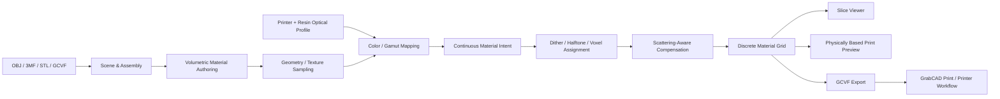

# PrismSlicer 功能、处理策略与 SliceSoft 对照研究

> 文档类型：外部产品研究 / 技术情报 / 非实现真源  
> 调研对象：Additive Appearance `PrismSlicer`（全彩、多材料、Material Jetting / PolyJet 版本）  
> 调研日期：2026-07-12  
> 信息范围：公开官网、产品商店、厂商教程、大学研究页面、开放论文、GitHub、合作伙伴公告、行业媒体、公开视频与公开社区页面  
> 证据级别：外部公开资料，不属于本项目 A/B/C/D 内部实现证据；只能用于竞品研究和路线启发，不能证明 PrismSlicer 的闭源实现细节，也不能直接变更 SliceSoft 生产协议

---

## 1. 执行摘要

PrismSlicer 与 SliceSoft 的确属于高度相近的问题域：二者都不是传统 FFF 的 G-code 路径规划器，而是面向 UV 固化喷墨、多材料、体素化打印数据的准备软件。两者都关心彩色纹理、内部材料、逐层/逐体素材料分配、白色或透明材料、支撑、打印结果预览和下游数据交付。

但公开证据显示，两者当前产品边界并不相同：

| 维度 | PrismSlicer | SliceSoft 当前项目 |
|---|---|---|
| 主要定位 | 商业化全彩/多材料 DfAM、体素切片、外观软打样 | UV 喷墨切片 Demo 到正式产品的工程化验证 |
| 核心抽象 | 打印机可执行的离散材料体素网格 | `RGBWSV` 六通道、逐层 TIFF、语义策略和报告 |
| 公开输出 | Stratasys `GCVF` 预切片体素文件；也可导入 GCVF | `p0.rgbwsv.2`、RGBWSV uint8 TIFF 层、manifest/report |
| 下游边界 | GCVF 交给 GrabCAD Print；后者仍负责作业提交、支撑和设备侧流程 | 明确不实现 RIP、半色调、喷头 bitstream 和设备通信 |
| 颜色策略 | 设备/树脂标定、材料感知切片、光散射补偿、抖动/半色调优化 | 当前以纹理采样、材料策略、通道组合和输出契约为主 |
| 外观预览 | 基于材料光学参数的体积光传输/路径追踪软打样 | 生产层检查、伪彩材料叠加和原始调试预览 |
| 体积设计 | 材料混合、3D 线性梯度、装配嵌套、重叠覆盖 | `TextureApplicationPolicy`、模型填充、支撑、光油壳层等显式语义 |
| 开源状态 | PrismSlicer 本体是商业闭源软件；部分学术算法代码和数据开放 | 本项目代码可直接审查，生产/实验边界由仓库约束 |

最重要的边界修正是：公开教程没有证明 PrismSlicer 直接生成最终喷头 bitstream 或完整 RIP 作业。它生成的是带有逐体素 CMYKW 树脂分配的 GCVF 预切片数据，随后导入 GrabCAD Print；GrabCAD Print 仍会处理支撑、Matte/Glossy 和最终打印提交。因此，更准确的描述是：

```text
PrismSlicer 将颜色/材料解释、体素化、半色调/材料分配推进到接近 RIP 的层级，
但公开工作流仍保留厂商作业软件和设备侧 RIP/控制边界。
```

对 SliceSoft 最有价值的启发，不是复制它的 GCVF 或闭源界面，而是建立四个可独立演进的能力域：

1. `PrinterMaterialProfile`：打印机、树脂、分辨率、光学参数和离散材料集合。
2. `AppearanceIntent -> PrintableMaterialGrid`：将目标颜色/材质意图映射为可打印的材料体素/通道。
3. `PrintSoftProof`：基于真实输出数据和材料标定的预测预览，而不是只显示输入纹理。
4. `DownstreamAdapter`：保持 SliceSoft 切片契约与厂商 RIP/设备格式隔离。

---

## 2. 调研方法与可信度

### 2.1 来源优先级

本次按以下优先级使用公开信息：

1. Additive Appearance 官网、商店、教程和功能页。
2. Charles University Computer Graphics Group 的论文页面、开放论文和代码仓库。
3. Quantica 等合作厂商公告。
4. 3D Printing Industry、VoxelMatters、Fabbaloo 等行业媒体。
5. YouTube、LinkedIn、Reddit、G2 等视频或社区页面。

### 2.2 结论标签

文中使用三类判断：

- **公开确认**：官网、教程、论文或合作厂商明确写出。
- **高可信推断**：多项公开证据一致，但没有 PrismSlicer 源码可验证。
- **未知/待确认**：没有足够公开证据，不能从论文直接推定商业产品已经采用。

### 2.3 局限

- PrismSlicer 全彩版没有公开源码，无法验证内部模块、数据结构、并行框架、内存模型和算法开关。
- 厂商论文展示的是团队技术基础，不等于每项论文算法都已经进入商业版本。
- 官网不同页面存在版本、价格和兼容设备更新不同步的情况；本文按 2026-07-12 快照记录，并标出冲突。
- 公开社区独立评测很少。G2 页面在调研时没有用户评论；Reddit 上主要能找到论文会议讨论入口，而不是成熟产品使用反馈。
- 本次没有购买许可证、安装全彩版本、连接真实设备，也没有对 GCVF 做逆向工程。

---

## 3. 公司、产品和演进历史

### 3.1 公司背景

Additive Appearance s.r.o. 是捷克查理大学 Computer Graphics Group 的衍生公司。公开里程碑为：

| 时间 | 事件 |
|---|---|
| 2015-2022 | 团队在查理大学开展外观制造、体积光传输和彩色 3D 打印研究 |
| 2023-06-15 | 公司正式注册成立 |
| 2023-12 | 与 Quantica 公布 MultiSlice 合作 |
| 2024-11 | 在 Formnext 2024 展示/发布 PrismSlicer |
| 2025-05 | 面向更广泛市场正式发布 PrismSlicer |
| 2025-11 | 发布 PrismSlicer SLA 和 Color Picker |
| 2025-12 | 散射感知颜色标定论文获 SIGGRAPH Asia 2025 Honorable Mention |

来源：[Additive Appearance 公司与里程碑](https://appearan.cz/about/)、[Quantica MultiSlice 公告](https://www.quantica.io/news/quanticas-multi-material-3d-printing-system-to-be-equipped-with-ai-based-software-multislice)。

### 3.2 产品族不要混淆

公开产品至少包括：

| 产品 | 目标工艺 | 作用 |
|---|---|---|
| PrismSlicer | PolyJet / Material Jetting / UV Inkjet | 全彩、多材料、体素级切片与外观预览 |
| PrismSlicer SLA | SLA/DLP/Vat Photopolymerization | 单一预混树脂颜色、透光性预览、SLA 层导出 |
| Color Picker | CMYKW 树脂套装 | 目标颜色到树脂配方的免费计算器 |
| 企业定制/SDK | 打印服务商、设备商 | 工作流集成、自动化、Python API、定制标定 |
| Quantica MultiSlice | Quantica NovoJet | 与设备厂合作的构建管理、切片、外观/功能预测软件 |

本文主要讨论第一项。SLA 版本的“混合整桶树脂”与 PolyJet 的“逐体素喷射多个材料”是两种不同的数据路径，不应把 SLA 功能当作全彩版的直接证据。

---

## 4. PrismSlicer 已公开确认的完整功能

### 4.1 输入、项目和颜色信息

官方商店当前明确列出：

| 类别 | 导入 | 导出 | 备注 |
|---|---|---|---|
| 模型 | 3MF、STL、OBJ | 未列模型导出 | STL 不携带颜色 |
| 切片 | GCVF | GCVF | 可把已有体素切片作为设计组成部分 |
| 项目 | 3MF | 3MF | 用于保存项目/装配 |

颜色信息支持：

| 信息类型 | 3MF | OBJ | STL |
|---|---:|---:|---:|
| 纹理 | 是 | 是 | 否 |
| 顶点颜色 | 是 | 是 | 否 |
| 面颜色 | 是 | 否 | 否 |
| 材质漫反射色/Albedo | 是 | 是 | 否 |

官网教程确认 OBJ 可配 PNG 纹理、支持多模型导入、拖放、移动、缩放、旋转和数值变换。商店还表示，其他 Assimp 常见格式可以按客户需求支持，但这不等于标准版本默认启用全部格式。

来源：[PrismSlicer 商店功能与格式矩阵](https://shop.appearan.cz/products/prismslicer)、[全彩预览教程](https://appearan.cz/blog/how-to-preview-full-color-3d-printouts-with-photorealistic-accuracy/)。

### 4.2 构建平台与场景编辑

公开界面呈现出三个主工作区：

```text
Design  -> 导入、排布、变换、材料/颜色/梯度/装配设计
Slice   -> 自动切片、逐层材料体素检查、GCVF 导出
Preview -> 基于切片结果和材料标定的外观软打样
```

设计功能包括：

- 虚拟打印床和实时 3D 视口。
- 多模型同台排布。
- Gizmo 与数值输入两种变换方式。
- 单材料、数字材料混合、彩色模型、预切片模型、梯度模型的组合。
- 模型重叠、嵌套和覆盖优先级控制。
- 对复杂装配的逐层验证。

“Nesting”在公开描述中更接近“把不同来源、不同材料语义的对象嵌套/叠加为复杂体积结构”，不应简单理解为传统排版算法的自动装箱。

### 4.3 体素化和逐层材料网格

厂商对 slicing 的公开定义是：把模型转换为 `material grid`，即 PolyJet 打印机的材料指令网格。每层由 CMYKW 等离散树脂液滴构成，每个位置最终对应一个材料选择。

公开确认的 Slice Viewer 能力：

- 用垂直滑块逐层浏览。
- 在 3D 几何上下文中查看层切面。
- 检查每个 voxel 的材料分配。
- 检查复杂装配的重叠区是否按预期覆盖。
- 用最终切片区分“软件准备错误”和“硬件打印问题”。
- 导入 GCVF 后与网格部件比较。

这与 SliceSoft 12C 的“生产层检查”方向非常接近，但 PrismSlicer 预览的基本对象是离散材料体素，而 SliceSoft 当前的生产真源是 RGBWSV TIFF 通道像素。

来源：[Slice Viewer](https://appearan.cz/features/slice-viewer/)、[教程的自动切片步骤](https://appearan.cz/blog/how-to-preview-full-color-3d-printouts-with-photorealistic-accuracy/)。

### 4.4 3D 材料梯度

PrismSlicer 不是只把 2D 纹理贴到表面。公开的 3D Gradient Editor 支持：

- 在 3D 视口中放置多个梯度停止平面。
- 使用 Gizmo 或精确数值变换控制停止平面。
- 为每个停止平面指定一种材料混合比例。
- 在相邻停止平面之间做线性材料插值。
- 梯度区域之外沿用最近停止面的固定混合。
- 梯度作用于整个体积，不局限于表面纹理。
- 用途不仅是颜色渐变，也包括硬/软等功能材料属性过渡。

来源：[3D Gradient Editor](https://appearan.cz/features/3d-gradient-editor/)、[商店的梯度说明](https://shop.appearan.cz/products/prismslicer)。

### 4.5 数字材料、装配和覆盖

公开确认的装配对象可以混合以下来源：

```text
单材料模型
材料混合/数字材料模型
带颜色或纹理的模型
已经切片的 GCVF 体素模型
带 3D 梯度的模型
```

这些对象可以重叠和嵌套，并显式控制谁覆盖谁。这个能力表明其内部至少需要一种统一的“体积材料场/体素采样接口”，以便网格、梯度、混合和预切片数据在同一输出网格上求值。这里的统一接口是**高可信推断**，具体类结构未知。

### 4.6 颜色准确性与设备标定

官方称颜色处理会依据材料、几何和打印机进行校正，目标包括：

- 数字目标颜色到真实树脂原色组合的映射。
- 不同打印任务间的颜色一致性。
- 针对特定打印机和材料的 profile。
- 自动光谱校正、颜色/纹理调整和抖动图案优化。
- 在目标颜色超出设备色域时做可打印近似。

2026 教程列出的 Stratasys 预标定材料包括 Vero Opaque CMY、Vero Vivid CMY、BlackPlus、PureWhite、UltraBlack、UltraWhite 和 VeroClear，并可请求其他树脂标定。

来源：[Color Accuracy](https://appearan.cz/features/color-accuracy/)、[VoxelMatters 发布报道](https://www.voxelmatters.com/additive-appearance-launches-prismslicer-for-multi-material-3d-printing/)、[全彩预览教程](https://appearan.cz/blog/how-to-preview-full-color-3d-printouts-with-photorealistic-accuracy/)。

### 4.7 纹理细节增强

厂商公开承认透明/半透明树脂会使纹理变模糊、降低对比度，并称 PrismSlicer 会在设备能力范围内恢复纹理锐度和对比度。

结合论文，可把其技术路线概括为：

```text
目标纹理
  -> 设备/树脂颜色标定
  -> 体素材料初始分配与半色调
  -> 预测体积内吸收、散射和表面外观
  -> 计算目标与预测的视觉误差
  -> 调整体素材料分布以预补偿串色/模糊
  -> 离散化为可喷射材料体素
```

前两行和最终离散材料输出有商业产品公开证据；完整迭代优化是否在所有 PrismSlicer profile 中默认运行属于**高可信推断但未由源码确认**。

来源：[Texture Detail](https://appearan.cz/features/texture/)、[2017 散射感知纹理复现论文](https://cgg.mff.cuni.cz/?p=1714)、[2019 几何感知散射补偿论文](https://cgg.mff.cuni.cz/~jaroslav/papers/2019-texfab3d/2019-sumin-rittig-texfab3d-paper.pdf)。

### 4.8 照片级打印结果预览

Preview 不是普通网格渲染，而是打印结果的 soft-proof。公开能力包括：

- 使用预标定的材料光学属性。
- 路径追踪/光线追踪体积光传输。
- 模拟颜色吸收、内部散射、透明度和颜色串扰。
- 显示打印分辨率造成的层纹/打印纹理。
- 支持相机 FoV、图像分辨率和 sample count。
- 逐步渲染，图像从噪声状态不断收敛。
- 每次更新提供去噪结果，可提前停止。
- 内置 360 度环境；支持用户导入 OpenEXR HDRI。
- 用连续 roughness 模拟粗砂、哑光、光泽、抛光或涂层表面。
- 支持多对象同时预览。

厂商在 Stratasys J750 上用 VeroVivid、PureWhite 和 BlackPlus，对 5 mm 纹理薄板和 0.25/0.50/1.00 mm 透明薄片进行了预览与标定照片比较。结果是厂商和论文作者自有验证证据，不是独立第三方认证。

来源：[Photorealistic Preview](https://appearan.cz/features/photorealistic-preview/)、[详细预览教程与验证](https://appearan.cz/blog/how-to-preview-full-color-3d-printouts-with-photorealistic-accuracy/)、[商店的 progressive rendering/denoising 说明](https://shop.appearan.cz/products/prismslicer)。

### 4.9 输出到 GCVF 和 GrabCAD Print

公开工作流为：

```text
PrismSlicer Design
  -> 自动体素切片与 CMYKW 材料分配
  -> Slice Viewer 验证
  -> Preview 预测打印外观
  -> 导出 Stratasys GCVF
  -> GrabCAD Print 导入 GCVF
  -> 选择 Matte / Glossy，生成支撑并提交打印
```

GCVF 保存的是逐体素树脂分配。GrabCAD Print 加载后不显示表面颜色，很多模型选项会被禁用，但形状、隐藏的颜色材料信息和 Matte/Glossy 仍可使用。教程明确称支持由 GrabCAD Print 自动添加。

因此不能把 GCVF 等同于：

```text
最终喷头 firing bitstream
设备运动/固化时序
完整厂商 RIP 作业包
已经包含全部支撑和设备补偿的数据
```

来源：[教程的 GCVF 导出与 GrabCAD Print 步骤](https://appearan.cz/blog/how-to-preview-full-color-3d-printouts-with-photorealistic-accuracy/)。

### 4.10 API、自动化和部署

公开确认：

- Windows、macOS、Linux 跨平台。
- 商店称标准桌面软件可离线运行。
- 企业版本提供 Python API 和命令行调用，可脚本化导入模型和渲染预览。
- 企业版可适配打印服务商和设备制造商的自动化流程。
- 定价页提到 SDK/API Integration 和 Custom Features，但页面的套餐勾选状态不够清晰，应通过商务渠道确认。
- 商业版采用时间许可证/订阅；公开页面提供 3 天、30 天和 365 天选项。

来源：[定价/功能页](https://appearan.cz/pricing/)、[商店](https://shop.appearan.cz/products/prismslicer)、[教程企业 API 说明](https://appearan.cz/blog/how-to-preview-full-color-3d-printouts-with-photorealistic-accuracy/)。

---

## 5. 支持的打印机、系统和版本快照

### 5.1 公开兼容设备

官网兼容性页在调研日列出：

| 厂商 | 系列/设备 | 状态 |
|---|---|---|
| Stratasys | J735、J750 | 明确支持 |
| Stratasys | J835、J850 | 明确支持 |
| Stratasys | J35、J55 | 明确支持 |
| Stratasys | DentaJet 系列 | 明确支持，但未列具体型号 |
| Quantica | NovoJet OPEN | 明确支持 |
| Mimaki | 3DUJ-553、3DUJ-2207 | 技术兼容，需联系厂商获得支持 |

商店页只列 J55 Prime、J735、J750、J826、J835、J850 和 NovoJet OPEN，说明两个官方页面更新不同步。采购或对接前必须向厂商索取当前 compatibility matrix 和导出格式说明。

来源：[Printer Compatibility](https://appearan.cz/features/printer-compatibility/)、[商店支持矩阵](https://shop.appearan.cz/products/prismslicer)。

### 5.2 版本信息

公开下载页在调研日显示：

- PrismSlicer 全彩版截图标注 `1.3.0`，但这很可能只是页面截图版本。
- PrismSlicer SLA 标注 `1.5.2`。
- 商店首页公告称 `PrismSlicer 1.5.3` 已支持 3MF 和顶点色模型。

因此本文不把 `1.3.0` 视为当前全彩最新版。需要通过购买/演示确认实际交付版本和 changelog。

### 5.3 价格快照

2026-07-12 官网价格页显示全彩 PrismSlicer 约为 `313.95 EUR/月` 或 `3134.95 EUR/年`；商店用捷克克朗列出 3 日、30 日、365 日许可证。2025 行业报道曾引用更高的旧价格。价格属于易变信息，不应写进本项目产品需求或成本模型而不重新核实。

---

## 6. 从公开研究推导出的核心处理策略

本节区分“团队公开学术路线”和“商业产品已确认功能”。论文是理解其可能技术栈的最强公开线索，但不是 PrismSlicer 源码。

### 6.1 物理问题：体积串扰而非普通 2D 网点扩大

UV 固化彩色树脂不是理想不透明墨点。光会在树脂中吸收和多次散射：

```text
一个体素不仅影响其正上方表面；
邻近体素、深层体素和对侧表面都可能影响观察颜色；
局部几何厚度决定可实现色域；
薄壁、尖角和高频纹理是最困难区域。
```

这意味着仅做 `RGB -> CMYKW` 逐像素查表不够，需要同时考虑：

- 材料的吸收系数、散射系数/消光系数。
- 单次散射反照率和相函数。
- 模型局部厚度与曲率。
- 相邻表面和体积中的材料分布。
- 观察光照、表面粗糙度和后处理。

### 6.2 2017：散射感知纹理复现

2017 论文建立了早期完整闭环：

1. 对每种打印材料做实际光学标定。
2. 将目标表面颜色变为初始五原色材料体素分布。
3. 用 Monte Carlo 模拟异质体积中的光传输。
4. 比较模拟表面与目标纹理。
5. 迭代调整体素材料，让吸收性材料更有效地抵消模糊。
6. 重新半色调为离散材料。

策略重点不是缩小色域来换锐度，而是改变内部材料排布，尽量同时保持色域和高频细节。

来源：[Scattering-aware Texture Reproduction for 3D Printing](https://cgg.mff.cuni.cz/?p=1714)。

### 6.3 2019：从平板推广到任意 3D 几何

2019 论文解决曲面、薄壁和复杂形状：

- 用小规模全体积共轭梯度优化验证“高吸收材料向表面集中”的启发式。
- 使用与视角无关的 Monte Carlo 体积光传输预测。
- 在任意曲面上迭代遍历和更新材料分配。
- 引入 geometry-aware gamut mapping。
- 在局部厚度不足、物理上无法实现目标色时，做与几何相关的可实现色映射。
- 对薄特征做内容感知预处理，避免直接套用厚体色域导致黑化或色偏。

这对 SliceSoft 很重要：`TextureApplicationPolicy::FullVolume/SurfaceShell` 只决定纹理施加范围，尚不能替代“局部厚度感知色域”和“散射预补偿”。

来源：[Geometry-Aware Scattering Compensation for 3D Printing](https://cgg.mff.cuni.cz/~jaroslav/papers/2019-texfab3d/2019-sumin-rittig-texfab3d-paper.pdf)。

### 6.4 2021：神经网络加速前向外观预测

传统 Monte Carlo 前向预测会让一次完整优化耗时数天。2021 论文用 Radiance Predicting Neural Network 替代优化循环中的 Monte Carlo 前向渲染：

- 训练数据是体积材料分布到表面辐亮度的配对。
- 参考数据使用 `512 spp` Monte Carlo 渲染。
- 训练体积被半色调为 5 种离散散射材料。
- 输入包含吸收/散射属性，输出单颜色通道辐亮度。
- 使用物理启发的层级共享和八分区共享减少网络规模。
- 论文报告典型加速约 100-300 倍，同时保持相近优化质量。
- 对未见几何和材料数值有一定泛化能力。

局限也很明确：

- 很薄的物体超出训练分布时泛化较差。
- 强凹和闭环几何可能产生伪影。
- 训练使用理想体素；真实喷射可能存在液滴混合、界面不规则和层方向各向异性。
- 模型仅适用于其材料参数覆盖范围，超范围需重新生成训练数据或重训。

来源：[Neural Acceleration 论文页面](https://cgg.mff.cuni.cz/publications/neural-acceleration-of-scattering-aware-color-3d-printing/)、[开放代码与数据](https://github.com/denis-sumin/neural-scattering-prediction)。

### 6.5 2021：可微体积渲染与通用优化框架

另一项 2021 研究把打印准备写成连续材料混合空间中的可微体积渲染问题：

```text
minimize VisualError(Render(MaterialVolume), TargetAppearance)
```

其价值是把“特定启发式”扩展为更通用的目标函数和梯度优化框架，可优化颜色之外的外观目标。公开论文也指出，通用 SGD 的收敛、感知误差指标、连续混合到离散材料的转换仍是难点；在一些测试中，专用启发式更快、更锐利。

来源：[A Gradient-Based Framework for 3D Print Appearance Optimization](https://cgg.mff.cuni.cz/publications/a-gradient-based-framework-for-3d-print-appearance-optimization/)。

### 6.6 2025：低成本、线性扩展的树脂光学标定

最新公开标定方法使用一个约 `5.5 x 5.0 x 3.0 cm` 的单一标定件：

- 在厚黑/白基底上叠放薄的半透明彩色树脂区域。
- 用相机获取 RGB；需要光谱精度时用光谱仪。
- 先拟合黑、白树脂，再依次拟合其他树脂。
- 通过一维和二维数值搜索恢复每种树脂的单次散射反照率 `alpha` 和消光系数 `sigma_t`。
- 假设聚合物折射率约 `1.5`、Henyey-Greenstein 相函数 `g` 约 `0.4`。
- 标定件尺寸和运行时间随树脂数量线性增长。
- 论文用 242 种材料混合、不同厚度薄片、纹理平板和复杂 3D 模型验证。

研究设想的产品化闭环是：更换树脂批次后，由打印机自动打印标定件，内置 RGB/多光谱传感器测量，几分钟内更新切片器材料 profile。

来源：[Scattering-Aware Color Calibration 论文](https://doi.org/10.1145/3763293)、[查理大学研究页](https://cgg.mff.cuni.cz/research/topics/appearance-fabrication/)。

### 6.7 半色调/抖动策略

公开资料可以确认 PrismSlicer 会产生每体素单一树脂的离散网格，并称会做 device-specific dither pattern optimization。学术路线包括：

- 3D error diffusion：把连续颜色/材料比例转为离散体素。
- Contoning：沿深度堆叠不同原色厚度，减少表面网点伪影。
- 散射感知优化：不是只优化局部配比，而是在体积邻域中调整离散材料分布。
- 可微/启发式优化：在预测外观与目标之间最小化误差。

**未知项**：PrismSlicer 当前商业版针对每台设备具体采用哪种误差扩散扫描顺序、蓝噪声、约束、核函数、层间相关性和材料优先级。不能根据论文自行宣称其商业实现细节。

---

## 7. 推测的 PrismSlicer 逻辑架构

以下为基于公开功能的**高可信逻辑推断**，不是源码结构：



合理的模块边界应包括：

```text
Import/Scene
Volumetric Authoring
Printer/Material Calibration Profile
Color Management and Gamut Mapping
Voxelization
Discrete Material Assignment / Halftoning
Appearance Prediction
Inverse Appearance Optimization
Slice Inspection
Output Adapter
Automation API
```

这种拆分与 SliceSoft 当前“Importer 不写 TIFF、Material policy 不读文件、Report 不决定业务策略”的架构红线是一致的。

---

## 8. PrismSlicer 与 SliceSoft 的逐项对照

### 8.1 输入与场景

| 能力 | PrismSlicer | SliceSoft | 结论 |
|---|---|---|---|
| OBJ/纹理 | 支持 OBJ + PNG，材质漫反射、顶点色 | 支持 OBJ/MTL/PNG | 基础方向一致 |
| 3MF | 模型、项目、纹理、顶点/面/材质颜色 | stored/deflate、BaseMaterial、ColorGroup、Texture2DGroup | SliceSoft 解析基础较强，但项目/装配 UX 待产品化 |
| STL | 几何导入 | 基础几何导入 | 一致 |
| 多模型 | 多对象排布、装配、嵌套覆盖 | 当前有场景/多模型评估，但 production 边界保守 | PrismSlicer 产品化更成熟 |
| 预切片数据再导入 | GCVF 可作为装配组成 | RIP reader 可读 RGBWSV 包，但不是通用 authoring 输入 | 可研究“只读 reference layer source”，不宜直接混入生产 composer |

### 8.2 材料语义

| 能力 | PrismSlicer | SliceSoft | 结论 |
|---|---|---|---|
| 离散材料 | CMYKW/多材料体素 | RGBWSV 六通道强度 | 表达模型不同，需要适配层而非直接复用 |
| 数字材料混合 | 明确支持 | `MaterialProcessProfile`/composer 有基础 | 可增加连续意图层，但保持 RGBWSV 输出不变 |
| 3D 梯度 | 产品级编辑器 | 当前没有同等通用的体积梯度 authoring | 是中长期 DfAM 差距 |
| 功能材料 | 宣传硬/软、导电等过渡，Quantica 路线明确 | 当前聚焦 RGB/W/S/V | 不应在当前阶段扩张通道协议 |
| 支撑 | GCVF 导入 GrabCAD 后由下游自动添加；SLA 版不生成支撑 | 已有 SupportPolicy、上下/内部支撑、S 通道 | SliceSoft 在切片前置支撑语义上反而更显式 |
| 光油/表面粗糙度 | 预览 Matte/Glossy/抛光；GCVF 后可选表面 finish | V 通道、表面/外侧壳层策略 | 两者“光学 finish”和“独立 V 材料通道”不完全等价 |

### 8.3 颜色与纹理

| 能力 | PrismSlicer | SliceSoft | 差距 |
|---|---|---|---|
| 设备颜色标定 | 有 printer/resin profile | 未建立完整光学/颜色 profile | 大 |
| 色域映射 | 明确宣传，研究支持 geometry-aware gamut | 当前以通道组合为主 | 大 |
| 散射补偿 | 团队核心研究，商业版宣传 texture enhancement | 无正式生产实现 | 大 |
| 纹理范围 | 体积策略和散射优化 | FullVolume、SurfaceShell、TopSurface、OuterSurfaceShell | SliceSoft 语义明确，但视觉优化较浅 |
| 半色调 | 逐体素离散材料、dither 优化 | Stage 10 明确不实现 RIP 半色调 | 属于责任边界差异，不应直接判定为缺陷 |

### 8.4 预览、诊断与可解释性

| 能力 | PrismSlicer | SliceSoft | 结论 |
|---|---|---|---|
| 逐层最终数据查看 | 材料 voxel + 3D 几何 | RGBWSV TIFF + 六通道探针/叠加方向 | 高度相似 |
| 照片级预测 | 物理材料、体积散射、HDRI、roughness | 当前没有 | 是重要产品差距 |
| 报告/schema | 公开宣传较少 | manifest/report/schema/golden/negative tests 较强 | SliceSoft 工程审计更显式 |
| 几何准入 | 公开资料未详细说明 | strict diagnostics + ProductionAdmissionPolicy | SliceSoft 安全边界更清楚 |
| 软件/硬件问题定位 | Slice Viewer 强调此用途 | report、RIP reader、preview 可支持 | 可吸收其 UX 表达 |

### 8.5 输出和 RIP 边界

| 项目 | PrismSlicer | SliceSoft |
|---|---|---|
| 切片真源 | 离散材料 voxel grid | RGBWSV TIFF layer package |
| 输出格式 | GCVF（公开主路径） | `p0.rgbwsv.2` |
| 厂商工具 | GrabCAD Print / Quantica 工作流 | 下游 RIP 团队 |
| 支撑位置 | Stratasys 路径在 GrabCAD Print 继续生成 | SliceSoft 自己生成 S 通道语义 |
| 最终设备数据 | 公开资料未证明由 PrismSlicer 直接生成 | 明确不生成 |

结论：SliceSoft 当前的 Stage 10 边界仍合理。PrismSlicer 的竞争力来自“把材料和外观意图解释到离散体素”，而不是证明“切片器必须吞并最终设备 RIP”。

---

## 9. 对 SliceSoft 可落地的借鉴

以下建议只作为后续路线候选，不改变当前 12C-R0 执行入口。

### 9.1 P0：建立 `PrinterMaterialProfile` 契约

先建立数据结构和报告，不立即实现物理渲染：

```text
printerModel
buildResolutionX/Y/Z
nativeMaterialSet
channelToMaterialRole
materialOpticalPropertiesVersion
colorCalibrationVersion
halftoneOwner = slicer | downstream_rip
supportOwner = slicer | downstream
surfaceFinishModes
downstreamFormat
```

价值：把“当前通道怎么写”和“未来设备如何解释”从散落配置提升为版本化 profile，同时不修改 `p0.rgbwsv.2`。

### 9.2 P0：把最终输出数据定义为预览唯一真源

PrismSlicer Slice Viewer 的核心价值是查看真正送给硬件的数据。SliceSoft 12C 已朝此方向设计，应继续坚持：

```text
生产层检查 = 读取实际 RGBWSV TIFF
材料叠加 = 对实际 TIFF 做伪彩解释
输入纹理/原始 preview = 仅作设计参考
```

同时增加对照模式：目标纹理、切片 RGB、材料语义、下游读取结果四视图共用 layer index 和像素探针。

### 9.3 P1：颜色管理先于复杂神经网络

建议顺序：

1. 打印机/材料 profile 版本化。
2. 标准色块/薄片 fixture 和测量协议。
3. 基础 `target RGB -> printable RGBWSV` LUT/矩阵流程。
4. 色域检查和 out-of-gamut report。
5. 厚度/表面区域感知修正。
6. 最后再评估 Monte Carlo、神经预测或可微优化。

不应直接把论文模型接入生产，因为其开放代码基于 TensorFlow 1、理想五材料体素和 OpenVDB 数据集，与 SliceSoft 当前 RGBWSV 协议、真实树脂和 Windows/MSVC 工程不匹配。

### 9.4 P1：局部厚度与可实现色域诊断

在不做完整散射补偿前，可以先做诊断：

```text
thinFeatureMask
localThicknessEstimate
surfaceColorFrequency
likelyBleedingRisk
outOfGamutRisk
oppositeSurfaceInterferenceRisk
```

OpenVDB/SDF utility 可以作为局部厚度估计候选，但必须保持默认关闭、只输出诊断、不能替代 legacy production path。

### 9.5 P1：体积材料意图层

可在 RGBWSV composer 之前增加不绑定通道数的意图对象：

```text
MaterialIntentField
  SolidRole
  ContinuousMixture
  Gradient
  SurfaceTexture
  ImportedDiscreteLayerSource
```

然后由 `MaterialChannelComposer` 映射到当前 RGBWSV。这样可支持未来渐变/数字材料设计，同时不让 UI 或 importer 直接写 TIFF。

### 9.6 P2：外观软打样分阶段实现

建议三层精度：

| 层级 | 方法 | 用途 |
|---|---|---|
| L0 | 当前通道/伪彩/ICC 显示 | 快速生产检查 |
| L1 | 基于厚度、透射率、简单散射核的近似预览 | 秒级风险预览 |
| L2 | 标定光学参数 + 体积路径追踪/神经代理 | 高质量离线 soft-proof |

L2 应作为独立服务或工具，不应把重型渲染依赖直接塞进 `slicer_core` 的最小生产构建。

### 9.7 P2：下游格式用 Adapter 隔离

如果未来要支持 GCVF、厂商 SDK 或其他 RIP 接口，建议：

```text
Stable SliceSoft Semantic Package
  -> DownstreamAdapter interface
     -> RGBWSV package adapter
     -> Vendor voxel format adapter
     -> RIP SDK adapter
```

任何厂商 adapter 都不得反向污染 importer、material policy 或 core 协议。GCVF 是厂商生态格式，格式许可、SDK 条款和设备认证必须先由法务/商务/设备团队确认。

---

## 10. 不建议直接照搬的内容

1. **不要把论文代码当 PrismSlicer SDK。** 开放仓库只覆盖神经散射预测研究，不包含 PrismSlicer 产品源码、UI、GCVF writer 或商业标定数据库。
2. **不要越过 Stage 10 RIP 边界。** 是否把半色调放进 SliceSoft，需要下游接口、打印质量、IP 和设备责任共同决策。
3. **不要直接采用 TensorFlow 1 研究栈。** 其维护、安全、GPU 部署和 Windows 集成都不适合当前默认生产路径。
4. **不要把 GCVF 当开放标准。** 公开教程说明能使用，不代表格式规范和写入许可完全开放。
5. **不要先做照片级 UI 再做标定。** 没有真实材料 profile 的“漂亮渲染”会制造错误信心。
6. **不要把 PrismSlicer 的 Matte/Glossy 等同于 SliceSoft V 通道。** 前者可能是厂商表面 finish 模式，后者是明确的光油材料通道语义。
7. **不要从厂商对比图推导定量优势。** 目前独立评测和公开用户样本不足。

---

## 11. 建议的验证与进一步情报清单

若要把本调研推进为可实施方案，建议下一步只做证据收集，不直接改生产代码：

### 11.1 向厂商申请 Demo 时的问题

1. PrismSlicer 当前准确版本、changelog 和支持操作系统。
2. 每个支持设备的输出格式：GCVF、厂商 SDK、专有文件或网络提交。
3. GCVF writer 是否需要 Stratasys Voxel Print 许可。
4. 支撑由 PrismSlicer 还是下游软件生成；是否能预览支撑材料。
5. GCVF 中的体素分辨率、材料索引、空体素、透明材料和表面 finish 如何表达。
6. 是否支持 clear、varnish、support 独立材料；是否支持超出 CMYKW 的任意通道。
7. `contrast enhancement` 是否默认启用，算法是否会改变几何内部材料。
8. 颜色 profile 是否按打印机、喷头、树脂批次、层厚和 finish 区分。
9. Preview 与实际打印对比采用什么色差指标、照明和相机标定。
10. 3D gradient 在离散材料设备上的抖动/量化规则。
11. Enterprise Python API 的对象模型、批处理能力和许可证限制。
12. 是否有 command-line slice/export，而不仅是 import/render。

### 11.2 可控样件对比

建议统一模型集合：

```text
纯色阶梯块
CMYKW 色块和灰阶
0.25/0.5/1/2/5 mm 薄片
高频棋盘格和细线纹理
双面不同颜色薄壁
尖角、凹槽、球面和薄柱
内部空腔、嵌套装配和重叠优先级
白色填充、透明/光油外壳、支撑接触面
```

记录：

```text
目标纹理
PrismSlicer voxel slice
SliceSoft RGBWSV slice
下游 RIP 读取结果
标定照片
DeltaE00 / MTF / 边缘扩散宽度
材料用量、切片耗时、峰值内存
```

### 11.3 法律与 IP 检查

- PrismSlicer 最终用户许可和企业 API 条款。
- GCVF/GrabCAD Voxel Print 的格式和 SDK 授权。
- 论文专利、大学技术转移和商业授权状态。
- 开放研究仓库的实际许可证文件；若仓库未声明许可证，默认不能复制代码。
- 只可借鉴公开思想并做独立实现，不复制闭源 UI、资源、标定库或专有格式实现。

---

## 12. 开源、论坛和视频渠道结论

### 12.1 PrismSlicer 本体

未发现 PrismSlicer 产品源码、公开 issue tracker 或公开插件 SDK 仓库。官网销售时间许可证，行业报道也将其描述为商业订阅软件。因此应按闭源商业产品对待。

### 12.2 可用的开放技术资产

| 资产 | 内容 | 与 PrismSlicer 的关系 |
|---|---|---|
| [neural-scattering-prediction](https://github.com/denis-sumin/neural-scattering-prediction) | TensorFlow 1、C++/Python、OpenVDB viewer、数据集和预训练模型 | 团队 2021 散射预测论文代码，不是产品源码 |
| [2017 散射感知纹理复现](https://cgg.mff.cuni.cz/?p=1714) | 论文、标定、Monte Carlo + 优化 | 技术基础 |
| [2019 几何感知补偿](https://cgg.mff.cuni.cz/~jaroslav/papers/2019-texfab3d/2019-sumin-rittig-texfab3d-paper.pdf) | 任意几何、薄特征、geometry-aware gamut | 技术基础 |
| [2021 可微优化框架](https://cgg.mff.cuni.cz/publications/a-gradient-based-framework-for-3d-print-appearance-optimization/) | 连续材料空间、可微体积渲染 | 技术探索 |
| [2025 散射感知标定](https://doi.org/10.1145/3763293) | 单标定件恢复树脂光学参数 | 最新标定路线 |

GitHub 仓库页面没有在摘要区域显示许可证。使用前必须直接检查仓库 `LICENSE`；没有明确许可证时，只能阅读，不能把代码复制到 SliceSoft。

### 12.3 视频

可用视频入口包括：

- [Additive Appearance YouTube 频道](https://www.youtube.com/@AdditiveAppearance)。
- [PrismSlicer 商店内嵌 workflow demonstration](https://shop.appearan.cz/products/prismslicer)。
- [Neural Acceleration teaser](https://www.youtube.com/watch?v=e14ALgaCx5M)。
- [Neural Acceleration presentation](https://www.youtube.com/watch?v=eRpnyaKIx9E)。
- [Gradient-Based Framework 页面中的 presentation video](https://cgg.mff.cuni.cz/publications/a-gradient-based-framework-for-3d-print-appearance-optimization/)。

公开视频主要提供工作流和论文可视化，不足以确认闭源实现细节。

### 12.4 论坛和用户反馈

- Eurographics 2021 为 Neural Acceleration 论文提供过 Reddit discussion 入口。
- G2 在调研日没有足够用户评论。
- 未发现活跃的 PrismSlicer 专属论坛、公开 bug tracker 或大量独立用户长测。
- LinkedIn 内容以厂商发布、演示片段和活动信息为主，适合跟踪版本，不适合作为独立质量证据。

因此，对“易用性、稳定性、真实打印质量、许可证服务响应”的判断仍处于待确认状态。

---

## 13. 关键未知项

以下内容在公开资料中仍不能确定：

1. PrismSlicer 是否在所有输出 profile 中运行完整散射补偿，还是只对部分设备/许可证启用。
2. 其“超快、与三角形数量无关”具体依赖何种体素化算法、稀疏结构或缓存。
3. 是否使用 OpenVDB；论文代码使用 OpenVDB 不等于商业产品使用。
4. 当前商业版使用 Monte Carlo、神经代理、可微优化、启发式优化中的哪一种组合。
5. GCVF 写出前是否已经完成所有设备半色调，还是仍有厂商 RIP 再处理。
6. 对 non-manifold、自交、重复面、局部 winding 和自动修复的准入策略。
7. 对支撑、透明材料、光油、清洗材料和空体素的统一优先级。
8. 多模型重叠时的布尔运算、覆盖、抗锯齿和亚体素采样规则。
9. 颜色 profile、树脂批次和打印机状态的版本追踪方式。
10. Python API 是否能导出 GCVF、执行批量切片和访问逐层材料数据。

---

## 14. 最终判断

PrismSlicer 最值得关注的不是“另一个切片 GUI”，而是它把以下链路放在同一个产品中：

```text
体积材料设计
-> 设备/树脂颜色标定
-> 几何和纹理到离散材料体素
-> 散射感知的颜色/细节补偿
-> 最终体素逐层检查
-> 基于同一体素数据的照片级打印软打样
-> 厂商格式交付
```

SliceSoft 当前优势是 RGBWSV 契约、支撑/白墨/光油显式语义、报告/schema、负向测试和生产准入边界；主要差距是打印机/材料标定、色域管理、散射感知纹理补偿、统一体积材料 authoring 和预测性外观预览。

建议保持当前 12C 和 Stage 10 边界不变，把本文件作为后续专项输入。真正值得立项的顺序是：

```text
PrinterMaterialProfile
-> 输出真源预览
-> 颜色标定与色域诊断
-> 局部厚度/散射风险报告
-> 近似外观预览
-> 体积材料意图与梯度
-> 高精度散射补偿/软打样评估
-> 可选厂商 DownstreamAdapter
```

---

## 15. 主要来源索引

### 官方产品和教程

1. [PrismSlicer 产品页](https://appearan.cz/3d-slicer-software/prismslicer-multi-material/)
2. [PrismSlicer 商店功能、格式、设备和视频](https://shop.appearan.cz/products/prismslicer)
3. [下载与 FAQ](https://appearan.cz/download/)
4. [价格与版本层级](https://appearan.cz/pricing/)
5. [打印机兼容性](https://appearan.cz/features/printer-compatibility/)
6. [Slice Viewer](https://appearan.cz/features/slice-viewer/)
7. [3D Gradient Editor](https://appearan.cz/features/3d-gradient-editor/)
8. [Photorealistic Preview](https://appearan.cz/features/photorealistic-preview/)
9. [Color Accuracy](https://appearan.cz/features/color-accuracy/)
10. [Texture Detail](https://appearan.cz/features/texture/)
11. [全彩 PolyJet 预览与 GCVF 导出教程](https://appearan.cz/blog/how-to-preview-full-color-3d-printouts-with-photorealistic-accuracy/)
12. [PrismSlicer 正式发布公告](https://appearan.cz/blog/prismslicer-announcement/)
13. [公司背景和里程碑](https://appearan.cz/about/)

### 学术与开源

14. [Appearance Fabrication 研究入口](https://cgg.mff.cuni.cz/research/topics/appearance-fabrication/)
15. [Scattering-aware Texture Reproduction for 3D Printing, 2017](https://cgg.mff.cuni.cz/?p=1714)
16. [Geometry-Aware Scattering Compensation for 3D Printing, 2019](https://cgg.mff.cuni.cz/~jaroslav/papers/2019-texfab3d/2019-sumin-rittig-texfab3d-paper.pdf)
17. [Neural Acceleration of Scattering-Aware Color 3D Printing, 2021](https://cgg.mff.cuni.cz/publications/neural-acceleration-of-scattering-aware-color-3d-printing/)
18. [Neural Scattering Prediction 开放代码和数据](https://github.com/denis-sumin/neural-scattering-prediction)
19. [A Gradient-Based Framework for 3D Print Appearance Optimization, 2021](https://cgg.mff.cuni.cz/publications/a-gradient-based-framework-for-3d-print-appearance-optimization/)
20. [Scattering-Aware Color Calibration, 2025](https://doi.org/10.1145/3763293)

### 合作方与行业媒体

21. [Quantica MultiSlice 合作公告](https://www.quantica.io/news/quanticas-multi-material-3d-printing-system-to-be-equipped-with-ai-based-software-multislice)
22. [3D Printing Industry 产品报道](https://3dprintingindustry.com/news/introducing-prismslicer-by-additive-appearance-photorealistic-software-for-complex-multi-material-3d-printing-239721/)
23. [VoxelMatters 产品报道](https://www.voxelmatters.com/additive-appearance-launches-prismslicer-for-multi-material-3d-printing/)
24. [Fabbaloo 产品报道](https://www.fabbaloo.com/news/new-prismslicer-software-targets-visual-precision-in-color-3d-printing)
25. [Formnext 2024 现场报道](https://www.engineering.com/formnext-2024-first-day-recap/)

