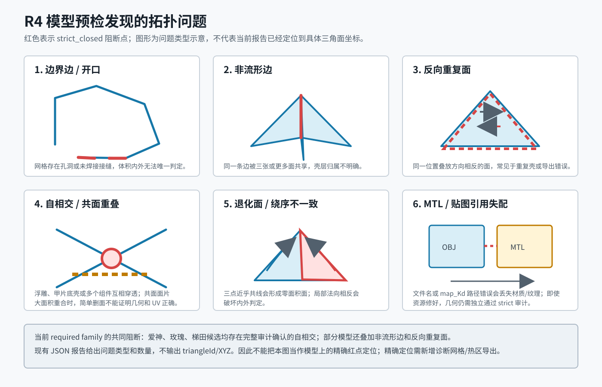
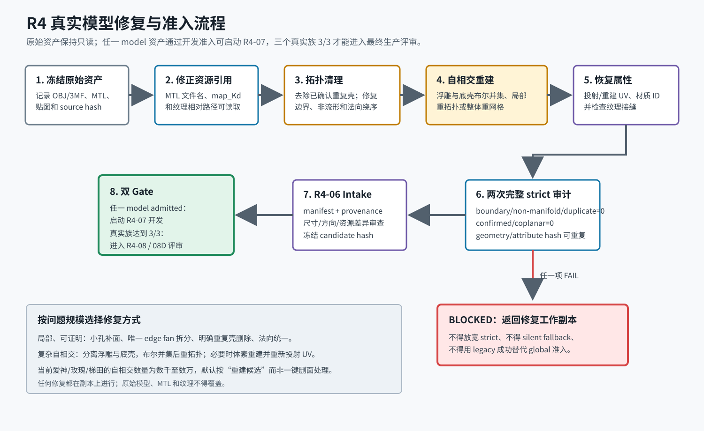

# REPORT_12E-08C-R4 模型资产预检清单

> 文档状态：VERIFIED / R4 后续输入基线  
> 日期：2026-07-22
> 扫描范围：`model/**/*.{obj,3mf}`  
> 生产边界：本报告只判定模型能否在“不重建”条件下进入后续严格模块，不代表已取得生产 TIFF 准入

## 1. 校验方法

统一使用 Release `mesh_repair_preflight`，在最终 `autoOrient` 变换后执行 topology、strict closed 和完整
AABB BVH 自相交审计：

```powershell
.\build\Release\mesh_repair_preflight.exe `
  --config <generated-config> `
  --output <report.json> `
  --voxel-mm 0.10 `
  --require-openvdb-off `
  --analyze-r3-01a `
  --complete-self-intersection-max-candidates 5000000
```

分类规则：

```text
可直接进入后续模块：strictPass=true，完整自相交审计 complete，confirmed/coplanar 均为 0；
需人工修复：无自相交，但存在非流形、反向重复面等 strict blocker，且自动修复策略拒绝；
需重建：存在 confirmed self-intersection 或 coplanar overlap；
审计阻断：解析失败、资源缺失、预算不足或完整审计未完成。
```

## 2. 模型校验表

| 模型 | 三角面 | 材质/纹理 | strict | 自相交（确认/共面） | 结论 | 主要问题 |
|---|---:|---:|---|---:|---|---|
| `model/3mf/haiyang_fudiao/01.3mf` | 99,538 | 3/3 | FAIL | 12,196/0 | 需重建 | 边界 6，非流形 10,179，反向重复面 6,623 |
| `model/3mf/meigui_fudiao/02.3mf` | 28,910 | 2/2 | FAIL | 54/64 | 需重建 | 非流形 9,631，反向重复面 6,255 |
| `model/3mf/meigui_fudiao/03.3mf` | 75,596 | 3/3 | FAIL | 5,136/0 | 需重建 | 非流形 10,939，反向重复面 7,190 |
| `model/obj/aishen_fudiao/MF_aishen_damuzhi_L_tx02.obj` | 84,533 | 1/1 | FAIL | 19,270/20 | 需重建 | 边界 3，非流形 59，反向重复面 2，退化面 1 |
| `model/obj/aishen_fudiao/ai_shen_wumingzhi_L_tx03.obj` | 79,904 | 1/1 | FAIL | 5,908/0 | 需重建 | 非流形 8,914，反向重复面 3,651 |
| `model/obj/aishen_fudiao/MF_ai_shen_shizhi_L_tx03.obj` | 299,976 | 1/1 | FAIL | 32,481/23 | 需重建 | 非流形 229，反向重复面 102，退化面 4 |
| `model/obj/aishen_fudiao/MF_aishen_xiaozhi_L.obj` | 109,538 | 1/1 | FAIL | 12,325/0 | 需重建 | 非流形 24，反向重复面 8 |
| `model/obj/aishen_fudiao/MF_aishen_zhongzhi_L_tx03.obj` | 131,584 | 0/0 | FAIL | 15,280/13 | 需重建 | OBJ 引用的 MTL 文件名与现有文件不一致；同时存在完整审计确认的自相交 |
| `model/obj/caihong/5mm.obj` | 308 | 7/7 | FAIL | 0/0 | 需人工修复 | 非流形 102，反向重复面 48；策略返回 `manual_repair_required` |
| `model/obj/meigui_fudiao/02.obj` | 70,262 | 1/1 | FAIL | 3,474/0 | 需重建 | 非流形 299，局部绕序不一致 1,305 |
| `model/obj/meigui_fudiao/03.obj` | 75,596 | 1/1 | FAIL | 15,730/0 | 需重建 | 完整审计确认自相交 |
| `model/obj/meigui_fudiao/04.obj` | 76,926 | 1/1 | FAIL | 5,592/0 | 需重建 | 非流形 10,940，反向重复面 7,192 |
| `model/obj/nai_you_new/MF_nai_you.obj` | 117,705 | 2/1 | FAIL | 8,409/0 | 需重建 | 边界 113，退化面 1 |
| `model/obj/shengdanjie_fudiao/star/MF_shengdanjie_zhongzhi_R_fy02.obj` | 23,454 | 19/15 | FAIL | 571/0 | 需重建 | 完整审计确认自相交；OBJ 实际使用的中指材质贴图存在，MTL 还声明了未随资产提供的其他纹理 |
| `model/obj/titian_fudiao/dmz.obj` | 95,590 | 1/1 | FAIL | 48,831/28 | 需重建 | 非流形 27,069，反向重复面 17,247 |
| `model/obj/xiao_ma_wu_yu_new/MF_Xiao_ma_Damuzhi_ty02.obj` | 12,736 | 5/5 | PASS | 0/0 | **可直接进入** | 完整审计通过 |
| `model/obj/xiao_ma_wu_yu_new/MF_Xiao_ma_Shizhi_ty03.obj` | 11,680 | 5/5 | PASS | 0/0 | **可直接进入** | 完整审计通过 |
| `model/obj/xiao_ma_wu_yu_new/MF_Xiao_ma_Wumingzhi_ty03.obj` | 11,680 | 5/5 | PASS | 0/0 | **可直接进入** | 完整审计通过 |
| `model/obj/xiao_ma_wu_yu_new/MF_Xiao_ma_Xiaozhi_ty03.obj` | 11,680 | 5/5 | PASS | 0/0 | **可直接进入** | 完整审计通过 |
| `model/obj/xiao_ma_wu_yu_new/MF_Xiao_ma_Zhongzhi_ty03.obj` | 11,680 | 5/5 | PASS | 0/0 | **可直接进入** | 完整审计通过 |
| `model/obj/yecan/3.obj` | 14,606 | 1/1 | PASS | 0/0 | **可直接进入** | 完整审计通过 |
| `model/obj/yecan/4.obj` | 14,606 | 1/1 | PASS | 0/0 | **可直接进入** | 完整审计通过 |

## 3. 汇总结论

```text
扫描模型：22
可直接进入后续严格模块：7
需人工修复：1
需复杂重建：14
审计阻断：0
```

22 个模型均被 importer 成功读取。`MF_aishen_zhongzhi_L_tx03.obj` 的 `mtllib` 名称与目录内实际 MTL
文件名不一致，因此 importer 结果为 0 材质/0 纹理；该资源问题不会掩盖其自相交 blocker。其余新增模型
均能读取到其实际使用的材质/纹理。圣诞模型的 MTL 声明了 15 个 `map_Kd`，但 OBJ 当前只使用
`MI_shengdanjie_zhongzhi_R_fy2`，其对应贴图存在；其余未使用材质的贴图没有随目录提供。资源计数不替代
后续纹理采样、颜色保真和 production writer 验收。

7 个直接准入候选已执行第二次完整审计；strict 状态、拓扑计数、candidate pair hash、geometry hash 和
attribute hash 均保持一致。

## 4. 后续输入选择

R4 正向开发优先使用：

```text
主彩色 OBJ：model/obj/xiao_ma_wu_yu_new/MF_Xiao_ma_Damuzhi_ty02.obj；
独立复核 OBJ：model/obj/yecan/3.obj；
同系列覆盖：xiao_ma_wu_yu_new 其余四个 OBJ 与 yecan/4.obj；
Texture2D 3MF：model 目录当前无 strict PASS 文件，继续使用
samples/models/3mf/texture2d_checker_cube.3mf 作为正向 fixture。
```

根据 `DOC_DECISION_12E_08C_R4_06_真实模型族准入替代规则.md`，R4-06 required Gate 改为
`aishen_fudiao/meigui_fudiao/titian_fudiao` 三个真实模型族各至少一个 admitted 资产。上述 clean OBJ
不属于这三个模型族，不能解除 required-family 最终 Gate 或 12E-08D 的生产阻断；依据 R4-07 开发准入
放宽决策，它们可以通过 `development_model_pool` intake 解锁开发四 case。

## 5. 三个真实模型族 Gate

| Required family | 已审计文件 | strict PASS | 可进入 R4-06 family 验收 | 结论 |
|---|---:|---:|---:|---|
| `required_aishen_family` | 5 | 0 | 0 | 所有候选均需修复或重建；中指模型还需修正 MTL 引用 |
| `required_meigui_family` | 3 | 0 | 0 | 所有候选均需修复或重建 |
| `required_titian_family` | 1 | 0 | 0 | `dmz.obj` 需修复或重建 |

当前无法保证三个目录各有一个无需重建的模型。R4-06 服务开发已经完成，但真实 family pass 保持 `0/3`。

## 6. R4-06 实际进入 Intake 的真实模型

R4-06 没有把 22 个资产全部重复送入 intake。22 个 OBJ/3MF 均进入了模型资产完整预检；intake 阶段从三个
required family 各选择一个代表模型，用于验证准入合同、manifest、hash、重复审计和阻断行为：

| Family | R4-06 实际候选 | Intake 结果 | 关键阻断 | 是否获准 |
|---|---|---|---|---|
| `required_aishen_family` | `model/obj/aishen_fudiao/MF_aishen_damuzhi_L_tx02.obj` | `blocked` | 自相交 19,270，共面重叠 20，边界 3，非流形 59 | 否 |
| `required_meigui_family` | `model/obj/meigui_fudiao/04.obj` | `blocked` | 自相交 5,592，非流形 10,940，反向重复面 7,192 | 否 |
| `required_titian_family` | `model/obj/titian_fudiao/dmz.obj` | `blocked` | 自相交 48,831，共面重叠 28，非流形 27,069，反向重复面 17,247 | 否 |

这里的“进入验证”只表示候选被 intake 服务读取和审计，不等于 required-family “获准资产”。最终真实族
获准资产必须满足：

```text
admitted=true；
requiredFamilyPassCount=1；
完整自相交审计 complete，confirmed=0，coplanar=0；
postRepairStrictPass=true；
资源、几何和属性 hash 已冻结且重复运行一致。
```

因此，授权规则“爱神/玫瑰/梯田三个真实模型族各至少一个获准资产”的当前完成度是 `0/3`，不是 `3/3`。
`xiao_ma_wu_yu_new` 和 `yecan` 的 7 个 strict PASS 模型不能跨族替代 required family，但其中两个已按
`development_model_pool` 独立准入：

| Development candidate | Intake | 用途 |
|---|---|---|
| `xiao_ma_wu_yu_new/MF_Xiao_ma_Damuzhi_ty02.obj` | ADMITTED | minimum/allTexture 开发 case |
| `yecan/3.obj` | ADMITTED | intermediate 开发 case |

## 7. 问题在哪里，以及现有证据能定位到什么程度



当前报告能确定的是“哪个资产存在什么类型的问题、数量是多少”；还不能把错误精确标到某个 OBJ 面号或
XYZ 坐标。原因是 `mesh_repair_preflight_report.json` 当前只持久化汇总计数和完整审计 hash，没有输出
问题三角形 ID、问题边 ID 或诊断网格。所以下表中的“位置”是拓扑语义位置，不是伪造的模型空间坐标：

| 问题 | 在模型中的语义位置 | 对切片的影响 | 处理原则 |
|---|---|---|---|
| 边界边 | 壳体孔洞、未焊接接缝或断开的轮廓边 | 内外体积不唯一，SDF/实体填充可能泄漏 | 识别闭合环后补面或重新焊接，不能盲目封闭大开口 |
| 非流形边 | 三个以上面共享的壳层交界、重叠组件接缝 | 面归属和法向传播不唯一 | 先识别 edge fan 的组件归属，再拆分、删除重复壳或重建交界 |
| 反向重复面 | 同一空间位置的双层面或重复导出壳 | 产生零厚度双面和错误内外判定 | 仅在几何/材质归属可证明时删除；否则重建该壳 |
| 自相交 | 浮雕与甲片底壳互穿、多个组件穿透或壳体自身折叠 | strict 和 SDF 构建均不可信 | 局部布尔并集、重拓扑或整体重网格；数千级问题默认按重建处理 |
| 共面重叠 | 两片表面在同一平面大面积覆盖 | 无法唯一选择保留面及 UV | 分离组件后做明确布尔/重拓扑，不用容差掩盖 |
| 退化面/绕序 | 极细三角形、零面积面或局部法向反向 | 数值不稳定、体积符号错误 | 删除/重建退化区域并统一法向，之后重新完整审计 |
| MTL/贴图失配 | OBJ 的 `mtllib` 或 MTL 的 `map_Kd` 文件路径 | 几何可读但材质/纹理丢失 | 先修正相对路径，再独立完成几何 strict 审计 |

若后续需要“在模型上看到红色故障区域”，应新增独立诊断能力：输出问题边、问题三角形和交点的
`diagnostic.obj`/`PLY`，并在 Qt 预检页显示。该能力不应改变 strict 结论，也不属于 R4-07 Release Gate。

## 8. 当前问题模型的建议修复路线



| 模型/模型族 | 当前主要问题 | 建议修复方式 | 修复后必须保留/验证 |
|---|---|---|---|
| 爱神大拇指 | 19,270 自相交，另有少量边界、非流形和退化面 | 在工作副本中分离浮雕/底壳，清理小拓扑问题后做布尔并集或局部重拓扑 | 外形尺寸、方向、UV、贴图和材质 ID；两次完整 strict PASS |
| 爱神无名指 | 5,908 自相交，8,914 非流形，3,651 反向重复面 | 先识别并移除重复壳，再重建非流形交界和互穿区域 | 六个组件的归属、UV 接缝和纹理连续性 |
| 爱神食指 | 32,481/23 自相交/共面，面数接近 30 万 | 优先整体重拓扑或体素重建，再从原模型投射 UV；不建议逐面对修 | 浮雕细节误差、纹理投射误差和目标尺寸 |
| 爱神小指 | 12,325 自相交，少量非流形/重复面 | 自相交区域重建为主，随后清理残余拓扑 | 浮雕边缘和底壳厚度不得塌缩 |
| 爱神中指 | 15,280/13 自相交/共面，且 OBJ 引用不存在的 `aishen_zhongzhi_L_tx03.mtl` | 先把 `mtllib` 改为现有 `MF_aishen_zhongzhi_L_tx03.mtl` 或同步重命名工作副本，再重建互穿区域 | `T_aishen_zhongzhi_L.png` 可读、材质/纹理计数恢复，strict PASS |
| 玫瑰 02 | 3,474 自相交，299 非流形，1,305 绕序不一致 | 分离两个组件，修复 edge fan 和绕序，再对浮雕/底壳做布尔或局部重拓扑 | 纹理方向、法向方向和组件合并后的闭合性 |
| 玫瑰 03 | 拓扑汇总表面干净，但有 15,730 自相交 | 检查隐藏重叠壳和浮雕穿透；采用布尔并集或重拓扑 | 不能因边界/非流形为 0 就跳过完整自相交审计 |
| 玫瑰 04 | 5,592 自相交，10,940 非流形，7,192 反向重复面 | 先删除已证明的重复壳，再重建剩余交界和互穿区域 | 两个组件的材质和 UV 归属 |
| 梯田 `dmz.obj` | 48,831/28 自相交/共面，27,069 非流形，17,247 反向重复面 | 问题规模最大，建议整体重建/重拓扑，不采用局部自动删面 | 梯田浮雕层级、外轮廓、底壳厚度和 UV 纹理 |
| 彩虹 `5mm.obj` | 无自相交，但 102 非流形、48 反向重复面 | 可人工修复：确认重复面归属、拆分 edge fan、统一法向 | 7 个材质和 7 张纹理必须全部保留 |
| 奶油 `MF_nai_you.obj` | 边界 113、退化面 1、自相交 8,409 | 先封闭可证明的小边界并删除退化面，再重建互穿组件 | 10 个组件、2 个材质和纹理资源 |
| 圣诞中指 | 自相交 571；MTL 含多份其他手指的未使用材质定义 | 修复两个组件之间或壳体内部的互穿；同时精简未使用材质或补齐完整资源包 | 当前实际使用的中指 UV/贴图、单位换算和两个组件关系 |
| 三个 3MF | 多组件/多资源，存在数十至上万自相交及大量重复壳 | 解包后按 component/resource ID 分离，清理或重建，再恢复 3MF 材质/Texture2D 关系 | 组件变换、Color/Texture2D property、纹理包路径和单位 |

上述修复全部在副本中完成，禁止覆盖 `model/` 下的原始 OBJ/3MF、MTL 和贴图。复杂自相交修复并不是
当前 R4 自动修复器的能力；可以使用 DCC/网格工具外部修复或独立重建，但结果必须重新进入 R4-06 intake。

## 9. R4-07 准备度与启动结论

截至本次全量复核：

```text
model 目录 OBJ/3MF：22/22 已完成完整预检；
strict PASS：7；
required family strict/admitted：0/3；
development_model_pool admitted：2/2；
R4-06 软件能力：COMPLETE；
R4-07 development four-case：4/4 PASS；
R4-07 final required-family acceptance：NO-GO，等待 required family matrix=3/3。
```

R4-07 开发已经按放宽后的 Gate 完成；clean OBJ 只证明开发链路，不代表爱神/玫瑰/梯田最终验收。下一条
最终准入路径仍是：每个 required family 提供至少一个修复/重建候选，运行 R4-06 intake，三个报告均
`admitted=true` 后重跑真实族矩阵、冻结生产预算，再评审 R4-08。

## 10. 本地证据

```text
output/benchmarks/12e_08c_r4_model_inventory/model_inventory_summary.json
output/benchmarks/12e_08c_r4_model_inventory/model_inventory_summary.csv
output/benchmarks/12e_08c_r4_model_inventory/usable_repeatability.json
output/benchmarks/12e_08c_r4_model_inventory/<case>/mesh_repair_preflight_report.json
output/benchmarks/12e_08c_r4_model_inventory/<case>/mesh_repair_preflight_report_repeat.json
output/benchmarks/12e_08c_r4_06_repaired_asset_intake/required_family_matrix.json
output/benchmarks/12e_08c_r4_06_repaired_asset_intake/development_gate_matrix.json
output/benchmarks/12e_08c_r4_07_development_gate/four_case_development_summary.json
output/benchmarks/12e_08c_r4_06_repaired_asset_intake/<candidate>/intake_report.json
```

`model_inventory_summary.json/csv` 已按当前 22 个 OBJ/3MF 的逐资产报告重新汇总。模型和 benchmark 文件是
本机证据，不纳入本次文档修改提交。
