# SliceSoft 新版切片软件使用手册

> 日期：2026-09-14（同步蓝色选中轮廓、鼠标导航、逐页布局、导入后工艺切换、RIP 进度与默认目录）
>
> 适用产品线：`product/packaged-slicer`；本次 HOSTUX 更新实现分支为 `codex/host-visibility-navigation`。
>
> 适用程序：`slice_soft_test.exe`；保留 `slicer_ui_host_sim.exe` 兼容入口，两者启动同一版本。
>
> 适用对象：模型导入、工艺选择、场景排版、切片作业、六/七通道生产包与 RIP 结果检查人员。

## 1. 软件定位

新版软件采用“打印宿主界面 + 切片能力模块 + Worker”结构。操作人员在宿主界面中完成模型、
Profile、切片参数和输出目录选择；切片模块负责场景与生产包能力；Worker 在独立进程中执行作业。

本程序是参考宿主，不包含打印机通信和喷头控制；RIP 由独立外置模块执行，宿主负责配置、调用和输出校验。
当前本地切片、生产包校验及外置 RIP 集成可用，
打印侧书面回签、目标 RIP、洁净机和实物打印证据仍属于外部验收，不能仅凭本界面判定整机量产放行。

生产包有两种明确区分的协议，不能通过改文件后缀互相转换：

```text
默认六通道   = p0.rgbwsv.2   / R G B W S V
显式 T 工艺  = p0.rgbwsvt.1  / R G B W S V T
bitDepth     = 8
polarity     = black_is_print
```

### 新功能速查

| 要完成的操作 | 对应章节 |
|---|---|
| 保留源姿态、源 XY 或整体偏移一批模型 | 5.1，图 18 |
| 导入中文路径、中文 OBJ/MTL/贴图 | 5.3 |
| 沿 Z 移动、旋转后触底、手动触底 | 6.2，图 19 |
| 多图层透明→光油、非打印定位块、同层多素材 | 4.2.1、7.1，图 12/13 |
| 将模型左侧/下侧到 X=0、Y=0 的空白保留在所有层中 | 7.2；六/七通道均支持 |
| 对照 TIFF 朝向、查看全通道或单通道 | 9.1 |
| 自动/手动 RIP、正常/3 倍墨量、单色/彩色验证 | 9.3，图 14..17 |
| 蓝色选中轮廓、鼠标锚点旋转、加粗 XYZ 轴 | 6.1，图 22 |
| 右侧分组布局、标签滚轮切换、参数防误改 | 6.4，图 23..27 |
| 导入后直接切换彩色纹理/缩裹材料 | 3、4.1，无需清空重导 |
| RIP 连续计时、处理阶段、默认手动目录 | 9.3.3、9.3.4，图 24 |

图 1..21 为保留的操作示例，部分布局来自较早版本；当前 HOSTUX 布局以图 22..27 及正文为准。

## 2. 启动软件

优先使用已部署运行目录，确保宿主、模块、Worker、Qt 和 TIFF 依赖处于同一目录：

```powershell
cd runtime\slicesoft\Release
.\slice_soft_test.exe
```

调试运行目录：

```powershell
cd runtime\slicesoft\Debug
.\slice_soft_test.exe
```

程序默认加载同目录的 `slicer_module.dll`。只有开发或诊断时才显式指定模块：

```powershell
.\slice_soft_test.exe --module D:\path\to\slicer_module.dll
```

在 VSCode 中，日常使用可选 **SliceSoft 14E: Quick Run Packaged Host UI (Release, No Build)**，
它直接启动已部署版本，不编译、不更新程序。修改源码后则选 **Run Packaged Host UI (Release)**，
它先调用构建/部署任务再启动。CMake 支持增量构建，但实际是否全量取决于所选任务：
当前 VSCode 日常入口为 `Fast Build` 增量构建后 `DeployOnly` 部署；直接运行部署脚本且不带
`-DeployOnly` 时默认完整构建，显式 `-Incremental` 才启用脚本的增量流程。不要把 No Build 当作更新步骤。
首次构建、切换 Debug/Release、修改公共头文件或构建配置时耗时可能明显增加。
更新前保存并关闭正在运行的旧宿主；不要只替换 EXE 而保留旧模块或 Worker。

编译 `slicer_ui_host_sim` 后，CMake 会把本手册和全部截图复制到可执行文件旁的：

```text
docs/user_guides/SLICE_PRODUCT_PACKAGED_新版切片软件使用手册.md
docs/user_guides/assets/packaged_slicer/
```

执行 `PrepareSliceSoftRuntime.ps1` 后，同一目录结构会进入
`runtime/slicesoft/<Config>/`，并记录在 `runtime_manifest.json` 的 `resources` 中。

启动后先检查窗口顶部：

- “模块已就绪”表示 SPI、Profile 目录和模块能力已正常解析。
- 模块路径应指向本次运行目录或明确指定的受控版本。
- “模块诊断”页可查看版本、能力和初始化信息。


图 1：新版工作区。中央是俯视/3D 场景，右侧依次提供模型、Profile、切片设置、切片作业和变换排版。

## 3. 推荐操作流程

推荐按以下顺序操作，避免在模型、Profile 或设备参数尚未确定时提交作业：

1. 确认模块已就绪。
2. 在“工艺配置”选择可切片的生产 Profile。
3. 在“切片设置”确认工艺预设、DPI、层厚、构建体积、输出目录和材料参数。
4. 先在“变换与排版”确定两个导入开关和批次原点，再在“模型”页批量导入 OBJ、3MF 或 STL。

> 上述顺序是建议，不是限制。**已导入模型后也可切换工艺配置，无需清空或重新导入**，
> 模型和摆放位置保留；失败时恢复原工艺并提示原因。作业运行期间不能切换。
> 设备构建体积仍受场景绑定限制，需改变设备画幅时使用“新建场景”重新建立场景。
> “新建场景”会清空当前模型，但保留当前选定工艺；不要仅为切换工艺误点该按钮。

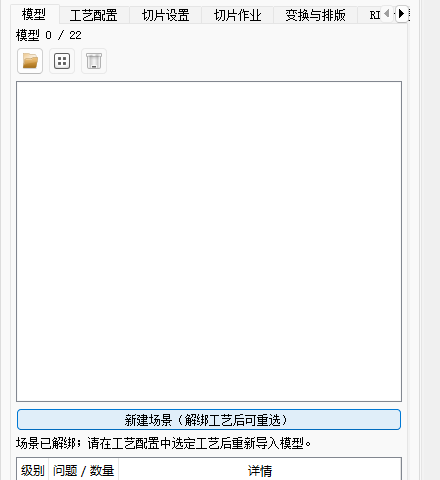

5. 在俯视或 3D 视图确认方向、纹理、碰撞和越界状态。
6. 必要时在“变换与排版”调整实例，重新执行规则排版。
7. 在“切片作业”确认已就绪后开始切片。
8. 在“结果”页检查生产包身份、层预览、通道曲线和报告。
9. 需要 RIP 时，在“RIP 设置”确认颜色模式、墨量与输出验证，再点“运行 RIP”；若已提前启用自动处理，检查自动 RIP 的终态与输出目录，见 9.3。

## 4. 选择 Profile 与工艺

### 4.1 工艺配置

“工艺配置”页会把宿主 Profile 与模块实际能力求交。列表中只有“能力状态”为可用、且要求
`slice.rgbwsv` 或 `slice.rgbwsvt` 的 Profile 才能提交切片。

| Profile | 用途 | 操作要求 |
|---|---|---|
| 彩色纹理生产 · 材料与支撑可编辑 | 日常模型导入、排版与生产包生成 | 默认选择，提交前检查纹理和输出目录 |
| 材料一致性验证 · 受限候选 | 修复后几何、材料闭合与通道一致性专项 | 不等于生产准入，失败时必须停止 |
| 生产包与六通道检查 · 只读 | 检查生产包和报告 | 不能作为模型切片入口 |
| 缩裹材料 T 通道 · 显式新版协议 | 缩裹区域独立成 T 通道，输出七通道 `p0.rgbwsvt.1` | 仅在明确选择 `_rgbwsvt` 工艺并确认外部 RGB/Kd 配置后使用 |

“生产安全级别”分别显示生产可用、受限候选或仅诊断。不要把“能力可用”误读为设备端已验收。

从“彩色纹理”改选“缩裹材料”时，软件会同步当前已验证预设对应的七通道版本和 T 识别策略，
保留其他已编辑参数；切回非 T 切片 Profile 时关闭 T 输出。若当前自定义/候选工艺没有已验证的
T 变体，会拒绝改选并提示先选择支持 T 的常用工艺，而不是静默替换材料策略。只读 Profile 仍不能切片。

### 4.2 常用工艺预设

“切片设置 -> 常用工艺预设”提供以下六通道组合，并为支持 T 的工艺提供“｜缩裹 T 通道”变体。
列表中的“自定义”表示保留当前参数，不是另一种材料工艺：

| 预设 | 适用场景 |
|---|---|
| 全实体 RGB + 下表面支撑 | 纹理不含不可打印纯白，W/V 保持空 |
| RGB 表层 + 白墨实体填充 | 彩色表层之间由 W 承载模型实体 |
| 全实体 RGB + 按需补白墨 | 默认预设，仅为严格纯白纹理像素写 W 载体 |
| RGB 表层 + 光油实体填充 | 彩色表层之间由 V 承载模型实体 |
| RGB 表层 + 白墨与光油实体填充 | 同时需要 W/V 的工艺，提交前展开材料段核对填充与光油参数 |
| 单材料白墨 W | 不采样彩色纹理的白墨模型 |
| 单材料光油 V | 不采样彩色纹理的光油模型 |
| 多材质纵深｜逐层材质 RGB + 按需补白墨（候选） | 按 Z 解析多材质归属，需满足多材质准入和优先级要求 |
| 多图层透明→光油 | **多图层模型**：透明素材写 V，其余素材各按自身贴图走 RGB |

名称带“｜缩裹 T 通道”后缀的预设输出七通道 `p0.rgbwsvt.1`，把缩裹区域写入独立 T 通道
而不占用 RGB。它们从部署目录 `configs/material_process` 下的 `*_rgbwsvt.json` 读取
缩裹识别参数；该目录缺文件时预设**不会出现在下拉里，也不会报错**。

| 缩裹变体 | 甲片部分 | 缩裹区域 |
|---|---|---|
| 全实体 RGB｜缩裹 T 通道 | 贴图走 RGB | T |
| 全实体 RGB + 按需补白墨｜缩裹 T 通道 | 贴图走 RGB，不可打印纯白补 W | T |
| 单材料白墨 W｜缩裹 T 通道 | 整模型写 W | T |
| 单材料光油 V｜缩裹 T 通道 | 整模型写 V | T |

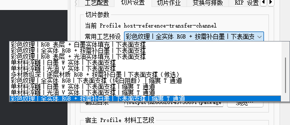

缩裹识别按材质漫反射色 `Kd` **精确匹配**，不认材质名也不做模糊距离。不同批次导出的
同一材质可能相差 1（例如 `0.8627 -> 220` 与 `0.8588 -> 219`），差 1 即完全不命中。

### 4.2.1 多图层透明→光油（多材质纵深）

一个模型含多个图层、每层各有自己的素材（例如上层透明、下层带贴图）时用这个预设。
它与其余预设的根本差别是**按 Z 解析同一 XY 列上的材质归属**，因此同一列在不同层可以
属于不同素材；其余预设逐 XY 列只取顶面材质，表达不了纵深叠放。

该预设自动开启四项，缺一即不可用：

| 项 | 值 | 缺失后果 |
|---|---|---|
| 多材质纵深体积 RGB | 启用 | 退回顶面取色，下层素材拿不到自己的颜色 |
| 按材质命名自动推导优先级 | 勾选 | 退化为手填两个材质名，多图层素材数超过名字槽而无法提交 |
| 由不透明度判光油 | 启用，上限 0.001 | 透明素材不进 V，会以近白色留在 RGB |
| 退化面阈值 | 1e-24 | CAD/NURBS 导出的 nm² 级合法薄面被误杀，材质被判开放表面而直接拒绝 |

**对资产的要求**（详见 `docs/slice/DOC/DOC_SPEC_MATERIAL_NAMING_多图层素材命名与语义标识规范.md`）：

```text
打印材质名     <素材名>[-<同层序号>]-L<层号>   L1 为设计上的最上层，向下递增
透明素材       名为 transparent / trans，且 MTL 的 d 值为 0
各图层贴图     每个图层的材质在 MTL 中各自声明 map_Kd
内嵌关系       被包裹的素材层号【更小】，包裹它的介质层号更大
```

最后一条最容易出错。若一个素材被另一个完全包裹（内层 X/Y/Z 都真包含于外层），
两者**不得同层**——同层时由类别次序裁决，透明素材会胜出并把被包裹的素材整个吃掉，
而且**切片会正常结束、不报任何错误**，只是内嵌部件在切片数据里消失。

```text
正确   nail-L1  +  trans-L2      被包裹的物体 L1，包裹它的透明介质 L2
错误   nail-L1  +  trans-L1      内嵌部件静默消失
```

**不实际打印的画幅定位块：** 材质名统一为 **`nail-Default`**，区分大小写，不带层号。
这指的是 MTL 的 `newmtl` 与 OBJ 的 `usemtl`，不是文件名或对象名；多个定位块共用这个材质。
普通 `Default`、`nail-default`、`nail-Default-L1` 都不会被识别为非打印定位材质。

定位块只保留变换后的 XY 输出画幅，不生成墨水、支撑或额外打印层，不参与主体的自动定向与触底决策。
定位块不再作为打印表面显示，但画幅范围仍保留；主体仍按原工艺打印，此规则也兼容“全实体 RGB+按需补白墨”。
不要把需要打印的主体面绑定到定位材质，只有定位块而没有主体的模型会被拒绝。
修改命名后应重新导入模型。含定位几何的“修复导出”目前会明确拒绝，以防丢失画幅，不影响正常切片。
注意：自动定向仍默认启用。定位块剔出定向参考后，只按主体形状计算，结果可能与旧版不同，
例如 `gubao05` 会发生翻面。要保留源模型的倒钩姿态，导入前取消“导入时自动定向”；
还要保留源 XY 时，同时取消“导入后自动排版”，批次原点 X/Y 设为 0。主体 Z 轴仍会触底。
导出示例及完整边界见[素材命名规范 §1.3](../slice/DOC/DOC_SPEC_MATERIAL_NAMING_多图层素材命名与语义标识规范.md#13-非打印画幅定位保留名用户-2026-09-07-授权)。

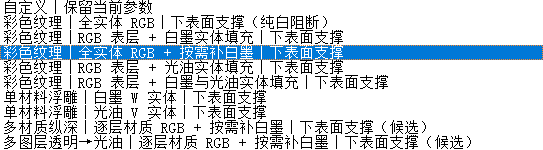

图 12：当前 Release 的预设列表，底部为“多图层透明→光油”；T 变体在列表更下方。

选择预设后仍可继续调整材料、纹理和支撑参数。预设是参数起点，不替代切片前检查。

## 5. 导入与检查模型

### 5.1 支持格式

点击“模型”页中的添加按钮，可一次选择一个或多个文件：

```text
*.obj
*.3mf
*.stl
```

OBJ 彩色纹理应同时提供 OBJ 引用的 MTL 和贴图文件。STL 不携带彩色纹理，通常应选择单材料工艺。

导入流程会执行快速预检并显示：三角形数、顶点数、包围盒尺寸、UV、法线、问题级别和详情。
批量导入是一次场景提交。“变换与排版”提供两个互不替代的开关：

- “导入时自动定向”默认勾选；取消后保留模型源姿态，但 Z 轴仍自动触底；
- “导入后自动排版”默认勾选；取消后不执行规则排版，并开放“批次原点 X/Y”。

批次原点是应用到下一批全部新增模型的统一 XY 偏移，模型之间的相对位置保持不变。需要按 OBJ
源坐标复现整组位置时，应同时取消自动定向和自动排版，再填写批次原点；例如源组合左侧超出
`0.5 mm`，可填写 `批次原点 X=0.5 mm`。这些输入不修改 Z，导入实例仍自动触底。场景最多 22 个实例。

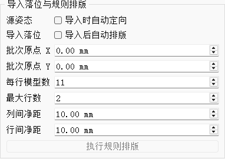

图 18：保留源坐标的设置示例，两个开关均关闭，批次原点为零。初次默认两个开关均开启，
不要把示例中的关闭状态误当作默认值。修改开关或批次原点不会追溯移动已导入模型。

| 需求 | 导入前设置 |
|---|---|
| 软件自动调整甲片姿态并规则排版 | 两个开关都勾选 |
| 原角度不变，仅规则排版 | 取消自动定向，勾选自动排版 |
| 按源 XY 坐标展示整组模型 | 两个开关都取消，批次原点 X/Y=0 |
| 保持组内位置，整体平移 | 两个开关都取消，填写统一批次原点 X/Y |
| 保留 X=0 到模型左侧的空白，不移动模型 | 另在“切片设置”勾选“补齐至 X=0”，见 7.2 |

源文件的 (0,0) 只有在未自动定向、未排版且批次偏移为零时，才按源 XY 坐标落在场景原点。
Z 仍按每个导入实例的主体触底；这不是“完全保留源三维坐标”，也不保证多个独立文件的源 Z 间距。


图 2：模型已导入并自动排版。中央显示场景，右侧可切换到“变换与排版”继续调整。

### 5.2 预检结果

| 状态 | 含义 | 处理方式 |
|---|---|---|
| 通过 | 当前模型满足快速预检 | 继续检查排版与切片设置 |
| 需要人工修复 | 模型不能直接视为严格生产通过 | 修复源模型后重新导入和严格检查 |
| 阻断 | 存在明确生产阻断项 | 不得继续提交生产切片 |

非流形、重复或相反重复面、局部绕序问题会阻断严格生产准入；确认自交必须快速失败。

### 5.3 中文路径与中文素材

新版封装宿主支持中文目录和中文 OBJ/STL/3MF 文件名，例如 `C:\Users\admin\Downloads\黄晨晨ND002.obj`。
无需为此开启 Windows“使用 Unicode UTF-8 提供全球语言支持”测试选项，也无需把模型改成英文名。

1. 将 OBJ、它引用的 MTL 和贴图一起复制，保持 `mtllib` / `map_Kd` 与实际路径一致。
2. 为跨电脑交换，优先将 OBJ/MTL 文本保存为 UTF-8；中文路径兼容不等于能自动猜出任意旧编码。
3. 中文输出目录同样可用，但仍需目录可写、资源齐全；不要使用过长的嵌套目录。
4. 在其他电脑复现“文件不存在”时，先核对宿主、模块 DLL 和 Worker 是否一起更新，不能只复制界面程序。

路径修复已做本机隔离 ACP936/1252/65001 验证；这不等于每台电脑或每种外部导出软件都已验收。
旧 OBJ/MTL 仅对无效 UTF-8 字节保留本机 ANSI 兼容，跨机器编码不同的素材建议重新导出 UTF-8。
仍失败时提供完整路径、错误码、文件是否实际存在、MTL/贴图引用与模块版本，不要只提供中文文件名。

## 6. 查看、选择与编辑场景

### 6.1 俯视和 3D

工作区左上角可切换“俯视”和“3D”：

- 俯视用于检查 X/Y 排版、工作台边界、纹理外观和实例选择。
- 3D 用于检查模型高度、空间关系和整体外观。
- “设置”页可选择下次进入工作区的默认视图，以及 3D 正交/透视投影。
- 网格和选中高亮只影响显示，不修改模型或生产 TIFF。


图 3：3D 场景视图。视图切换不会重新计算几何或改变切片数据。

在右侧模型列表或画布选择模型后，2D/3D 均显示**蓝色外轮廓**，不再用黄色线覆盖内部透明孔洞。
模型材质和切片数据不会因选中而改变。3D 拖动旋转以鼠标按下处的可见表面点为锚点；
按在空白处时使用相机焦平面锚点，不会旋转模型本身。原点坐标轴已加粗并标注 X/Y/Z。

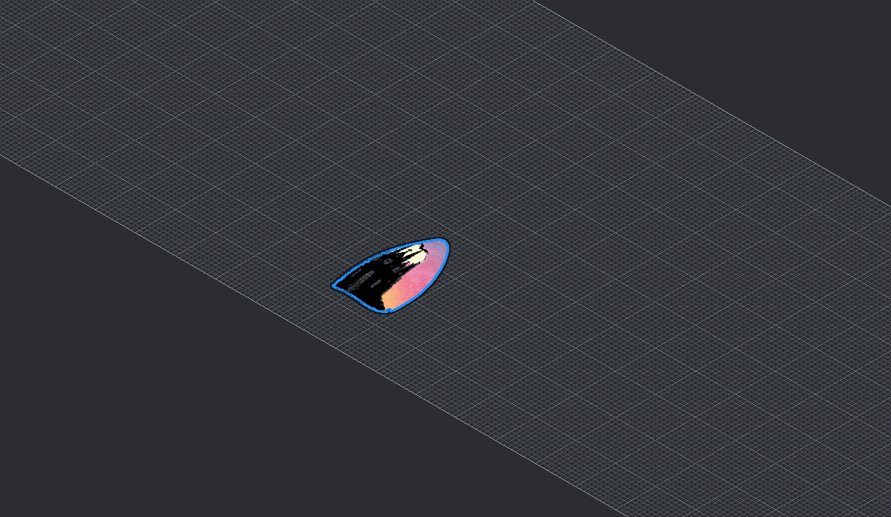

图 22：gubao05-dingwei 真实模型的选中显示，内部图案不再遍布黄色描边；这是显示证据，不是打印结果。

### 6.2 实例变换

在模型列表或画布中选择实例，再打开“变换与排版 -> 变换”。可提交：

```text
X / Y / Z 增量
绕 X / Y / Z 旋转
等比缩放
镜像 X / 镜像 Y
变换后自动触底 / 将选中实例触底
```

一次点击“提交选中实例变换”会原子提交当前输入。提交后检查场景 revision、碰撞数和越界数。
输入非零 Z 增量表示人工抬高或下移模型，软件会自动关闭“变换后自动触底”，防止该位移被
立即抵消；点击“将选中实例触底”会清除累计 Z 偏移，并把模型主体重新贴到 Z=0。对于带有
远离主体的微小孤立角标或测量标记的 STL，触底以显著连通组件为准，源几何不会被静默删除。


图 4：实例变换页。数值单位分别为 mm、deg 和无量纲缩放因子。

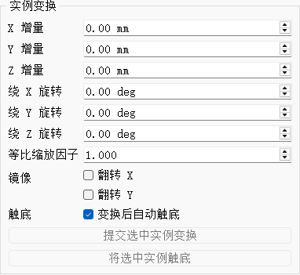

图 19：当前 Z 移动与触底控件。本图未选择实例，两个提交按钮为禁用状态；先选中模型后才可操作。
例如要抬高 1 mm，输入“Z 增量=1”再提交；要回到平台，点击“将选中实例触底”。
“增量”不是绝对坐标，提交后应查看模型实际位置，不要把同一数值重复提交当成设置绝对高度。

### 6.3 规则排版

规则排版支持每行模型数、最大行数、列间净距和行间净距。默认上限对应 11 × 2、共 22 个实例。
排版由切片能力模块执行，宿主不会自行计算另一套落位结果。


图 5：规则排版完成后应同时检查视觉结果、碰撞计数和越界计数。

### 6.4 右侧页面与鼠标操作

右侧顶层标签固定，不随内容滚出屏幕。模型和工艺配置页面常规尺寸无需页面滚动条，列表/说明仍可内部滚动。
“切片设置”参数较多，保留按需滚动；“切片作业”仅内容溢出时滚动。
“变换与排版”分为“变换 / 导入与排版”，“RIP 设置”分为“参数 / 路径 / 手动 RIP”。
常规窗口无需整体滚动这些分组；小窗口或长诊断信息溢出时仍保留滚动保护，避免控件被截断。

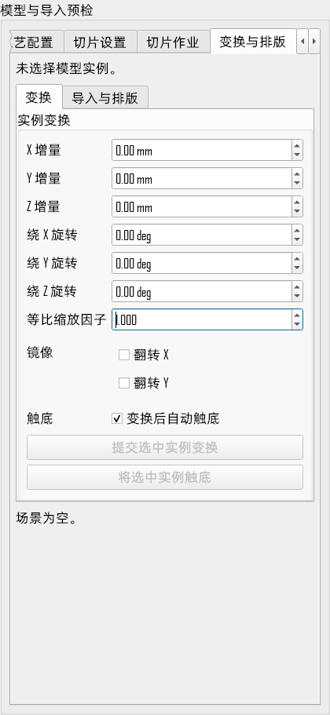

图 25：变换与触底入口，图中尚未选择模型，故提交按钮禁用。

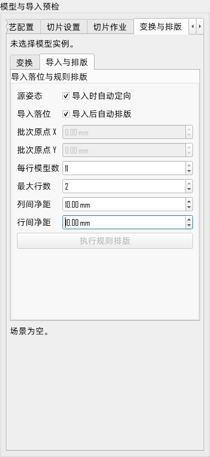

图 26：导入开关、批次原点与规则排版；切换分组不会重置参数。

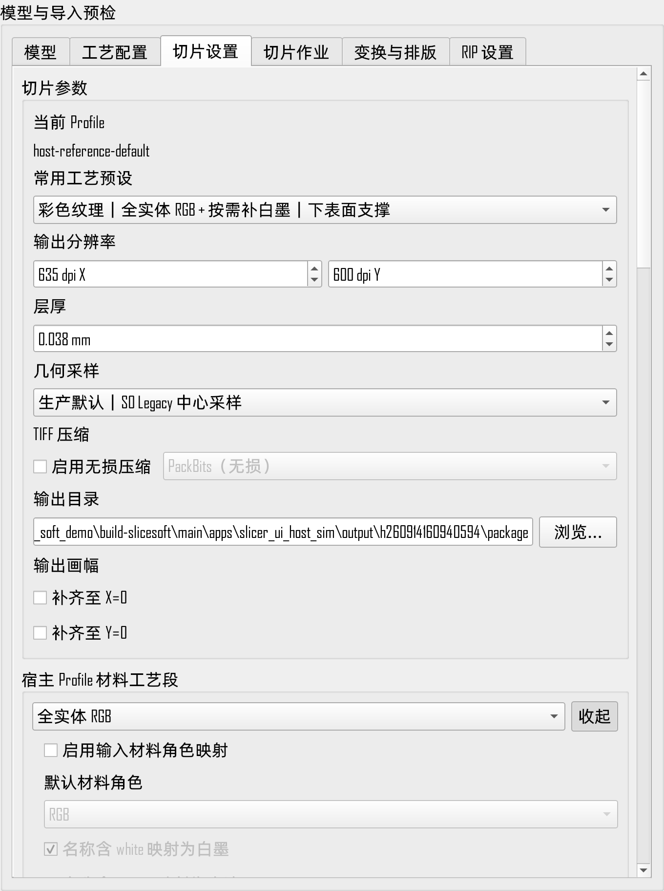

图 27：200% 缩放下拖宽右栏后的切片设置，复合输入行不再被父容器裁剪；参数较多时按需滚动。
可拖动工作区与右栏之间的分隔线调整宽度。窄栏下若展开的复杂字段仍超宽，可拖宽右栏或使用横向滚动条。

| 操作位置 | 滚轮行为 |
|---|---|
| 有模型的 2D/3D 画布 | 以鼠标位置为中心缩放；拖动/按住鼠标键期间暂停缩放 |
| 设置页、模型列表、报告、展开的下拉列表 | 滚动浏览 |
| 顶层或分组标签栏 | 前后切换标签；参数区滚动不会跳页 |
| 数值输入、未展开下拉框、生产层滑条 | 不改值、不改工艺、不跳层；有上级滚动区域时转交滚动 |

即使参数框拥有焦点，也不能用滚轮改值；键盘输入、增减箭头、滑条拖动及中键平移仍可用。
完整规则见 [鼠标滚轮交互规则](SLICE_HOST_鼠标滚轮交互规则.md)。

## 7. 设置切片参数

打开“切片设置”，逐项确认：

| 设置 | 默认值或规则 | 注意事项 |
|---|---|---|
| 输出分辨率 | 635 × 600 DPI | 应与打印设备 Profile 一致 |
| 层厚 | 0.038 mm | 改动会影响层数、耗时和材料统计 |
| 几何采样 | S0 Legacy 中心采样 | 当前生产默认，不得被候选策略静默替换 |
| TIFF 压缩 | 关闭，`none` | PackBits 仅在目标 RIP 明确兼容时启用 |
| 输出目录 | 每次会话独立 package 目录 | 不要覆盖仍在使用或待追溯的生产包 |
| 输出画幅｜补齐至 X=0 | 不勾选 | 仅向左补空白、不平移模型，六/七通道均支持，见 7.2 |
| 输出画幅｜补齐至 Y=0 | 不勾选 | 仅向下补空白，可与 X 同时勾选；本次 XYPAD 版本新增 |
| 构建体积 | X/Y/Z 由宿主设备 Profile 提供 | 模块不会替设备猜默认值 |
| 缩裹 T 通道｜真开边上限 | 0（不放行任何开边） | 仅在选择缩裹工艺时相关，见下 |
| 多材质纵深｜按材质命名自动推导优先级 | 随工艺预设，多图层预设为勾选 | 勾选后下方两个材质名槽停用，见 7.1 |

几何采样中的 S3“层体积 2×2（至少 2/4）”是诊断候选，仅限受控的
`relief_heightfield` 场景，包括彩色纹理浮雕和单材料白墨 W/光油 V 浮雕。单材料工艺选择
S3 不会启用纹理，只会切换几何采样链路。选择 S3 不会改变 S0 的生产默认地位，也不能据此
把 P3 姿态用于生产。

**缩裹 T 通道｜拓扑放宽 -> 真开边上限**：缩裹材质须为闭合曲面才能求解纵深区间。
默认 0 表示不放行任何真开边；某些资产的缩裹材质带少量真开边（`08`/`09`/`08-03`/`08-04`
各有 3 条），此时切片会以
`E_MATVOL_T_TOPOLOGY_INVALID … boundary edges exceed the configured limit of 0` 失败，
对已确认属于上述资产、且诊断确为 3 条真开边的情况，可将上限设为 3 后重新检查。
不要为消除错误任意调大上限。放宽只对**有界**开边生效，逐列射线奇偶检查仍然执行，
不保证所有带开边模型都能切片，也不会绕过区间求解的正确性门。

该值会随工作区持久化。若工作区保存于此设置存在之前，恢复出的值为 0 并会覆盖工艺文件里的
设定——直接在本控件改成所需值即可，改动会正确写回。

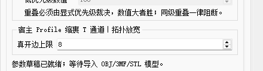

### 7.1 多材质纵深｜优先级的两种给法

“宿主 Profile 多材质纵深段”里勾选“启用多材质纵深体积 RGB（候选）”后，重叠区归谁由
优先级裁决，数值大者胜，**同级重叠一律阻断**。优先级有两种给法：

| 方式 | 何时用 | 操作 |
|---|---|---|
| 按材质命名自动推导 | 多图层资产（素材数多于两个） | 勾选“按材质命名自动推导优先级”，两个名字槽自动停用 |
| 手填两个材质名 | 只有两种材质需要裁决 | 不勾选，填写高/低优先级材质名与数值 |

自动推导按 `<素材名>-L<层号>` 计算，规则是**层序主导、同层再看类别次序**：

```text
priority = (最大层号 + 1 - 本层号) × 100 + 类别次序
类别次序   透明 20 ＞ 常规 10
```

所以 `L1` 整层压过 `L2` 整层；常规/透明两类同层相遇时，透明优先。
贴图素材的名字主体由设计侧决定，例如 `lcb-L1` 与 `cb-L1` 可以同时存在并共享同级优先级，
**不因名字不同而拒绝**；它们若在空间上实际发生同级重叠，仍由材质区间求解阻断。
实际打印素材缺少 `-L<n>` 后缀会报 `E_MATOPQ_LAYER_NAME_INVALID`；
精确保留名 `nail-Default` 不参与图层优先级，不可推广成忽略所有 `Default`。
特殊类别 `el` 的类别次序为 30，完整约束以[素材命名规范](../slice/DOC/DOC_SPEC_MATERIAL_NAMING_多图层素材命名与语义标识规范.md)为准，不要把普通素材随意改为保留名。

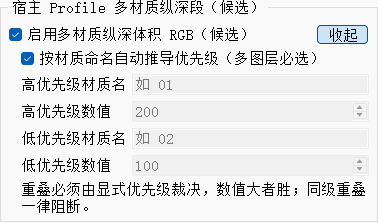

图 13：选用多图层预设后自动启用纵深与命名推导，手填材质槽变灰是正常状态，不表示配置丢失。

有效 Profile 预览会显示本次准备提交的完整配置。只有校验提示已就绪时才进入下一步。

### 7.2 输出画幅｜补齐至 X=0 / Y=0

导入前在“切片设置 → 输出画幅”按需勾选“补齐至 X=0”和“补齐至 Y=0”，再确认工艺和模型摆放并切片。
两个开关独立，默认关闭，设置会保存；恢复旧工作区时缺少 Y 项则仍关闭，不会将旧的 X-only 自动变成 XY。
Y 开关是 `codex/xy-origin-canvas-padding` 功能分支新增；旧运行包只有 X 时，需要使用包含本次更新的完整运行包。
2026-09-09 经用户确认，已将通过验证的 XYPAD 版本更新到 `runtime/slicesoft/Release/slicer_ui_host_sim.exe`，原启动入口可直接使用；独立验证副本保留在 `runtime/slicesoft-xypad/Release`。

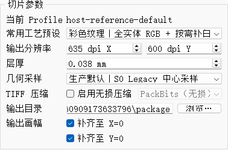

图 21：XYPAD 验证版的两个独立开关，同时勾选可补齐左侧及下侧空白；不会移动模型。

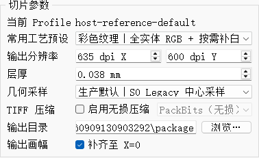

图 20：先前 X-only 版本的 T 工艺补白示例。本图实际选择“全实体 RGB + 按需补白墨｜下表面支撑｜缩裹 T 通道”，
窄面板中的预设名称会截断，完整名称请展开下拉核对；同一开关也适用于六通道工艺。

- 只勾选 X 且原切片左边界 Xmin>0 时，将原点到左边界的空白写入每一层 TIFF；不移动模型，不改变 Y、Z、层数或材质。
- 勾选 Y 且原切片下边界 Ymin>0 时，将 Y=0 到下边界的空白写入每一层；在俯视、结果预览和新 TIFF 中均位于**下侧**，不应出现在上侧。
- 两项都勾选时同时补左侧和下侧；只勾选其中一项不会改变另一轴，Z、层数、姿态和原材料像素保持不变。
- 以整像素扩展并保留原有采样位置，左边界允许落在 X=0 左侧不足一个像素处，不通过平移模型凑成精确零点。
- 新增区域所有通道均为 255（空值），**不是白墨 W，也不是 T 材料**；结果预览和 TIFF 使用同一扩展画幅。
- 原画幅已覆盖 X=0 时不重复扩展，也不裁剪负 X；仍需通过原有构建体积/越界检查。
- Y 轴采用相同规则：已覆盖 Y=0 时不重复扩展；不裁剪负 Y、不移动越界模型，每轴最多保留不足一个像素的零点余量。
- 七通道工艺仍受原有单可见实例限制，补白不会解除此限制，也不改变 T 与其他材料的独占规则。
- 旧包不被改写，需要重新切片。文件体积、写盘和校验耗时会增加，量级见 11.7.1。

例如保留整组源坐标并输出到平台原点：导入前取消自动定向和自动排版，批次原点 X/Y=0；
两个补齐开关都勾选，再导入并切片。批次偏移会移动模型，而补齐开关只扩大画幅，二者不能相互替代。

默认输出使用运行目录下的短会话子目录，例如 `output/h<时间标识>/package`。
**`output` 是保留的目录名称，不能缩短为 `out`。** 临时文件缩短不意味着可手工移动或删除运行中的临时文件。

## 8. 提交与取消切片作业

打开“切片作业”：

1. 确认状态为“切片作业已就绪”。
2. 再次确认几何采样为期望的 S0 或受控 S3。
3. 点击“开始切片”。
4. 观察排队、配置读取、模型加载、场景准入、逐模型切片、图层合成、包写入和包校验阶段。
5. 需要停止时点击“取消作业”，等待 Worker 完成协作式取消和临时目录清理。

作业运行期间，模型、Profile 和切片参数编辑会被锁定，避免结果身份与界面状态不一致。


图 6：作业完成后显示错误码或成功码、耗时和生产包目录。成功后软件会继续后台严格校验结果。

耗时字段用于定位模型加载、逐层计算、图层合成、TIFF、预览和报告写入开销。部分字段存在包含关系，
不能直接相加作为总耗时。

进度达到 100% 不单独代表结果可用；还须等待作业终结状态和包校验完成。
统计项可能在对应阶段结束、Worker 上报或报告读回后才出现，空值不等于 0 秒。
处理第二次作业前应等待上一次成功、失败或取消进入终态，再检查“开始切片”是否重新就绪。
若持续未恢复，记录阶段、终结码与耗时明细，不要反复点击开始或删掉正在写入的包目录。

## 9. 检查生产包结果

结果严格校验通过后，软件自动切换到“结果”页。先检查顶部是否显示：

```text
生产包严格校验通过
层数
package identity
```


图 7：结果页包含层选择、通道预览、生产包摘要、通道曲线和命名报告。

### 9.1 层与通道

- 滑块或数字框选择真实 `layerIndex`。
- 预览模式只有两类：**全通道并集**与各**单通道**。并集项的通道集由生产包决定——
  七通道包显示“全通道并集（7 通道·含缩裹）”，六通道包显示“全通道并集（6 通道）”，
  打开生产包后自动选中，无需手工挑选；该包不具备的单通道项会置灰。
- 当前界面为**单个生产层预览**，滑块与数字框切换当前层；不再使用首层 A/当前层 B 双预览操作说明。
- 曲线显示各层 R/G/B/W/S/V（七通道包再加 T）的打印像素变化，用于发现突变、空层或
  异常支撑范围。
- 伪彩色仅用于判读，**不代表生产 TIFF 的像素值**：W 青蓝 `0,170,255`、S 纯绿 `0,255,0`、
  V 中灰 `127,127,127`、T 品红 `255,0,255`。并集视图中缩裹叠在最上层，以免被支撑盖住。
  R/G/B 是真实材质色，不做伪彩色替换。

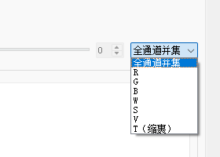

> 上图摄于【未加载生产包】时，故并集项显示为「全通道并集」。加载生产包后，该项会按包的
> 实际通道改写为「全通道并集（7 通道·含缩裹）」或「（6 通道）」，并自动选中；
> 包不具备的单通道项此时也会置灰。

**位置与颜色分开核对：** 工作区“俯视”、结果预览与新生成的 `package/layers` TIFF 应使用一致的
场景 XY 朝向（+X 向右、+Y 向上），不需要用户另做镜像补偿。不要拿旋转过的自由 3D 相机视角直接判定 TIFF 镜像。
模型预览是整个模型的投影，某一层 TIFF 只是该 Z 高度的截面，形状不必完全相同。
普通图片软件对六/七通道 TIFF 的颜色解释也可能不同；核对材料请用结果页对应通道。
历史包不会因程序升级被重新写入；排查朝向时，应重新切片并核对同一个包、同一层。

### 9.2 摘要与报告

生产包摘要应核对：目录、身份、协议、通道、位深、极性、网格、DPI、层数、实例数、
Profile 版本和 Profile Hash。

其中**实例数、Profile 版本、Profile Hash 是可选字段**，不作为结果页的受理条件：
它们来自清单的 `perInstance` 与 `profileEcho`。命令行直接喂配置文件切出的包没有 Profile
溯源，这两项为空属正常；七通道包目前也不产出 `perInstance`，故实例数显示为 0。
受理条件只包括写包端确定产出的项：协议与通道数、准入状态自洽、位深、极性、
冻结通道集、层数和网格尺寸。摘要中任一项不合规时，错误消息会**指名具体是哪一条**。

“命名报告”可切换 `slice`、`preview` 和 `scene`。报告用于追溯本次作业，不应手工修改后再当作原始证据。

“打开包目录”只会打开当前已严格校验且身份一致的目录；目录消失或身份不一致时软件会拒绝操作。

### 9.3 切片后 RIP（2026-09-14 更新）

当前 RIP 页按“参数 / 路径 / 手动 RIP”组织，旧图 14..17 仍可对照选项含义，最新布局见下图。


图 23：参数页；运行状态、进度、当前包 RIP 操作保留在分组下方。

打开右侧 **“RIP 设置”**。页签较窄时，通过右上角页签箭头找到入口。
此页有两种入口：“运行 RIP”处理当前已校验的切片包；“运行手动 RIP”处理人工指定的切片文件夹。
两种入口共用上方配置，不需要编辑 BAT 文件。

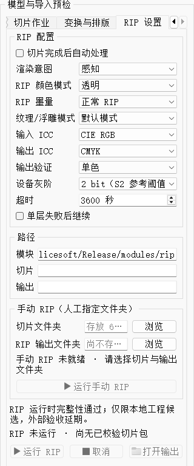

图 14：新版程序实际截图，未加载切片包、未填写手动目录，因此两个运行按钮置灰；不是运行失败。
截图中自动处理关闭、墨量为正常 RIP，是新配置默认状态，已有配置恢复后可能不同。

#### 9.3.1 颜色模式与墨量分别设置

| RIP 颜色模式 | 传给 RIP 的参数 |
|---|---|
| 透明 | `--transparent 0` |
| 不透 | `--transparent 1` |
| 肤色 | `--transparent 2` |
| 白色 30 | `--transparent 3` |
| 白色 50 | `--transparent 4` |


图 17：颜色模式五档与 0..4 一一对应。这里的透明/不透是 RIP 参数，不是模型材质 `d` 或切片工艺预设。

**新增“RIP 墨量”：**

| 选项 | 参数 | 行为与默认值 |
|---|---|---|
| 正常 RIP | `--ripmode 0` | 新配置默认；供应方直通流程，不执行墨量控制、补光油、肤色特殊处理和白墨挂网 |
| 3 倍墨量 RIP | `--ripmode 1` | 供应方完整流程；已有 v1/v2 配置迁移到这一档 |


图 15：墨量选项独立于颜色模式。“3 倍墨量”不是把输出通道数值简单乘以 3，不能据此自行修改 TIFF 字节。
需要肤色或白色特殊处理时，注意正常 RIP 不执行对应完整分支；工艺效果仍需实际验证。
升级后首次运行前请重新确认这一项：**已有配置迁移为 1，新配置默认 0**。

#### 9.3.2 输出验证：单色与彩色

这两个名称是原有验证方式的更名，**不负责把模型转换成单色或彩色，也不改变原规则**。

| 当前名称 | 原名称/内部标识 | 输出规则 |
|---|---|---|
| 单色 | 原严格 S2，`strict_s2` | 结构、层数、尺寸、源身份和 W/S/V 墨滴上限均通过后，生成 `rip` |
| 彩色 | 原诊断保存，`diagnostic_unvalidated` | 保留结构、层数、尺寸和源身份检查；W/S/V 超限记入报告，保存为 `rip_diagnostic`，不取得 S2 发布资格 |


图 16：更名后的两项；新配置仍默认单色。彩色保存成功不等于已通过打印端验收，后续须核验通道数据和目标打印软件兼容性。
“设备灰阶”是输出校验参考阈值，不是 RIP 墨量档位，也不会作为灰阶算法参数传给 CLI。

#### 9.3.3 当前切片包与自动处理

1. 确认“RIP 运行时完整性通过”，再选择渲染意图、颜色模式、RIP 墨量、ICC 和输出验证。
2. 手动执行当前包时，先完成切片并通过结果严格加载，然后点页底“运行 RIP”。
3. 希望切片后自动执行时，**在开始切片前**勾选“切片完成后自动处理”。新配置默认不勾选。
4. 等待 RIP 及输出校验完成；需要中止时点“取消”，等待终态。切片成功和 RIP 成功是两件事，RIP 失败不会删除有效切片数据。
5. 成功后点“打开输出”，核对层文件数及结果报告。目标目录已存在时拒绝覆盖，不要直接反复运行到同一目录。

```text
package/
  manifest.json
  layers/                         切片源层，保持不变
  rip/                            单色验证通过时生成
    rip_000000.tif
    rip_result.json
  rip_diagnostic/                 选择彩色时生成
    rip_000000.tif
    rip_diagnostic_result.json
```

两种 RIP 目录均与 `layers` 同级；上图是目录规则示意，不表示一次运行同时生成两种结果。
报告中 `settings.ripMode`、`settings.transparentMode` 和 `settings.outputValidationMode` 可用于核对实际运行参数。
“单层失败后继续”只控制 RIP CLI 是否继续处理后续层，不会把缺层输出视为合格。

RIP 运行时持续更新宿主处理阶段、累计耗时和已观察到的 TIFF 文件数。
**文件出现不等于处理成功**，输出校验完成前不能按 100% 认定发布成功。
供应方 DLL 尚未提供内部每个运算步骤的精确回调，界面不会伪造内部百分比；以最终状态与报告为准。

#### 9.3.4 仅有切片文件夹时

在“RIP 设置 -> 手动 RIP”选择切片文件夹，使用或修改默认的**尚不存在、父目录已存在**的输出文件夹，
再点“运行手动 RIP”。只读取所选目录下的 `.tif` / `.tiff`，不递归读取子目录。
已完成切片时，输入默认跟随最近生产包的 `layers`；手动修改过的输入目录不会被后续切片覆盖。
输出默认位于程序目录 `output/rip/r<时间>_<唯一标识>`，成功后自动生成下次任务的新路径；
人工指定的输出路径会保留，且不会因切换验证选项自动改名。`output` 不缩写为 `out`。
不能与输入文件夹相同或相互嵌套。输入层应具有一致尺寸。


图 24：专用验证实例的默认输出目录；图中尚未切片，输入为空。实际运行时路径以当前程序目录为准。

**当前接入限六通道 RGBWSV、unsigned 8bit、contiguous、stripped TIFF。含缩裹 T 的七通道切片包不因这次 RIP 更新自动兼容，不能直接混用。**
DPI 不参与当前 RIP 前置/发布判断，不需要为使用 RIP 强制改成 600×600；切片 DPI 仍按自身工艺要求设置。

## 10. 工作区恢复与显示设置

软件会保存工作区布局、当前 Profile、切片设置和显示偏好。恢复数据使用版本化 schema；未知、
过期或不完整值按安全策略拒绝或回退，不会把未知策略静默当作生产默认。

显示设置只控制默认视图、3D 投影、网格和高亮。Qt 宿主只展示模块返回的 ViewData、Worker 耗时、
manifest 统计和 package TIFF 预览，不在界面中重新计算生产几何或姿态。

## 11. 常见问题

### 11.1 “切片模块尚未加载”

检查 `slicer_module.dll` 是否与宿主同目录，模块、Worker 和宿主是否来自同一部署版本；再查看“模块诊断”。

### 11.2 “请先修正切片设置和有效 Profile”

这条提示出现在“切片作业”页，但它只是**转述**——真正的原因在“切片设置”页底部或页面顶部。
先看那两处的具体消息，再对症处理：

- **导入后切换工艺失败**：当前版本无需重导模型；检查是否仍在运行旧 EXE，或所选自定义工艺没有已验证 T 变体。
  实际调整设备 buildVolume 时仍需新建场景；删除模型不会自动解除设备上下文绑定。
- 其余情况检查 Profile 是否具备 `slice.rgbwsv` 或 `slice.rgbwsvt`、输出目录是否有效、
  DPI/层厚/构建体积是否在范围内，以及当前 Profile 与几何采样是否兼容。

### 11.3 模型导入后不能切片

检查预检表、模型数量、碰撞、越界、纹理资源和场景 revision。阻断状态不能通过更换界面选项绕过。

### 11.3.1 缩裹工艺报“boundary edges exceed the configured limit of 0”

缩裹材质带有真开边，而默认不放行任何开边。先检查模型诊断，再按第 7 节的已验证资产边界处理。
`08`/`09`/`08-03`/`08-04` 的缩裹材质各有 3 条真开边；其他资产不能直接套用或无限调大上限。

### 11.3.2 缩裹区域没有进 T 通道，仍出现在 RGB 里

缩裹识别按材质 `Kd` 精确匹配。检查该模型缩裹材质的 `Kd` 换算值（`round(Kd × 255)`）
是否在工艺文件的 `materialDiffuseRgbValues` 列表内。不同批次导出可能相差 1，差 1 即不命中。
当前已覆盖浅桃 `255,220,198`、黄 `255,255,0`、浅桃变体 `255,219,198` 三色。

### 11.3.3 勾选“启用多材质纵深体积 RGB”后不能切片

先看“切片设置”里的校验提示，它会指名原因：

| 提示 | 处理 |
|---|---|
| 多材质纵深 RGB 候选要求按需补白策略为 white_underbase | 纹理段的白墨策略改为按需补白 |
| 多材质纵深 RGB 候选不支持同时启用材料角色映射 | 关闭材料角色映射 |
| 当前模型外观资源不足，无法解析逐层材质归属 | 模型的贴图缺失，补齐 `map_Kd` 引用的图片文件 |
| materialVolumePolicy requires geometrySampling.strategy=legacy_center_sample | 将几何采样改为 S0；多材质纵深工艺不能叠加 S3 |
| 光油不透明度上限须在 0 与 1 之间 | 该值须为正且小于 1，工艺预设给的是 0.001 |

若未勾选“按材质命名自动推导优先级”，则两个材质名**必须填写**，否则无法提交——
多图层资产请勾选自动推导，见 7.1。

### 11.3.4 内嵌部件在切片数据里消失（无报错）

切片正常结束、退出码正常、报告 `errors` 为空，但内嵌的部件在切片数据里看不到。

先确认当前 Z 层穿过该部件、预览模式包含其通道，再核对材质命名。一种已知原因是：
被包裹素材与透明包裹介质用了同一层号，透明素材按类别次序胜出并占据全部重叠区。

处理：把包裹介质的层号改大（`trans-L1` → `trans-L2`），被包裹素材保持 `L1`。详见 4.2.1。

判定方法：查看生产包 `reports/material_volume_report.json`，把各层的
`ownerPixelsByMaterial` 按材质累加。某材质总和为 0 表示没有获得采样像素，需结合几何尺寸、
采样分辨率、面绑定和重叠关系判断原因，不能仅凭零值断言是命名问题。

### 11.4 纯白纹理被告警或阻断

选择“全实体 RGB + 按需补白墨”或“RGB 表层 + 白墨实体填充”工艺。不要用 RGB=254 等方式伪造可打印白色。

多图层工艺（4.2.1）已内置按需补白，无需另行设置：贴图的纯白区会自动写 W 载体承载。
若仍出现下面这条错误，说明补白未生效，请报告该输出目录：

```text
PM-SLICER-CONTRACT-0060 / SCENE_PRODUCTION_PACKAGE_INVALID   field=layers.ownership
instance RGBWSV bytes do not close against material ownership;
pixel=… values=255,255,255,255,255,255 ownership=1,0,0,0
```

它的含义是某像素**有材质归属但六个通道全为 255（空值）**——在 `black_is_print` 下 255
既表示“空”又表示“最大值”，纯白贴图像素必须由 W 载体承载才能闭合契约。

### 11.4.1 结果页显示“生产包摘要违反冻结协议”

消息会**指名具体哪一条**不合规（例如“位深须为 8，实为 …”“层数须为正，实为 …”）。
按指名项排查即可。实例数、Profile 版本、Profile Hash 为可选字段，**不会**导致该提示。

### 11.4.2 切片成功但预览框空白

确认所选预览模式对当前包可用：并集项会按包自动选中，包不具备的单通道项应为置灰状态。
先切回“全通道并集”，再检查该层是否为空、是否已完成包校验，以及详情中有无读层错误。

### 11.5 结果页没有自动打开

查看“切片作业”的终结码和详情。切片核心成功但生产包校验失败时，结果不会作为可用包加载。

### 11.6 PackBits 是否可以默认开启

不可以。当前默认仍为无压缩 `none`。只有目标 RIP/控制软件兼容性获得明确证据后，才对受控作业启用 PackBits。

### 11.7 切片耗时明显偏长

先看作业完成页的耗时字段（含义见 8 节），**判断耗时集中在哪一段再决定怎么办**：

| 耗时集中处 | 含义 | 处理 |
|---|---|---|
| 逐列求交 / 网格准备 | 多材质纵深的材质所有权求解 | 受几何复杂度、栅格列数及重叠影响，不能仅按面数估时 |
| 逐层计算 / 图层合成 | 各层材料、支撑与通道处理 | 在工艺允许时增大层厚或降低 DPI 可减少工作量；减小层厚反而增加层数 |
| TIFF / 预览写入 | 编码写盘 | 检查输出位置与剩余空间；大画幅、X 原点补白都会增加写入量 |
| 报告 / 包校验 | 统计汇总及结果完整性检查 | 等待终态并查看错误详情，不以关掉严格校验替代性能排查 |

多材质纵深工艺（4.2.1）比普通工艺慢是**预期的**：它要按 Z 解析每个 XY 列上的材质归属，
而普通工艺逐列只取一个顶面材质。旧版本、不同模型或不同机器的单次耗时不能作为本次作业的固定标准。
不要为提速随意降低多材质资产的采样精度；过粗采样可能触发材质归属不一致，而非获得等价切片。
**报告问题时请附上完整耗时字段**、程序版本、模型、工艺、DPI、层厚、输出画幅及磁盘位置。

> 测量注意：机器上有其它任务并行时耗时偏差可达 30% 以上，比较性能须在空载下串行测量。

### 11.7.1 “补齐至 X=0”会多耗时多少

没有固定百分比。左侧空白越宽、层数越多，新增数据越多；并不重新摆放模型或重新采样原有像素。
以下为 XPAD 专项 2026-09-08 记录的本机 Release 对照测量，不是本手册更新时重新测得，也不是耗时承诺：

| 示例 | 相同参数下的画幅变化 | 开关成对测量 |
|---|---|---|
| 20260908-HuangChenC 十模型，六通道，600 DPI / 0.2 mm / 23 层 | 4110→4585 列，增加约 90.13 MB 原始层数据 | 三次配对增量 0.17～1.33 s，中位数约 0.65 s（约 16%） |
| finger_suoguo/03.obj，T 工艺，600 DPI / 0.2 mm / 32 层 | 555→1053 列，原模型 T 像素数不变 | 三次配对增量 0.47～0.61 s，中位数约 0.48 s（约 10%） |

两行使用不同资产，不能据此比较六通道与七通道谁更快。更薄层厚、慢速磁盘或更大补白会有不同结果。
详细条件见[XPAD 收口报告](../slice/REPORT/REPORT_XPAD_X原点输出画幅补白收口总结.md)。

以上测时仅适用于旧 X-only 对照，不能当作新增 Y 补白的耗时承诺。
本次十模型 XY 对照为 600 DPI / 0.2 mm / 23 层，画幅从 4110×1375 变为 4585×1411，
左侧增加 475 列、下侧增加 36 行，所有原模型像素不变；详见 [XYPAD 验证报告](../slice/REPORT/REPORT_XYPAD_XY原点补白验证与交付.md)。

### 11.8 RIP 升级后选项或模块不匹配

确认打开的是本次部署的程序，并检查应用旁 `modules/rip/rip_module.json` 的模块版本为 `1.2.0`。
本次源目录是 `rip_project/RIPDLL_20260909`，后续日期版须由维护人员显式选定并重新打包，放入一个新日期文件夹不会自动切换。
不要只覆盖 EXE/DLL：本次 ICC 和线性化表也更新，必须整套同步；私有 `tiff.dll` 不能覆盖宿主根目录的 TIFF 库。
配置/结果 schema 已升级 v3，旧版程序不能据此认定兼容。

### 11.9 切片成功但 RIP 失败，或只生成 rip_diagnostic

先看 RIP 的具体错误码，而不是只看“切片成功”：

| 现象 | 处理 |
|---|---|
| 按钮置灰 | 当前包尚未严格加载，或手动输入/输出目录尚未就绪；对照图 14 检查对应入口 |
| `RIP_OUTPUT_DROP_LIMIT_EXCEEDED` | 单色仍执行原 W/S/V 上限校验；需保存输出分析时可显式选彩色，但不能把 255 擅自改成 0 或视为打印验收通过 |
| `RIP_OUTPUT_DIMENSION_MISMATCH` | 输出尺寸不满足当前网格及允许的宽度补齐规则；保留源包、报告和模块版本交给维护人员，不靠更换 DPI 绕过 |
| 只生成 `rip_diagnostic` | 选择了彩色验证，这是预期目录；读取 `rip_diagnostic_result.json`，不是文件丢失 |
| 目标已存在、超时、缺层或模块完整性失败 | 使用新的输出目录或按具体报错排查；“单层失败后继续”不能绕过发布检查 |

## 12. 操作完成检查表

- [ ] 宿主、模块和 Worker 来自同一版本。
- [ ] Profile 的能力状态与生产安全级别符合本次任务。
- [ ] 模型预检通过，碰撞和越界均为 0。
- [ ] 已确认自动定向、自动排版及批次原点；需要保留源摆放时没有误启用规则排版。
- [ ] 已确认 Z 触底/人工高度；需要左侧空白时已勾选“补齐至 X=0”并重新切片。
- [ ] 需要下侧空白时已勾选“补齐至 Y=0”；TIFF 的底部空白与预览相同，旧包没有被误作新结果。
- [ ] 中文 OBJ 的 MTL/贴图已一起复制；多图层命名、定位保留名及 T 识别参数符合所选工艺。
- [ ] DPI、层厚、构建体积、材料、纹理和支撑参数已确认。
- [ ] 生产作业使用 S0；若使用 S3，已有明确诊断授权并记录用途。
- [ ] 生产包严格校验通过，协议、通道、位深、极性和身份正确。
- [ ] 已检查首层、中间层、末层、通道曲线和关键报告。
- [ ] 需要 RIP 时，已确认颜色模式、墨量、单色/彩色验证及自动开关，升级后的旧配置墨量已复核。
- [ ] 已分别确认切片和 RIP 终态，核对实际输出目录、层数与设置快照；彩色保存未被误当作 S2 发布通过。
- [ ] 未把本地结果误报为目标 RIP、洁净机或实物打印验收通过。
