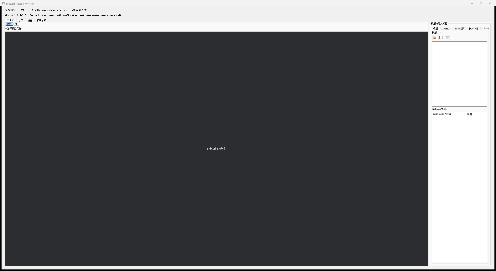
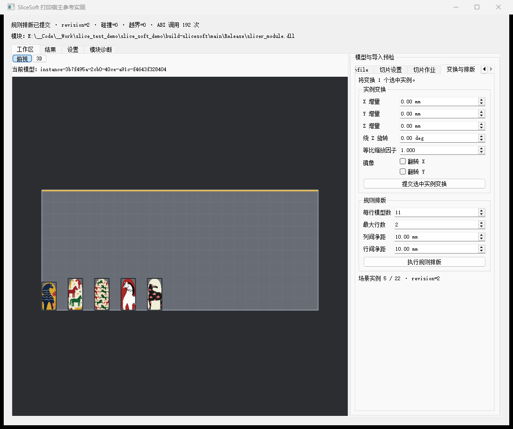
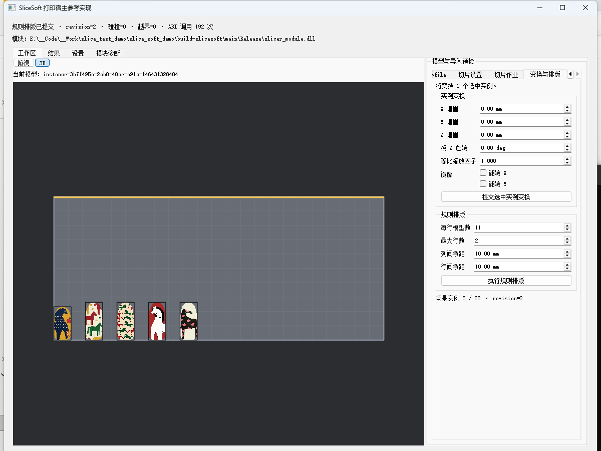
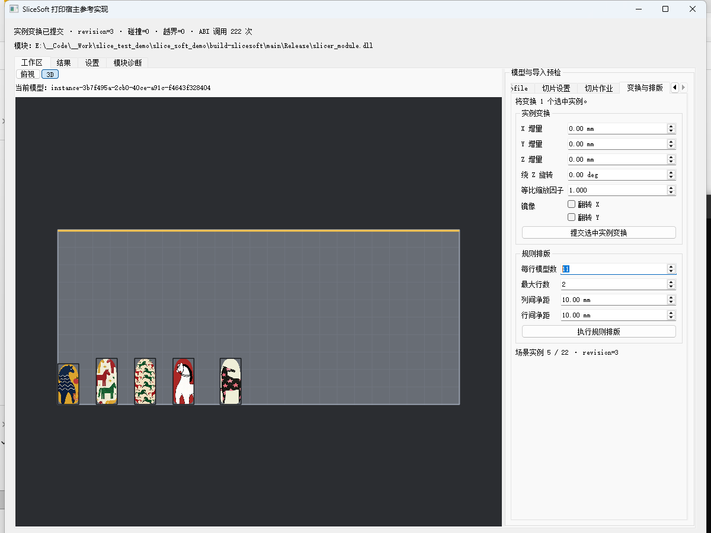
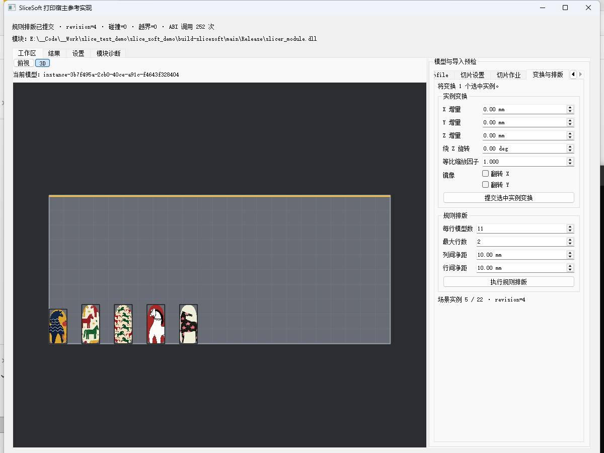
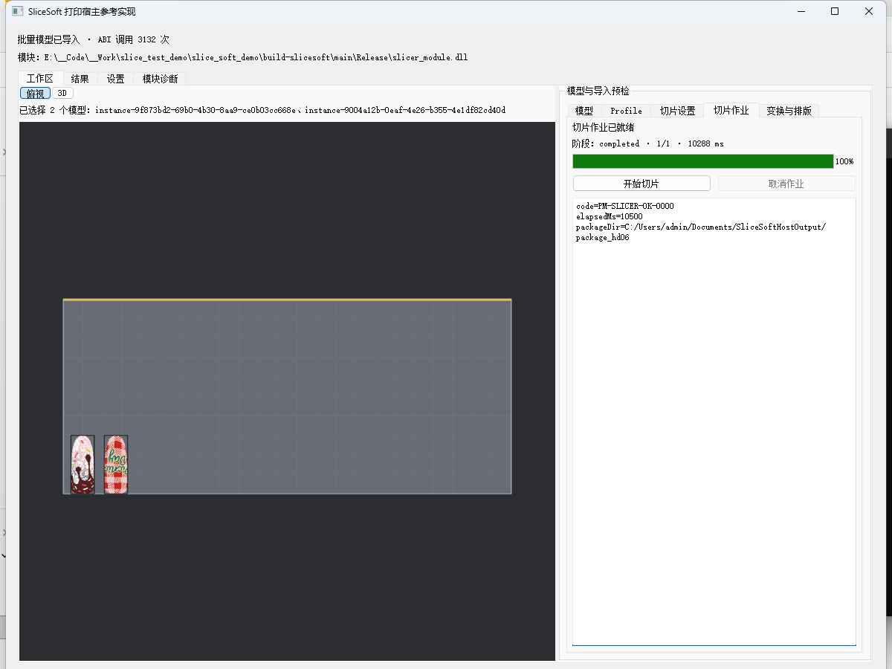
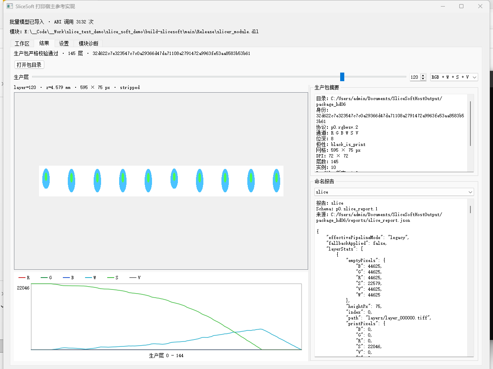

# SliceSoft 新版切片软件使用手册

> 日期：2026-08-14
>
> 适用分支：`product/packaged-slicer`
>
> 适用程序：`slicer_ui_host_sim.exe`（SliceSoft 打印宿主参考实现）
>
> 适用对象：模型导入、工艺选择、场景排版、切片作业和 RGBWSV 生产包检查人员。

## 1. 软件定位

新版软件采用“打印宿主界面 + 切片能力模块 + Worker”结构。操作人员在宿主界面中完成模型、
Profile、切片参数和输出目录选择；切片模块负责场景与生产包能力；Worker 在独立进程中执行作业。

本程序是参考宿主，不包含打印机通信、喷头控制和 RIP 半色调。当前本地切片与生产包校验可用，
打印侧书面回签、目标 RIP、洁净机和实物打印证据仍属于外部验收，不能仅凭本界面判定整机量产放行。

固定生产包合同：

```text
schema       = p0.rgbwsv.2
channelOrder = R G B W S V
bitDepth     = 8
polarity     = black_is_print
```

## 2. 启动软件

优先使用已部署运行目录，确保宿主、模块、Worker、Qt 和 TIFF 依赖处于同一目录：

```powershell
cd runtime\slicesoft\Release
.\slicer_ui_host_sim.exe
```

调试运行目录：

```powershell
cd runtime\slicesoft\Debug
.\slicer_ui_host_sim.exe
```

程序默认加载同目录的 `slicer_module.dll`。只有开发或诊断时才显式指定模块：

```powershell
.\slicer_ui_host_sim.exe --module D:\path\to\slicer_module.dll
```

启动后先检查窗口顶部：

- “模块已就绪”表示 SPI、Profile 目录和模块能力已正常解析。
- 模块路径应指向本次运行目录或明确指定的受控版本。
- “模块诊断”页可查看版本、能力和初始化信息。



图 1：新版工作区。中央是俯视/3D 场景，右侧依次提供模型、Profile、切片设置、切片作业和变换排版。

## 3. 推荐操作流程

推荐按以下顺序操作，避免在模型、Profile 或设备参数尚未确定时提交作业：

1. 确认模块已就绪。
2. 在“工艺配置”选择可切片的生产 Profile。
3. 在“切片设置”确认工艺预设、DPI、层厚、构建体积、输出目录和材料参数。
4. 在“模型”页批量导入 OBJ、3MF 或 STL。
5. 在俯视或 3D 视图确认方向、纹理、碰撞和越界状态。
6. 必要时在“变换与排版”调整实例，重新执行规则排版。
7. 在“切片作业”确认已就绪后开始切片。
8. 在“结果”页检查生产包身份、层预览、通道曲线和报告。

## 4. 选择 Profile 与工艺

### 4.1 工艺配置

“工艺配置”页会把宿主 Profile 与模块实际能力求交。列表中只有“能力状态”为可用、且要求
`slice.rgbwsv` 的 Profile 才能提交切片。

| Profile | 用途 | 操作要求 |
|---|---|---|
| 彩色纹理生产 · 材料与支撑可编辑 | 日常模型导入、排版与生产包生成 | 默认选择，提交前检查纹理和输出目录 |
| 材料一致性验证 · 受限候选 | 修复后几何、材料闭合与通道一致性专项 | 不等于生产准入，失败时必须停止 |
| 生产包与六通道检查 · 只读 | 检查生产包和报告 | 不能作为模型切片入口 |

“生产安全级别”分别显示生产可用、受限候选或仅诊断。不要把“能力可用”误读为设备端已验收。

### 4.2 常用工艺预设

“切片设置 -> 常用工艺预设”提供六类常用组合：

| 预设 | 适用场景 |
|---|---|
| 全实体 RGB + 下表面支撑 | 纹理不含不可打印纯白，W/V 保持空 |
| RGB 表层 + 白墨实体填充 | 彩色表层之间由 W 承载模型实体 |
| 全实体 RGB + 按需补白墨 | 默认预设，仅为严格纯白纹理像素写 W 载体 |
| RGB 表层 + 光油实体填充 | 彩色表层之间由 V 承载模型实体 |
| 单材料白墨 W | 不采样彩色纹理的白墨模型 |
| 单材料光油 V | 不采样彩色纹理的光油模型 |

选择预设后仍可继续调整材料、纹理和支撑参数。预设是参数起点，不替代切片前检查。

## 5. 导入与检查模型

### 5.1 支持格式

点击“模型”页中的添加按钮，可一次选择一个或多个文件：

```text
*.obj
*.3mf
*.stl
```

OBJ 彩色纹理应同时提供 OBJ 引用的 MTL 和贴图文件。STL 不携带彩色纹理，通常应选择单材料工艺。

导入流程会执行快速预检并显示：三角形数、顶点数、包围盒尺寸、UV、法线、问题级别和详情。
批量导入是一次场景提交；多模型导入后会按当前排版参数自动排版。场景最多 22 个实例。



图 2：模型已导入并自动排版。中央显示场景，右侧可切换到“变换与排版”继续调整。

### 5.2 预检结果

| 状态 | 含义 | 处理方式 |
|---|---|---|
| 通过 | 当前模型满足快速预检 | 继续检查排版与切片设置 |
| 需要人工修复 | 模型不能直接视为严格生产通过 | 修复源模型后重新导入和严格检查 |
| 阻断 | 存在明确生产阻断项 | 不得继续提交生产切片 |

非流形、重复或相反重复面、局部绕序问题会阻断严格生产准入；确认自交必须快速失败。

## 6. 查看、选择与编辑场景

### 6.1 俯视和 3D

工作区左上角可切换“俯视”和“3D”：

- 俯视用于检查 X/Y 排版、工作台边界、纹理外观和实例选择。
- 3D 用于检查模型高度、空间关系和整体外观。
- “设置”页可选择下次进入工作区的默认视图，以及 3D 正交/透视投影。
- 网格和选中高亮只影响显示，不修改模型或生产 TIFF。



图 3：3D 场景视图。视图切换不会重新计算几何或改变切片数据。

### 6.2 实例变换

在模型列表或画布中选择实例，再打开“变换与排版”。可提交：

```text
X / Y / Z 增量
绕 Z 旋转
等比缩放
镜像 X / 镜像 Y
```

一次点击“提交选中实例变换”会原子提交当前输入。提交后检查场景 revision、碰撞数和越界数。



图 4：实例变换页。数值单位分别为 mm、deg 和无量纲缩放因子。

### 6.3 规则排版

规则排版支持每行模型数、最大行数、列间净距和行间净距。默认上限对应 11 × 2、共 22 个实例。
排版由切片能力模块执行，宿主不会自行计算另一套落位结果。



图 5：规则排版完成后应同时检查视觉结果、碰撞计数和越界计数。

## 7. 设置切片参数

打开“切片设置”，逐项确认：

| 设置 | 默认值或规则 | 注意事项 |
|---|---|---|
| 输出分辨率 | 635 × 600 DPI | 应与打印设备 Profile 一致 |
| 层厚 | 0.038 mm | 改动会影响层数、耗时和材料统计 |
| 几何采样 | S0 Legacy 中心采样 | 当前生产默认，不得被候选策略静默替换 |
| TIFF 压缩 | 关闭，`none` | PackBits 仅在目标 RIP 明确兼容时启用 |
| 输出目录 | 每次会话独立 package 目录 | 不要覆盖仍在使用或待追溯的生产包 |
| 构建体积 | X/Y/Z 由宿主设备 Profile 提供 | 模块不会替设备猜默认值 |

几何采样中的 S3“层体积 2×2（至少 2/4）”是诊断候选，仅限受控的
`relief_heightfield` 场景。选择 S3 不会改变 S0 的生产默认地位，也不能据此把 P3 姿态用于生产。

有效 Profile 预览会显示本次准备提交的完整配置。只有校验提示已就绪时才进入下一步。

## 8. 提交与取消切片作业

打开“切片作业”：

1. 确认状态为“切片作业已就绪”。
2. 再次确认几何采样为期望的 S0 或受控 S3。
3. 点击“开始切片”。
4. 观察排队、配置读取、模型加载、场景准入、逐模型切片、图层合成、包写入和包校验阶段。
5. 需要停止时点击“取消作业”，等待 Worker 完成协作式取消和临时目录清理。

作业运行期间，模型、Profile 和切片参数编辑会被锁定，避免结果身份与界面状态不一致。



图 6：作业完成后显示错误码或成功码、耗时和生产包目录。成功后软件会继续后台严格校验结果。

耗时字段用于定位模型加载、逐层计算、图层合成、TIFF、预览和报告写入开销。部分字段存在包含关系，
不能直接相加作为总耗时。

## 9. 检查生产包结果

结果严格校验通过后，软件自动切换到“结果”页。先检查顶部是否显示：

```text
生产包严格校验通过
层数
package identity
```



图 7：结果页包含层选择、通道预览、生产包摘要、通道曲线和命名报告。

### 9.1 层与通道

- 滑块或数字框选择真实 `layerIndex`。
- 预览模式支持 RGB、RGB+W、RGB+S、RGB+V、六通道组合和单通道。
- A 固定为同一生产包、同一通道组合的首层；B 为当前层。A/B 不是两次不同切片结果。
- 曲线显示各层 R/G/B/W/S/V 的打印像素变化，用于发现突变、空层或异常支撑范围。

### 9.2 摘要与报告

生产包摘要应核对：目录、身份、协议、通道、位深、极性、网格、DPI、层数、实例数、
Profile 版本和 Profile Hash。

“命名报告”可切换 `slice`、`preview` 和 `scene`。报告用于追溯本次作业，不应手工修改后再当作原始证据。

“打开包目录”只会打开当前已严格校验且身份一致的目录；目录消失或身份不一致时软件会拒绝操作。

## 10. 工作区恢复与显示设置

软件会保存工作区布局、当前 Profile、切片设置和显示偏好。恢复数据使用版本化 schema；未知、
过期或不完整值按安全策略拒绝或回退，不会把未知策略静默当作生产默认。

显示设置只控制默认视图、3D 投影、网格和高亮。Qt 宿主只展示模块返回的 ViewData、Worker 耗时、
manifest 统计和 package TIFF 预览，不在界面中重新计算生产几何或姿态。

## 11. 常见问题

### 11.1 “切片模块尚未加载”

检查 `slicer_module.dll` 是否与宿主同目录，模块、Worker 和宿主是否来自同一部署版本；再查看“模块诊断”。

### 11.2 “请先修正切片设置和有效 Profile”

检查 Profile 是否具备 `slice.rgbwsv`、输出目录是否有效、DPI/层厚/构建体积是否在范围内，
以及当前 Profile 与几何采样是否兼容。

### 11.3 模型导入后不能切片

检查预检表、模型数量、碰撞、越界、纹理资源和场景 revision。阻断状态不能通过更换界面选项绕过。

### 11.4 纯白纹理被告警或阻断

选择“全实体 RGB + 按需补白墨”或“RGB 表层 + 白墨实体填充”工艺。不要用 RGB=254 等方式伪造可打印白色。

### 11.5 结果页没有自动打开

查看“切片作业”的终结码和详情。切片核心成功但生产包校验失败时，结果不会作为可用包加载。

### 11.6 PackBits 是否可以默认开启

不可以。当前默认仍为无压缩 `none`。只有目标 RIP/控制软件兼容性获得明确证据后，才对受控作业启用 PackBits。

## 12. 操作完成检查表

- [ ] 宿主、模块和 Worker 来自同一版本。
- [ ] Profile 的能力状态与生产安全级别符合本次任务。
- [ ] 模型预检通过，碰撞和越界均为 0。
- [ ] DPI、层厚、构建体积、材料、纹理和支撑参数已确认。
- [ ] 生产作业使用 S0；若使用 S3，已有明确诊断授权并记录用途。
- [ ] 生产包严格校验通过，协议、通道、位深、极性和身份正确。
- [ ] 已检查首层、中间层、末层、通道曲线和关键报告。
- [ ] 未把本地结果误报为目标 RIP、洁净机或实物打印验收通过。
