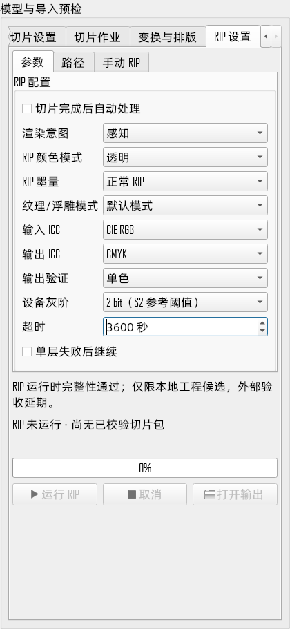
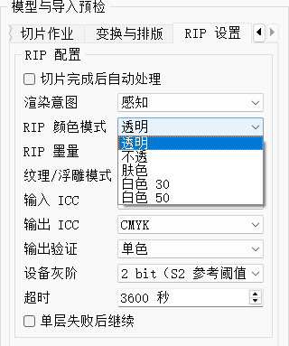
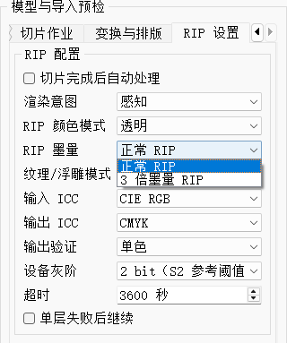
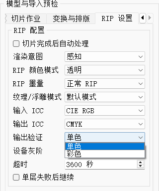
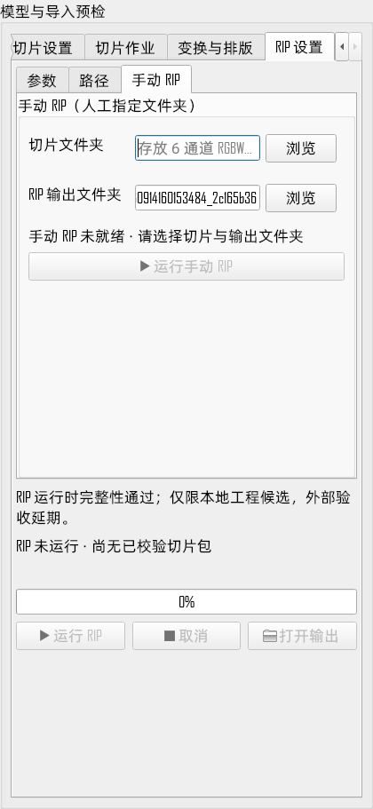

# SliceSoft 切片后 RIP 设置与迁移说明

> 适用状态：`SLICER_SIDE_COMPLETE / EXTERNAL_VALIDATION_DEFERRED`
> 当前模块：本地工程候选，不代表目标打印软件或实物打印已验收
> 更新日期：2026-09-20；适用 RIP 模块 1.3.0 / RIPDLL_20260920；设置与结果合同 v3

## 1. 目录

包内 RIP 处理已经严格校验成功的切片 Package，不修改切片层；只有文件夹时使用 2.5 节手动入口。
包内目录如下：

```text
package/
  manifest.json
  layers/
    layer_000000.tiff
  rip/
    rip_result.json
    rip_000000.tif
  rip_diagnostic/              # 彩色选项；保留原诊断合同，不取得 S2 发布资格
    rip_diagnostic_result.json
    rip_000000.tif
```

`layers` 保持原名，`rip` 和 `rip_diagnostic` 与其同级。两个输出目录都不会覆盖已有内容。

## 2. 设置与运行

在右侧“RIP 设置”页配置渲染意图、RIP 颜色模式、RIP 墨量、ICC、失败策略、输出验证、grayBits 参考阈值和超时。
“切片完成后自动处理”默认关闭；手动与自动模式使用同一个 QProcess 控制器和同一组前置/输出
检查。自动模式只在切片成功且结果严格加载成功后启动。



新版页面分为“参数”“路径”“手动 RIP”三个子标签。图示取自 Release 程序，当前未加载切片包，故运行按钮置灰；
已恢复的旧配置不一定与图中的新配置默认值相同。

运行状态持续显示宿主阶段、累计耗时和已出现的 TIFF 文件数，包含输入校验、外部 RIP 执行及输出校验等阶段。
文件出现不等于写入完成或校验通过；供应方 DLL 尚未提供内部算法的精确进度接口，不能把文件数量当作内部百分比。

输入与输出 TIFF 检查在后台执行，验证期间仍可取消。启动前会冻结 `manifest.json` 与每个输入层的
canonical path、大小和 SHA-256，发布 `rip` 前再次核对；外部 RIP 若改写输入，结果不会发布。

RIP 颜色模式与新版 `--transparent` 参数一一对应：

```text
0 透明
1 不透
2 肤色
3 白色 30
4 白色 50
```



旧版“跟随切片包”不再参与映射；旧设置迁移时会回落到 0，并关闭自动 RIP，避免静默改变工艺。
独立的“纹理/浮雕模式”对应 `--colormode`，当前仍只允许 0。grayBits 只校验真实输出范围，
不会向当前 RIP CLI 传入算法参数。

“RIP 墨量”对应 `--ripmode`：正常 RIP=0，3 倍墨量 RIP=1。新配置默认 0，已有 v1/v2 设置
迁移到 1。供应方定义 0 为直通流程，不做补光油、肤色特殊处理及白墨挂网；1 为完整流程，
不是逐通道数值简单乘以 3。设置与结果快照以 v3 保存实际参数。



升级后首次运行前请确认墨量：旧配置为 1，新配置为 0。模式 0 不执行上述特殊处理，
不能仅凭选择了“肤色”或“白色 30/50”推断其已经执行完整分支。

“输出验证”默认选择“单色”（原严格 S2），另一个选项为“彩色”（原诊断保存）。这里只更名，
不改变校验规则，也不决定 RIP 是否生成彩色通道。“彩色”仍检查输出结构、层数、尺寸和源 Package 身份，但把 W/S/V 超限
记入报告并保存到 `rip_diagnostic`，不会生成严格 `rip`。



“彩色”不代表已经取得打印验收资格，也不改变 CLI 的颜色算法；这里只选择原有输出校验方式。

当前已验证的本地子集：

```text
输入：p0.rgbwsv.2、unsigned 8bit、RGBWSV、contiguous、stripped
设置：ripMode=0/1、transparentMode=0..4、colorMode=0、deviceGrayBits=1/2（仅输出准入期望）
输出：至少 7 通道、unsigned 8bit、contiguous、stripped
命名：rip_%06d.tif
```

本次更新未开放含 T 的七通道 RGBWSVT 输入，不能将该工艺的切片层直接视为兼容。

DPI 不是当前 RIP API/CLI 的输入参数，也不参与 RIP 前置或发布判断。外部二进制目前会
在输出 TIFF 中写入 600 x 600 数值标签，该元数据不代表对 Package DPI 的限制。

当前 RIP 会把非 4 对齐宽度向右补齐 1..3 像素；程序只在高度不变且补齐值精确等于 4 像素对齐
结果时裁回 Package 原宽。其他缩放、扩宽或高度变化仍视为数据错误。

tiled、缺层、非确定性尺寸差异或输出 W/S/V 超限均不会发布 `rip`。0..4 五档均已验证可完成
RIP 进程，但每档能否形成严格 `rip` 仍以该次输出验证为准。

## 2.5 手动 RIP（人工指定文件夹）

当手上只有一批切片 tif、没有完整切片包时，用「RIP 设置」中的**手动 RIP** 子标签：



切片成功后，输入默认跟随最近切片包的 `layers` 目录。输出默认生成在程序目录
`output/rip/r<时间>_<唯一标识>`，成功后自动准备下一次目录；`output` 不缩写为 `out`。
人工编辑过的输入或输出目录会保留，不随之后切片自动覆盖；长路径可在输入框内移动光标查看完整内容。

1. **切片文件夹**：选择存放切片 tif 的文件夹。只取该文件夹下（不含子目录）的
   `*.tif` / `*.tiff`，按文件名不区分大小写升序编号，与外置 RIP 的遍历顺序一致。
   所有层必须是 8bit、6 通道 RGBWSV、contiguous、stripped；首层决定像素 Grid，
   其余层与首层尺寸不一致会在运行前被拒绝。
2. **RIP 输出文件夹**：选择一个**尚不存在**的目标文件夹。浏览按钮选中上级目录后会自动
   补一个 `rip` 子目录名，可直接改写。目标已存在一律拒绝，不会覆盖；目标也不能与切片
   文件夹相同或相互嵌套，目标父目录必须已存在。建议与 `layers` 同级；彩色可手填
   `rip_diagnostic`，手动入口不会随验证选项自动修改你填写的路径。
3. 「RIP 配置」里的渲染意图、颜色模式、RIP 墨量、ICC、输出验证、设备灰阶、超时对两种运行方式通用。
4. 点「运行手动 RIP」。运行中可用同一个「取消」按钮中止。

产物与包内运行一致：`rip_000000.tif` 起的连续编号，加一份 `rip_result.json`
（诊断模式为 `rip_diagnostic_result.json`），报告里 `sourceBinding` 记为
`manual_unbound`，并附上源切片文件夹与层数。

注意：手动运行没有 manifest，因而没有切片侧的准入声明。**单色（原严格 S2）** 模式下任一层
W/S/V 超过设备灰阶上限（2bit 为 W6/S9/V9）都会整单失败且不留下任何输出目录；需要
拿到产物排查时改用**彩色（原诊断保存）**模式，它会保存输出并在报告里记录超限数量与首个超限位置，
但明确标记不可打印。

## 3. 迁移

本次由仓库的 `rip_module/source.json` 分别固定二进制和资源来源：EXE/DLL/私有 TIFF 取
`rip_project/RIPDLL_20260920`，完整 `CmykFiles` 取最近一次已验收的
`rip_project/RIPDLL_20260909/CmykFiles`。`RIPDLL_20260917`、`RIPDLL_20260918` 是中间版本，
不进入部署选择。后续 `RIPDLL_日期` 只作为候选，须经维护人员检查并显式更新来源，不会自动取日期最新目录。
不要向供应方目录手工复制资源；生成模块会在 provenance 中分别记录二进制和资源来源。

迁移到打印软件时复制整个 `modules/rip` 目录，不挑选 DLL：

```text
<application>/modules/rip/
  rip_module.json
  source_provenance.json
  rip_settings.default.json
  runtime_dependencies.json
  rip_cli.exe
  RipSlicer.dll
  tiff.dll
  CmykFiles/
  licenses/
```

应用从自身目录相对发现 `modules/rip`。私有 `tiff.dll` 必须留在该子目录，不能覆盖宿主使用的
LibTIFF 4.7.1。模块清单中的 11 个运行文件会逐个校验大小和 SHA-256。

本地打包与自检：

```powershell
powershell -NoProfile -ExecutionPolicy Bypass -File scripts/PackageRipModule.ps1 `
  -Destination output/ripflow/modules/rip
powershell -NoProfile -ExecutionPolicy Bypass -File scripts/TestRipModulePackage.ps1 `
  -ModuleDirectory output/ripflow/modules/rip
```

需要显式工程对照时，同时提供 `-SourceRoot rip_project/RIPDLL_20260920` 与
`-ResourceSourceRoot rip_project/RIPDLL_20260909/CmykFiles`。只传 `-SourceRoot` 仍按旧式完整目录处理，
会在其下查找 `CmykFiles`。

本机隔离目录迁移验证可使用 `scripts/TestRipModuleMigration.ps1`。它会在新目录部署 Qt、复制整个
模块并执行真实 RIP；外部交付前仍需在目标打印软件的干净机环境重新验收。

## 4. 结果与故障

成功后 `rip_result.json` 记录输入 manifest hash、模块 hash、设置、退出码、耗时、W/S/V 最小/最大值
以及 `EXTERNAL_VALIDATION_DEFERRED`。RIP 失败、取消或超时不回滚有效切片包，只清理本次
`.rip.staging.*`；UI 会分别保留“切片成功”和 RIP 终态。

诊断完成后读取 `rip_diagnostic/rip_diagnostic_result.json`。它固定包含
`status=diagnostic_unvalidated`、`s2PublicationEligible=false`、参考上限、W/S/V 最小/最大值、
逐通道超限样本数和首个超限坐标。该结果只供合同分析，不能送入打印流程。

清理 staging 前会拒绝 junction、符号链接和 Windows reparse point；不安全目录不会递归删除，而是
保留现场并报告 `RIP_STAGING_CLEANUP_REFUSED`。

若界面报告 `RIP_OUTPUT_DROP_LIMIT_EXCEEDED`，详细信息会包含层号、W/S/V 通道、实际值、上限和
像素坐标。值 255 不能在当前合同下由切片侧静默改成 0 滴，须由 RIP/打印软件确认极性与量化后再
调整；这与 4 像素宽度补齐是两个独立问题。

外部分发仍等待 RipSlicer/CLI、lcms2、ICC 和私有 LibTIFF 的来源与再分发材料；打印侧还需完成
白语义、极性、ChannelSplitter、干净机、实物打印和长稳验收。
